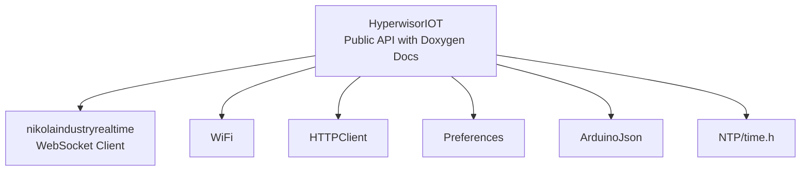
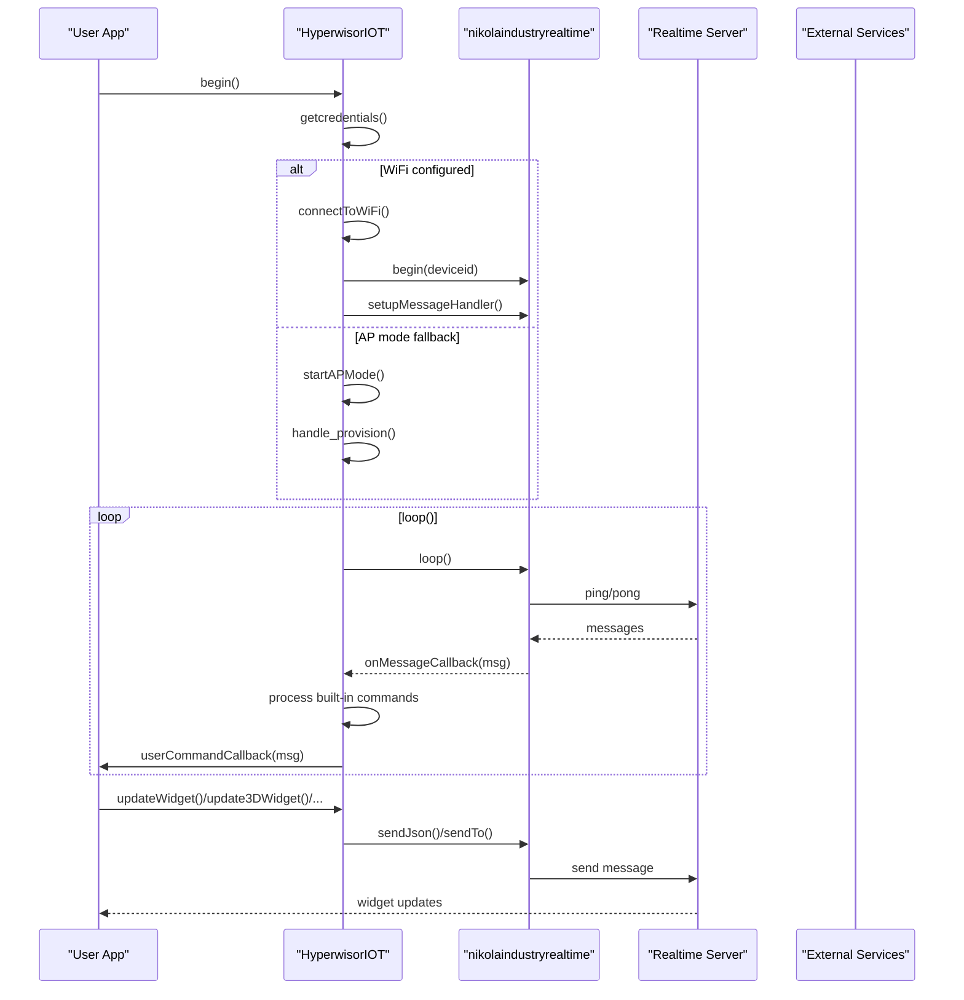
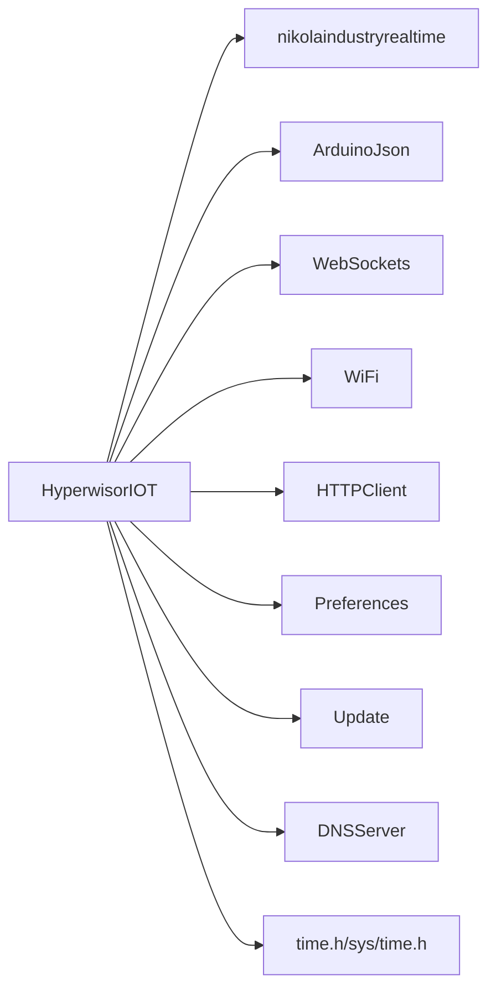

# API Reference

<cite>
**Referenced Files in This Document**
- [hyperwisor-iot.h](file://src/hyperwisor-iot.h)
- [hyperwisor-iot.cpp](file://src/hyperwisor-iot.cpp)
- [nikolaindustry-realtime.h](file://src/nikolaindustry-realtime.h)
- [nikolaindustry-realtime.cpp](file://src/nikolaindustry-realtime.cpp)
- [library.properties](file://library.properties)
- [README.md](file://README.md)
- [BasicSetup.ino](file://examples/BasicSetup/BasicSetup.ino)
- [CommandHandler.ino](file://examples/CommandHandler/CommandHandler.ino)
- [WidgetUpdate.ino](file://examples/WidgetUpdate/WidgetUpdate.ino)
- [ThreeDWidgetControl.ino](file://examples/ThreeDWidgetControl/ThreeDWidgetControl.ino)
</cite>

## Update Summary
**Changes Made**
- Enhanced Doxygen documentation for IntelliSense support across all public APIs
- Added comprehensive documentation for new widget update capabilities including updateHeatMap() and update3DWidget() methods
- Expanded data structure documentation for HeatMapPoint and ThreeDModelUpdate with detailed field descriptions
- Updated widget system API documentation with improved examples and usage patterns
- Enhanced IntelliSense support through comprehensive function and parameter documentation

## Table of Contents
1. [Introduction](#introduction)
2. [Project Structure](#project-structure)
3. [Core Components](#core-components)
4. [Architecture Overview](#architecture-overview)
5. [Detailed Component Analysis](#detailed-component-analysis)
6. [Dependency Analysis](#dependency-analysis)
7. [Performance Considerations](#performance-considerations)
8. [Troubleshooting Guide](#troubleshooting-guide)
9. [Conclusion](#conclusion)
10. [Appendices](#appendices)

## Introduction
This document provides a comprehensive API reference for the Hyperwisor-IOT Arduino library. It covers device initialization and lifecycle management, WiFi provisioning, real-time messaging, widget updates (simple, charts/graphs, 3D models, heat maps), command processing (built-in and custom), and database/SMS/authentication utilities. The library now features comprehensive Doxygen documentation for enhanced IntelliSense support, making development experience more efficient with detailed tooltips and parameter descriptions.

## Project Structure
The library consists of:
- Public API header exposing the HyperwisorIOT class and supporting types with comprehensive Doxygen documentation
- Implementation source containing device lifecycle, provisioning, messaging, widgets, and utilities
- A bundled realtime client wrapper for WebSocket communication
- Examples demonstrating typical usage scenarios



**Diagram sources**
- [hyperwisor-iot.h:1-190](file://src/hyperwisor-iot.h#L1-L190)
- [nikolaindustry-realtime.h:1-35](file://src/nikolaindustry-realtime.h#L1-L35)

**Section sources**
- [library.properties:1-11](file://library.properties#L1-L11)
- [README.md:1-173](file://README.md#L1-L173)

## Core Components
- HyperwisorIOT class: central interface for device lifecycle, provisioning, messaging, widgets, and utilities with comprehensive Doxygen documentation
- nikolaindustryrealtime wrapper: WebSocket client for real-time bidirectional communication
- Data structures: HeatMapPoint, ThreeDModelUpdate, and JSON utility helpers with detailed field documentation

Key capabilities:
- Device initialization and loop management with enhanced IntelliSense support
- WiFi provisioning (AP mode and web UI)
- Real-time message handling and routing
- Widget updates for dashboards (strings, numbers, arrays, dialogs, flight attitude, positions, countdowns, heat maps, 3D models)
- Database operations (insert, get, update, delete), onboarding, SMS, and authentication
- Time synchronization via NTP with timezone support
- GPIO state persistence and restoration

**Section sources**
- [hyperwisor-iot.h:39-187](file://src/hyperwisor-iot.h#L39-L187)
- [nikolaindustry-realtime.h:10-32](file://src/nikolaindustry-realtime.h#L10-L32)

## Architecture Overview
High-level runtime flow:
- begin(): loads credentials, connects to WiFi or starts AP mode, initializes NTP, and establishes realtime connection
- loop(): manages WiFi reconnection, WebSocket health, and AP mode timeouts
- Message handling: parses incoming commands, executes built-ins (GPIO, OTA, DEVICE_STATUS), and forwards to user handler
- Widget APIs: construct JSON payloads and send via realtime with comprehensive parameter validation
- Utilities: database, SMS, authentication, GPIO state, and time functions



**Diagram sources**
- [hyperwisor-iot.cpp:13-137](file://src/hyperwisor-iot.cpp#L13-L137)
- [nikolaindustry-realtime.cpp:5-75](file://src/nikolaindustry-realtime.cpp#L5-L75)

## Detailed Component Analysis

### Device Initialization and Lifecycle
- begin(): initializes device, loads credentials, connects to WiFi or starts AP mode, initializes NTP
- loop(): maintains WiFi and WebSocket connectivity, handles reconnection attempts, and AP mode timeout
- getDeviceId(), getUserId(): read persistent identifiers
- setApiKeys(): configure API keys for secured operations

Usage patterns:
- Call begin() in setup(), then loop() in main loop()
- Use setApiKeys() before invoking database/SMS/authentication functions
- Use getDeviceId() to identify device in dashboard

Common pitfalls:
- Missing API keys will cause database/SMS/auth functions to return early
- WiFi failures trigger AP mode; ensure credentials are saved or provisioned via web UI

**Section sources**
- [hyperwisor-iot.cpp:13-137](file://src/hyperwisor-iot.cpp#L13-L137)
- [hyperwisor-iot.cpp:414-429](file://src/hyperwisor-iot.cpp#L414-L429)
- [hyperwisor-iot.cpp:725-728](file://src/hyperwisor-iot.cpp#L725-L728)
- [BasicSetup.ino:21-38](file://examples/BasicSetup/BasicSetup.ino#L21-L38)

### WiFi Provisioning and Management
- setWiFiCredentials(), setDeviceId(), setUserId(), setCredentials(), clearCredentials(), hasCredentials(): manage stored credentials
- startAPMode(), handle_provision(): serve web UI for provisioning
- connectToWiFi(): establish STA connection with timeout
- getSuccessHtml(), getErrorHtml(): AP provisioning responses

Integration tips:
- Use setCredentials() for manual provisioning or rely on AP web UI
- After provisioning, device restarts and connects automatically

**Section sources**
- [hyperwisor-iot.cpp:413-518](file://src/hyperwisor-iot.cpp#L413-L518)
- [hyperwisor-iot.cpp:141-185](file://src/hyperwisor-iot.cpp#L141-L185)
- [hyperwisor-iot.cpp:278-310](file://src/hyperwisor-iot.cpp#L278-L310)

### Real-Time Messaging and Routing
- sendTo(targetId, payloadBuilder): constructs and sends JSON payload to a target
- setupMessageHandler(): registers WebSocket message callback, parses commands, executes built-ins, and invokes user handler
- setUserCommandHandler(cb): register custom command handler
- sendDeviceStatus(targetId): respond to DEVICE_STATUS command

Built-in commands:
- GPIO_MANAGEMENT: configure pin modes and digital writes
- OTA: perform firmware updates from URL with version tracking
- DEVICE_STATUS: respond with online status

Routing:
- Uses "from" field to route responses back to original sender via sendTo()

**Section sources**
- [hyperwisor-iot.cpp:521-532](file://src/hyperwisor-iot.cpp#L521-L532)
- [hyperwisor-iot.cpp:313-405](file://src/hyperwisor-iot.cpp#L313-L405)
- [hyperwisor-iot.cpp:408-411](file://src/hyperwisor-iot.cpp#L408-L411)
- [hyperwisor-iot.cpp:717-722](file://src/hyperwisor-iot.cpp#L717-L722)
- [CommandHandler.ino:26-85](file://examples/CommandHandler/CommandHandler.ino#L26-L85)

### Widget System API
**Enhanced** with comprehensive Doxygen documentation for IntelliSense support

Simple widget updates:
- updateWidget(targetId, widgetId, value): accepts string, float, vector<float>, vector<int>, vector<String>

Dialogs:
- showDialog(targetId, title, description, icon)
- info/warning/success/error/risk variants

Flight attitude:
- updateFlightAttitude(targetId, widgetId, roll, pitch)

Position/size/rotation:
- updateWidgetPosition(targetId, widgetId, x, y, w, h, r)

Countdown:
- updateCountdown(targetId, widgetId, hours, minutes, seconds)

**New Heat Map Visualization**:
- updateHeatMap(targetId, widgetId, vector<HeatMapPoint>): each point has x, y, value
- HeatMapPoint structure: detailed documentation with field descriptions

**Enhanced 3D Model Widgets**:
- update3DModel(targetId, widgetId, modelUrl): single model URL
- update3DWidget(targetId, widgetId, vector<ThreeDModelUpdate>): multiple models with transforms and material properties
- ThreeDModelUpdate structure: comprehensive documentation with all transform and material property fields

**Enhanced Data Structures**:
```cpp
// Heat map data point structure
struct HeatMapPoint {
  int x;        ///< X coordinate on the heat map (pixels)
  int y;        ///< Y coordinate on the heat map (pixels)
  int value;    ///< Intensity/value at this point (sensor reading)
};

// 3D model update structure
struct ThreeDModelUpdate {
  String modelId;         ///< Unique identifier for the model
  float position[3];      ///< X, Y, Z position coordinates
  float rotation[3];      ///< Rotation around X, Y, Z axes (degrees)
  float scale[3];         ///< Scale factors for X, Y, Z axes
  String color;           ///< Hex color code (e.g., "#FF0000")
  float metalness;        ///< Metallic appearance (0.0 = non-metallic, 1.0 = metallic)
  float roughness;        ///< Surface roughness (0.0 = smooth, 1.0 = rough)
  float opacity;          ///< Transparency (0.0 = invisible, 1.0 = opaque)
  bool wireframe;         ///< Wireframe display mode (true/false)
  bool visible;           ///< Visibility flag (true = show, false = hide)
};
```

Usage patterns:
- Use arrays for chart/graph series
- For 3D widgets, batch multiple model updates in a single call
- Heat map updates require vector<HeatMapPoint> with proper coordinate values
- 3D widget updates support complex material property animations

**Section sources**
- [hyperwisor-iot.h:17-35](file://src/hyperwisor-iot.h#L17-L35)
- [hyperwisor-iot.h:78-108](file://src/hyperwisor-iot.h#L78-L108)
- [hyperwisor-iot.cpp:552-598](file://src/hyperwisor-iot.cpp#L552-L598)
- [hyperwisor-iot.cpp:601-628](file://src/hyperwisor-iot.cpp#L601-L628)
- [hyperwisor-iot.cpp:631-638](file://src/hyperwisor-iot.cpp#L631-L638)
- [hyperwisor-iot.cpp:641-650](file://src/hyperwisor-iot.cpp#L641-L650)
- [hyperwisor-iot.cpp:653-660](file://src/hyperwisor-iot.cpp#L653-L660)
- [hyperwisor-iot.cpp:663-675](file://src/hyperwisor-iot.cpp#L663-L675)
- [hyperwisor-iot.cpp:678-714](file://src/hyperwisor-iot.cpp#L678-L714)
- [WidgetUpdate.ino:45-66](file://examples/WidgetUpdate/WidgetUpdate.ino#L45-L66)
- [ThreeDWidgetControl.ino:46-77](file://examples/ThreeDWidgetControl/ThreeDWidgetControl.ino#L46-L77)

### Command Processing API
Built-in handlers:
- GPIO_MANAGEMENT: sets pinMode and applies digitalWrite based on action and params
- OTA: downloads firmware from URL and performs update; reports progress/status
- DEVICE_STATUS: responds with online status

Custom command implementation:
- setUserCommandHandler(cb): capture all incoming messages
- findCommand(payload, name), findAction(payload, cmd, action), findParams(payload, cmd, action): helpers to extract structured command/action/params

Message routing:
- Use msg["from"] and sendTo(targetId, builder) to respond to the originating controller

Best practices:
- Always check payload presence and commands array
- Use find helpers to simplify parsing
- Send explicit responses for commands requiring acknowledgment

**Section sources**
- [hyperwisor-iot.cpp:313-405](file://src/hyperwisor-iot.cpp#L313-L405)
- [hyperwisor-iot.cpp:1781-1810](file://src/hyperwisor-iot.cpp#L1781-L1810)
- [CommandHandler.ino:26-85](file://examples/CommandHandler/CommandHandler.ino#L26-L85)

### Database, SMS, Authentication, and GPIO Utilities
Database operations:
- insertDatainDatabase(productId, deviceId, tableName, dataBuilder)
- insertDatainDatabaseWithResponse(...): returns success, HTTP code, parsed data or raw response
- getDatabaseData(productId, tableName, limit)
- getDatabaseDataWithResponse(...)
- updateDatabaseData(dataId, dataBuilder)
- updateDatabaseDataWithResponse(...)
- deleteDatabaseData(dataId)
- deleteDatabaseDataWithResponse(...)

Onboarding:
- onboardDevice(productId, userId, deviceName, deviceIdentifier)
- onboardDeviceWithResponse(...)

SMS:
- sendSMS(productId, to, message)
- sendSMSWithResponse(...)

Authentication:
- authenticateUser(email, password)
- authenticateUserWithResponse(...)

GPIO state:
- saveGPIOState(pin, state)
- loadGPIOState(pin)
- restoreAllGPIOStates()

Time and date:
- initNTP(), setTimezone(tz)
- getNetworkTime(), getNetworkDate(), getNetworkDateTime()

Notes:
- All HTTP operations require API keys and WiFi connectivity
- Responses are logged; use response-returning variants for programmatic handling

**Section sources**
- [hyperwisor-iot.cpp:731-778](file://src/hyperwisor-iot.cpp#L731-L778)
- [hyperwisor-iot.cpp:781-847](file://src/hyperwisor-iot.cpp#L781-L847)
- [hyperwisor-iot.cpp:850-888](file://src/hyperwisor-iot.cpp#L850-L888)
- [hyperwisor-iot.cpp:891-948](file://src/hyperwisor-iot.cpp#L891-L948)
- [hyperwisor-iot.cpp:951-995](file://src/hyperwisor-iot.cpp#L951-L995)
- [hyperwisor-iot.cpp:998-1061](file://src/hyperwisor-iot.cpp#L998-L1061)
- [hyperwisor-iot.cpp:1064-1152](file://src/hyperwisor-iot.cpp#L1064-L1152)
- [hyperwisor-iot.cpp:1155-1200](file://src/hyperwisor-iot.cpp#L1155-L1200)
- [hyperwisor-iot.cpp:1203-1267](file://src/hyperwisor-iot.cpp#L1203-L1267)
- [hyperwisor-iot.cpp:1270-1314](file://src/hyperwisor-iot.cpp#L1270-L1314)
- [hyperwisor-iot.cpp:1317-1380](file://src/hyperwisor-iot.cpp#L1317-L1380)
- [hyperwisor-iot.cpp:1383-1414](file://src/hyperwisor-iot.cpp#L1383-L1414)
- [hyperwisor-iot.cpp:1617-1779](file://src/hyperwisor-iot.cpp#L1617-L1779)

### Realtime Client Wrapper
- begin(deviceId), loop(): connect and maintain WebSocket session
- sendJson(json), sendTo(targetId, builder): send structured payloads
- setOnMessageCallback(cb), setOnConnectionStatusChange(cb): subscribe to events
- isNikolaindustryRealtimeConnected(): check connection status

Behavior:
- Heartbeat enabled to detect stale connections
- Automatic reconnection attempts with intervals

**Section sources**
- [nikolaindustry-realtime.h:10-32](file://src/nikolaindustry-realtime.h#L10-L32)
- [nikolaindustry-realtime.cpp:5-75](file://src/nikolaindustry-realtime.cpp#L5-L75)
- [nikolaindustry-realtime.cpp:90-97](file://src/nikolaindustry-realtime.cpp#L90-L97)

## Dependency Analysis
External dependencies:
- ArduinoJson: JSON serialization/deserialization
- WebSockets: WebSocket client for realtime
- WiFi, WebServer, HTTPClient, WiFiClientSecure: networking stack
- Preferences: non-volatile storage
- Update, DNSServer: OTA and AP mode support
- time.h, sys/time.h: time synchronization

Internal dependencies:
- HyperwisorIOT depends on nikolaindustryrealtime for transport
- All HTTP-based utilities depend on WiFi connectivity and API keys



**Diagram sources**
- [hyperwisor-iot.h:4-14](file://src/hyperwisor-iot.h#L4-L14)
- [library.properties](file://library.properties#L10)

**Section sources**
- [library.properties:9-11](file://library.properties#L9-L11)

## Performance Considerations
- Loop overhead: keep loop() minimal; delegate heavy tasks to timers or non-blocking logic
- JSON sizes: adjust buffer sizes (DynamicJsonDocument) according to payload complexity
- OTA updates: ensure sufficient flash space; monitor progress via realtime status
- NTP: initialize once and reuse; timezone changes trigger reinitialization
- WiFi reconnection: exponential/backoff-like behavior prevents busy loops
- Widget updates: batch multiple model updates in a single call to reduce traffic
- **Enhanced**: Doxygen documentation improves IntelliSense performance by reducing runtime parameter lookup overhead

## Troubleshooting Guide
Common issues and resolutions:
- WiFi connection fails: device falls back to AP mode; verify SSID/password and credentials
- Realtime disconnections: check heartbeat and reconnection logic; inspect logs for ping/pong cycles
- OTA failures: verify URL validity, content length, and available flash space
- Missing API keys: database/SMS/auth functions return early; call setApiKeys() before use
- NTP synchronization: wait for initial sync; fallback to retry logic if needed
- Widget updates not appearing: confirm targetId/widgetId correctness and dashboard configuration
- **New**: IntelliSense issues: ensure Doxygen comments are properly formatted for IDE recognition

**Section sources**
- [hyperwisor-iot.cpp:46-137](file://src/hyperwisor-iot.cpp#L46-L137)
- [hyperwisor-iot.cpp:1417-1503](file://src/hyperwisor-iot.cpp#L1417-L1503)
- [hyperwisor-iot.cpp:1617-1654](file://src/hyperwisor-iot.cpp#L1617-L1654)

## Conclusion
The Hyperwisor-IOT library provides a cohesive framework for ESP32-based IoT devices, covering provisioning, real-time messaging, widget updates, and utility operations. With comprehensive Doxygen documentation and enhanced widget update capabilities including heat map visualization and 3D model manipulation, developers can rapidly build connected applications with reliable command routing, responsive UI updates, and robust operational features. The enhanced IntelliSense support significantly improves the development experience with detailed parameter descriptions and method documentation.

## Appendices

### API Quick Reference

- Device lifecycle
  - begin()
  - loop()
  - getDeviceId(), getUserId()
  - setApiKeys(apiKey, secretKey)

- WiFi provisioning
  - setWiFiCredentials(ssid, password)
  - setDeviceId(deviceId)
  - setUserId(userId)
  - setCredentials(ssid, password, deviceId, userId="")
  - clearCredentials()
  - hasCredentials()

- Real-time messaging
  - setUserCommandHandler(callback)
  - sendTo(targetId, payloadBuilder)
  - sendDeviceStatus(targetId)
  - findCommand(payload, name)
  - findAction(payload, cmd, action)
  - findParams(payload, cmd, action)

- Widgets
  - updateWidget(targetId, widgetId, value)
  - showDialog(targetId, title, description, icon)
  - updateFlightAttitude(targetId, widgetId, roll, pitch)
  - updateWidgetPosition(targetId, widgetId, x, y, w, h, r)
  - updateCountdown(targetId, widgetId, hours, minutes, seconds)
  - updateHeatMap(targetId, widgetId, points)
  - update3DModel(targetId, widgetId, modelUrl)
  - update3DWidget(targetId, widgetId, updates)

- Utilities
  - insertDatainDatabase(productId, deviceId, tableName, dataBuilder)
  - getDatabaseData(productId, tableName, limit)
  - updateDatabaseData(dataId, dataBuilder)
  - deleteDatabaseData(dataId)
  - onboardDevice(productId, userId, deviceName, deviceIdentifier)
  - sendSMS(productId, to, message)
  - authenticateUser(email, password)
  - saveGPIOState(pin, state)
  - loadGPIOState(pin)
  - restoreAllGPIOStates()
  - initNTP(), setTimezone(tz)
  - getNetworkTime(), getNetworkDate(), getNetworkDateTime()

**Section sources**
- [hyperwisor-iot.h:46-187](file://src/hyperwisor-iot.h#L46-L187)
- [hyperwisor-iot.cpp:521-1810](file://src/hyperwisor-iot.cpp#L521-L1810)

### Enhanced Data Structures Reference

**HeatMapPoint Structure**:
- x: X coordinate on the heat map (pixels)
- y: Y coordinate on the heat map (pixels)  
- value: Intensity/value at this point (sensor reading)

**ThreeDModelUpdate Structure**:
- modelId: Unique identifier for the model
- position[3]: X, Y, Z position coordinates
- rotation[3]: Rotation around X, Y, Z axes (degrees)
- scale[3]: Scale factors for X, Y, Z axes
- color: Hex color code (e.g., "#FF0000")
- metalness: 0.0-1.0 metallic appearance
- roughness: 0.0-1.0 surface roughness
- opacity: 0.0-1.0 transparency
- wireframe: true/false wireframe mode
- visible: true/false visibility

**Section sources**
- [hyperwisor-iot.h:16-47](file://src/hyperwisor-iot.h#L16-L47)
- [hyperwisor-iot.cpp:663-714](file://src/hyperwisor-iot.cpp#L663-L714)