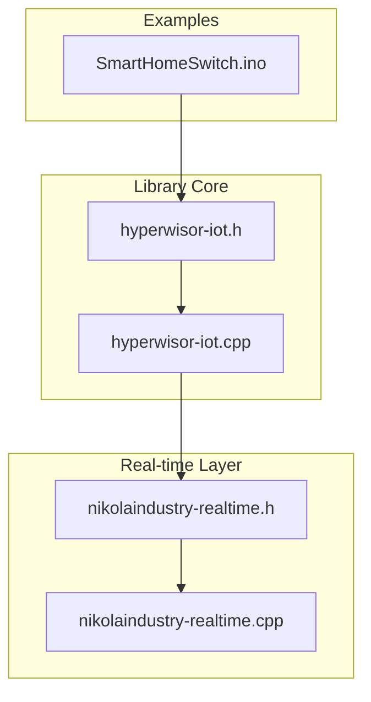
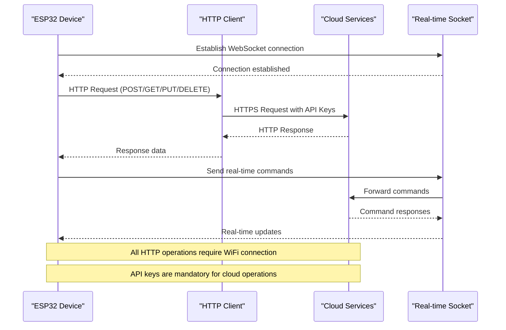
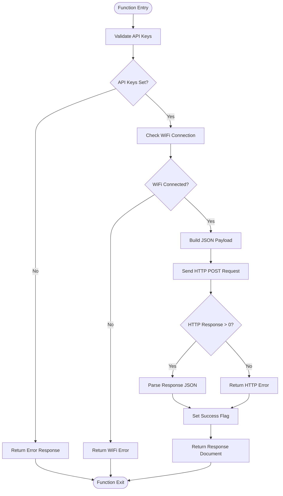
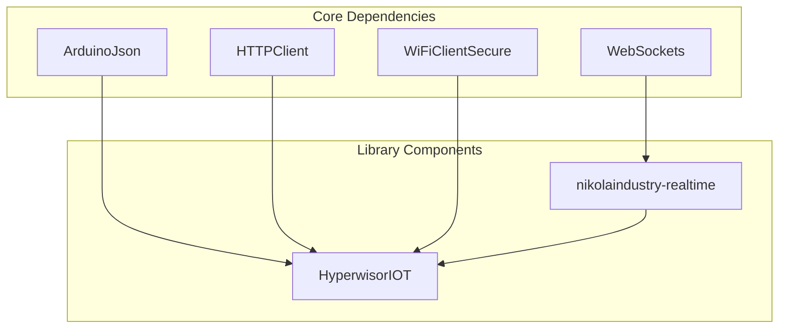
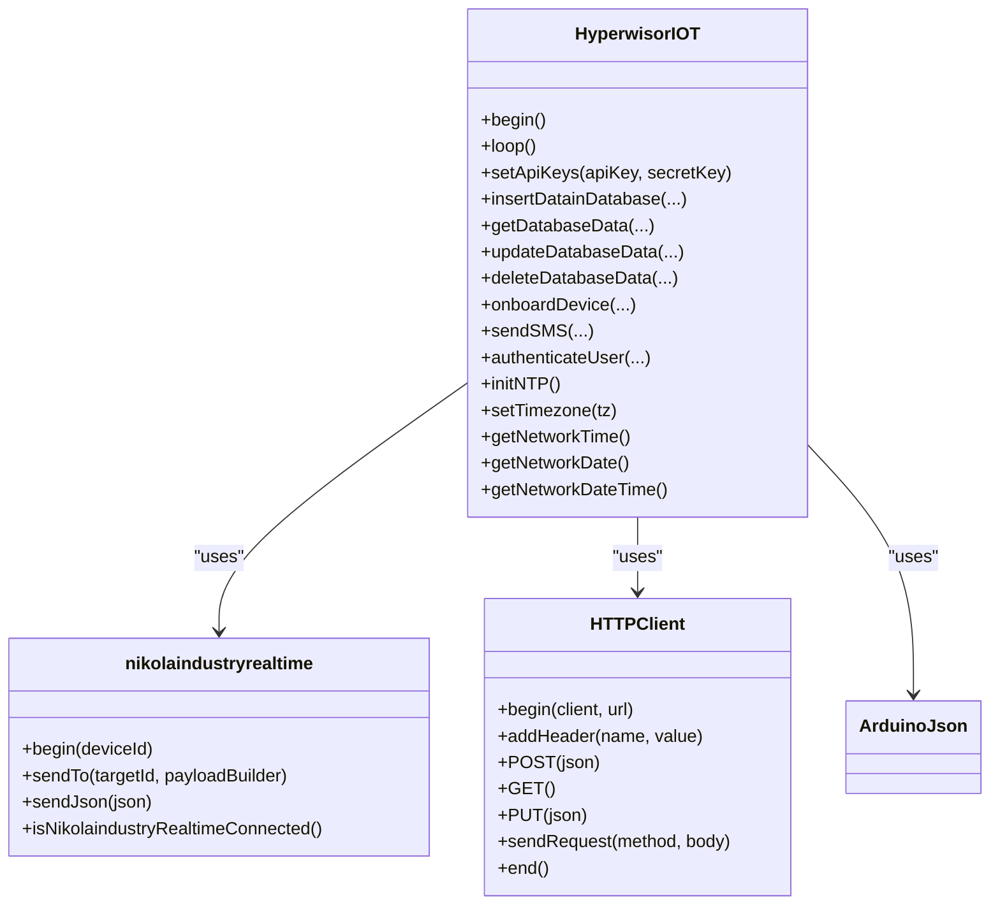

# Cloud Services API

<cite>
**Referenced Files in This Document**
- [hyperwisor-iot.h](file://src/hyperwisor-iot.h)
- [hyperwisor-iot.cpp](file://src/hyperwisor-iot.cpp)
- [nikolaindustry-realtime.h](file://src/nikolaindustry-realtime.h)
- [nikolaindustry-realtime.cpp](file://src/nikolaindustry-realtime.cpp)
- [SmartHomeSwitch.ino](file://examples/SmartHomeSwitch/SmartHomeSwitch.ino)
- [README.md](file://README.md)
- [library.properties](file://library.properties)
</cite>

## Table of Contents
1. [Introduction](#introduction)
2. [Project Structure](#project-structure)
3. [Core Components](#core-components)
4. [Architecture Overview](#architecture-overview)
5. [Detailed Component Analysis](#detailed-component-analysis)
6. [Dependency Analysis](#dependency-analysis)
7. [Performance Considerations](#performance-considerations)
8. [Troubleshooting Guide](#troubleshooting-guide)
9. [Conclusion](#conclusion)

## Introduction
This document provides comprehensive API documentation for the cloud service integration functions in the Hyperwisor-IOT Arduino library. The library enables ESP32-based IoT devices to integrate with cloud services including database operations, device onboarding, SMS messaging, user authentication, and time management. The documentation covers function signatures, parameter specifications, response handling patterns, error codes, and practical integration examples using the SmartHomeSwitch example.

## Project Structure
The library follows a modular structure with clear separation of concerns:
- Core library interface and declarations in header files
- Implementation details in corresponding CPP files
- Real-time communication wrapper for WebSocket connectivity
- Example implementations demonstrating practical usage patterns



**Diagram sources**
- [hyperwisor-iot.h](file://src/hyperwisor-iot.h#L1-L190)
- [hyperwisor-iot.cpp](file://src/hyperwisor-iot.cpp#L1-L1811)
- [nikolaindustry-realtime.h](file://src/nikolaindustry-realtime.h#L1-L35)
- [nikolaindustry-realtime.cpp](file://src/nikolaindustry-realtime.cpp#L1-L113)

**Section sources**
- [hyperwisor-iot.h](file://src/hyperwisor-iot.h#L1-L190)
- [README.md](file://README.md#L1-L173)

## Core Components
The library exposes a comprehensive set of cloud service integration functions organized into logical categories:

### Database Operations
- Data insertion with response capture
- Data retrieval with configurable limits
- Data updates with selective field updates
- Data deletion with confirmation responses

### Device Management
- Device onboarding with product and user identification
- Comprehensive response handling for provisioning workflows

### Communication Services
- SMS delivery with recipient and message content
- User authentication with credential validation

### Time Management
- Network time synchronization via NTP
- Timezone configuration and adjustment
- Localized time/date formatting

**Section sources**
- [hyperwisor-iot.h](file://src/hyperwisor-iot.h#L119-L140)
- [hyperwisor-iot.cpp](file://src/hyperwisor-iot.cpp#L730-L1779)

## Architecture Overview
The cloud service integration architecture combines HTTP client operations with real-time WebSocket communication:



**Diagram sources**
- [hyperwisor-iot.cpp](file://src/hyperwisor-iot.cpp#L13-L28)
- [nikolaindustry-realtime.cpp](file://src/nikolaindustry-realtime.cpp#L5-L75)

## Detailed Component Analysis

### Database Operations API

#### insertDatainDatabase()
The primary function for inserting data into cloud databases with automatic response handling.

**Function Signature:**
```cpp
void insertDatainDatabase(
    const String &productId,
    const String &deviceId,
    const String &tableName,
    std::function<void(JsonObject &)> dataBuilder
);
```

**Parameters:**
- `productId`: Product identifier for tenant isolation
- `deviceId`: Unique device identifier
- `tableName`: Target database table name
- `dataBuilder`: Callback function to construct JSON payload

**Response Pattern:** Silent operation with console logging for success/failure

**Error Handling:**
- API key validation (requires setApiKeys())
- WiFi connectivity check
- HTTP response code reporting

**Section sources**
- [hyperwisor-iot.h](file://src/hyperwisor-iot.h#L120-L121)
- [hyperwisor-iot.cpp](file://src/hyperwisor-iot.cpp#L731-L778)

#### insertDatainDatabaseWithResponse()
Enhanced version that captures and returns detailed response information.

**Function Signature:**
```cpp
DynamicJsonDocument insertDatainDatabaseWithResponse(
    const String &productId,
    const String &deviceId,
    const String &tableName,
    std::function<void(JsonObject &)> dataBuilder
);
```

**Response Structure:**
```json
{
  "success": boolean,
  "http_response_code": integer,
  "data": object,
  "error": string,
  "raw_response": string
}
```

**Processing Logic:**


**Diagram sources**
- [hyperwisor-iot.cpp](file://src/hyperwisor-iot.cpp#L781-L847)

**Section sources**
- [hyperwisor-iot.h](file://src/hyperwisor-iot.h#L120-L121)
- [hyperwisor-iot.cpp](file://src/hyperwisor-iot.cpp#L781-L847)

#### getDatabaseData()
Data retrieval with configurable result limits.

**Function Signature:**
```cpp
void getDatabaseData(
    const String &productId,
    const String &tableName,
    int limit = 50
);
```

**URL Parameters:**
- `product_id`: Product identifier
- `table_name`: Database table name  
- `limit`: Maximum records to retrieve (default: 50)

**Section sources**
- [hyperwisor-iot.h](file://src/hyperwisor-iot.h#L122-L123)
- [hyperwisor-iot.cpp](file://src/hyperwisor-iot.cpp#L850-L888)

#### getDatabaseDataWithResponse()
Complete response capture for data retrieval operations.

**Section sources**
- [hyperwisor-iot.h](file://src/hyperwisor-iot.h#L122-L123)
- [hyperwisor-iot.cpp](file://src/hyperwisor-iot.cpp#L891-L948)

#### updateDatabaseData()
Selective data updates with partial field modifications.

**Function Signature:**
```cpp
void updateDatabaseData(
    const String &dataId,
    std::function<void(JsonObject &)> dataBuilder
);
```

**Endpoint:** `PUT /manufacturer-api/database/runtime-data/{dataId}`

**Section sources**
- [hyperwisor-iot.h](file://src/hyperwisor-iot.h#L124-L127)
- [hyperwisor-iot.cpp](file://src/hyperwisor-iot.cpp#L951-L995)

#### updateDatabaseDataWithResponse()
Enhanced update operation with comprehensive response handling.

**Section sources**
- [hyperwisor-iot.h](file://src/hyperwisor-iot.h#L124-L127)
- [hyperwisor-iot.cpp](file://src/hyperwisor-iot.cpp#L998-L1061)

#### deleteDatabaseData()
Data removal with confirmation.

**Function Signature:**
```cpp
void deleteDatabaseData(const String &dataId);
```

**Endpoint:** `DELETE /manufacturer-api/database/runtime-data/{dataId}`

**Section sources**
- [hyperwisor-iot.h](file://src/hyperwisor-iot.h#L126-L127)
- [hyperwisor-iot.cpp](file://src/hyperwisor-iot.cpp#L1064-L1097)

#### deleteDatabaseDataWithResponse()
Complete response capture for deletion operations.

**Section sources**
- [hyperwisor-iot.h](file://src/hyperwisor-iot.h#L126-L127)
- [hyperwisor-iot.cpp](file://src/hyperwisor-iot.cpp#L1100-L1152)

### Device Onboarding Functions

#### onboardDevice()
Device provisioning with product, user, and device identifiers.

**Function Signature:**
```cpp
void onboardDevice(
    const String &productId,
    const String &userId,
    const String &deviceName,
    const String &deviceIdentifier
);
```

**Request Payload:**
```json
{
  "product_id": "string",
  "user_id": "string", 
  "device_name": "string",
  "device_identifier": "string"
}
```

**Section sources**
- [hyperwisor-iot.h](file://src/hyperwisor-iot.h#L129-L131)
- [hyperwisor-iot.cpp](file://src/hyperwisor-iot.cpp#L1155-L1200)

#### onboardDeviceWithResponse()
Enhanced onboarding with comprehensive response handling.

**Section sources**
- [hyperwisor-iot.h](file://src/hyperwisor-iot.h#L129-L131)
- [hyperwisor-iot.cpp](file://src/hyperwisor-iot.cpp#L1203-L1267)

### SMS Services

#### sendSMS()
Simple SMS delivery without response capture.

**Function Signature:**
```cpp
void sendSMS(
    const String &productId,
    const String &to,
    const String &message
);
```

**Request Payload:**
```json
{
  "productId": "string",
  "to": "string",
  "message": "string"
}
```

**Section sources**
- [hyperwisor-iot.h](file://src/hyperwisor-iot.h#L134-L135)
- [hyperwisor-iot.cpp](file://src/hyperwisor-iot.cpp#L1270-L1314)

#### sendSMSWithResponse()
Complete SMS delivery with response handling.

**Section sources**
- [hyperwisor-iot.h](file://src/hyperwisor-iot.h#L134-L135)
- [hyperwisor-iot.cpp](file://src/hyperwisor-iot.cpp#L1317-L1380)

### Authentication Functions

#### authenticateUser()
User credential validation.

**Function Signature:**
```cpp
void authenticateUser(
    const String &email,
    const String &password
);
```

**Request Payload:**
```json
{
  "email": "string",
  "password": "string"
}
```

**Section sources**
- [hyperwisor-iot.h](file://src/hyperwisor-iot.h#L138-L139)
- [hyperwisor-iot.cpp](file://src/hyperwisor-iot.cpp#L1506-L1549)

#### authenticateUserWithResponse()
Enhanced authentication with response capture.

**Section sources**
- [hyperwisor-iot.h](file://src/hyperwisor-iot.h#L138-L139)
- [hyperwisor-iot.cpp](file://src/hyperwisor-iot.cpp#L1552-L1614)

### Time Management Functions

#### initNTP()
Network time synchronization initialization.

**Features:**
- Configures NTP servers with timezone support
- Handles GMT offset calculations
- Automatic retry mechanism for time synchronization

**Section sources**
- [hyperwisor-iot.h](file://src/hyperwisor-iot.h#L113-L117)
- [hyperwisor-iot.cpp](file://src/hyperwisor-iot.cpp#L1617-L1654)

#### setTimezone()
Timezone configuration with dynamic reinitialization.

**Section sources**
- [hyperwisor-iot.h](file://src/hyperwisor-iot.h#L114-L117)
- [hyperwisor-iot.cpp](file://src/hyperwisor-iot.cpp#L1657-L1665)

#### getNetworkTime()
Current time retrieval with localization.

**Returns:** Formatted time string "HH:MM:SS"

**Section sources**
- [hyperwisor-iot.h](file://src/hyperwisor-iot.h#L115-L117)
- [hyperwisor-iot.cpp](file://src/hyperwisor-iot.cpp#L1668-L1703)

#### getNetworkDate()
Current date retrieval with localization.

**Returns:** Formatted date string "YYYY-MM-DD"

**Section sources**
- [hyperwisor-iot.h](file://src/hyperwisor-iot.h#L115-L117)
- [hyperwisor-iot.cpp](file://src/hyperwisor-iot.cpp#L1706-L1741)

#### getNetworkDateTime()
Combined date and time retrieval.

**Returns:** Formatted datetime string "YYYY-MM-DD HH:MM:SS"

**Section sources**
- [hyperwisor-iot.h](file://src/hyperwisor-iot.h#L115-L117)
- [hyperwisor-iot.cpp](file://src/hyperwisor-iot.cpp#L1744-L1779)

## Dependency Analysis

### External Dependencies
The library relies on several Arduino ecosystem components:



**Diagram sources**
- [library.properties](file://library.properties#L10-L11)
- [hyperwisor-iot.h](file://src/hyperwisor-iot.h#L4-L14)

### Internal Component Relationships


**Diagram sources**
- [hyperwisor-iot.h](file://src/hyperwisor-iot.h#L39-L187)
- [nikolaindustry-realtime.h](file://src/nikolaindustry-realtime.h#L10-L32)

**Section sources**
- [library.properties](file://library.properties#L9-L11)
- [hyperwisor-iot.h](file://src/hyperwisor-iot.h#L1-L15)

## Performance Considerations

### Memory Management
- Dynamic JSON documents use heap allocation for HTTP payloads
- Response documents are sized according to expected payload complexity
- Consider memory constraints for ESP32 devices with limited RAM

### Network Optimization
- HTTP requests use secure connections with certificate verification disabled for development
- WebSocket maintains persistent connections with automatic reconnection
- NTP synchronization includes retry mechanisms for reliable time acquisition

### Error Handling Patterns
- All cloud operations validate API key presence before execution
- WiFi connectivity checks prevent unnecessary network requests
- Comprehensive error reporting through response documents

## Troubleshooting Guide

### Common Issues and Solutions

#### API Key Validation Failures
**Symptoms:** Functions return immediately without network activity
**Solution:** Ensure `setApiKeys()` is called before any cloud operations

#### WiFi Connectivity Problems
**Symptoms:** HTTP requests fail with negative response codes
**Solution:** Verify WiFi credentials and network availability before cloud operations

#### SSL Certificate Verification
**Note:** Development builds disable SSL certificate verification for convenience
**Security Warning:** Production deployments should implement proper certificate validation

#### Time Synchronization Issues
**Symptoms:** Time functions return empty strings or incorrect values
**Solution:** Ensure WiFi connectivity and allow sufficient time for NTP initialization

**Section sources**
- [hyperwisor-iot.cpp](file://src/hyperwisor-iot.cpp#L733-L742)
- [hyperwisor-iot.cpp](file://src/hyperwisor-iot.cpp#L852-L861)
- [hyperwisor-iot.cpp](file://src/hyperwisor-iot.cpp#L1618-L1653)

## Conclusion

The Hyperwisor-IOT library provides a comprehensive cloud service integration framework for ESP32-based IoT devices. Its modular design separates concerns between real-time communication, HTTP operations, and specialized services like database management, device onboarding, SMS delivery, and time synchronization.

Key strengths include:
- Consistent API design with synchronous and asynchronous variants
- Comprehensive error handling and response capture
- Flexible payload construction through callback functions
- Robust real-time communication with automatic reconnection
- Practical integration examples demonstrating real-world usage patterns

The library's architecture supports scalable IoT deployments while maintaining simplicity for individual device implementations. The SmartHomeSwitch example demonstrates practical application of these APIs in real-world scenarios involving device control, state persistence, and cloud integration.