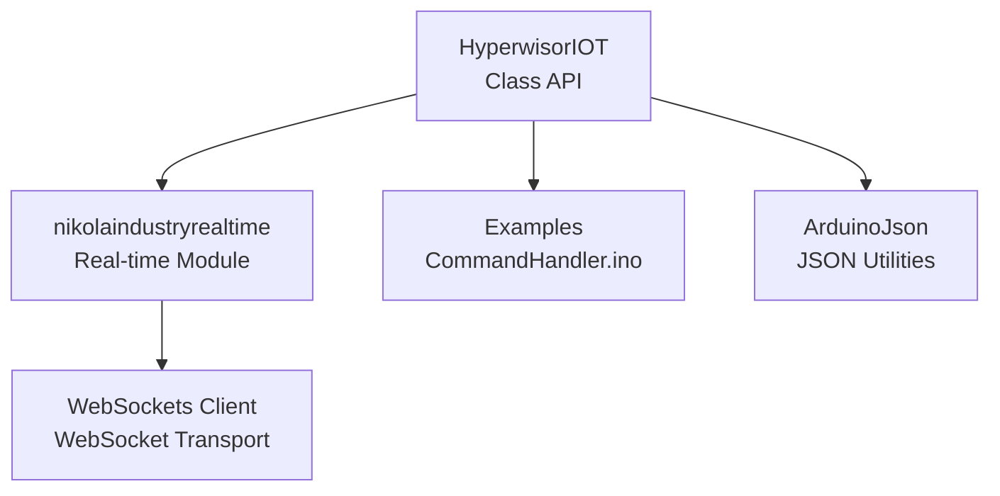
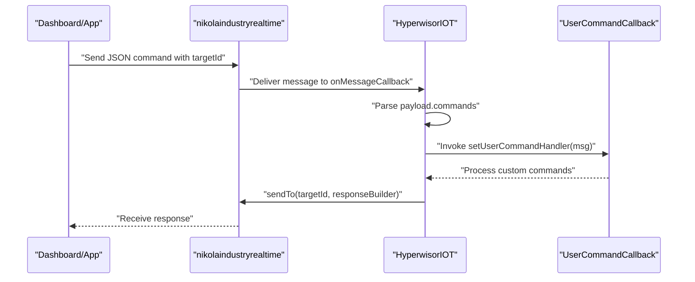
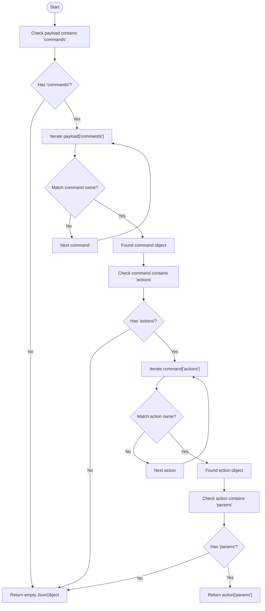
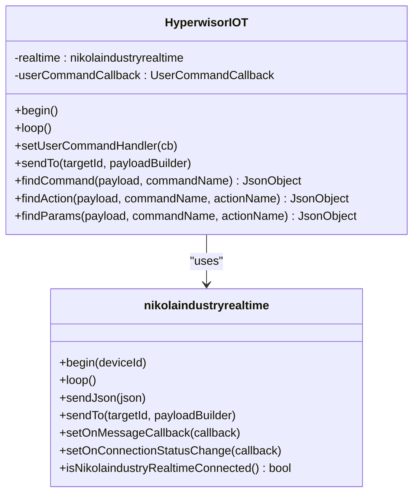
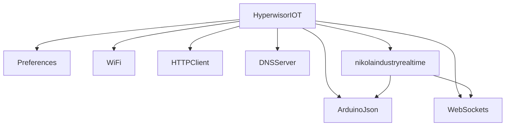

# Command Processing API

<cite>
**Referenced Files in This Document**
- [hyperwisor-iot.h](file://src/hyperwisor-iot.h)
- [hyperwisor-iot.cpp](file://src/hyperwisor-iot.cpp)
- [nikolaindustry-realtime.h](file://src/nikolaindustry-realtime.h)
- [nikolaindustry-realtime.cpp](file://src/nikolaindustry-realtime.cpp)
- [CommandHandler.ino](file://examples/CommandHandler/CommandHandler.ino)
- [README.md](file://README.md)
- [library.properties](file://library.properties)
</cite>

## Table of Contents
1. [Introduction](#introduction)
2. [Project Structure](#project-structure)
3. [Core Components](#core-components)
4. [Architecture Overview](#architecture-overview)
5. [Detailed Component Analysis](#detailed-component-analysis)
6. [Dependency Analysis](#dependency-analysis)
7. [Performance Considerations](#performance-considerations)
8. [Troubleshooting Guide](#troubleshooting-guide)
9. [Conclusion](#conclusion)

## Introduction
This document provides comprehensive API documentation for the command processing and messaging system in the Hyperwisor-IOT Arduino library. It focuses on:
- Registering custom command callbacks with setUserCommandHandler()
- Sending targeted messages with sendTo()
- JSON utility functions for command parsing: findCommand(), findAction(), and findParams()
- The UserCommandCallback typedef and callback function signature requirements
- Message structure handling, response patterns, and integration with real-time communication via the nikolaindustry-realtime protocol

The documentation includes practical examples from the CommandHandler example sketch and explains the message routing system, error handling, and integration with real-time communication.

## Project Structure
The library consists of:
- A primary header and implementation for the HyperwisorIOT class
- A separate real-time communication module (nikolaindustry-realtime)
- Example sketches demonstrating command handling and message routing

**Diagram sources**
- [hyperwisor-iot.h](file://src/hyperwisor-iot.h#L39-L187)
- [nikolaindustry-realtime.h](file://src/nikolaindustry-realtime.h#L10-L32)
- [CommandHandler.ino](file://examples/CommandHandler/CommandHandler.ino#L15-L95)

**Section sources**
- [hyperwisor-iot.h](file://src/hyperwisor-iot.h#L1-L190)
- [nikolaindustry-realtime.h](file://src/nikolaindustry-realtime.h#L1-L35)
- [README.md](file://README.md#L1-L173)

## Core Components
This section documents the primary APIs for command processing and messaging.

- UserCommandCallback typedef and registration
  - typedef: std::function<void(JsonObject &msg)>
  - Registration: setUserCommandHandler(UserCommandCallback cb)
  - Purpose: Allows users to register a custom callback that receives incoming messages and processes application-specific commands.

- Targeted message sending
  - Function: sendTo(const String &targetId, std::function<void(JsonObject &)> payloadBuilder)
  - Purpose: Sends a JSON payload to a specific targetId using the real-time transport.

- JSON utility functions
  - findCommand(JsonObject& payload, const char* commandName): Locates a command object by name within the payload.commands array.
  - findAction(JsonObject& payload, const char* commandName, const char* actionName): Finds an action object within a given command.
  - findParams(JsonObject& payload, const char* commandName, const char* actionName): Retrieves the params object for a specific action.

- Real-time messaging interface
  - nikolaindustryrealtime exposes sendTo(targetId, payloadBuilder) and setOnMessageCallback(callback) for low-level control.

**Section sources**
- [hyperwisor-iot.h](file://src/hyperwisor-iot.h#L37-L56)
- [hyperwisor-iot.h](file://src/hyperwisor-iot.h#L142-L145)
- [nikolaindustry-realtime.h](file://src/nikolaindustry-realtime.h#L17-L21)
- [hyperwisor-iot.cpp](file://src/hyperwisor-iot.cpp#L407-L411)
- [hyperwisor-iot.cpp](file://src/hyperwisor-iot.cpp#L520-L532)
- [hyperwisor-iot.cpp](file://src/hyperwisor-iot.cpp#L1781-L1810)

## Architecture Overview
The command processing pipeline integrates Wi-Fi provisioning, real-time communication, and structured JSON command execution.

**Diagram sources**
- [nikolaindustry-realtime.cpp](file://src/nikolaindustry-realtime.cpp#L25-L59)
- [hyperwisor-iot.cpp](file://src/hyperwisor-iot.cpp#L313-L404)
- [hyperwisor-iot.cpp](file://src/hyperwisor-iot.cpp#L407-L411)
- [hyperwisor-iot.cpp](file://src/hyperwisor-iot.cpp#L520-L532)

## Detailed Component Analysis

### setUserCommandHandler()
- Signature: void setUserCommandHandler(UserCommandCallback cb)
- Callback signature: std::function<void(JsonObject &msg)>
- Behavior:
  - Stores the provided callback for later invocation.
  - The callback receives the entire incoming message object, including the "from" field and "payload".
  - Typical usage involves checking for presence of "payload", iterating through payload.commands, and dispatching to application-specific logic.

- Example usage:
  - See the CommandHandler example for a complete callback implementation that:
    - Reads the sender ID from msg["from"]
    - Validates presence of msg["payload"]
    - Iterates payload.commands to process custom commands
    - Uses sendTo() to respond to the sender

- Error handling considerations:
  - The callback should guard against missing keys (e.g., "payload") and malformed JSON.
  - Responses should be constructed via sendTo() to ensure proper routing.

**Section sources**
- [hyperwisor-iot.h](file://src/hyperwisor-iot.h#L37-L56)
- [hyperwisor-iot.cpp](file://src/hyperwisor-iot.cpp#L407-L411)
- [CommandHandler.ino](file://examples/CommandHandler/CommandHandler.ino#L25-L85)

### sendTo()
- Signature: void sendTo(const String &targetId, std::function<void(JsonObject &)> payloadBuilder)
- Behavior:
  - Constructs a JSON message with "targetId" and a nested "payload" object.
  - Invokes the provided payloadBuilder to populate the payload.
  - Sends the message via the real-time transport (nikolaindustry-realtime).

- Message structure:
  - Root fields: "targetId" (String), "payload" (Object)
  - Payload content is defined by the caller via payloadBuilder.

- Response patterns:
  - Use sendTo() to send responses back to the sender identified by msg["from"].
  - The example demonstrates sending status and device metrics in response to commands.

**Section sources**
- [hyperwisor-iot.cpp](file://src/hyperwisor-iot.cpp#L520-L532)
- [CommandHandler.ino](file://examples/CommandHandler/CommandHandler.ino#L68-L83)

### JSON Utility Functions
- findCommand()
  - Purpose: Locate a command object by name within payload["commands"].
  - Returns: JsonObject representing the command or an empty JsonObject if not found.
  - Complexity: O(n) over the commands array.

- findAction()
  - Purpose: Find an action object within a given command by action name.
  - Returns: JsonObject representing the action or an empty JsonObject if not found.
  - Complexity: O(m) over the actions array.

- findParams()
  - Purpose: Retrieve the params object for a specific action.
  - Returns: JsonObject representing params or an empty JsonObject if not found.
  - Complexity: O(1) once the action is located.

- Usage pattern:
  - Chain findCommand() -> findAction() -> findParams() to extract parameters for a specific action.
  - Guard against null objects before accessing nested fields.

**Diagram sources**
- [hyperwisor-iot.cpp](file://src/hyperwisor-iot.cpp#L1781-L1810)

**Section sources**
- [hyperwisor-iot.h](file://src/hyperwisor-iot.h#L142-L145)
- [hyperwisor-iot.cpp](file://src/hyperwisor-iot.cpp#L1781-L1810)

### Real-time Communication Integration
- nikolaindustryrealtime
  - Provides WebSocket-based transport for real-time messaging.
  - Exposes sendTo(targetId, payloadBuilder) and setOnMessageCallback(callback).
  - Manages connection lifecycle, heartbeat, and reconnection.

- HyperwisorIOT integration
  - On successful Wi-Fi connection, HyperwisorIOT initializes the real-time client and registers a message handler.
  - Incoming messages are parsed and routed to both built-in command handlers and the user's custom callback.

**Diagram sources**
- [hyperwisor-iot.h](file://src/hyperwisor-iot.h#L39-L187)
- [nikolaindustry-realtime.h](file://src/nikolaindustry-realtime.h#L10-L32)

**Section sources**
- [nikolaindustry-realtime.h](file://src/nikolaindustry-realtime.h#L10-L32)
- [nikolaindustry-realtime.cpp](file://src/nikolaindustry-realtime.cpp#L5-L112)
- [hyperwisor-iot.cpp](file://src/hyperwisor-iot.cpp#L313-L404)

### Message Routing and Response Patterns
- Routing:
  - Incoming messages carry a "from" field indicating the sender.
  - Outgoing responses should target the sender using sendTo(newtarget, ...), where newtarget is derived from msg["from"] during message handling.

- Response patterns:
  - Successful command execution: send a response payload with status indicators and relevant data.
  - Device status queries: respond with device health metrics and connectivity status.

- Example patterns:
  - The CommandHandler example demonstrates:
    - Parsing commands and actions
    - Constructing responses with status and metadata
    - Using sendTo() to return responses to the original sender

**Section sources**
- [hyperwisor-iot.cpp](file://src/hyperwisor-iot.cpp#L313-L404)
- [CommandHandler.ino](file://examples/CommandHandler/CommandHandler.ino#L25-L85)

## Dependency Analysis
The library depends on:
- ArduinoJson for JSON serialization/deserialization
- WebSockets for real-time transport
- Preferences for persistent storage of credentials
- WiFi, WebServer, HTTPClient, DNSServer for provisioning and AP mode

**Diagram sources**
- [hyperwisor-iot.h](file://src/hyperwisor-iot.h#L4-L14)
- [nikolaindustry-realtime.h](file://src/nikolaindustry-realtime.h#L4-L8)
- [library.properties](file://library.properties#L10-L10)

**Section sources**
- [hyperwisor-iot.h](file://src/hyperwisor-iot.h#L4-L14)
- [nikolaindustry-realtime.h](file://src/nikolaindustry-realtime.h#L4-L8)
- [library.properties](file://library.properties#L10-L10)

## Performance Considerations
- JSON parsing overhead:
  - Commands and actions are iterated linearly. Keep the number of commands/actions reasonable to minimize latency.
- Memory usage:
  - DynamicJsonDocument sizes are chosen to accommodate typical payloads. Adjust buffer sizes based on payload complexity.
- Real-time reliability:
  - The real-time module manages heartbeats and reconnections. Ensure adequate power and network stability for continuous operation.

## Troubleshooting Guide
Common issues and resolutions:
- No payload in message:
  - The callback should check for msg.containsKey("payload") and return early if absent.
- Missing "from" field:
  - Use msg["from"] with safe accessors and fallbacks when constructing responses.
- JSON deserialization errors:
  - Verify the message conforms to the expected structure. Use ArduinoJson’s deserializeJson and check for errors.
- WebSocket disconnections:
  - The library attempts periodic reconnection. Monitor connection status via setOnConnectionStatusChange and implement retry logic if needed.
- OTA update failures:
  - Ensure the OTA URL is valid and accessible. Validate parameters passed in the OTA command.

**Section sources**
- [CommandHandler.ino](file://examples/CommandHandler/CommandHandler.ino#L31-L35)
- [nikolaindustry-realtime.cpp](file://src/nikolaindustry-realtime.cpp#L25-L59)
- [hyperwisor-iot.cpp](file://src/hyperwisor-iot.cpp#L313-L404)

## Conclusion
The Hyperwisor-IOT library provides a robust foundation for building command-driven IoT applications on ESP32. The setUserCommandHandler() API enables flexible custom command processing, while sendTo() ensures reliable, targeted messaging. The JSON utility functions simplify command and action discovery, and the integration with nikolaindustry-realtime delivers real-time responsiveness. By following the patterns demonstrated in the CommandHandler example and adhering to the error-handling guidelines, developers can implement reliable command processing and messaging workflows.