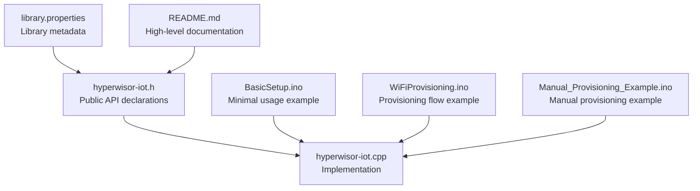
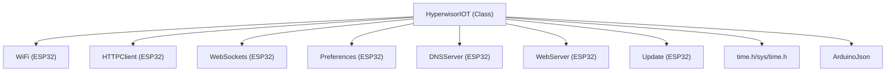

# Core Library Functions

<cite>
**Referenced Files in This Document**
- [hyperwisor-iot.h](file://src/hyperwisor-iot.h)
- [hyperwisor-iot.cpp](file://src/hyperwisor-iot.cpp)
- [BasicSetup.ino](file://examples/BasicSetup/BasicSetup.ino)
- [WiFiProvisioning.ino](file://examples/WiFiProvisioning/WiFiProvisioning.ino)
- [Manual_Provisioning_Example.ino](file://examples/Manual_Provisioning_Example/Manual_Provisioning_Example.ino)
- [library.properties](file://library.properties)
- [README.md](file://README.md)
</cite>

## Table of Contents
1. [Introduction](#introduction)
2. [Project Structure](#project-structure)
3. [Core Components](#core-components)
4. [Architecture Overview](#architecture-overview)
5. [Detailed Component Analysis](#detailed-component-analysis)
6. [Dependency Analysis](#dependency-analysis)
7. [Performance Considerations](#performance-considerations)
8. [Troubleshooting Guide](#troubleshooting-guide)
9. [Conclusion](#conclusion)

## Introduction
This document provides comprehensive API documentation for the core Hyperwisor-IOT library functions. It focuses on the main constructor and initialization lifecycle, API key configuration, device identification, and WiFi provisioning capabilities. Practical usage examples are drawn from the BasicSetup example and other included demonstrations.

## Project Structure
The library consists of a primary header and implementation file that define the HyperwisorIOT class, plus several example sketches demonstrating typical usage patterns.

**Diagram sources**
- [hyperwisor-iot.h](file://src/hyperwisor-iot.h#L1-L190)
- [hyperwisor-iot.cpp](file://src/hyperwisor-iot.cpp#L1-L1811)
- [BasicSetup.ino](file://examples/BasicSetup/BasicSetup.ino#L1-L39)
- [WiFiProvisioning.ino](file://examples/WiFiProvisioning/WiFiProvisioning.ino#L1-L58)
- [Manual_Provisioning_Example.ino](file://examples/Manual_Provisioning_Example/Manual_Provisioning_Example.ino#L1-L65)
- [library.properties](file://library.properties#L1-L11)
- [README.md](file://README.md#L1-L173)

**Section sources**
- [hyperwisor-iot.h](file://src/hyperwisor-iot.h#L1-L190)
- [hyperwisor-iot.cpp](file://src/hyperwisor-iot.cpp#L1-L1811)
- [library.properties](file://library.properties#L1-L11)
- [README.md](file://README.md#L1-L173)

## Core Components
This section documents the core lifecycle and provisioning APIs, including initialization order, error handling patterns, and integration points.

- Constructor
  - Purpose: Construct a HyperwisorIOT instance.
  - Signature: HyperwisorIOT()
  - Notes: Initializes internal state; no parameters required.

- Initialization Lifecycle
  - begin(): Performs credential loading, attempts WiFi connection, starts AP mode if needed, and initializes NTP.
  - loop(): Manages WiFi reconnection, WebSocket connectivity, and AP mode timeouts.

- API Key Configuration
  - setApiKeys(apiKey, secretKey): Stores API keys used by backend communication functions.

- Device Identification
  - getDeviceId(): Retrieves the stored device identifier.
  - getUserId(): Retrieves the stored user identifier.

- WiFi Provisioning
  - setWiFiCredentials(ssid, password): Saves WiFi credentials to persistent storage.
  - setDeviceId(deviceId): Saves the device identifier.
  - setUserId(userId): Saves the user identifier.
  - setCredentials(ssid, password, deviceId, userId): Bulk setter for all credentials.
  - clearCredentials(): Removes all stored credentials.
  - hasCredentials(): Checks if required credentials exist.

**Section sources**
- [hyperwisor-iot.h](file://src/hyperwisor-iot.h#L39-L72)
- [hyperwisor-iot.cpp](file://src/hyperwisor-iot.cpp#L13-L137)
- [hyperwisor-iot.cpp](file://src/hyperwisor-iot.cpp#L414-L518)

## Architecture Overview
The library orchestrates WiFi provisioning, real-time communication, and periodic maintenance through a simple lifecycle.

```mermaid
sequenceDiagram
participant App as "User Sketch"
participant HW as "HyperwisorIOT"
participant Pref as "Preferences"
participant WiFi as "WiFi"
participant RT as "Realtime"
participant AP as "AP Mode"
App->>HW : begin()
HW->>Pref : getcredentials()
Pref-->>HW : ssid,password,deviceid,userid
alt Credentials present
HW->>WiFi : connectToWiFi()
WiFi-->>HW : Connected or Failed
alt Connected
HW->>RT : begin(deviceid)
HW->>RT : setupMessageHandler()
else Failed
HW->>AP : startAPMode()
end
else No credentials
HW->>AP : startAPMode()
end
HW->>HW : initNTP()
loop Every loop()
HW->>WiFi : status()
alt Station mode
HW->>RT : isNikolaindustryRealtimeConnected()
alt Disconnected
HW->>RT : begin(deviceid)
HW->>RT : setupMessageHandler()
end
HW->>RT : loop()
else AP mode
HW->>AP : dnsServer.processNextRequest()
HW->>AP : server.handleClient()
HW->>HW : Timeout check
end
end
```

**Diagram sources**
- [hyperwisor-iot.cpp](file://src/hyperwisor-iot.cpp#L13-L137)
- [hyperwisor-iot.cpp](file://src/hyperwisor-iot.cpp#L141-L156)
- [hyperwisor-iot.cpp](file://src/hyperwisor-iot.cpp#L159-L185)
- [hyperwisor-iot.cpp](file://src/hyperwisor-iot.cpp#L256-L310)

## Detailed Component Analysis

### Constructor and Initialization
- Constructor: HyperwisorIOT()
  - Purpose: Creates a library instance ready for initialization.
  - Complexity: O(1).
  - Notes: No runtime work performed; initialization occurs in begin().

- begin()
  - Purpose: Orchestrates device initialization.
  - Behavior:
    - Loads stored credentials from Preferences.
    - Attempts WiFi connection if credentials exist; otherwise starts AP mode.
    - Initializes NTP for time functions.
  - Error handling: Prints diagnostic messages; falls back to AP mode on connection failure.
  - Integration: Prepares realtime messaging and HTTP server for provisioning.

- loop()
  - Purpose: Maintains connectivity and handles AP mode.
  - Behavior:
    - In station mode: manages WiFi reconnection and WebSocket reconnection with retry limits.
    - In AP mode: serves provisioning page and enforces a 4-minute timeout.
  - Error handling: Logs reconnection attempts and reboots after max retries.

**Section sources**
- [hyperwisor-iot.h](file://src/hyperwisor-iot.h#L43-L48)
- [hyperwisor-iot.cpp](file://src/hyperwisor-iot.cpp#L13-L28)
- [hyperwisor-iot.cpp](file://src/hyperwisor-iot.cpp#L46-L137)

### API Key Configuration
- setApiKeys(apiKey, secretKey)
  - Purpose: Store API keys used by database, SMS, and authentication functions.
  - Parameters:
    - apiKey: String representing the public API key.
    - secretKey: String representing the secret key.
  - Behavior: Assigns values to internal members for later use by HTTP functions.
  - Usage: Call before invoking database, SMS, or authentication functions that require keys.

**Section sources**
- [hyperwisor-iot.h](file://src/hyperwisor-iot.h#L50-L51)
- [hyperwisor-iot.cpp](file://src/hyperwisor-iot.cpp#L725-L728)

### Device Identification
- getDeviceId()
  - Purpose: Retrieve the stored device identifier.
  - Returns: String containing the device ID or "unknown" if not found.
  - Persistence: Reads from Preferences under the "wifi-creds" namespace.

- getUserId()
  - Purpose: Retrieve the stored user identifier.
  - Returns: String containing the user ID or "unknown" if not found.
  - Persistence: Reads from Preferences under the "wifi-creds" namespace.

**Section sources**
- [hyperwisor-iot.h](file://src/hyperwisor-iot.h#L63-L64)
- [hyperwisor-iot.cpp](file://src/hyperwisor-iot.cpp#L414-L429)

### WiFi Provisioning Functions
- setWiFiCredentials(ssid, password)
  - Purpose: Save WiFi credentials to persistent storage.
  - Parameters:
    - ssid: WiFi network name.
    - password: WiFi password.
  - Behavior: Writes to Preferences and updates in-memory copies.

- setDeviceId(deviceId)
  - Purpose: Save the device identifier.
  - Parameter: Unique device identifier string.

- setUserId(userId)
  - Purpose: Save the user identifier.
  - Parameter: User identifier string.

- setCredentials(ssid, password, deviceId, userId)
  - Purpose: Bulk setter for all credentials.
  - Parameter: Optional userId defaults to empty string if omitted.

- clearCredentials()
  - Purpose: Remove all stored credentials.
  - Behavior: Clears Preferences entries and resets in-memory fields.

- hasCredentials()
  - Purpose: Check if required credentials exist.
  - Returns: Boolean indicating presence of ssid, password, and deviceid.

**Section sources**
- [hyperwisor-iot.h](file://src/hyperwisor-iot.h#L67-L72)
- [hyperwisor-iot.cpp](file://src/hyperwisor-iot.cpp#L432-L518)

### Practical Usage Examples

#### BasicSetup Example
- Demonstrates minimal initialization and device ID retrieval.
- Typical flow:
  - Include the library header.
  - Create a HyperwisorIOT instance.
  - Call begin() in setup().
  - Call loop() in the main loop().
  - Optionally retrieve device ID after initialization.

**Section sources**
- [BasicSetup.ino](file://examples/BasicSetup/BasicSetup.ino#L17-L38)

#### WiFi Provisioning Example
- Shows provisioning status checks and AP mode behavior.
- Highlights:
  - Using hasCredentials() to detect provisioning state.
  - Starting AP mode when credentials are missing.
  - Retrieving device and user IDs after successful connection.

**Section sources**
- [WiFiProvisioning.ino](file://examples/WiFiProvisioning/WiFiProvisioning.ino#L21-L57)

#### Manual Provisioning Example
- Demonstrates setting credentials programmatically.
- Shows:
  - Bulk setCredentials() usage.
  - Individual setters for WiFi, device, and user IDs.
  - Optional setApiKeys() call for backend functions.

**Section sources**
- [Manual_Provisioning_Example.ino](file://examples/Manual_Provisioning_Example/Manual_Provisioning_Example.ino#L35-L50)

## Dependency Analysis
The library integrates with several ESP32-native and external components.

**Diagram sources**
- [hyperwisor-iot.h](file://src/hyperwisor-iot.h#L4-L14)
- [hyperwisor-iot.cpp](file://src/hyperwisor-iot.cpp#L1-L5)

**Section sources**
- [hyperwisor-iot.h](file://src/hyperwisor-iot.h#L4-L14)
- [library.properties](file://library.properties#L10-L10)

## Performance Considerations
- WiFi reconnection and WebSocket retry logic:
  - Uses exponential-like backoff via fixed intervals and retry counters.
  - Limits maximum retries and triggers device restart on exhaustion.
- AP mode timeout:
  - Enforces a 4-minute cap to prevent indefinite AP operation.
- NTP initialization:
  - Configures time only once and reinitializes when timezone changes.
- OTA update:
  - Streams firmware content and validates completion before reboot.

**Section sources**
- [hyperwisor-iot.cpp](file://src/hyperwisor-iot.cpp#L46-L137)
- [hyperwisor-iot.cpp](file://src/hyperwisor-iot.cpp#L1617-L1665)
- [hyperwisor-iot.cpp](file://src/hyperwisor-iot.cpp#L1417-L1503)

## Troubleshooting Guide
- WiFi fails to connect:
  - Verify credentials were saved via setCredentials() or AP provisioning.
  - Check serial logs for connection attempts and fallback to AP mode.
- AP mode stuck:
  - Device remains in AP mode for up to 4 minutes; ensure provisioning app completes configuration.
- Realtime disconnections:
  - Library attempts automatic reconnection with retry limits; review serial logs for retry counts.
- API key errors:
  - Many backend functions require setApiKeys() to be called before use; ensure keys are set and WiFi is connected.

**Section sources**
- [hyperwisor-iot.cpp](file://src/hyperwisor-iot.cpp#L278-L310)
- [hyperwisor-iot.cpp](file://src/hyperwisor-iot.cpp#L46-L137)
- [hyperwisor-iot.cpp](file://src/hyperwisor-iot.cpp#L725-L728)

## Conclusion
The Hyperwisor-IOT library provides a streamlined interface for ESP32-based IoT devices to manage WiFi provisioning, real-time communication, and device configuration. The core lifecycle centers around begin() and loop(), with clear provisioning and identification APIs. Proper initialization order and error handling patterns ensure reliable operation across various deployment scenarios.