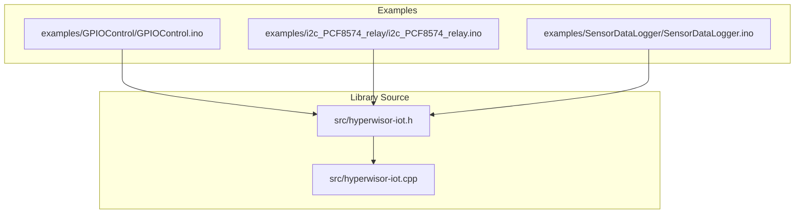
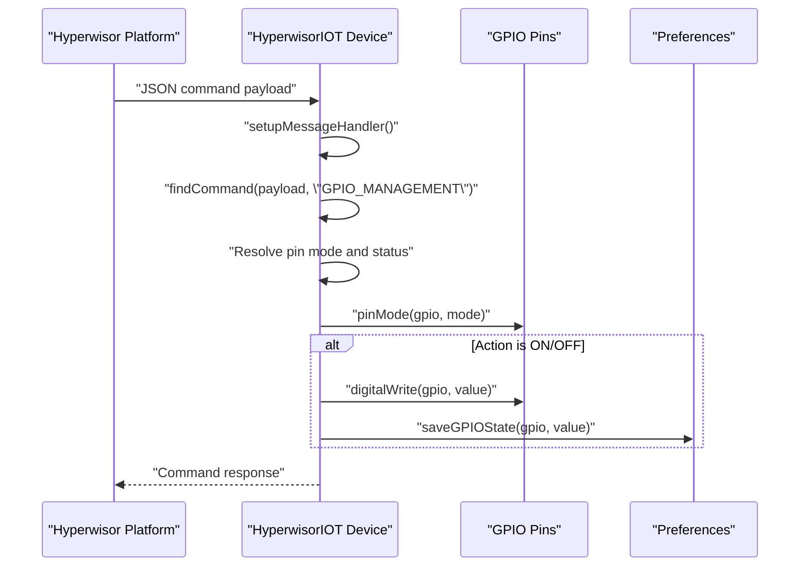
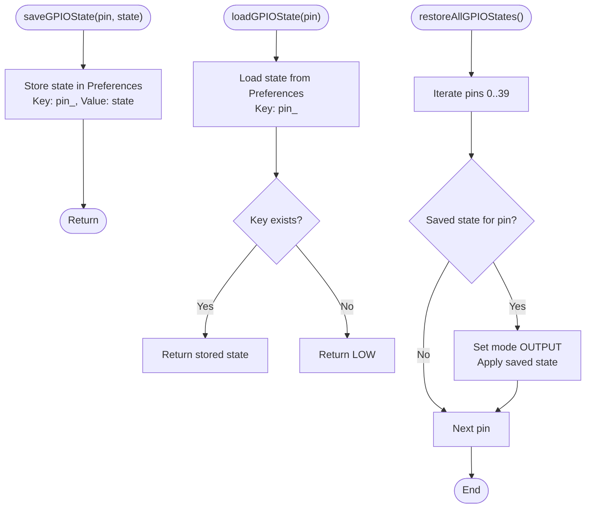
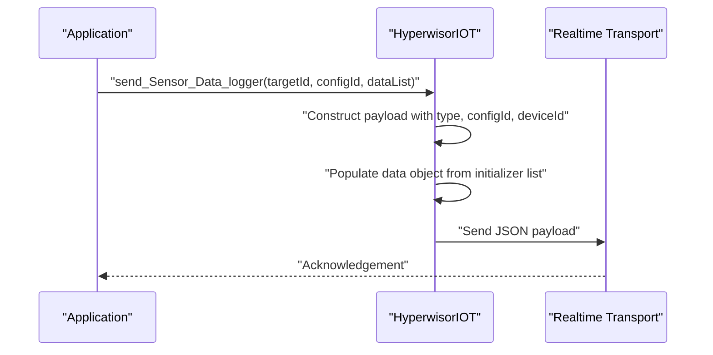
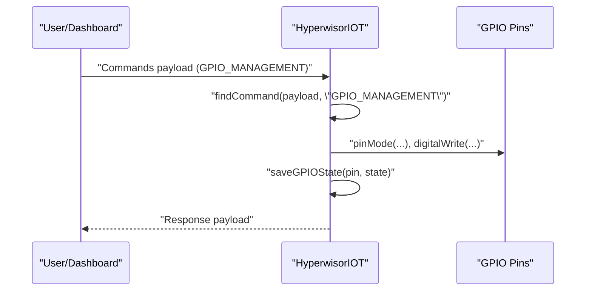
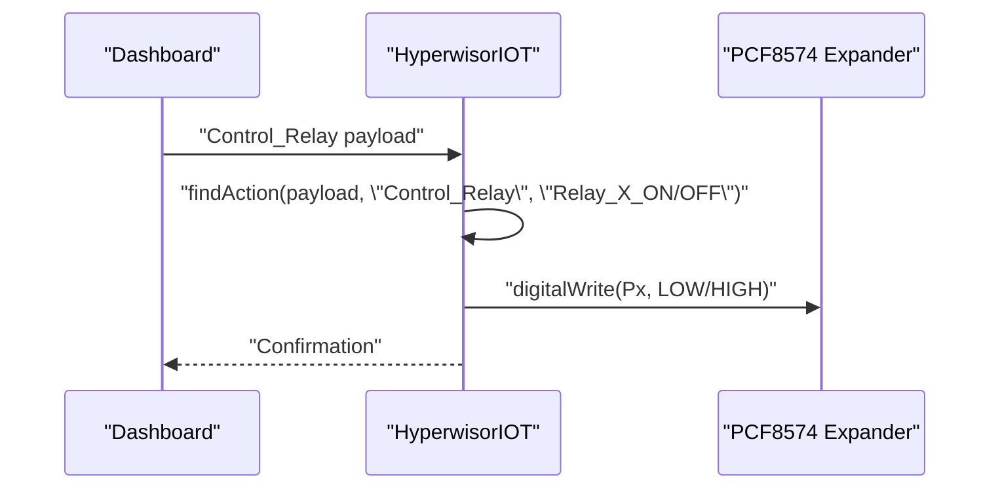
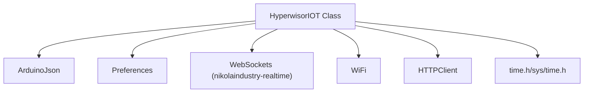

# Hardware Control API

<cite>
**Referenced Files in This Document**
- [hyperwisor-iot.h](file://src/hyperwisor-iot.h)
- [hyperwisor-iot.cpp](file://src/hyperwisor-iot.cpp)
- [GPIOControl.ino](file://examples/GPIOControl/GPIOControl.ino)
- [i2c_PCF8574_relay.ino](file://examples/i2c_PCF8574_relay/i2c_PCF8574_relay.ino)
- [SensorDataLogger.ino](file://examples/SensorDataLogger/SensorDataLogger.ino)
- [README.md](file://README.md)
</cite>

## Table of Contents
1. [Introduction](#introduction)
2. [Project Structure](#project-structure)
3. [Core Components](#core-components)
4. [Architecture Overview](#architecture-overview)
5. [Detailed Component Analysis](#detailed-component-analysis)
6. [Dependency Analysis](#dependency-analysis)
7. [Performance Considerations](#performance-considerations)
8. [Troubleshooting Guide](#troubleshooting-guide)
9. [Conclusion](#conclusion)

## Introduction
This document provides comprehensive API documentation for hardware control and GPIO management functions within the Hyperwisor IoT Arduino library. It focuses on:
- GPIO state management APIs: saveGPIOState(), loadGPIOState(), and restoreAllGPIOStates()
- Data logger functionality: send_Sensor_Data_logger() with initializer list usage and data formatting
- Practical integration patterns shown in GPIOControl and i2c_PCF8574_relay examples
- Hardware abstraction patterns, error handling strategies, and best practices for GPIO management

The library integrates real-time communication, Wi-Fi provisioning, OTA updates, and structured JSON command handling to enable robust IoT device control and monitoring.

## Project Structure
The repository organizes the library source code and example sketches to demonstrate hardware control patterns and sensor data logging workflows.

**Diagram sources**
- [hyperwisor-iot.h](file://src/hyperwisor-iot.h#L1-L190)
- [hyperwisor-iot.cpp](file://src/hyperwisor-iot.cpp#L1-L1811)
- [GPIOControl.ino](file://examples/GPIOControl/GPIOControl.ino#L1-L105)
- [i2c_PCF8574_relay.ino](file://examples/i2c_PCF8574_relay/i2c_PCF8574_relay.ino#L1-L116)
- [SensorDataLogger.ino](file://examples/SensorDataLogger/SensorDataLogger.ino#L1-L77)

**Section sources**
- [README.md](file://README.md#L1-L173)

## Core Components
This section documents the primary hardware control and GPIO management APIs, including their signatures, parameters, and behavior.

- GPIO State Management
  - saveGPIOState(int pin, int state)
    - Purpose: Persist the logical state of a GPIO pin to non-volatile storage for later restoration.
    - Parameters:
      - pin: Integer pin identifier (0–39 typical for ESP32).
      - state: Logical state (HIGH or LOW).
    - Behavior: Stores the state under a key derived from the pin number.
    - Persistence: Uses Preferences with a dedicated namespace for GPIO states.
  - loadGPIOState(int pin)
    - Purpose: Retrieve the previously saved state for a given pin.
    - Parameters: pin
    - Returns: Stored state (HIGH or LOW), defaults to LOW if not found.
  - restoreAllGPIOStates()
    - Purpose: Iterate through a predefined pin range and restore saved states to outputs.
    - Behavior: Iterates pins 0–39, checks for saved state, sets pin mode to OUTPUT, and applies the stored state.
    - Notes: Designed for quick recovery after power cycles or resets.

- Data Logger
  - send_Sensor_Data_logger(const String &targetId, const String &configId, std::initializer_list<std::pair<const char *, float>> dataList)
    - Purpose: Send structured sensor data to a target dashboard or service for logging and visualization.
    - Parameters:
      - targetId: Destination identifier for the real-time channel.
      - configId: Identifier for the sensor configuration or template.
      - dataList: Initializer list of pairs mapping sensor names to numeric values.
    - Behavior: Constructs a JSON payload with type, configId, deviceId, and a data object populated from the initializer list.
    - Output: Transmitted via the real-time transport to the specified target.

- Helper Utilities
  - findCommand(JsonObject &payload, const char *commandName)
    - Purpose: Locate a specific command object within a payload’s commands array.
  - findAction(JsonObject &payload, const char *commandName, const char *actionName)
    - Purpose: Find a specific action within a named command.
  - findParams(JsonObject &payload, const char *commandName, const char *actionName)
    - Purpose: Retrieve parameters associated with a specific action.

**Section sources**
- [hyperwisor-iot.h](file://src/hyperwisor-iot.h#L57-L84)
- [hyperwisor-iot.cpp](file://src/hyperwisor-iot.cpp#L1382-L1414)
- [hyperwisor-iot.cpp](file://src/hyperwisor-iot.cpp#L534-L549)
- [hyperwisor-iot.cpp](file://src/hyperwisor-iot.cpp#L1781-L1810)

## Architecture Overview
The hardware control architecture centers around structured JSON commands received from the Hyperwisor platform. The library parses incoming commands, applies GPIO configurations and states, and optionally persists changes for continuity across reboots.

**Diagram sources**
- [hyperwisor-iot.cpp](file://src/hyperwisor-iot.cpp#L313-L405)
- [hyperwisor-iot.cpp](file://src/hyperwisor-iot.cpp#L1382-L1388)

**Section sources**
- [README.md](file://README.md#L51-L76)
- [hyperwisor-iot.cpp](file://src/hyperwisor-iot.cpp#L313-L405)

## Detailed Component Analysis

### GPIO State Management API
This component enables persistent GPIO state management across device reboots and resets.

**Diagram sources**
- [hyperwisor-iot.cpp](file://src/hyperwisor-iot.cpp#L1382-L1414)

Implementation highlights:
- Non-volatile storage: Uses Preferences with a dedicated namespace for GPIO states.
- Key naming convention: "pin_<pin>" ensures uniqueness and easy iteration.
- Restoration scope: Iterates a fixed range (0–39) to restore known saved states.
- Safety: Pins without saved states are skipped; default restored state is LOW.

Best practices:
- Always call restoreAllGPIOStates() early in setup to recover previous states.
- Persist state changes immediately after applying them to ensure continuity.
- Use explicit pin modes (INPUT, INPUT_PULLUP, OUTPUT) when restoring to avoid ambiguity.

**Section sources**
- [hyperwisor-iot.cpp](file://src/hyperwisor-iot.cpp#L1382-L1414)

### Data Logger API
The data logger API simplifies sending sensor readings to the Hyperwisor platform for visualization and storage.

**Diagram sources**
- [hyperwisor-iot.cpp](file://src/hyperwisor-iot.cpp#L534-L549)

Usage patterns:
- Structured data: Use an initializer list to pair sensor names with values for clarity and compactness.
- Periodic logging: Schedule periodic reads and transmissions to minimize bandwidth usage.
- Dashboard mapping: Ensure configId aligns with dashboard templates for automatic visualization.

**Section sources**
- [hyperwisor-iot.cpp](file://src/hyperwisor-iot.cpp#L534-L549)
- [SensorDataLogger.ino](file://examples/SensorDataLogger/SensorDataLogger.ino#L34-L62)

### Hardware Abstraction Patterns
The library demonstrates several abstraction patterns for hardware control:

- Command-driven GPIO control:
  - Incoming JSON commands define pin, mode, and status.
  - The library resolves modes and applies them to pins.
  - Example: GPIOControl.ino shows how to integrate custom logic alongside automatic handling.

- Peripheral expansion via I2C:
  - i2c_PCF8574_relay example integrates external GPIO expanders to control relays.
  - The library’s helper utilities locate specific commands and actions for peripheral control.

- State persistence:
  - GPIO state changes are persisted locally to ensure continuity after restarts.
  - restoreAllGPIOStates() provides a clean recovery mechanism.

**Section sources**
- [GPIOControl.ino](file://examples/GPIOControl/GPIOControl.ino#L34-L79)
- [i2c_PCF8574_relay.ino](file://examples/i2c_PCF8574_relay/i2c_PCF8574_relay.ino#L33-L108)

### Practical Integration Examples

#### GPIOControl Integration Pattern
- Initialization:
  - Configure pins as outputs.
  - Restore saved states to resume previous conditions.
- Command handling:
  - Use findCommand() to detect GPIO_MANAGEMENT commands.
  - Apply pin modes and statuses, then persist state changes.
- Reporting:
  - Provide custom status reports via sendTo() for dashboard updates.

**Diagram sources**
- [GPIOControl.ino](file://examples/GPIOControl/GPIOControl.ino#L34-L79)
- [hyperwisor-iot.cpp](file://src/hyperwisor-iot.cpp#L313-L405)

**Section sources**
- [GPIOControl.ino](file://examples/GPIOControl/GPIOControl.ino#L1-L105)

#### i2c_PCF8574 Relay Integration Pattern
- I2C setup:
  - Initialize Wire with SDA/SCL pins and attach PCF8574 expander.
  - Configure specific pins as outputs for relay control.
- Command routing:
  - Use findAction() to detect specific relay actions (e.g., Relay_1_ON/OFF).
  - Apply LOW/HIGH to expander pins to control relays.
- Feedback:
  - Log command reception and state changes for debugging.

**Diagram sources**
- [i2c_PCF8574_relay.ino](file://examples/i2c_PCF8574_relay/i2c_PCF8574_relay.ino#L56-L107)

**Section sources**
- [i2c_PCF8574_relay.ino](file://examples/i2c_PCF8574_relay/i2c_PCF8574_relay.ino#L1-L116)

## Dependency Analysis
The hardware control APIs depend on internal components and external libraries for networking, JSON handling, and storage.

**Diagram sources**
- [hyperwisor-iot.h](file://src/hyperwisor-iot.h#L4-L14)
- [hyperwisor-iot.cpp](file://src/hyperwisor-iot.cpp#L1-L10)

Key dependencies:
- ArduinoJson: Used for constructing and parsing JSON payloads in commands and data logger.
- Preferences: Provides non-volatile storage for GPIO states and Wi-Fi credentials.
- WebSockets (nikolaindustry-realtime): Enables real-time messaging and command routing.
- WiFi and HTTPClient: Power connectivity and cloud integrations.
- time.h/sys/time.h: NTP-based time synchronization for logging and scheduling.

**Section sources**
- [hyperwisor-iot.h](file://src/hyperwisor-iot.h#L4-L14)
- [hyperwisor-iot.cpp](file://src/hyperwisor-iot.cpp#L1-L10)

## Performance Considerations
- GPIO state iteration: restoreAllGPIOStates() iterates a fixed range (0–39). For devices with fewer pins, consider optimizing the range to reduce unnecessary iterations.
- JSON construction: Using initializer lists for sensor data minimizes memory overhead compared to manual loops.
- Network reliability: The library includes retry logic for WebSocket connections and automatic reconnection attempts. Ensure adequate timeouts and backoff strategies in production deployments.
- OTA updates: The performOTA() function validates content length and available flash space before writing firmware. Monitor progress and handle errors gracefully.

[No sources needed since this section provides general guidance]

## Troubleshooting Guide
Common issues and resolutions:

- GPIO state not restored:
  - Verify that saveGPIOState() was called after applying changes.
  - Confirm that Preferences keys exist for the intended pins.
  - Ensure restoreAllGPIOStates() runs early in setup.

- Commands not applied:
  - Check that findCommand() locates the expected command in the payload.
  - Validate pin mode resolution and action parameters.
  - Confirm that pin modes are compatible with the hardware configuration.

- Sensor data not logged:
  - Ensure send_Sensor_Data_logger() receives a valid targetId and configId.
  - Verify that the device is connected to Wi-Fi and the real-time transport is active.
  - Inspect the constructed JSON payload for missing fields.

- I2C relay control failures:
  - Confirm SDA/SCL pin assignments match the board wiring.
  - Verify PCF8574 address and expander initialization.
  - Check LOW/HIGH logic levels for relay activation.

**Section sources**
- [hyperwisor-iot.cpp](file://src/hyperwisor-iot.cpp#L1382-L1414)
- [hyperwisor-iot.cpp](file://src/hyperwisor-iot.cpp#L534-L549)
- [i2c_PCF8574_relay.ino](file://examples/i2c_PCF8574_relay/i2c_PCF8574_relay.ino#L12-L16)

## Conclusion
The Hyperwisor IoT library provides a cohesive framework for hardware control and data logging on ESP32 devices. Its GPIO state management APIs enable reliable persistence and restoration, while the data logger API streamlines sensor data transmission to the platform. The included examples demonstrate practical integration patterns for GPIO control and I2C-based peripherals, along with structured command handling and state persistence mechanisms. By following the best practices outlined—such as restoring states early, persisting changes promptly, and leveraging helper utilities—the library facilitates robust, maintainable IoT solutions.