# Widget System API

<cite>
**Referenced Files in This Document**
- [hyperwisor-iot.h](file://src/hyperwisor-iot.h)
- [hyperwisor-iot.cpp](file://src/hyperwisor-iot.cpp)
- [WidgetUpdate.ino](file://examples/WidgetUpdate/WidgetUpdate.ino)
- [ThreeDWidgetControl.ino](file://examples/ThreeDWidgetControl/ThreeDWidgetControl.ino)
- [AttitudeWidget_MPU6050.ino](file://examples/AttitudeWidget_MPU6050/AttitudeWidget_MPU6050.ino)
- [README.md](file://README.md)
</cite>

## Table of Contents
1. [Introduction](#introduction)
2. [Project Structure](#project-structure)
3. [Core Components](#core-components)
4. [Architecture Overview](#architecture-overview)
5. [Detailed Component Analysis](#detailed-component-analysis)
6. [Dependency Analysis](#dependency-analysis)
7. [Performance Considerations](#performance-considerations)
8. [Troubleshooting Guide](#troubleshooting-guide)
9. [Conclusion](#conclusion)

## Introduction

The Hyperwisor-IOT Arduino library provides a comprehensive widget system for real-time dashboard integration. This documentation covers the complete widget API, including base updateWidget() functions with multiple overloads, specialized widget functions, and integration patterns with the dashboard system.

The widget system enables IoT devices to communicate with Hyperwisor dashboards through structured JSON messages, supporting various data types and visualization widgets including charts, gauges, 3D models, and flight instruments.

## Project Structure

The widget system is implemented within the Hyperwisor-IOT library with the following key components:

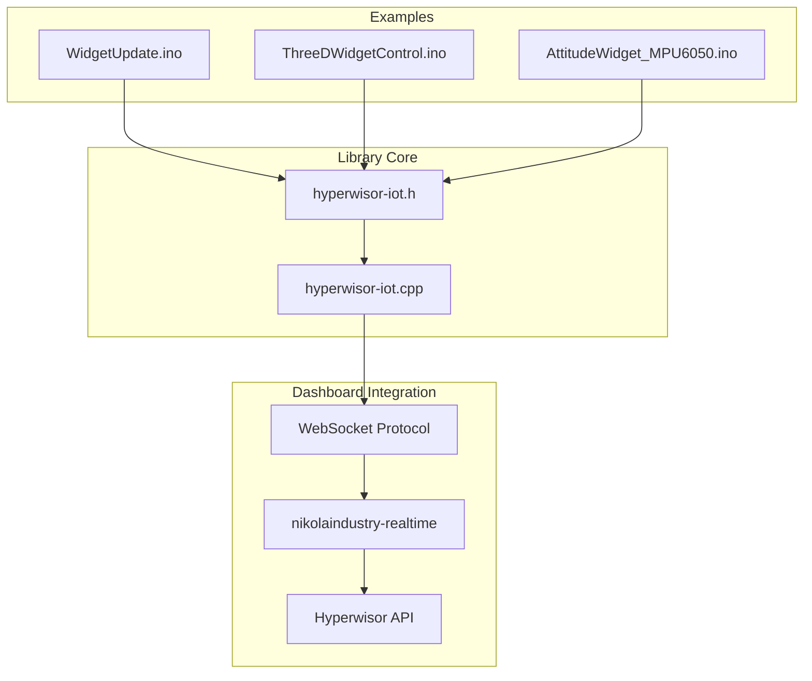

**Diagram sources**
- [hyperwisor-iot.h](file://src/hyperwisor-iot.h#L1-L190)
- [hyperwisor-iot.cpp](file://src/hyperwisor-iot.cpp#L1-L1811)

**Section sources**
- [hyperwisor-iot.h](file://src/hyperwisor-iot.h#L1-L190)
- [README.md](file://README.md#L1-L173)

## Core Components

The widget system consists of several key components that work together to provide comprehensive dashboard integration:

### Base Widget Functions

The foundation of the widget system is the `updateWidget()` family of functions, which provide multiple overloads for different data types:

- **String Values**: Direct string representation for text widgets
- **Float Values**: Numeric values for gauges and meters
- **Vector Float Arrays**: Multi-value data for charts and graphs
- **Vector Integer Arrays**: Integer data for discrete measurements
- **Vector String Arrays**: Mixed data types for flexible displays

### Specialized Widget Functions

Beyond basic value updates, the system provides specialized functions for complex visualizations:

- **Position Control**: Layout management with x, y coordinates and rotation
- **Countdown Widgets**: Time-based countdown displays
- **Heat Maps**: Spatial data visualization
- **3D Content**: Interactive 3D model manipulation
- **Flight Instruments**: Attitude and navigation displays
- **Dialog System**: User notification and alert mechanisms

**Section sources**
- [hyperwisor-iot.h](file://src/hyperwisor-iot.h#L78-L107)
- [hyperwisor-iot.cpp](file://src/hyperwisor-iot.cpp#L551-L714)

## Architecture Overview

The widget system operates through a structured communication flow between the ESP32 device and the Hyperwisor dashboard:

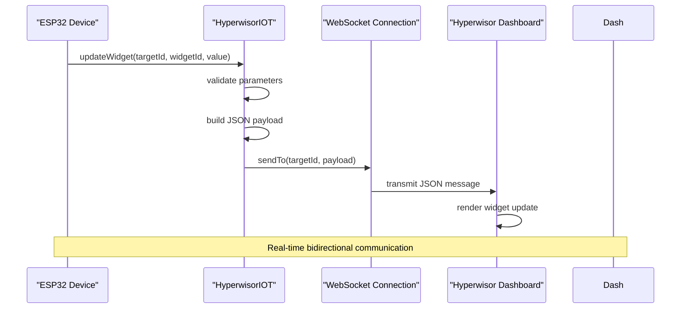

**Diagram sources**
- [hyperwisor-iot.cpp](file://src/hyperwisor-iot.cpp#L521-L532)
- [hyperwisor-iot.cpp](file://src/hyperwisor-iot.cpp#L551-L557)

The architecture supports both push-based updates from the device and pull-based commands from the dashboard, enabling responsive dashboard interactions.

**Section sources**
- [hyperwisor-iot.cpp](file://src/hyperwisor-iot.cpp#L313-L405)
- [hyperwisor-iot.cpp](file://src/hyperwisor-iot.cpp#L521-L532)

## Detailed Component Analysis

### Base Widget Update Functions

The `updateWidget()` function family provides the primary interface for widget data updates:

#### Function Signatures and Overloads

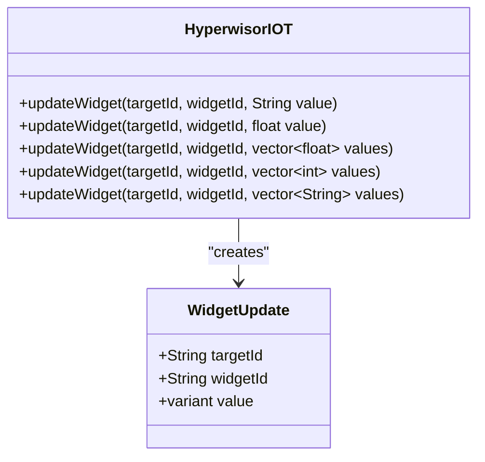

**Diagram sources**
- [hyperwisor-iot.h](file://src/hyperwisor-iot.h#L79-L83)
- [hyperwisor-iot.cpp](file://src/hyperwisor-iot.cpp#L551-L598)

#### Parameter Specifications

| Parameter | Type | Description | Required |
|-----------|------|-------------|----------|
| targetId | String | Dashboard target identifier | Yes |
| widgetId | String | Specific widget identifier | Yes |
| value | Variant | Data value (String, float, or arrays) | Yes |

#### Data Type Requirements

**String Values**: Direct text representation for labels and status displays
**Float Values**: Numeric data for measurements and gauges
**Vector Float Arrays**: Series data for charts and trend visualization
**Vector Integer Arrays**: Discrete measurements and counts
**Vector String Arrays**: Mixed data types for flexible displays

**Section sources**
- [hyperwisor-iot.h](file://src/hyperwisor-iot.h#L79-L83)
- [hyperwisor-iot.cpp](file://src/hyperwisor-iot.cpp#L551-L598)

### Dialog System Functions

The dialog system provides user notification capabilities with predefined icon types:

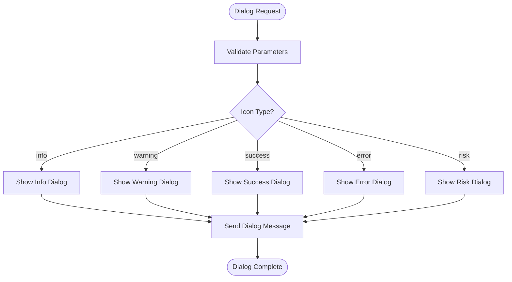

**Diagram sources**
- [hyperwisor-iot.h](file://src/hyperwisor-iot.h#L85-L91)
- [hyperwisor-iot.cpp](file://src/hyperwisor-iot.cpp#L600-L628)

#### Dialog Function Specifications

| Function | Purpose | Icon Type | Typical Use Case |
|----------|---------|-----------|------------------|
| showDialog | Generic dialog with custom icon | info, warning, success, error, risk | General notifications |
| info | Informational messages | info | Status updates |
| warning | Cautionary warnings | warning | Potential issues |
| success | Positive outcomes | success | Successful operations |
| error | Error conditions | error | System failures |
| risk | Risk assessment | risk | Safety concerns |

**Section sources**
- [hyperwisor-iot.h](file://src/hyperwisor-iot.h#L85-L91)
- [hyperwisor-iot.cpp](file://src/hyperwisor-iot.cpp#L600-L628)

### Flight Attitude Widget

The flight attitude widget provides aviation instrument displays with roll and pitch controls:

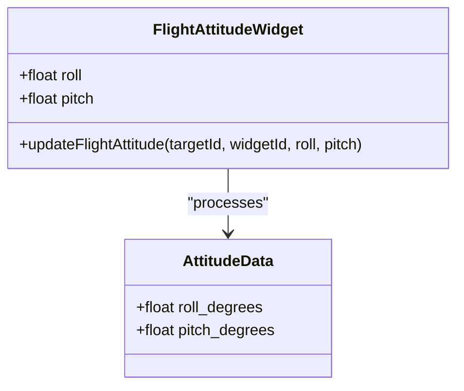

**Diagram sources**
- [hyperwisor-iot.h](file://src/hyperwisor-iot.h#L94)
- [hyperwisor-iot.cpp](file://src/hyperwisor-iot.cpp#L630-L638)

#### Implementation Details

The flight attitude function creates structured JSON with roll and pitch values, enabling real-time aircraft instrument simulation. The function expects values in degrees with typical ranges of ±90 degrees for pitch and ±180 degrees for roll.

**Section sources**
- [hyperwisor-iot.h](file://src/hyperwisor-iot.h#L94)
- [hyperwisor-iot.cpp](file://src/hyperwisor-iot.cpp#L630-L638)

### Position Control Functions

Widget positioning enables precise layout control within dashboard layouts:

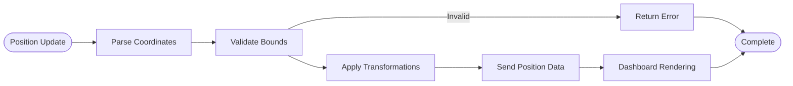

**Diagram sources**
- [hyperwisor-iot.h](file://src/hyperwisor-iot.h#L97)
- [hyperwisor-iot.cpp](file://src/hyperwisor-iot.cpp#L640-L650)

#### Position Parameter Specifications

| Parameter | Type | Range | Description |
|-----------|------|-------|-------------|
| x | int | 0-1920 | Horizontal position |
| y | int | 0-1080 | Vertical position |
| w | int | 10-1920 | Width in pixels |
| h | int | 10-1080 | Height in pixels |
| r | int | 0-360 | Rotation in degrees |

**Section sources**
- [hyperwisor-iot.h](file://src/hyperwisor-iot.h#L97)
- [hyperwisor-iot.cpp](file://src/hyperwisor-iot.cpp#L640-L650)

### Countdown Widget

Countdown widgets provide time-based visual displays with hour, minute, and second components:

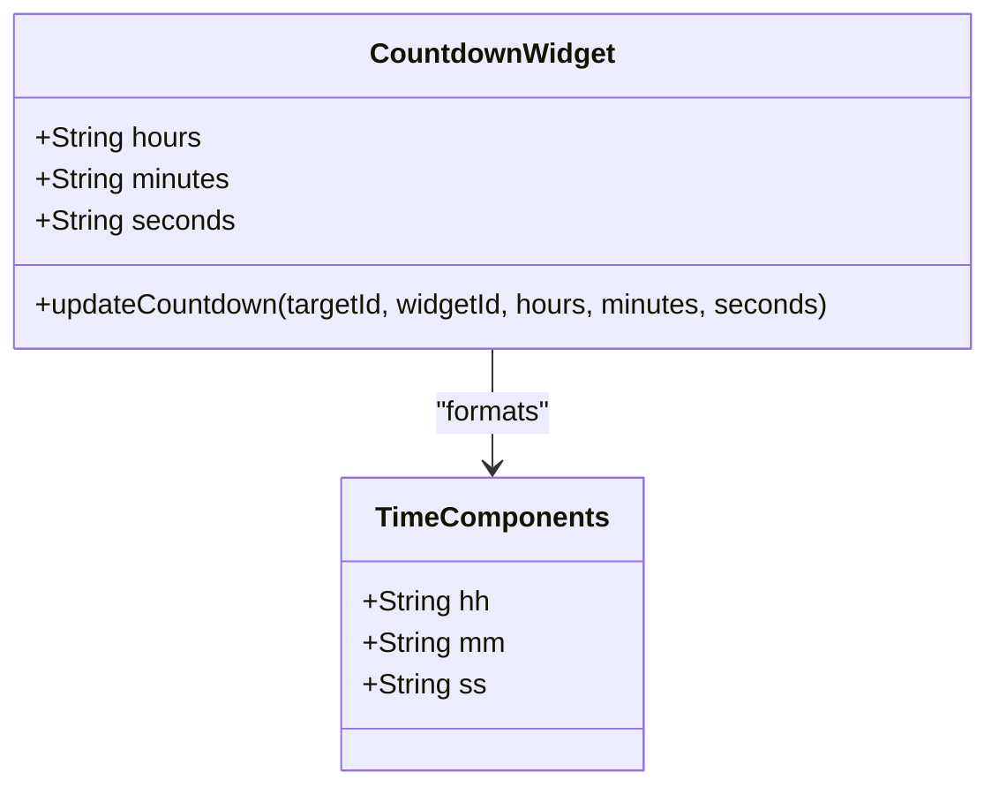

**Diagram sources**
- [hyperwisor-iot.h](file://src/hyperwisor-iot.h#L100)
- [hyperwisor-iot.cpp](file://src/hyperwisor-iot.cpp#L652-L660)

#### Implementation Notes

Countdown values are transmitted as strings to maintain leading zeros and ensure consistent formatting. The widget expects two-digit string representations for all time components.

**Section sources**
- [hyperwisor-iot.h](file://src/hyperwisor-iot.h#L100)
- [hyperwisor-iot.cpp](file://src/hyperwisor-iot.cpp#L652-L660)

### Heat Map Widget

Heat map visualization enables spatial data representation with configurable intensity:

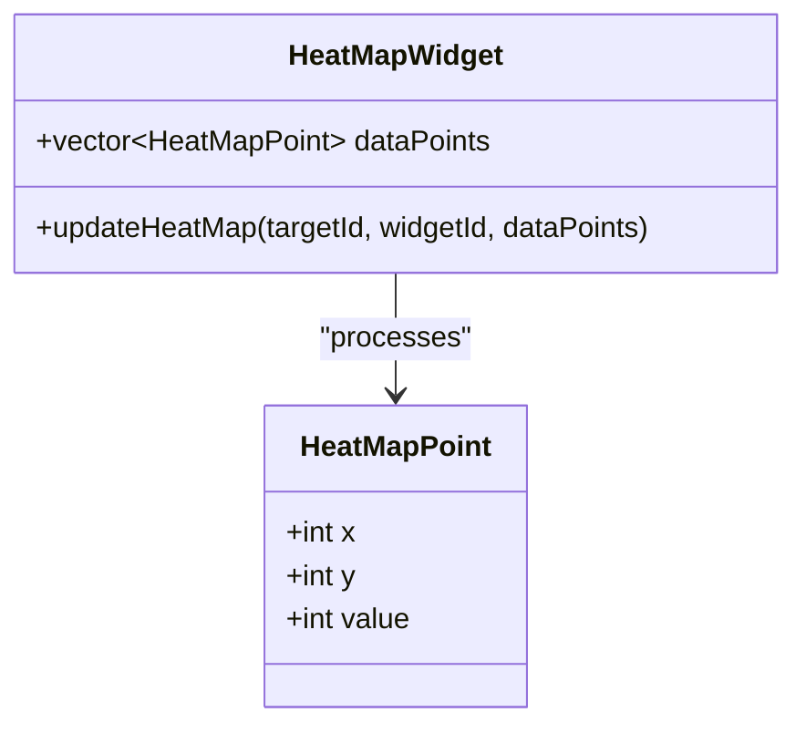

**Diagram sources**
- [hyperwisor-iot.h](file://src/hyperwisor-iot.h#L16-L21)
- [hyperwisor-iot.h](file://src/hyperwisor-iot.h#L103)
- [hyperwisor-iot.cpp](file://src/hyperwisor-iot.cpp#L662-L675)

#### Data Structure Requirements

The `HeatMapPoint` structure requires integer coordinates and intensity values. The system supports arbitrary grid sizes and value ranges for flexible data visualization.

**Section sources**
- [hyperwisor-iot.h](file://src/hyperwisor-iot.h#L16-L21)
- [hyperwisor-iot.h](file://src/hyperwisor-iot.h#L103)
- [hyperwisor-iot.cpp](file://src/hyperwisor-iot.cpp#L662-L675)

### 3D Widget System

The 3D widget system provides comprehensive 3D model manipulation with multiple transformation capabilities:

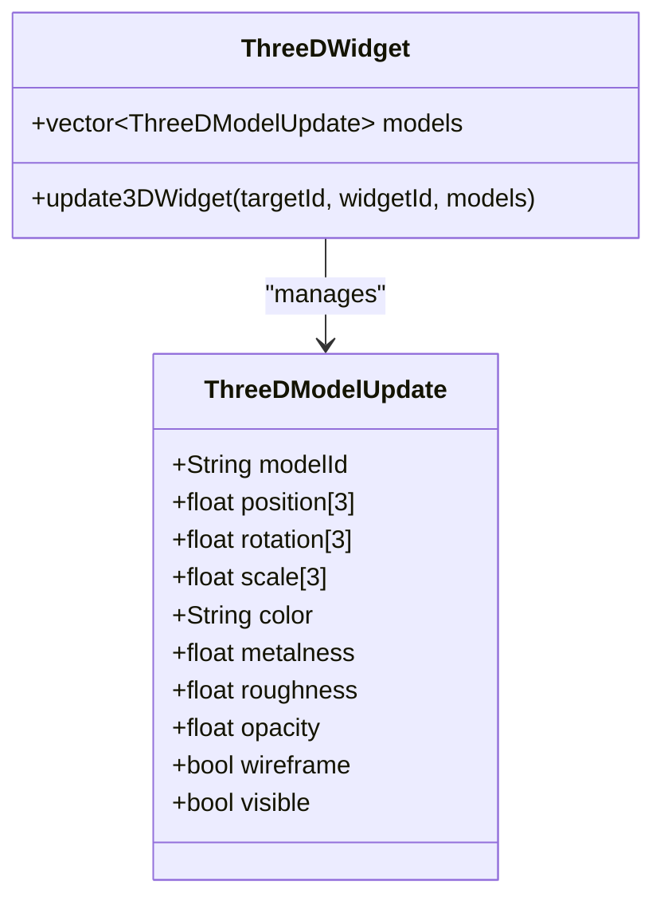

**Diagram sources**
- [hyperwisor-iot.h](file://src/hyperwisor-iot.h#L24-L35)
- [hyperwisor-iot.h](file://src/hyperwisor-iot.h#L107)
- [hyperwisor-iot.cpp](file://src/hyperwisor-iot.cpp#L685-L714)

#### 3D Model Properties

| Property | Type | Description | Default |
|----------|------|-------------|---------|
| modelId | String | Unique model identifier | Required |
| position | float[3] | X, Y, Z coordinates | [0,0,0] |
| rotation | float[3] | Roll, Pitch, Yaw in degrees | [0,0,0] |
| scale | float[3] | Scale factors | [1,1,1] |
| color | String | Hex color code | "#ffffff" |
| metalness | float | 0.0 to 1.0 | 0.0 |
| roughness | float | 0.0 to 1.0 | 1.0 |
| opacity | float | 0.0 to 1.0 | 1.0 |
| wireframe | bool | Wireframe rendering | false |
| visible | bool | Visibility state | true |

**Section sources**
- [hyperwisor-iot.h](file://src/hyperwisor-iot.h#L24-L35)
- [hyperwisor-iot.h](file://src/hyperwisor-iot.h#L107)
- [hyperwisor-iot.cpp](file://src/hyperwisor-iot.cpp#L685-L714)

### Integration Patterns

The widget system supports several integration patterns for different use cases:

#### Basic Widget Updates

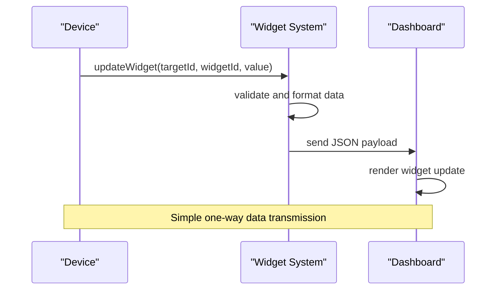

#### Interactive Widget Updates

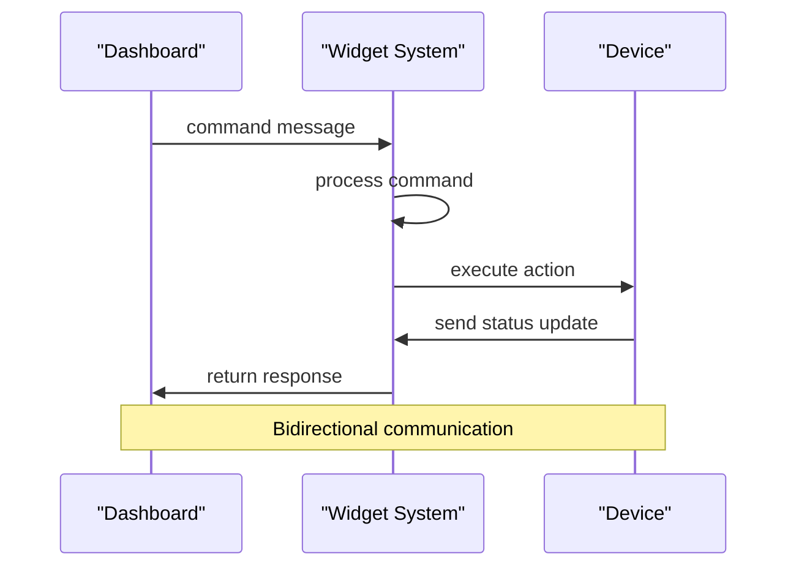

**Section sources**
- [hyperwisor-iot.cpp](file://src/hyperwisor-iot.cpp#L313-L405)
- [hyperwisor-iot.cpp](file://src/hyperwisor-iot.cpp#L521-L532)

## Dependency Analysis

The widget system has minimal external dependencies, relying primarily on Arduino core libraries and the nikolaindustry-realtime protocol:

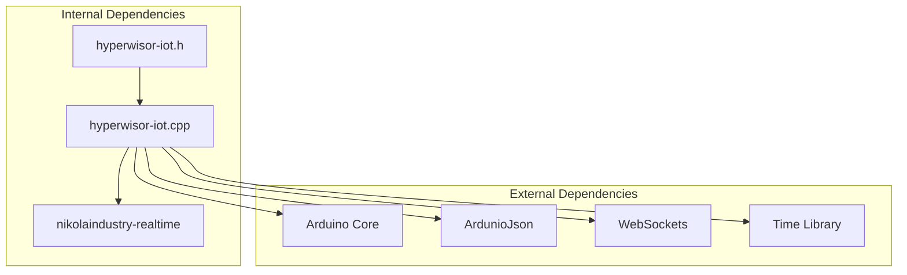

**Diagram sources**
- [hyperwisor-iot.h](file://src/hyperwisor-iot.h#L4-L14)
- [hyperwisor-iot.cpp](file://src/hyperwisor-iot.cpp#L1-L3)

### External Library Requirements

| Library | Version | Purpose | Required |
|---------|---------|---------|----------|
| ArduinoJson | Latest | JSON serialization | Yes |
| WebSockets | Latest | WebSocket communication | Yes |
| WiFi | ESP32 Core | Network connectivity | Yes |
| Preferences | ESP32 Core | Persistent storage | Yes |
| Update | ESP32 Core | OTA updates | No |
| DNSServer | ESP32 Core | AP mode | No |

**Section sources**
- [hyperwisor-iot.h](file://src/hyperwisor-iot.h#L4-L14)
- [README.md](file://README.md#L92-L122)

## Performance Considerations

### Memory Management

The widget system uses dynamic memory allocation for JSON payloads, with careful consideration for ESP32 memory constraints:

- **JSON Document Size**: Configurable based on payload complexity
- **Memory Pool Management**: Efficient allocation for frequent updates
- **Garbage Collection**: Automatic cleanup of temporary objects

### Update Frequency Optimization

- **Rate Limiting**: Prevent excessive widget updates
- **Batch Processing**: Combine multiple updates into single transmissions
- **Delta Updates**: Send only changed values when possible

### Network Efficiency

- **Compression**: JSON payload compression for large datasets
- **Connection Management**: Persistent WebSocket connections
- **Error Recovery**: Automatic reconnection on network failures

## Troubleshooting Guide

### Common Issues and Solutions

#### Widget Updates Not Displaying

**Symptoms**: Widgets remain static despite device updates
**Causes**: 
- Incorrect targetId or widgetId
- Network connectivity issues
- Dashboard widget not configured

**Solutions**:
1. Verify targetId and widgetId match dashboard configuration
2. Check WiFi connectivity status
3. Confirm widget exists on dashboard

#### JSON Payload Errors

**Symptoms**: Dashboard rejects widget updates
**Causes**:
- Invalid JSON structure
- Unsupported data types
- Missing required fields

**Solutions**:
1. Validate JSON structure using ArduinoJson
2. Ensure data type compatibility
3. Check widget configuration requirements

#### Memory Allocation Failures

**Symptoms**: Device resets or freezes during updates
**Causes**:
- Insufficient heap memory
- Large payload sizes
- Memory fragmentation

**Solutions**:
1. Reduce payload size
2. Implement memory pooling
3. Monitor free heap with `ESP.getFreeHeap()`

**Section sources**
- [hyperwisor-iot.cpp](file://src/hyperwisor-iot.cpp#L521-L532)
- [hyperwisor-iot.cpp](file://src/hyperwisor-iot.cpp#L1417-L1503)

## Conclusion

The Hyperwisor-IOT widget system provides a comprehensive solution for real-time dashboard integration with ESP32 devices. The system's modular design supports multiple data types, complex visualizations, and bidirectional communication patterns.

Key strengths include:
- **Flexible Data Types**: Support for strings, numbers, and arrays
- **Rich Visualizations**: Charts, 3D models, and flight instruments
- **Robust Communication**: WebSocket-based real-time updates
- **Extensible Architecture**: Easy addition of new widget types

The system is designed for reliability and performance, with careful attention to memory management and network efficiency. Integration with existing Hyperwisor dashboards enables rapid development of sophisticated IoT monitoring and control interfaces.

Future enhancements could include additional widget types, advanced animation support, and enhanced error reporting capabilities.