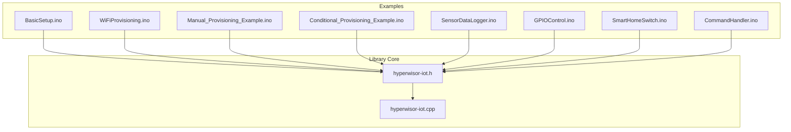
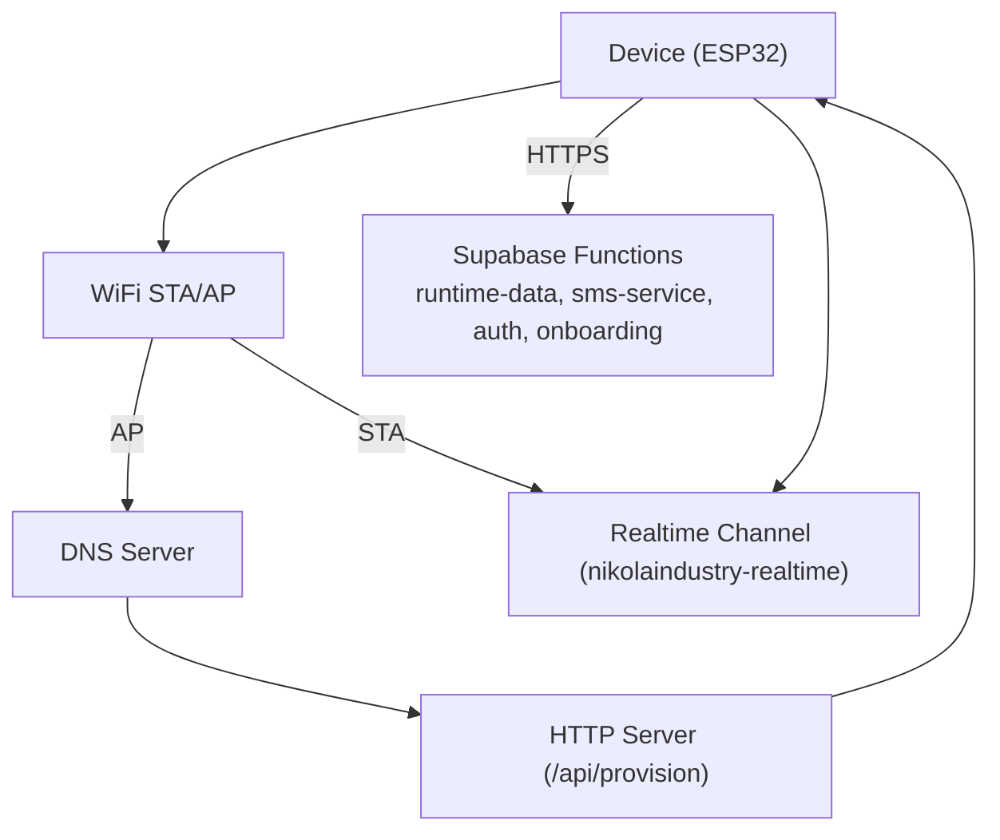
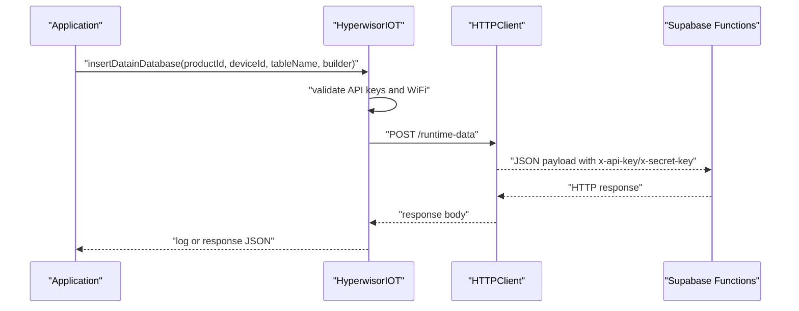
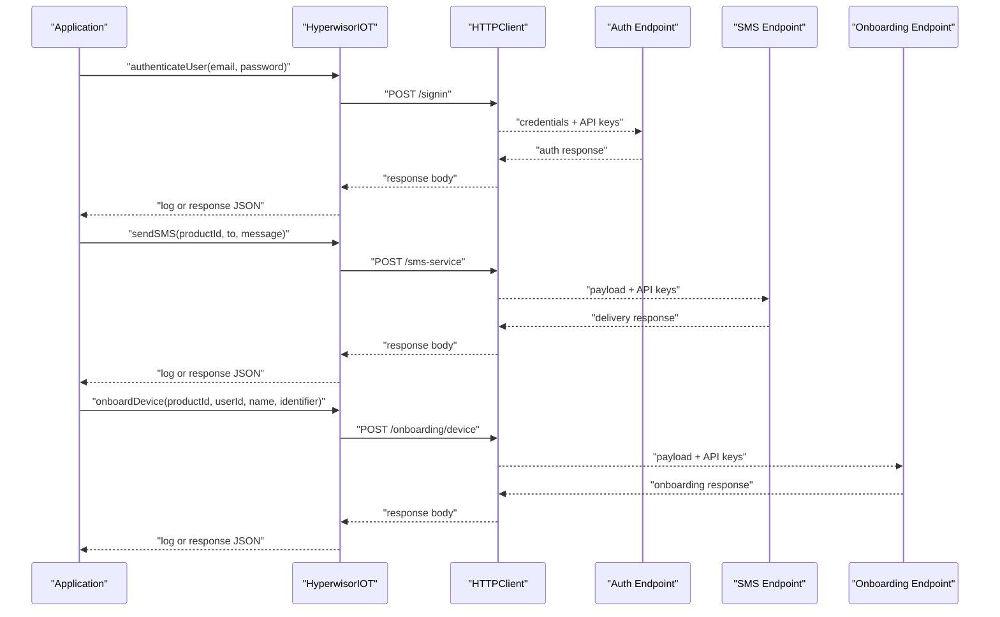
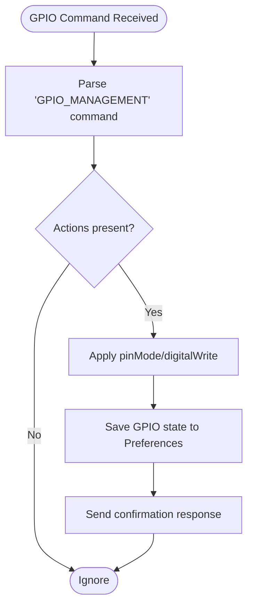
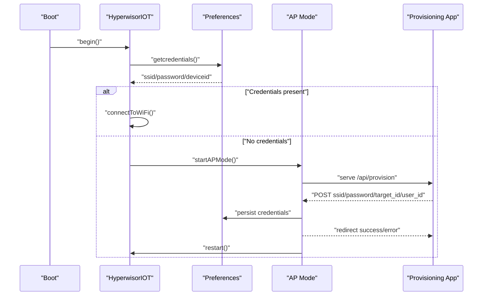
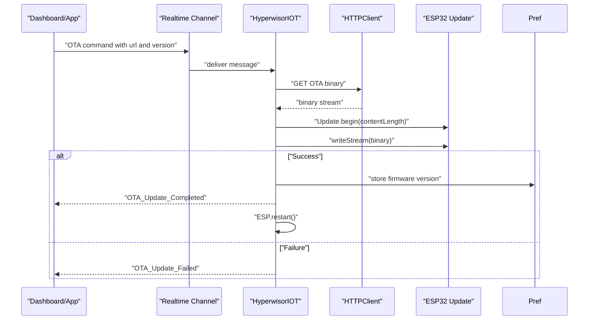
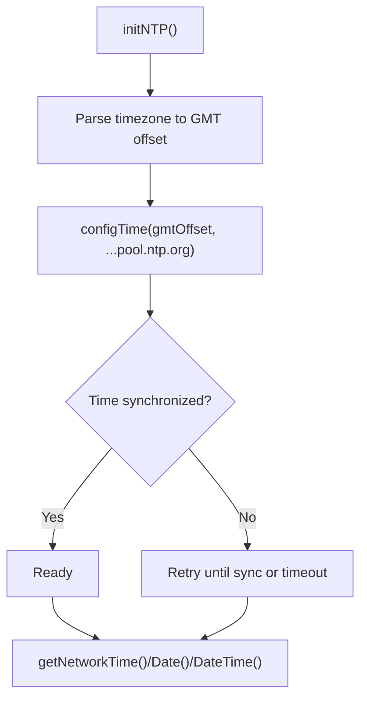
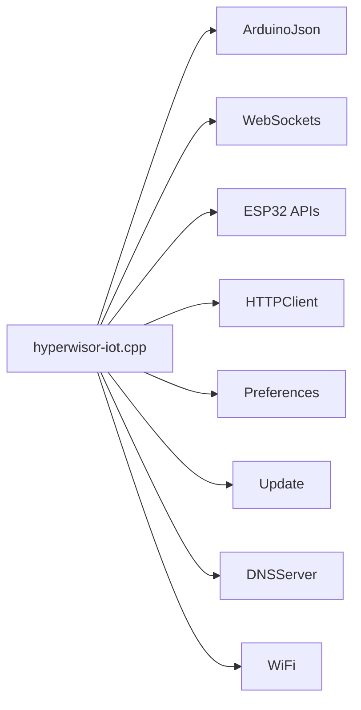

# Advanced Features

<cite>
**Referenced Files in This Document**
- [README.md](file://README.md)
- [library.properties](file://library.properties)
- [hyperwisor-iot.h](file://src/hyperwisor-iot.h)
- [hyperwisor-iot.cpp](file://src/hyperwisor-iot.cpp)
- [BasicSetup.ino](file://examples/BasicSetup/BasicSetup.ino)
- [WiFiProvisioning.ino](file://examples/WiFiProvisioning/WiFiProvisioning.ino)
- [Manual_Provisioning_Example.ino](file://examples/Manual_Provisioning_Example/Manual_Provisioning_Example.ino)
- [Conditional_Provisioning_Example.ino](file://examples/Conditional_Provisioning_Example/Conditional_Provisioning_Example.ino)
- [SensorDataLogger.ino](file://examples/SensorDataLogger/SensorDataLogger.ino)
- [GPIOControl.ino](file://examples/GPIOControl/GPIOControl.ino)
- [SmartHomeSwitch.ino](file://examples/SmartHomeSwitch/SmartHomeSwitch.ino)
- [CommandHandler.ino](file://examples/CommandHandler/CommandHandler.ino)
</cite>

## Table of Contents
1. [Introduction](#introduction)
2. [Project Structure](#project-structure)
3. [Core Components](#core-components)
4. [Architecture Overview](#architecture-overview)
5. [Detailed Component Analysis](#detailed-component-analysis)
6. [Dependency Analysis](#dependency-analysis)
7. [Performance Considerations](#performance-considerations)
8. [Troubleshooting Guide](#troubleshooting-guide)
9. [Conclusion](#conclusion)
10. [Appendices](#appendices)

## Introduction
This document covers advanced features of the Hyperwisor-IOT library for ESP32-based IoT devices. It explains database operations (CRUD and response handling), cloud services integration (SMS, authentication, device onboarding), hardware control (GPIO management, sensor integration, actuator control), advanced WiFi provisioning (manual, conditional, AP mode), OTA firmware updates (version tracking and deployment), performance optimization, security considerations, monitoring, and debugging strategies for production-grade deployments.

## Project Structure
The library provides a cohesive abstraction layer around ESP32 networking, real-time messaging, and device lifecycle management. Examples demonstrate practical usage patterns for provisioning, GPIO control, sensor logging, and cloud integrations.

**Diagram sources**
- [hyperwisor-iot.h](file://src/hyperwisor-iot.h#L1-L190)
- [hyperwisor-iot.cpp](file://src/hyperwisor-iot.cpp#L1-L120)

**Section sources**
- [README.md](file://README.md#L1-L173)
- [library.properties](file://library.properties#L1-L11)

## Core Components
- WiFi provisioning and AP mode fallback with DNS redirection and HTTP provisioning endpoint
- Real-time communication via nikolaindustry-realtime protocol
- Structured JSON command parsing with extensible user command handler
- GPIO control and persistence across reboots
- Database operations (insert, get, update, delete) with response handling
- Cloud services: SMS delivery, user authentication, device onboarding
- OTA firmware updates with version tracking and progress reporting
- NTP-based time/date utilities with timezone support

**Section sources**
- [hyperwisor-iot.h](file://src/hyperwisor-iot.h#L39-L187)
- [hyperwisor-iot.cpp](file://src/hyperwisor-iot.cpp#L13-L137)
- [README.md](file://README.md#L11-L36)

## Architecture Overview
The system integrates ESP32 networking, a lightweight HTTP server/AP mode, DNS redirection, and a real-time WebSocket channel. Cloud operations are performed via HTTPS endpoints with API key/secret authentication.

**Diagram sources**
- [hyperwisor-iot.cpp](file://src/hyperwisor-iot.cpp#L141-L156)
- [hyperwisor-iot.cpp](file://src/hyperwisor-iot.cpp#L159-L185)
- [hyperwisor-iot.cpp](file://src/hyperwisor-iot.cpp#L730-L778)
- [hyperwisor-iot.cpp](file://src/hyperwisor-iot.cpp#L1270-L1314)
- [hyperwisor-iot.cpp](file://src/hyperwisor-iot.cpp#L1506-L1549)
- [hyperwisor-iot.cpp](file://src/hyperwisor-iot.cpp#L1155-L1200)

## Detailed Component Analysis

### Database Operations (CRUD and Response Handling)
The library exposes a unified set of database helpers to perform CRUD operations against a Supabase-backed runtime data service. All operations require API keys and a connected WiFi interface. Responses are returned either as logs or parsed JSON documents.

- Insert data
  - Non-response variant: sends a POST request and prints the raw HTTP response
  - Response variant: returns a JSON document containing success flag, HTTP code, and parsed data or raw response
- Get data
  - Non-response variant: performs a GET with query parameters and logs the response
  - Response variant: returns a JSON document mirroring the insert pattern
- Update data
  - Non-response variant: sends a PUT request to a specific data ID
  - Response variant: returns a JSON document with success and parsed payload
- Delete data
  - Non-response variant: sends a DELETE request to a specific data ID
  - Response variant: returns a JSON document with success and parsed payload

**Diagram sources**
- [hyperwisor-iot.cpp](file://src/hyperwisor-iot.cpp#L730-L778)
- [hyperwisor-iot.cpp](file://src/hyperwisor-iot.cpp#L780-L847)

Key behaviors:
- API key enforcement: operations short-circuit if keys are missing
- WiFi connectivity check: operations short-circuit if not connected
- SSL configuration: client currently disables certificate verification (see Security Considerations)
- Response parsing: response variants attempt to deserialize the HTTP body into JSON

Best practices:
- Use response variants to handle errors and parse structured payloads
- Batch writes and reads to reduce network overhead
- Implement exponential backoff on transient failures

**Section sources**
- [hyperwisor-iot.h](file://src/hyperwisor-iot.h#L119-L128)
- [hyperwisor-iot.cpp](file://src/hyperwisor-iot.cpp#L730-L847)
- [SensorDataLogger.ino](file://examples/SensorDataLogger/SensorDataLogger.ino#L34-L62)

### Cloud Services Integration
The library provides convenience wrappers for three primary cloud services, all requiring API keys and an active WiFi connection.

- SMS service
  - Sends a POST request to the SMS endpoint with product ID, recipient, and message
  - Response variant returns success, HTTP code, and parsed or raw response
- Authentication
  - Sends a POST request to the sign-in endpoint with email and password
  - Response variant returns success, HTTP code, and parsed or raw response
- Device onboarding
  - Sends a POST request to the onboarding endpoint with product ID, user ID, device name, and identifier
  - Response variant returns success, HTTP code, and parsed or raw response

**Diagram sources**
- [hyperwisor-iot.cpp](file://src/hyperwisor-iot.cpp#L1270-L1314)
- [hyperwisor-iot.cpp](file://src/hyperwisor-iot.cpp#L1506-L1549)
- [hyperwisor-iot.cpp](file://src/hyperwisor-iot.cpp#L1155-L1200)

Operational notes:
- All endpoints require x-api-key and x-secret-key headers
- SSL verification is disabled in current implementation (see Security Considerations)
- Response variants unify error handling and payload parsing

**Section sources**
- [hyperwisor-iot.h](file://src/hyperwisor-iot.h#L134-L139)
- [hyperwisor-iot.cpp](file://src/hyperwisor-iot.cpp#L1270-L1380)
- [hyperwisor-iot.cpp](file://src/hyperwisor-iot.cpp#L1506-L1614)

### Hardware Control: GPIO Management, Sensors, Actuators
The library supports robust GPIO control and persistence, with examples demonstrating sensor logging and actuator switching.

- GPIO management
  - Automatic handling of GPIO_MANAGEMENT commands (pinMode, digitalWrite)
  - Persistence across reboots via Preferences
  - Helper utilities to restore all GPIO states on boot
- Sensor integration patterns
  - Structured sensor data logging with configurable intervals
  - Dashboard-ready payload construction
- Actuator control
  - SmartHomeSwitch example demonstrates 7-channel relays with physical switches, debouncing, and state persistence
  - Bidirectional control: cloud and local inputs update the same state

**Diagram sources**
- [hyperwisor-iot.cpp](file://src/hyperwisor-iot.cpp#L313-L404)
- [hyperwisor-iot.cpp](file://src/hyperwisor-iot.cpp#L1382-L1414)

Implementation highlights:
- User command handler extension allows custom logic alongside automatic GPIO handling
- Debounced physical switch inputs prevent chatter
- Power-loss resume ensures actuators return to persisted state after reboot

**Section sources**
- [hyperwisor-iot.h](file://src/hyperwisor-iot.h#L57-L61)
- [hyperwisor-iot.cpp](file://src/hyperwisor-iot.cpp#L313-L404)
- [GPIOControl.ino](file://examples/GPIOControl/GPIOControl.ino#L34-L79)
- [SmartHomeSwitch.ino](file://examples/SmartHomeSwitch/SmartHomeSwitch.ino#L64-L97)
- [SensorDataLogger.ino](file://examples/SensorDataLogger/SensorDataLogger.ino#L34-L62)

### Advanced WiFi Provisioning
The library supports multiple provisioning strategies to accommodate diverse deployment scenarios.

- AP mode provisioning
  - Starts soft AP, DNS server, and HTTP server for web-based provisioning
  - Accepts ssid, password, target_id, user_id via /api/provision and persists them
  - Redirects the provisioning app upon success/failure
- Manual provisioning
  - Programmatic setting of credentials and device identifiers
  - Useful for factory configuration or pre-deployed devices
- Conditional provisioning
  - Checks for existing credentials and falls back to AP mode if absent
  - Enables flexible deployment with hardcoded defaults

**Diagram sources**
- [hyperwisor-iot.cpp](file://src/hyperwisor-iot.cpp#L13-L28)
- [hyperwisor-iot.cpp](file://src/hyperwisor-iot.cpp#L256-L275)
- [hyperwisor-iot.cpp](file://src/hyperwisor-iot.cpp#L141-L156)
- [hyperwisor-iot.cpp](file://src/hyperwisor-iot.cpp#L159-L185)

Operational guidance:
- AP mode times out after a fixed duration to avoid indefinite stuck state
- Provisioning app communicates via hypervisorv4:// deep link scheme
- Use conditional provisioning to balance UX and reliability

**Section sources**
- [WiFiProvisioning.ino](file://examples/WiFiProvisioning/WiFiProvisioning.ino#L27-L52)
- [Manual_Provisioning_Example.ino](file://examples/Manual_Provisioning_Example/Manual_Provisioning_Example.ino#L25-L51)
- [Conditional_Provisioning_Example.ino](file://examples/Conditional_Provisioning_Example/Conditional_Provisioning_Example.ino#L28-L51)

### OTA Firmware Updates
OTA updates are triggered via real-time commands and executed securely when sufficient space is available.

**Diagram sources**
- [hyperwisor-iot.cpp](file://src/hyperwisor-iot.cpp#L364-L390)
- [hyperwisor-iot.cpp](file://src/hyperwisor-iot.cpp#L1417-L1503)

Deployment strategies:
- Version tracking: update stores firmware version in Preferences for auditability
- Progress reporting: real-time status messages inform the operator
- Safety checks: content length validation and Update.isFinished ensure integrity

**Section sources**
- [hyperwisor-iot.h](file://src/hyperwisor-iot.h#L146-L147)
- [hyperwisor-iot.cpp](file://src/hyperwisor-iot.cpp#L364-L390)
- [hyperwisor-iot.cpp](file://src/hyperwisor-iot.cpp#L1417-L1503)

### Time and Date Utilities
NTP synchronization is supported with timezone-aware formatting for time, date, and combined datetime.

- Initialization: configTime with GMT offset derived from timezone string
- Time retrieval: getNetworkTime/getNetworkDate/getNetworkDateTime with retry logic
- Timezone updates: setTimezone triggers reinitialization

**Diagram sources**
- [hyperwisor-iot.cpp](file://src/hyperwisor-iot.cpp#L1617-L1654)
- [hyperwisor-iot.cpp](file://src/hyperwisor-iot.cpp#L1667-L1779)

**Section sources**
- [hyperwisor-iot.h](file://src/hyperwisor-iot.h#L113-L117)
- [hyperwisor-iot.cpp](file://src/hyperwisor-iot.cpp#L1617-L1779)

## Dependency Analysis
External dependencies and internal coupling:
- ArduinoJson: JSON serialization/deserialization for payloads and responses
- WebSockets: Real-time communication via nikolaindustry-realtime
- ESP32 built-ins: WiFi, WebServer, HTTPClient, Preferences, Update, DNSServer, Wire
- Supabase functions: runtime-data, sms-service, auth, onboarding

**Diagram sources**
- [library.properties](file://library.properties#L10-L10)
- [hyperwisor-iot.h](file://src/hyperwisor-iot.h#L4-L14)

**Section sources**
- [library.properties](file://library.properties#L9-L11)
- [hyperwisor-iot.h](file://src/hyperwisor-iot.h#L4-L14)

## Performance Considerations
- Network efficiency
  - Batch sensor readings and cloud messages to minimize HTTP overhead
  - Use response variants to avoid redundant polling
  - Implement backoff strategies for transient network failures
- Memory management
  - Prefer response variants judiciously; adjust buffer sizes (DynamicJsonDocument) based on payload complexity
  - Avoid frequent allocations; reuse buffers where possible
- Power consumption
  - Disable WiFi sleep only when necessary; consider enabling sleep for battery-powered nodes
  - Minimize AP mode duration; enforce timeouts to avoid idle drain
- Real-time stability
  - Monitor WebSocket reconnection attempts and implement watchdog resets if needed
  - Keep loop() lightweight; offload heavy tasks to scheduled intervals

[No sources needed since this section provides general guidance]

## Troubleshooting Guide
Common issues and remedies:
- AP mode stuck
  - Symptom: Device remains in AP mode indefinitely
  - Cause: AP timeout exceeded
  - Resolution: Allow device to reboot; verify provisioning app flow
- WiFi connection failures
  - Symptom: Repeated reconnection attempts and eventual restart
  - Cause: Invalid credentials or unreachable router
  - Resolution: Re-provision via AP mode; validate SSID/password
- Database/cloud calls fail
  - Symptom: HTTP response code printed; no JSON parsed
  - Cause: Missing API keys, no WiFi, or endpoint errors
  - Resolution: Set API keys; ensure connectivity; inspect response variants for details
- OTA update failures
  - Symptom: OTA_Download_Failed or OTA_Update_Failed status
  - Cause: Insufficient space, invalid URL, or interrupted stream
  - Resolution: Verify partition size, URL validity, and network stability

**Section sources**
- [hyperwisor-iot.cpp](file://src/hyperwisor-iot.cpp#L127-L136)
- [hyperwisor-iot.cpp](file://src/hyperwisor-iot.cpp#L82-L85)
- [hyperwisor-iot.cpp](file://src/hyperwisor-iot.cpp#L1431-L1454)
- [hyperwisor-iot.cpp](file://src/hyperwisor-iot.cpp#L1494-L1500)

## Conclusion
Hyperwisor-IOT delivers a comprehensive, production-ready foundation for ESP32 IoT devices. Its advanced features span secure cloud integrations, robust provisioning, real-time control, and OTA updates—backed by structured JSON command handling and persistence. By following the best practices outlined here, teams can implement reliable, maintainable, and scalable IoT solutions.

[No sources needed since this section summarizes without analyzing specific files]

## Appendices

### API Reference Highlights
- Database
  - insertDatainDatabase / insertDatainDatabaseWithResponse
  - getDatabaseData / getDatabaseDataWithResponse
  - updateDatabaseData / updateDatabaseDataWithResponse
  - deleteDatabaseData / deleteDatabaseDataWithResponse
- Cloud services
  - sendSMS / sendSMSWithResponse
  - authenticateUser / authenticateUserWithResponse
  - onboardDevice / onboardDeviceWithResponse
- WiFi provisioning
  - setApiKeys
  - setWiFiCredentials, setDeviceId, setUserId, setCredentials, clearCredentials, hasCredentials
- Hardware control
  - saveGPIOState, loadGPIOState, restoreAllGPIOStates
- Real-time utilities
  - setUserCommandHandler, sendTo, findCommand/findAction/findParams
- Time/date
  - initNTP, setTimezone, getNetworkTime, getNetworkDate, getNetworkDateTime

**Section sources**
- [hyperwisor-iot.h](file://src/hyperwisor-iot.h#L51-L146)
- [hyperwisor-iot.cpp](file://src/hyperwisor-iot.cpp#L521-L532)

### Example Index
- Basic setup and initialization
  - [BasicSetup.ino](file://examples/BasicSetup/BasicSetup.ino#L21-L38)
- WiFi provisioning flows
  - [WiFiProvisioning.ino](file://examples/WiFiProvisioning/WiFiProvisioning.ino#L27-L52)
  - [Manual_Provisioning_Example.ino](file://examples/Manual_Provisioning_Example/Manual_Provisioning_Example.ino#L25-L51)
  - [Conditional_Provisioning_Example.ino](file://examples/Conditional_Provisioning_Example/Conditional_Provisioning_Example.ino#L28-L51)
- Sensor logging
  - [SensorDataLogger.ino](file://examples/SensorDataLogger/SensorDataLogger.ino#L34-L62)
- GPIO control and persistence
  - [GPIOControl.ino](file://examples/GPIOControl/GPIOControl.ino#L34-L79)
- Smart home actuator control
  - [SmartHomeSwitch.ino](file://examples/SmartHomeSwitch/SmartHomeSwitch.ino#L171-L226)
- Custom command handling
  - [CommandHandler.ino](file://examples/CommandHandler/CommandHandler.ino#L26-L84)

**Section sources**
- [BasicSetup.ino](file://examples/BasicSetup/BasicSetup.ino#L21-L38)
- [WiFiProvisioning.ino](file://examples/WiFiProvisioning/WiFiProvisioning.ino#L27-L52)
- [Manual_Provisioning_Example.ino](file://examples/Manual_Provisioning_Example/Manual_Provisioning_Example.ino#L25-L51)
- [Conditional_Provisioning_Example.ino](file://examples/Conditional_Provisioning_Example/Conditional_Provisioning_Example.ino#L28-L51)
- [SensorDataLogger.ino](file://examples/SensorDataLogger/SensorDataLogger.ino#L34-L62)
- [GPIOControl.ino](file://examples/GPIOControl/GPIOControl.ino#L34-L79)
- [SmartHomeSwitch.ino](file://examples/SmartHomeSwitch/SmartHomeSwitch.ino#L171-L226)
- [CommandHandler.ino](file://examples/CommandHandler/CommandHandler.ino#L26-L84)