# Cloud Services Integration

<cite>
**Referenced Files in This Document**
- [README.md](file://README.md)
- [library.properties](file://library.properties)
- [hyperwisor-iot.h](file://src/hyperwisor-iot.h)
- [hyperwisor-iot.cpp](file://src/hyperwisor-iot.cpp)
- [nikolaindustry-realtime.h](file://src/nikolaindustry-realtime.h)
- [nikolaindustry-realtime.cpp](file://src/nikolaindustry-realtime.cpp)
- [BasicSetup.ino](file://examples/BasicSetup/BasicSetup.ino)
- [WiFiProvisioning.ino](file://examples/WiFiProvisioning/WiFiProvisioning.ino)
- [Manual_Provisioning_Example.ino](file://examples/Manual_Provisioning_Example/Manual_Provisioning_Example.ino)
- [Conditional_Provisioning_Example.ino](file://examples/Conditional_Provisioning_Example/Conditional_Provisioning_Example.ino)
</cite>

## Table of Contents
1. [Introduction](#introduction)
2. [Project Structure](#project-structure)
3. [Core Components](#core-components)
4. [Architecture Overview](#architecture-overview)
5. [Detailed Component Analysis](#detailed-component-analysis)
6. [Dependency Analysis](#dependency-analysis)
7. [Performance Considerations](#performance-considerations)
8. [Troubleshooting Guide](#troubleshooting-guide)
9. [Conclusion](#conclusion)
10. [Appendices](#appendices)

## Introduction
This document provides comprehensive technical documentation for cloud services integration within the Hyperwisor-IOT Arduino library. It covers SMS services, authentication mechanisms, device onboarding, real-time communication, and cloud platform integration patterns. The library targets ESP32-based IoT devices and provides a unified abstraction for Wi-Fi provisioning, real-time messaging, OTA updates, and structured JSON command execution.

The library integrates with a cloud platform via HTTPS endpoints and a real-time WebSocket channel. It supports:
- Wi-Fi provisioning (AP mode fallback and web-based provisioning)
- Real-time communication using a dedicated protocol
- Database operations (insert, get, update, delete)
- Device onboarding workflows
- SMS notification delivery
- User authentication
- Time synchronization via NTP
- OTA firmware updates

**Section sources**
- [README.md](file://README.md#L1-L173)
- [library.properties](file://library.properties#L1-L11)

## Project Structure
The project follows a modular structure with a main library header and implementation, a real-time protocol module, and example sketches demonstrating usage patterns.

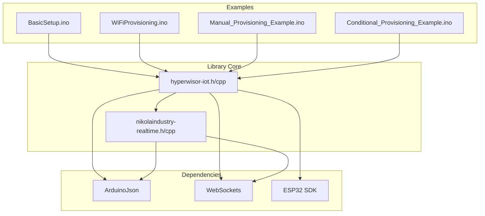

**Diagram sources**
- [hyperwisor-iot.h](file://src/hyperwisor-iot.h#L1-L190)
- [nikolaindustry-realtime.h](file://src/nikolaindustry-realtime.h#L1-L35)
- [BasicSetup.ino](file://examples/BasicSetup/BasicSetup.ino#L1-L39)

**Section sources**
- [hyperwisor-iot.h](file://src/hyperwisor-iot.h#L1-L190)
- [nikolaindustry-realtime.h](file://src/nikolaindustry-realtime.h#L1-L35)
- [README.md](file://README.md#L92-L122)

## Core Components
The library exposes a cohesive set of APIs for cloud integration:

- **Wi-Fi Provisioning**: AP mode setup with web-based provisioning and persistent storage
- **Real-time Communication**: WebSocket-based messaging with heartbeat and reconnection
- **Database Operations**: CRUD operations against cloud endpoints with API key authentication
- **Device Onboarding**: Registration of devices with product and user identifiers
- **SMS Services**: Notification delivery via cloud SMS endpoint
- **Authentication**: User sign-in with API key protection
- **OTA Updates**: Secure firmware updates with progress reporting
- **Time Synchronization**: NTP-based time/date retrieval with timezone support

Key functional areas:
- Device lifecycle management (provisioning, authentication, onboarding)
- Cloud data synchronization (database operations)
- Real-time bidirectional messaging
- Operational monitoring (connection status, retry logic)

**Section sources**
- [hyperwisor-iot.h](file://src/hyperwisor-iot.h#L39-L187)
- [hyperwisor-iot.cpp](file://src/hyperwisor-iot.cpp#L13-L137)

## Architecture Overview
The system architecture combines local device management with cloud services through a layered design:

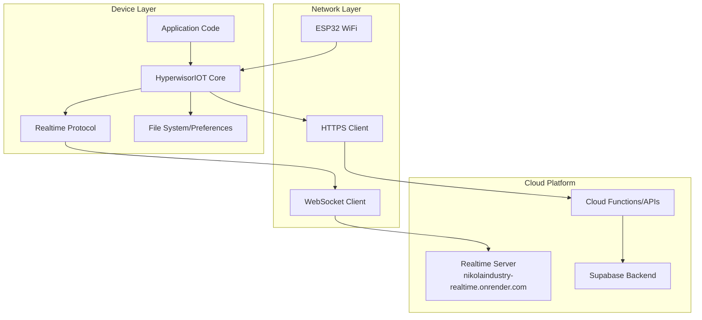

**Diagram sources**
- [nikolaindustry-realtime.cpp](file://src/nikolaindustry-realtime.cpp#L5-L75)
- [hyperwisor-iot.cpp](file://src/hyperwisor-iot.cpp#L756-L778)

**Section sources**
- [nikolaindustry-realtime.cpp](file://src/nikolaindustry-realtime.cpp#L1-L113)
- [hyperwisor-iot.cpp](file://src/hyperwisor-iot.cpp#L13-L137)

## Detailed Component Analysis

### Wi-Fi Provisioning and Device Lifecycle
The provisioning system provides seamless device configuration and recovery:

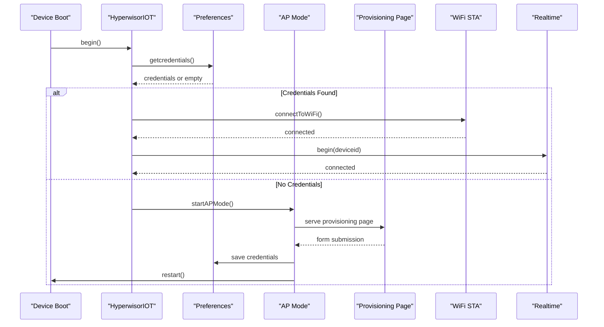

**Diagram sources**
- [hyperwisor-iot.cpp](file://src/hyperwisor-iot.cpp#L13-L137)
- [hyperwisor-iot.cpp](file://src/hyperwisor-iot.cpp#L159-L185)

Key behaviors:
- Automatic Wi-Fi connection using stored credentials
- AP mode fallback with DNS redirection and HTTP provisioning
- Persistent storage via Preferences
- Graceful restart after provisioning completion

**Section sources**
- [hyperwisor-iot.cpp](file://src/hyperwisor-iot.cpp#L13-L137)
- [hyperwisor-iot.cpp](file://src/hyperwisor-iot.cpp#L159-L185)
- [WiFiProvisioning.ino](file://examples/WiFiProvisioning/WiFiProvisioning.ino#L1-L58)

### Real-time Communication Protocol
The real-time messaging system provides reliable bidirectional communication:

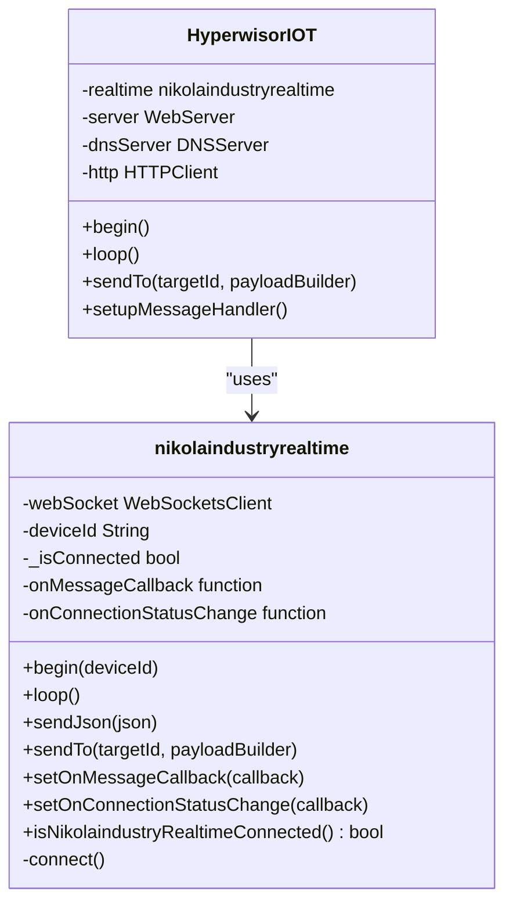

**Diagram sources**
- [nikolaindustry-realtime.h](file://src/nikolaindustry-realtime.h#L10-L32)
- [nikolaindustry-realtime.cpp](file://src/nikolaindustry-realtime.cpp#L5-L75)
- [hyperwisor-iot.h](file://src/hyperwisor-iot.h#L147-L156)

Protocol features:
- WebSocket SSL connection to dedicated server
- Heartbeat mechanism (ping/pong) for connection health
- Automatic reconnection with configurable intervals
- Message serialization/deserialization using ArduinoJson
- Targeted messaging with device ID routing

**Section sources**
- [nikolaindustry-realtime.cpp](file://src/nikolaindustry-realtime.cpp#L19-L67)
- [nikolaindustry-realtime.cpp](file://src/nikolaindustry-realtime.cpp#L90-L112)

### Database Operations and Cloud Synchronization
The library provides comprehensive database operations through HTTPS endpoints:

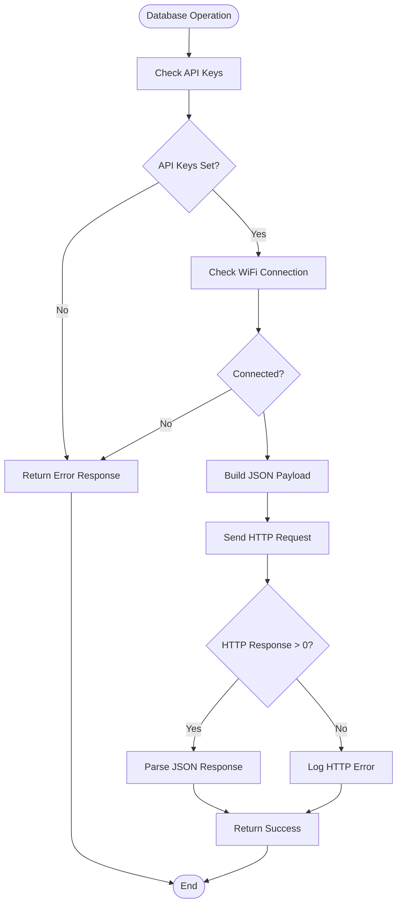

**Diagram sources**
- [hyperwisor-iot.cpp](file://src/hyperwisor-iot.cpp#L730-L778)
- [hyperwisor-iot.cpp](file://src/hyperwisor-iot.cpp#L850-L888)

Supported operations:
- Insert data with optional response parsing
- Retrieve data with pagination limits
- Update records by ID
- Delete records by ID
- All operations protected by API keys and secret keys

**Section sources**
- [hyperwisor-iot.cpp](file://src/hyperwisor-iot.cpp#L730-L847)
- [hyperwisor-iot.cpp](file://src/hyperwisor-iot.cpp#L850-L948)
- [hyperwisor-iot.cpp](file://src/hyperwisor-iot.cpp#L950-L1061)

### Device Onboarding Workflow
Device onboarding integrates product, user, and device metadata:

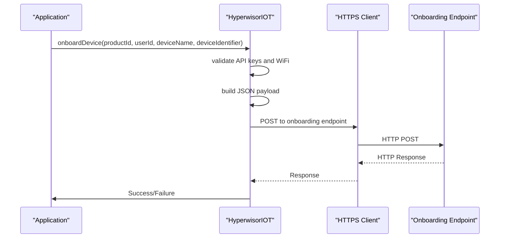

**Diagram sources**
- [hyperwisor-iot.cpp](file://src/hyperwisor-iot.cpp#L1154-L1200)
- [hyperwisor-iot.cpp](file://src/hyperwisor-iot.cpp#L1202-L1267)

Onboarding features:
- Product and user identification
- Device metadata capture
- API key authentication
- Optional response parsing for downstream processing

**Section sources**
- [hyperwisor-iot.cpp](file://src/hyperwisor-iot.cpp#L1154-L1267)

### SMS Service Integration
The SMS service enables notification delivery to users:

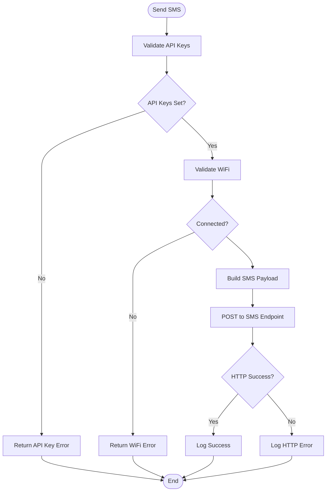

**Diagram sources**
- [hyperwisor-iot.cpp](file://src/hyperwisor-iot.cpp#L1269-L1314)
- [hyperwisor-iot.cpp](file://src/hyperwisor-iot.cpp#L1316-L1380)

SMS capabilities:
- Product-scoped messaging
- Recipient and message content specification
- API key authentication
- Response handling for delivery confirmation

**Section sources**
- [hyperwisor-iot.cpp](file://src/hyperwisor-iot.cpp#L1269-L1380)

### Authentication System
User authentication provides secure access control:

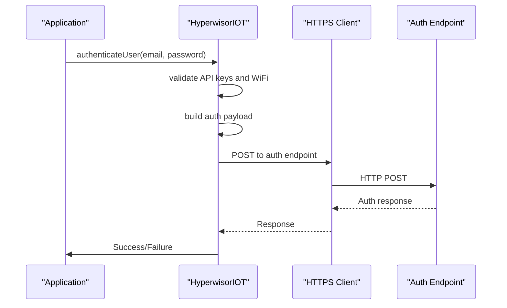

**Diagram sources**
- [hyperwisor-iot.cpp](file://src/hyperwisor-iot.cpp#L1505-L1549)
- [hyperwisor-iot.cpp](file://src/hyperwisor-iot.cpp#L1551-L1614)

Authentication features:
- Email/password credentials
- API key protection
- Optional detailed response parsing
- Integration with cloud identity services

**Section sources**
- [hyperwisor-iot.cpp](file://src/hyperwisor-iot.cpp#L1505-L1614)

### OTA Firmware Updates
OTA updates enable remote firmware deployment:

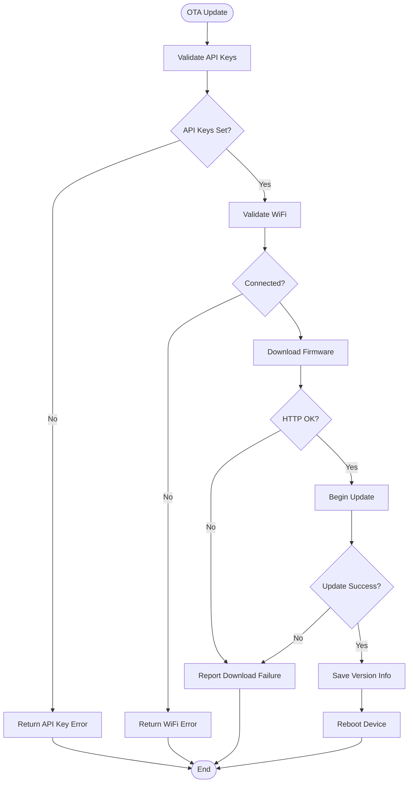

**Diagram sources**
- [hyperwisor-iot.cpp](file://src/hyperwisor-iot.cpp#L1416-L1503)

OTA features:
- Secure firmware downloads
- Progress reporting via real-time messages
- Version tracking and persistence
- Comprehensive error handling

**Section sources**
- [hyperwisor-iot.cpp](file://src/hyperwisor-iot.cpp#L1416-L1503)

### Time Synchronization and NTP
NTP-based time synchronization ensures accurate timestamps:

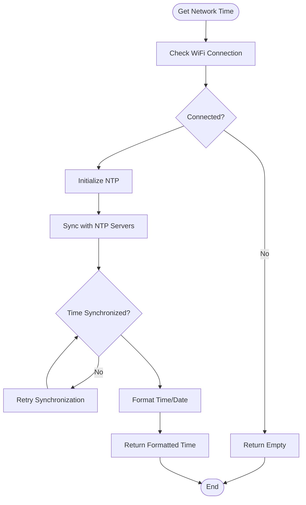

**Diagram sources**
- [hyperwisor-iot.cpp](file://src/hyperwisor-iot.cpp#L1616-L1654)
- [hyperwisor-iot.cpp](file://src/hyperwisor-iot.cpp#L1667-L1779)

Time features:
- Configurable timezone support
- Local time formatting with timezone adjustment
- Retry logic for NTP synchronization
- Integration with cloud services requiring timestamps

**Section sources**
- [hyperwisor-iot.cpp](file://src/hyperwisor-iot.cpp#L1616-L1779)

## Dependency Analysis
The library maintains clean separation of concerns through well-defined dependencies:

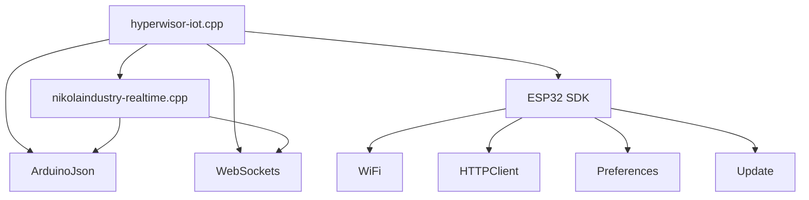

**Diagram sources**
- [hyperwisor-iot.h](file://src/hyperwisor-iot.h#L4-L14)
- [nikolaindustry-realtime.h](file://src/nikolaindustry-realtime.h#L4-L8)

Dependency characteristics:
- **High cohesion**: Each module focuses on a specific responsibility
- **Low coupling**: Interfaces minimize cross-module dependencies
- **External dependencies**: Well-known libraries (ArduinoJson, WebSockets)
- **Platform dependencies**: ESP32-specific APIs for networking and storage

**Section sources**
- [hyperwisor-iot.h](file://src/hyperwisor-iot.h#L4-L14)
- [library.properties](file://library.properties#L9-L11)

## Performance Considerations
The library implements several performance optimizations:

- **Memory management**: Dynamic JSON documents sized appropriately for each operation
- **Connection pooling**: WebSocket reuse with heartbeat detection
- **Retry strategies**: Exponential backoff for reconnection attempts
- **OTA optimization**: Streaming firmware updates to reduce memory pressure
- **NTP efficiency**: Lazy initialization and caching of time synchronization

Recommended optimizations:
- Monitor heap usage during JSON operations
- Implement backpressure for high-frequency telemetry
- Use selective message filtering in real-time handlers
- Cache frequently accessed configuration data

## Troubleshooting Guide

### Common Issues and Solutions

**Wi-Fi Connection Problems**
- Verify credentials are properly stored in Preferences
- Check AP mode timeout (4-minute limit) and automatic restart
- Ensure WiFi credentials match router configuration

**Real-time Connection Failures**
- Monitor WebSocket connection status callbacks
- Check heartbeat mechanism for zombie connection detection
- Verify device ID uniqueness and format

**API Key Authentication Errors**
- Confirm API keys are set before making cloud calls
- Validate secret key permissions for specific endpoints
- Check endpoint availability and rate limits

**OTA Update Failures**
- Verify sufficient flash memory for firmware
- Check firmware URL accessibility and content length
- Monitor update progress via real-time messages

**NTP Synchronization Issues**
- Validate timezone configuration format
- Check network connectivity for NTP servers
- Implement retry logic for initial synchronization

**Section sources**
- [hyperwisor-iot.cpp](file://src/hyperwisor-iot.cpp#L46-L137)
- [nikolaindustry-realtime.cpp](file://src/nikolaindustry-realtime.cpp#L19-L67)

## Conclusion
The Hyperwisor-IOT library provides a comprehensive foundation for cloud-connected IoT devices on ESP32 platforms. Its architecture balances simplicity with robustness, offering:

- **Seamless provisioning**: Automatic Wi-Fi configuration with AP mode fallback
- **Reliable communication**: Real-time messaging with heartbeat and reconnection
- **Secure operations**: API key protection for all cloud interactions
- **Flexible deployment**: Multiple provisioning strategies (manual, conditional, AP)
- **Operational excellence**: Comprehensive error handling, retry logic, and monitoring

The library's modular design enables easy extension and customization while maintaining consistent behavior across different deployment scenarios. Its integration with cloud services follows industry best practices for security, reliability, and performance.

## Appendices

### API Reference Summary

**Provisioning APIs**
- `begin()`: Initialize device and establish connections
- `setCredentials()`: Manually set Wi-Fi and device credentials
- `hasCredentials()`: Check for stored configuration
- `clearCredentials()`: Reset stored credentials

**Real-time Messaging**
- `sendTo()`: Send targeted messages to devices
- `setUserCommandHandler()`: Register custom message handlers
- `setupMessageHandler()`: Internal message routing setup

**Database Operations**
- `insertDatainDatabase()`: Create records with optional response
- `getDatabaseData()`: Retrieve records with pagination
- `updateDatabaseData()`: Modify existing records
- `deleteDatabaseData()`: Remove records by ID

**Device Management**
- `onboardDevice()`: Register devices with cloud platform
- `sendSMS()`: Deliver SMS notifications
- `authenticateUser()`: User sign-in with API protection

**System Utilities**
- `initNTP()`: Initialize time synchronization
- `getNetworkTime()`: Retrieve formatted time
- `getNetworkDate()`: Retrieve formatted date
- `getNetworkDateTime()`: Retrieve combined date/time

**Section sources**
- [hyperwisor-iot.h](file://src/hyperwisor-iot.h#L46-L187)
- [hyperwisor-iot.cpp](file://src/hyperwisor-iot.cpp#L13-L1811)