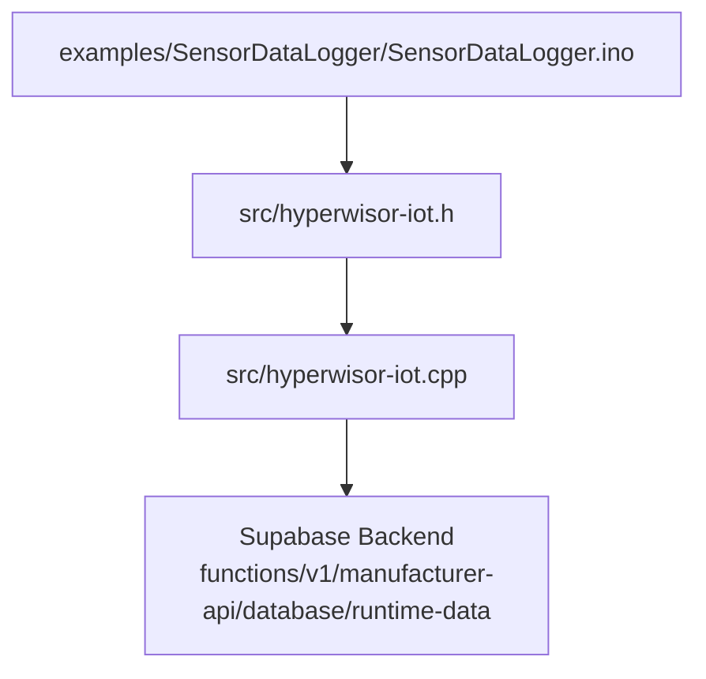
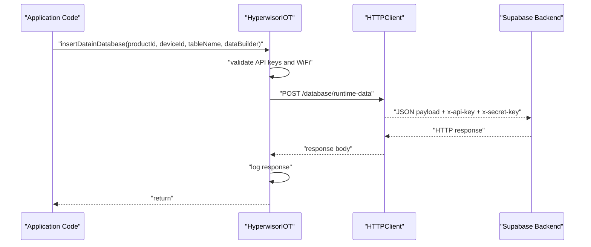
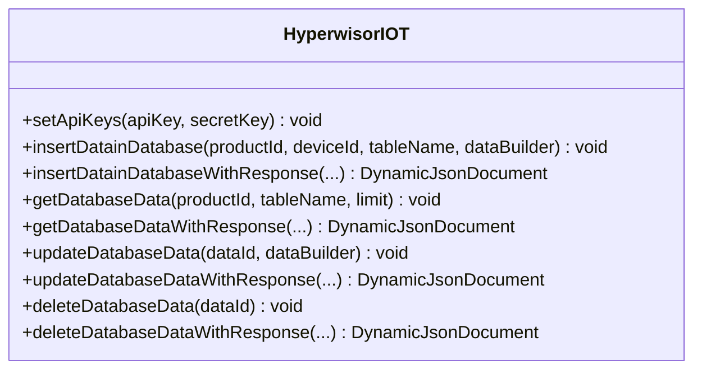
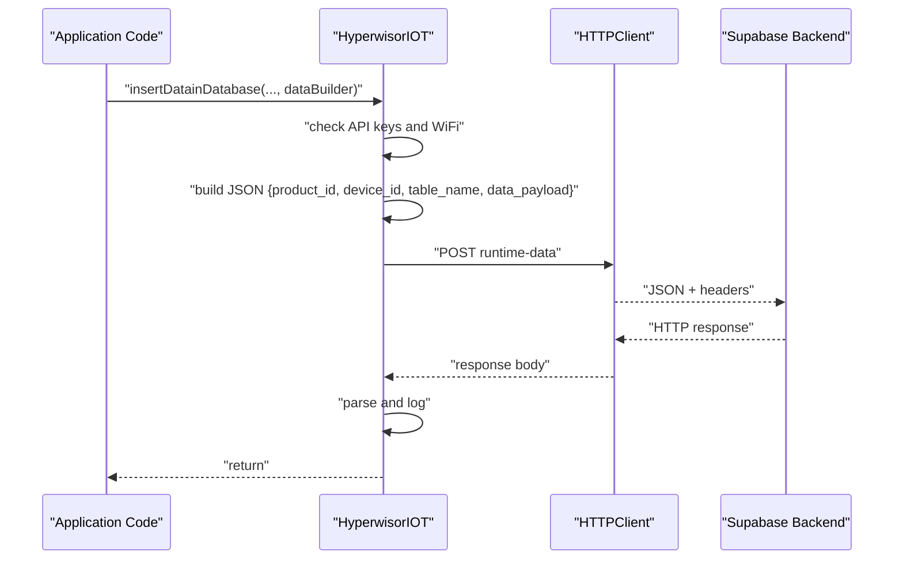
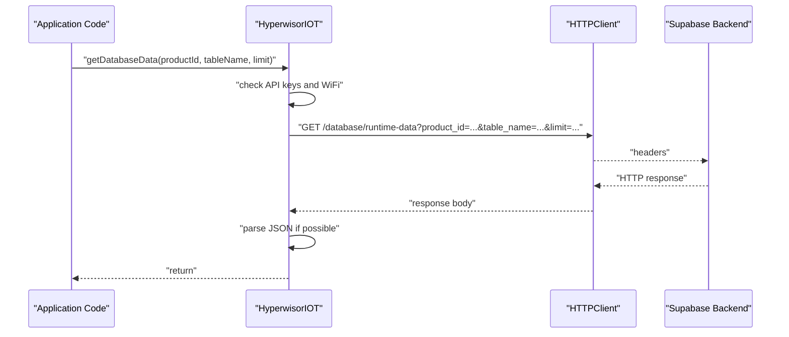
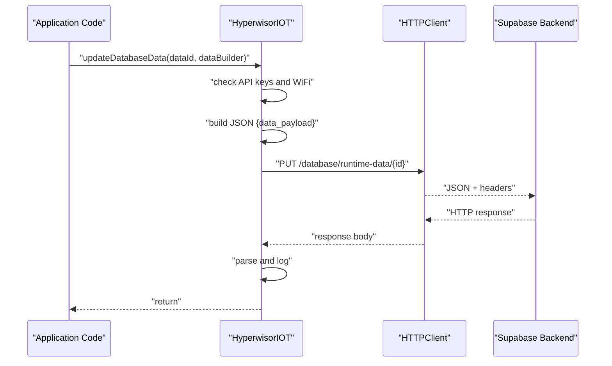
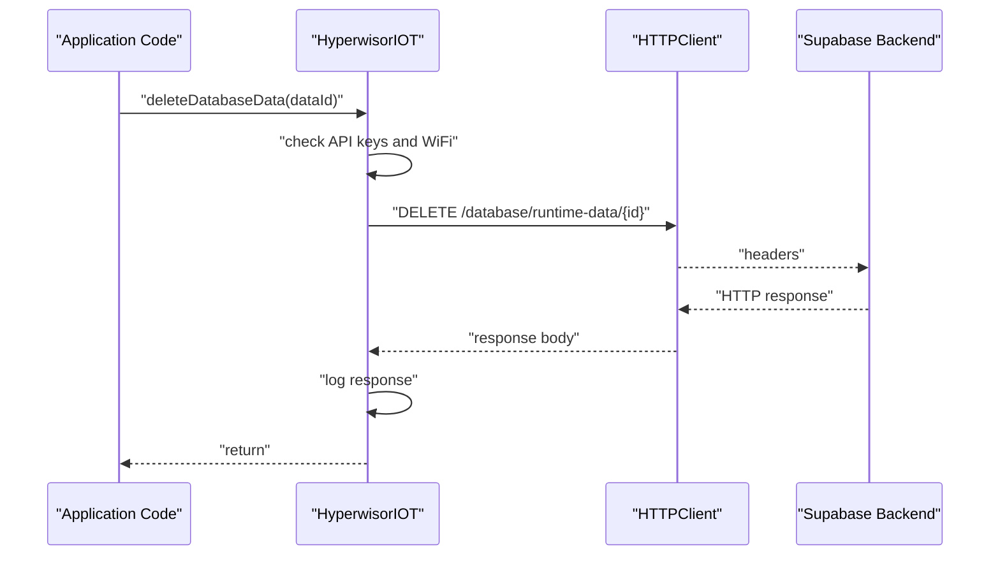
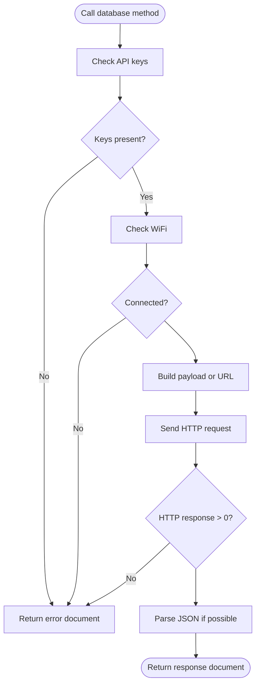
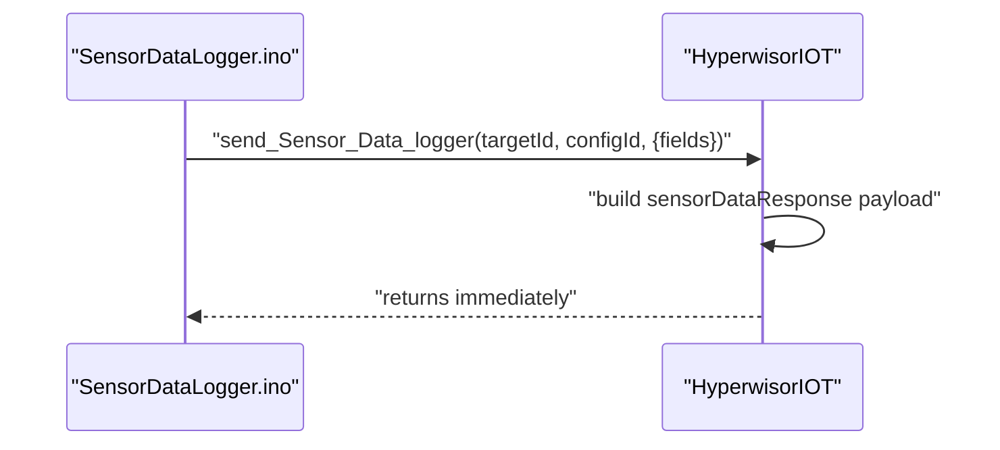
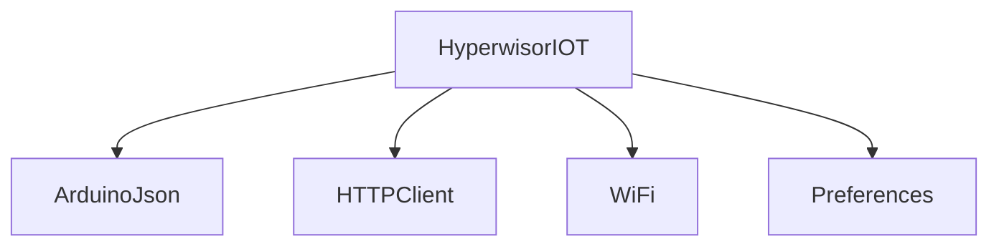

# Database Operations

<cite>
**Referenced Files in This Document**
- [hyperwisor-iot.h](file://src/hyperwisor-iot.h)
- [hyperwisor-iot.cpp](file://src/hyperwisor-iot.cpp)
- [SensorDataLogger.ino](file://examples/SensorDataLogger/SensorDataLogger.ino)
- [README.md](file://README.md)
</cite>

## Table of Contents
1. [Introduction](#introduction)
2. [Project Structure](#project-structure)
3. [Core Components](#core-components)
4. [Architecture Overview](#architecture-overview)
5. [Detailed Component Analysis](#detailed-component-analysis)
6. [Dependency Analysis](#dependency-analysis)
7. [Performance Considerations](#performance-considerations)
8. [Troubleshooting Guide](#troubleshooting-guide)
9. [Conclusion](#conclusion)
10. [Appendices](#appendices)

## Introduction
This document explains how Hyperwisor-IOT performs database operations for IoT devices. It covers the CRUD interface exposed by the library, how to construct queries and payloads, how responses are handled, and how to integrate with the backend service. Practical examples demonstrate sensor data logging, device state persistence, and historical data retrieval. It also outlines connection management, error handling, and performance optimization strategies tailored for ESP32-based constrained environments.

## Project Structure
The database functionality is encapsulated in the HyperwisorIOT class. The relevant files are:
- Header: declares the database APIs and supporting types
- Implementation: implements HTTP-based CRUD operations against a Supabase-managed backend
- Example: shows sensor data logging using the library’s built-in sensor data helper

**Diagram sources**
- [hyperwisor-iot.h](file://src/hyperwisor-iot.h#L119-L128)
- [hyperwisor-iot.cpp](file://src/hyperwisor-iot.cpp#L730-L1152)
- [SensorDataLogger.ino](file://examples/SensorDataLogger/SensorDataLogger.ino#L1-L77)

**Section sources**
- [hyperwisor-iot.h](file://src/hyperwisor-iot.h#L1-L190)
- [hyperwisor-iot.cpp](file://src/hyperwisor-iot.cpp#L1-L1811)
- [SensorDataLogger.ino](file://examples/SensorDataLogger/SensorDataLogger.ino#L1-L77)

## Core Components
- Database API surface: insert, get, update, delete operations with and without response payloads
- Authentication: requires API keys and a valid WiFi connection
- Payload construction: uses ArduinoJson to build structured payloads
- Response handling: logs HTTP responses and parses JSON when possible

Key methods:
- Insert: insertDatainDatabase(productId, deviceId, tableName, dataBuilder)
- Insert with response: insertDatainDatabaseWithResponse(...)
- Read: getDatabaseData(productId, tableName, limit), getDatabaseDataWithResponse(...)
- Update: updateDatabaseData(dataId, dataBuilder), updateDatabaseDataWithResponse(...)
- Delete: deleteDatabaseData(dataId), deleteDatabaseDataWithResponse(...)

These methods rely on:
- WiFi connectivity
- API keys set via setApiKeys(apiKey, secretKey)
- ArduinoJson for payload construction and response parsing

**Section sources**
- [hyperwisor-iot.h](file://src/hyperwisor-iot.h#L119-L128)
- [hyperwisor-iot.cpp](file://src/hyperwisor-iot.cpp#L730-L1152)

## Architecture Overview
The library communicates with a backend service over HTTPS. Each operation constructs a JSON payload, adds authentication headers, and performs an HTTP request. Responses are logged and optionally parsed into a structured JSON document.

**Diagram sources**
- [hyperwisor-iot.cpp](file://src/hyperwisor-iot.cpp#L730-L778)
- [hyperwisor-iot.cpp](file://src/hyperwisor-iot.cpp#L780-L847)

## Detailed Component Analysis

### Database API Surface
The library exposes a consistent CRUD interface:
- Insert: POST runtime-data endpoint with product_id, device_id, table_name, and data_payload
- Get: GET runtime-data endpoint with product_id, table_name, and limit
- Update: PUT runtime-data/{id} with data_payload
- Delete: DELETE runtime-data/{id}

Each method accepts a lambda that builds the data payload, enabling flexible data modeling.

**Diagram sources**
- [hyperwisor-iot.h](file://src/hyperwisor-iot.h#L119-L128)

**Section sources**
- [hyperwisor-iot.h](file://src/hyperwisor-iot.h#L119-L128)
- [hyperwisor-iot.cpp](file://src/hyperwisor-iot.cpp#L730-L1152)

### Insert Operation Workflow
- Validates API keys and WiFi connectivity
- Builds a JSON payload containing product_id, device_id, table_name, and data_payload
- Sends HTTP POST with Content-Type and authentication headers
- Logs HTTP response or error code

**Diagram sources**
- [hyperwisor-iot.cpp](file://src/hyperwisor-iot.cpp#L730-L778)
- [hyperwisor-iot.cpp](file://src/hyperwisor-iot.cpp#L780-L847)

**Section sources**
- [hyperwisor-iot.cpp](file://src/hyperwisor-iot.cpp#L730-L847)

### Read Operation Workflow
- Validates API keys and WiFi
- Constructs GET URL with product_id, table_name, and limit
- Sends HTTP GET with authentication headers
- Logs response and attempts to parse JSON into a response document

**Diagram sources**
- [hyperwisor-iot.cpp](file://src/hyperwisor-iot.cpp#L850-L888)
- [hyperwisor-iot.cpp](file://src/hyperwisor-iot.cpp#L891-L948)

**Section sources**
- [hyperwisor-iot.cpp](file://src/hyperwisor-iot.cpp#L850-L948)

### Update Operation Workflow
- Validates API keys and WiFi
- Builds data_payload via lambda
- Sends HTTP PUT to runtime-data/{id} with Content-Type and authentication headers
- Parses and logs response

**Diagram sources**
- [hyperwisor-iot.cpp](file://src/hyperwisor-iot.cpp#L950-L995)
- [hyperwisor-iot.cpp](file://src/hyperwisor-iot.cpp#L997-L1061)

**Section sources**
- [hyperwisor-iot.cpp](file://src/hyperwisor-iot.cpp#L950-L1061)

### Delete Operation Workflow
- Validates API keys and WiFi
- Sends HTTP DELETE to runtime-data/{id} with authentication headers
- Logs response

**Diagram sources**
- [hyperwisor-iot.cpp](file://src/hyperwisor-iot.cpp#L1063-L1097)
- [hyperwisor-iot.cpp](file://src/hyperwisor-iot.cpp#L1099-L1152)

**Section sources**
- [hyperwisor-iot.cpp](file://src/hyperwisor-iot.cpp#L1063-L1152)

### Query Building and Parameter Binding
- Query parameters for GET: product_id, table_name, limit
- Payload builders: lambdas passed to insert/update methods populate data_payload
- Headers: Content-Type for POST/PUT, x-api-key, x-secret-key for all requests
- Authentication: enforced by backend; library does not manage sessions

Practical guidance:
- Use the dataBuilder lambda to add fields to data_payload
- For reads, pass product_id, table_name, and desired limit
- For updates/deletes, pass the dataId returned by the backend or previously stored locally

**Section sources**
- [hyperwisor-iot.cpp](file://src/hyperwisor-iot.cpp#L863-L867)
- [hyperwisor-iot.cpp](file://src/hyperwisor-iot.cpp#L744-L753)
- [hyperwisor-iot.cpp](file://src/hyperwisor-iot.cpp#L964-L969)
- [hyperwisor-iot.cpp](file://src/hyperwisor-iot.cpp#L1076-L1082)

### Response Handling Mechanisms
- Logging: HTTP response bodies are printed for visibility
- Structured responses: With response-returning variants, the library attempts to parse the backend response as JSON and returns it in a DynamicJsonDocument
- Error reporting: Returns a document with success=false and error details when prerequisites are missing (API keys, WiFi) or HTTP request fails

**Diagram sources**
- [hyperwisor-iot.cpp](file://src/hyperwisor-iot.cpp#L786-L798)
- [hyperwisor-iot.cpp](file://src/hyperwisor-iot.cpp#L826-L846)
- [hyperwisor-iot.cpp](file://src/hyperwisor-iot.cpp#L896-L908)
- [hyperwisor-iot.cpp](file://src/hyperwisor-iot.cpp#L927-L947)

**Section sources**
- [hyperwisor-iot.cpp](file://src/hyperwisor-iot.cpp#L780-L847)
- [hyperwisor-iot.cpp](file://src/hyperwisor-iot.cpp#L891-L948)
- [hyperwisor-iot.cpp](file://src/hyperwisor-iot.cpp#L997-L1061)
- [hyperwisor-iot.cpp](file://src/hyperwisor-iot.cpp#L1099-L1152)

### Practical Examples

#### Sensor Data Logging
The example demonstrates periodic sensor readings and sending them to the platform. While this uses the dedicated sensor data helper, it illustrates how to structure device-centric data for backend storage and visualization.

**Diagram sources**
- [SensorDataLogger.ino](file://examples/SensorDataLogger/SensorDataLogger.ino#L34-L62)
- [hyperwisor-iot.cpp](file://src/hyperwisor-iot.cpp#L535-L549)

**Section sources**
- [SensorDataLogger.ino](file://examples/SensorDataLogger/SensorDataLogger.ino#L1-L77)
- [hyperwisor-iot.cpp](file://src/hyperwisor-iot.cpp#L535-L549)

#### Device State Persistence
Use insert/update to persist device state snapshots. The dataBuilder lambda allows you to include timestamps, device identifiers, and state fields. Retrieve recent states using getDatabaseData with a suitable limit.

Best practices:
- Include a timestamp field for ordering
- Store minimal state needed to reconstruct device behavior
- Use updateDatabaseData to modify existing records by dataId

**Section sources**
- [hyperwisor-iot.cpp](file://src/hyperwisor-iot.cpp#L730-L847)
- [hyperwisor-iot.cpp](file://src/hyperwisor-iot.cpp#L850-L948)
- [hyperwisor-iot.cpp](file://src/hyperwisor-iot.cpp#L950-L1061)

#### Historical Data Retrieval
Use getDatabaseDataWithResponse to fetch paginated or limited datasets. The response document contains either a parsed JSON object or raw response text depending on backend formatting.

Guidance:
- Choose limit based on memory constraints and visualization needs
- Parse the returned data to render charts or analytics dashboards

**Section sources**
- [hyperwisor-iot.cpp](file://src/hyperwisor-iot.cpp#L891-L948)

### Data Modeling Best Practices for IoT
- Normalize device identity: product_id, device_id, table_name
- Timestamps: include created_at or updated_at for temporal queries
- Lightweight payloads: minimize fields to reduce bandwidth and storage costs
- Idempotency: prefer upsert-like patterns by storing dataIds for updates
- Partitioning: use table_name to separate telemetry, events, and metadata

[No sources needed since this section provides general guidance]

## Dependency Analysis
- ArduinoJson: used for payload construction and response parsing
- HTTPClient: used for HTTPS requests
- WiFi: prerequisite for connectivity
- Preferences: used for persistent storage of credentials and GPIO states

**Diagram sources**
- [hyperwisor-iot.h](file://src/hyperwisor-iot.h#L4-L14)
- [hyperwisor-iot.cpp](file://src/hyperwisor-iot.cpp#L1-L3)

**Section sources**
- [hyperwisor-iot.h](file://src/hyperwisor-iot.h#L4-L14)
- [hyperwisor-iot.cpp](file://src/hyperwisor-iot.cpp#L1-L3)

## Performance Considerations
- Payload sizing: keep payloads compact; use only necessary fields
- Frequency control: throttle writes to backend to avoid bursts
- Memory: use DynamicJsonDocument judiciously; reuse buffers when possible
- Connectivity: ensure stable WiFi to reduce retries and timeouts
- SSL: the implementation disables certificate verification for convenience; in production, secure connections should be enabled

[No sources needed since this section provides general guidance]

## Troubleshooting Guide
Common issues and remedies:
- Missing API keys: Call setApiKeys before database operations
- No WiFi: Ensure begin() connects to Wi-Fi; check credentials
- HTTP errors: Inspect returned documents for http_response_code and error fields
- JSON parsing failures: The library falls back to raw_response when deserialization fails

Operational checks:
- Verify product_id, device_id, table_name correctness
- Confirm backend endpoint availability and authentication
- Monitor serial logs for HTTP response codes and messages

**Section sources**
- [hyperwisor-iot.cpp](file://src/hyperwisor-iot.cpp#L733-L742)
- [hyperwisor-iot.cpp](file://src/hyperwisor-iot.cpp#L786-L798)
- [hyperwisor-iot.cpp](file://src/hyperwisor-iot.cpp#L857-L861)
- [hyperwisor-iot.cpp](file://src/hyperwisor-iot.cpp#L896-L908)
- [hyperwisor-iot.cpp](file://src/hyperwisor-iot.cpp#L1066-L1075)

## Conclusion
Hyperwisor-IOT provides a straightforward, JSON-driven database interface for ESP32 devices. By leveraging ArduinoJson and HTTPClient, it enables robust CRUD operations against a managed backend. The library emphasizes simplicity: set API keys, ensure WiFi, and use lambda-based payload builders. For production, consider enabling certificate verification, tuning payload sizes, and implementing retry/backoff strategies.

[No sources needed since this section summarizes without analyzing specific files]

## Appendices

### API Reference Summary
- Insert: insertDatainDatabase(productId, deviceId, tableName, dataBuilder)
- Insert with response: insertDatainDatabaseWithResponse(...)
- Read: getDatabaseData(productId, tableName, limit), getDatabaseDataWithResponse(...)
- Update: updateDatabaseData(dataId, dataBuilder), updateDatabaseDataWithResponse(...)
- Delete: deleteDatabaseData(dataId), deleteDatabaseDataWithResponse(...)

**Section sources**
- [hyperwisor-iot.h](file://src/hyperwisor-iot.h#L119-L128)
- [hyperwisor-iot.cpp](file://src/hyperwisor-iot.cpp#L730-L1152)