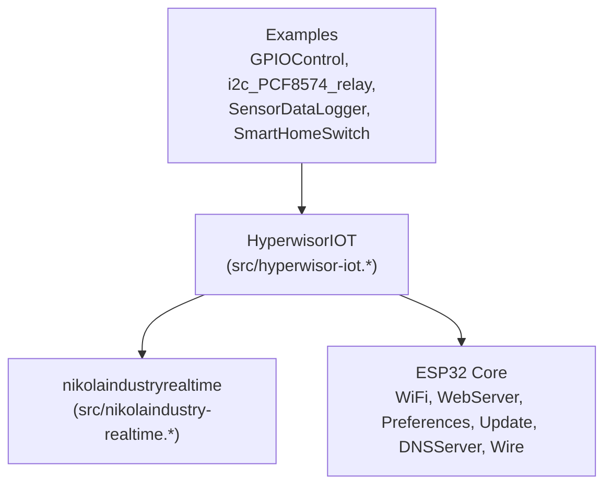
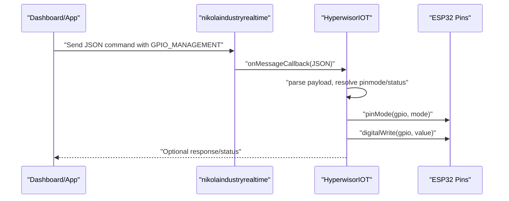
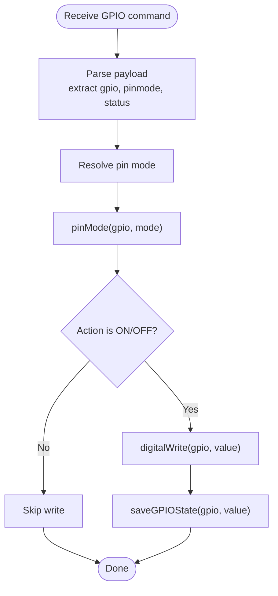
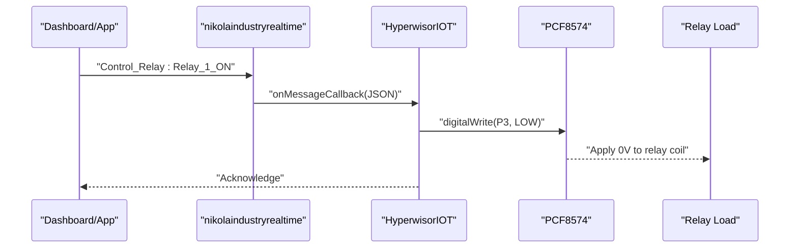
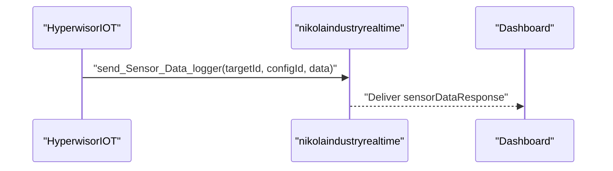
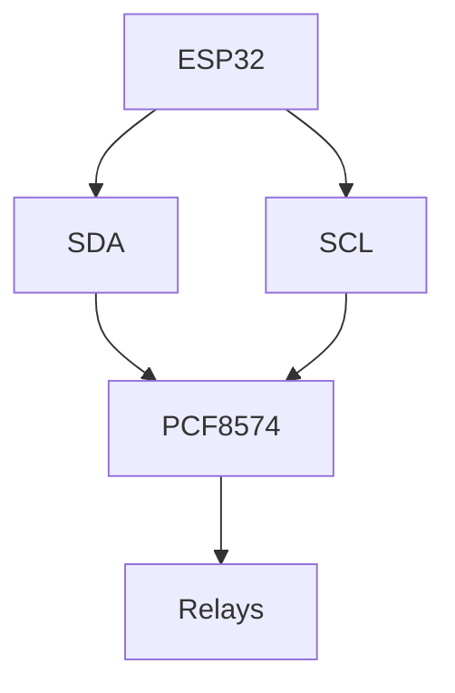
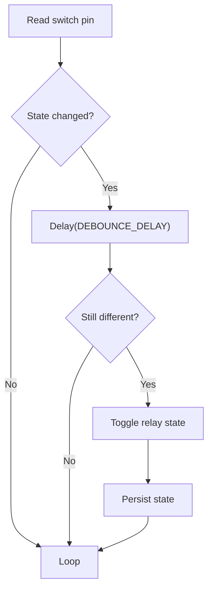
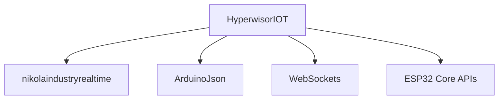

# Hardware Control

<cite>
**Referenced Files in This Document**
- [README.md](file://README.md)
- [library.properties](file://library.properties)
- [src/hyperwisor-iot.h](file://src/hyperwisor-iot.h)
- [src/hyperwisor-iot.cpp](file://src/hyperwisor-iot.cpp)
- [src/nikolaindustry-realtime.h](file://src/nikolaindustry-realtime.h)
- [src/nikolaindustry-realtime.cpp](file://src/nikolaindustry-realtime.cpp)
- [examples/GPIOControl/GPIOControl.ino](file://examples/GPIOControl/GPIOControl.ino)
- [examples/i2c_PCF8574_relay/i2c_PCF8574_relay.ino](file://examples/i2c_PCF8574_relay/i2c_PCF8574_relay.ino)
- [examples/SensorDataLogger/SensorDataLogger.ino](file://examples/SensorDataLogger/SensorDataLogger.ino)
- [examples/SmartHomeSwitch/SmartHomeSwitch.ino](file://examples/SmartHomeSwitch/SmartHomeSwitch.ino)
</cite>

## Table of Contents
1. [Introduction](#introduction)
2. [Project Structure](#project-structure)
3. [Core Components](#core-components)
4. [Architecture Overview](#architecture-overview)
5. [Detailed Component Analysis](#detailed-component-analysis)
6. [Dependency Analysis](#dependency-analysis)
7. [Performance Considerations](#performance-considerations)
8. [Troubleshooting Guide](#troubleshooting-guide)
9. [Conclusion](#conclusion)
10. [Appendices](#appendices)

## Introduction
This document explains the hardware control features exposed by the library, focusing on GPIO management, sensor integration patterns, actuator control, and I2C-based peripherals. It covers:
- GPIO pin configuration, input/output modes, and state persistence
- Remote GPIO control via structured JSON commands
- Actuator control patterns using relays and simulated motor control
- I2C communication for PCF8574-based relays
- Sensor data logging and reporting
- Debouncing techniques for switches
- Hardware initialization, power management, and fault detection
- Practical examples and troubleshooting guidelines

## Project Structure
The library centers around a primary class that orchestrates Wi-Fi provisioning, real-time messaging, and GPIO handling. Supporting components include a lightweight real-time transport and example sketches demonstrating hardware control patterns.

**Diagram sources**
- [src/hyperwisor-iot.h](file://src/hyperwisor-iot.h#L39-L187)
- [src/hyperwisor-iot.cpp](file://src/hyperwisor-iot.cpp#L1-L137)
- [src/nikolaindustry-realtime.h](file://src/nikolaindustry-realtime.h#L10-L32)
- [src/nikolaindustry-realtime.cpp](file://src/nikolaindustry-realtime.cpp#L1-L113)

**Section sources**
- [README.md](file://README.md#L1-L173)
- [library.properties](file://library.properties#L1-L11)

## Core Components
- HyperwisorIOT: Main class providing Wi-Fi provisioning, real-time messaging, GPIO state persistence, and convenience APIs for widgets, dialogs, and sensor data logging.
- nikolaindustryrealtime: Lightweight WebSocket client wrapper that manages connection lifecycle, heartbeats, and JSON message routing.
- Examples: Demonstrations of GPIO control, I2C relay control, sensor logging, and a full-featured smart home switch with debouncing and persistence.

Key GPIO and hardware-related APIs:
- GPIO state persistence: saveGPIOState, loadGPIOState, restoreAllGPIOStates
- Remote GPIO control: built-in handling of GPIO_MANAGEMENT commands
- User command handler: setUserCommandHandler for custom logic
- Helper utilities: findCommand, findAction, findParams for structured JSON parsing

**Section sources**
- [src/hyperwisor-iot.h](file://src/hyperwisor-iot.h#L43-L146)
- [src/hyperwisor-iot.cpp](file://src/hyperwisor-iot.cpp#L313-L405)
- [src/hyperwisor-iot.cpp](file://src/hyperwisor-iot.cpp#L1382-L1414)

## Architecture Overview
The hardware control architecture integrates Wi-Fi provisioning, real-time messaging, and GPIO/actuator control. The real-time layer decodes incoming commands and applies them to ESP32 pins, while the library persists GPIO states across reboots.

**Diagram sources**
- [src/hyperwisor-iot.cpp](file://src/hyperwisor-iot.cpp#L313-L405)
- [src/nikolaindustry-realtime.cpp](file://src/nikolaindustry-realtime.cpp#L19-L67)

## Detailed Component Analysis

### GPIO Management
- Remote control: The library automatically handles GPIO_MANAGEMENT commands, applying pin modes and output states to ESP32 pins.
- Local control: Users can configure pins in setup() and persist states across reboots using saveGPIOState/loadGPIOState/restoreAllGPIOStates.
- Persistence: GPIO states are stored in Preferences under a dedicated namespace.

Implementation highlights:
- Message parsing and action dispatch for GPIO_MANAGEMENT
- Pin mode resolution (INPUT, OUTPUT, INPUT_PULLUP)
- Output state application (HIGH, LOW)
- State restoration on boot

**Diagram sources**
- [src/hyperwisor-iot.cpp](file://src/hyperwisor-iot.cpp#L328-L362)
- [src/hyperwisor-iot.cpp](file://src/hyperwisor-iot.cpp#L1382-L1414)

**Section sources**
- [src/hyperwisor-iot.cpp](file://src/hyperwisor-iot.cpp#L313-L405)
- [src/hyperwisor-iot.cpp](file://src/hyperwisor-iot.cpp#L1382-L1414)
- [examples/GPIOControl/GPIOControl.ino](file://examples/GPIOControl/GPIOControl.ino#L34-L79)

### Actuator Control Patterns
- Relay switching: The I2C example controls PCF8574 pins to switch relays. The library’s GPIO layer can also drive ESP32 pins directly for relays.
- Motor control: While the library does not expose PWM APIs directly, motor direction and enable can be controlled via GPIO_MANAGEMENT commands. PWM would require adding ESP32-specific PWM functions to the library.
- Load management: The Smart Home Switch example demonstrates power-loss resume and bidirectional control (cloud and local).

**Diagram sources**
- [examples/i2c_PCF8574_relay/i2c_PCF8574_relay.ino](file://examples/i2c_PCF8574_relay/i2c_PCF8574_relay.ino#L56-L108)

**Section sources**
- [examples/i2c_PCF8574_relay/i2c_PCF8574_relay.ino](file://examples/i2c_PCF8574_relay/i2c_PCF8574_relay.ino#L1-L116)
- [examples/SmartHomeSwitch/SmartHomeSwitch.ino](file://examples/SmartHomeSwitch/SmartHomeSwitch.ino#L70-L104)

### Sensor Integration Patterns
- Structured logging: The library provides a helper to send sensor data with a config identifier and key-value pairs.
- Example usage: The SensorDataLogger sketch demonstrates periodic logging of temperature, humidity, and pressure-like metrics.

**Diagram sources**
- [src/hyperwisor-iot.cpp](file://src/hyperwisor-iot.cpp#L534-L549)
- [examples/SensorDataLogger/SensorDataLogger.ino](file://examples/SensorDataLogger/SensorDataLogger.ino#L34-L62)

**Section sources**
- [src/hyperwisor-iot.cpp](file://src/hyperwisor-iot.cpp#L534-L549)
- [examples/SensorDataLogger/SensorDataLogger.ino](file://examples/SensorDataLogger/SensorDataLogger.ino#L1-L77)

### I2C Communication for Peripherals
- PCF8574 relay control: The example initializes Wire on specific pins and controls PCF8574 GPIOs to switch relays.
- Device addressing: The example uses a fixed address for the PCF8574 chip.
- Data transfer: Digital writes to PCF8574 pins mirror ESP32 digital writes conceptually.

**Diagram sources**
- [examples/i2c_PCF8574_relay/i2c_PCF8574_relay.ino](file://examples/i2c_PCF8574_relay/i2c_PCF8574_relay.ino#L12-L17)

**Section sources**
- [examples/i2c_PCF8574_relay/i2c_PCF8574_relay.ino](file://examples/i2c_PCF8574_relay/i2c_PCF8574_relay.ino#L1-L116)

### Debouncing Techniques for Switches
- The Smart Home Switch example implements debouncing for seven physical toggle switches using a simple state comparison and a small delay.
- Debounce delay is configurable and applied before accepting a state change.

**Diagram sources**
- [examples/SmartHomeSwitch/SmartHomeSwitch.ino](file://examples/SmartHomeSwitch/SmartHomeSwitch.ino#L356-L438)

**Section sources**
- [examples/SmartHomeSwitch/SmartHomeSwitch.ino](file://examples/SmartHomeSwitch/SmartHomeSwitch.ino#L58-L69)
- [examples/SmartHomeSwitch/SmartHomeSwitch.ino](file://examples/SmartHomeSwitch/SmartHomeSwitch.ino#L356-L438)

### Hardware Abstraction and Pin Mapping Strategies
- ESP32 pin abstraction: The library operates on ESP32 pins directly. GPIO_MANAGEMENT commands accept numeric pin identifiers compatible with ESP32.
- Widget-to-pin mapping: The Smart Home Switch example demonstrates dynamic mapping of dashboard widget IDs to relay numbers, persisted in Preferences for cross-session continuity.
- Pin configuration: The library resolves pin modes and applies them before writing output states.

**Section sources**
- [src/hyperwisor-iot.cpp](file://src/hyperwisor-iot.cpp#L342-L362)
- [examples/SmartHomeSwitch/SmartHomeSwitch.ino](file://examples/SmartHomeSwitch/SmartHomeSwitch.ino#L105-L188)

### Practical Examples
- GPIOControl: Demonstrates saving/restoring GPIO states, custom command handling, and reporting GPIO status.
- i2c_PCF8574_relay: Shows I2C relay control via custom commands and PCF8574 digital writes.
- SensorDataLogger: Sends structured sensor data periodically to the dashboard.
- SmartHomeSwitch: Full-featured example with debouncing, persistence, cloud and local control, and dynamic widget mapping.

**Section sources**
- [examples/GPIOControl/GPIOControl.ino](file://examples/GPIOControl/GPIOControl.ino#L1-L105)
- [examples/i2c_PCF8574_relay/i2c_PCF8574_relay.ino](file://examples/i2c_PCF8574_relay/i2c_PCF8574_relay.ino#L1-L116)
- [examples/SensorDataLogger/SensorDataLogger.ino](file://examples/SensorDataLogger/SensorDataLogger.ino#L1-L77)
- [examples/SmartHomeSwitch/SmartHomeSwitch.ino](file://examples/SmartHomeSwitch/SmartHomeSwitch.ino#L1-L443)

## Dependency Analysis
- External libraries: ArduinoJson, WebSockets, ESP32 core (WiFi, WebServer, HTTPClient, Preferences, Update, DNSServer, Wire).
- Internal dependencies: HyperwisorIOT depends on nikolaindustryrealtime for real-time messaging and uses ESP32 APIs for GPIO and I2C.

**Diagram sources**
- [library.properties](file://library.properties#L9-L11)
- [src/hyperwisor-iot.h](file://src/hyperwisor-iot.h#L4-L14)

**Section sources**
- [library.properties](file://library.properties#L1-L11)
- [src/hyperwisor-iot.h](file://src/hyperwisor-iot.h#L4-L14)

## Performance Considerations
- Real-time messaging: The WebSocket layer includes heartbeat and automatic reconnection to maintain connectivity.
- GPIO operations: Minimal overhead; ensure frequent polling of user command handler does not starve the real-time loop.
- I2C bus: Use appropriate pull-up resistors and keep bus lengths short to minimize errors.
- Sensor logging: Batch or throttle readings to reduce bandwidth and CPU usage.

[No sources needed since this section provides general guidance]

## Troubleshooting Guide
Common issues and remedies:
- Wi-Fi provisioning failures: Verify SSID/password and device/user IDs are correctly stored; the library supports manual provisioning APIs.
- Real-time connection drops: The library attempts reconnection and will reboot after max retries if needed.
- GPIO not responding: Ensure pin mode is set before writing; confirm pin numbers match ESP32 pinout.
- I2C not detected: Check wiring, pull-ups, and device address; verify Wire.begin with correct pins.
- Sensor data not appearing: Confirm Wi-Fi is connected and the targetId is correct.

Operational checks:
- Use the device status command to verify online/offline state.
- Inspect serial logs for connection and OTA progress.
- Validate GPIO state persistence by rebooting and checking restored states.

**Section sources**
- [src/hyperwisor-iot.cpp](file://src/hyperwisor-iot.cpp#L46-L137)
- [src/hyperwisor-iot.cpp](file://src/hyperwisor-iot.cpp#L1416-L1503)
- [examples/GPIOControl/GPIOControl.ino](file://examples/GPIOControl/GPIOControl.ino#L34-L79)

## Conclusion
The library provides a robust foundation for hardware control on ESP32, including remote GPIO management, sensor data logging, and I2C-based actuator control. With built-in persistence, real-time messaging, and practical examples, developers can implement reliable IoT hardware solutions with minimal boilerplate.

[No sources needed since this section summarizes without analyzing specific files]

## Appendices

### Hardware Initialization Sequences
- Begin Wi-Fi and AP mode provisioning
- Initialize real-time connection
- Load credentials and device identifiers
- Restore GPIO states from persistence

**Section sources**
- [src/hyperwisor-iot.cpp](file://src/hyperwisor-iot.cpp#L13-L28)
- [src/hyperwisor-iot.cpp](file://src/hyperwisor-iot.cpp#L255-L275)
- [src/hyperwisor-iot.cpp](file://src/hyperwisor-iot.cpp#L1398-L1414)

### Power Management and Fault Detection
- Automatic Wi-Fi reconnection and real-time heartbeat
- AP mode fallback with timeout and reboot
- OTA update with progress and error reporting
- GPIO state persistence to resume after power loss

**Section sources**
- [src/hyperwisor-iot.cpp](file://src/hyperwisor-iot.cpp#L46-L137)
- [src/hyperwisor-iot.cpp](file://src/hyperwisor-iot.cpp#L1416-L1503)
- [examples/SmartHomeSwitch/SmartHomeSwitch.ino](file://examples/SmartHomeSwitch/SmartHomeSwitch.ino#L226-L246)

### Guidelines for Hardware Troubleshooting
- Validate pin modes and states before applying outputs
- Use debouncing for mechanical switches
- Confirm I2C wiring and device addresses
- Monitor real-time connection status and logs
- Test GPIO persistence by toggling and rebooting

**Section sources**
- [examples/SmartHomeSwitch/SmartHomeSwitch.ino](file://examples/SmartHomeSwitch/SmartHomeSwitch.ino#L58-L69)
- [examples/i2c_PCF8574_relay/i2c_PCF8574_relay.ino](file://examples/i2c_PCF8574_relay/i2c_PCF8574_relay.ino#L12-L17)
- [src/hyperwisor-iot.cpp](file://src/hyperwisor-iot.cpp#L46-L137)