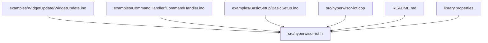
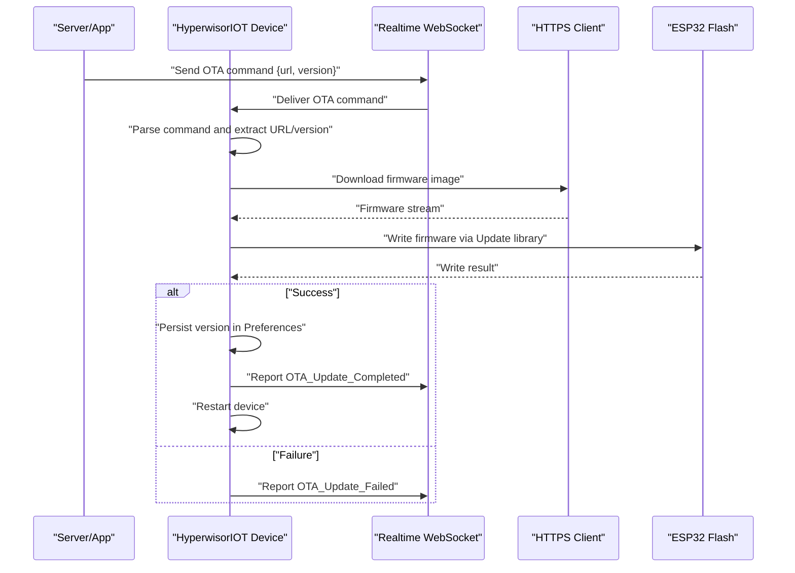
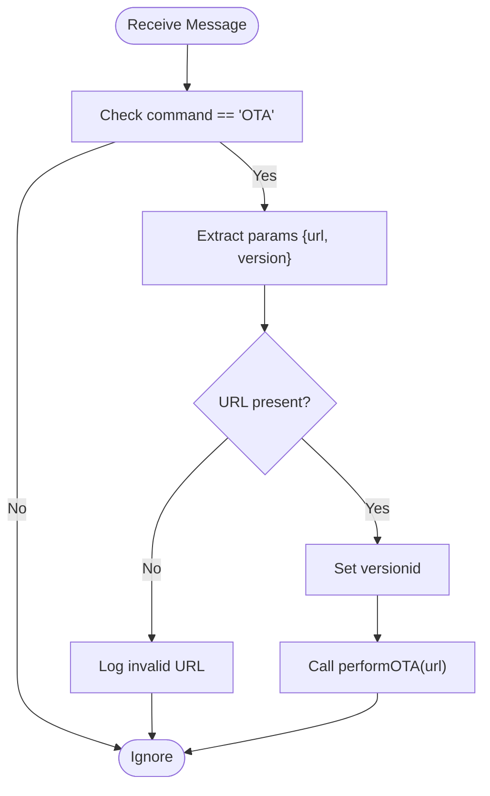
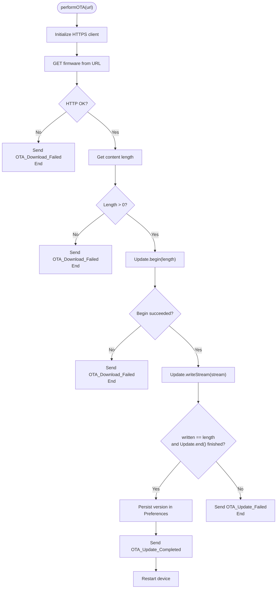
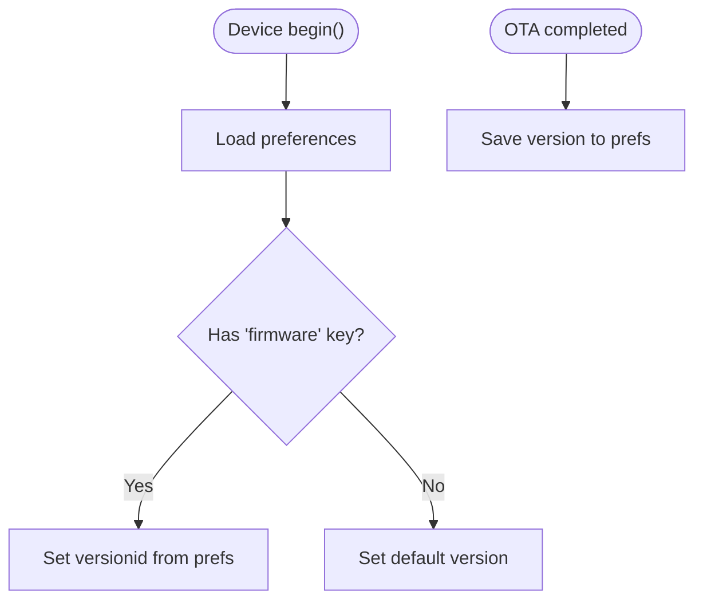
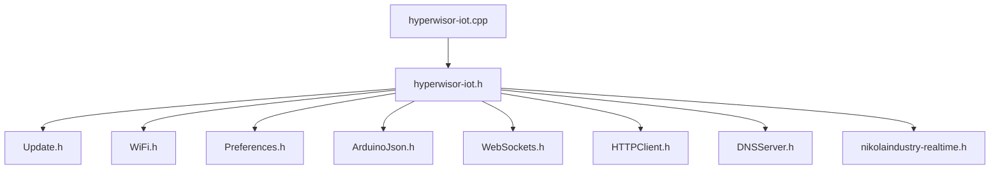

# OTA Firmware Updates

<cite>
**Referenced Files in This Document**
- [README.md](file://README.md)
- [library.properties](file://library.properties)
- [hyperwisor-iot.h](file://src/hyperwisor-iot.h)
- [hyperwisor-iot.cpp](file://src/hyperwisor-iot.cpp)
- [WidgetUpdate.ino](file://examples/WidgetUpdate/WidgetUpdate.ino)
- [CommandHandler.ino](file://examples/CommandHandler/CommandHandler.ino)
- [BasicSetup.ino](file://examples/BasicSetup/BasicSetup.ino)
</cite>

## Table of Contents
1. [Introduction](#introduction)
2. [Project Structure](#project-structure)
3. [Core Components](#core-components)
4. [Architecture Overview](#architecture-overview)
5. [Detailed Component Analysis](#detailed-component-analysis)
6. [Dependency Analysis](#dependency-analysis)
7. [Performance Considerations](#performance-considerations)
8. [Troubleshooting Guide](#troubleshooting-guide)
9. [Conclusion](#conclusion)
10. [Appendices](#appendices)

## Introduction
This document explains how the Hyperwisor-IOT Arduino library implements Over-The-Air (OTA) firmware updates for ESP32-based IoT devices. It covers the update mechanism including firmware download, verification, and installation processes, along with version tracking, deployment strategies, maintenance workflows, and security considerations. Practical examples are included to help developers implement OTA updates in real-world scenarios.

## Project Structure
The repository provides a ready-to-use Arduino library with:
- Core library header and implementation files
- Example sketches demonstrating OTA command handling and basic device initialization
- Documentation and metadata for installation and usage

**Diagram sources**
- [hyperwisor-iot.h](file://src/hyperwisor-iot.h#L1-L190)
- [hyperwisor-iot.cpp](file://src/hyperwisor-iot.cpp#L1-L1811)
- [README.md](file://README.md#L1-L173)
- [library.properties](file://library.properties#L1-L11)

**Section sources**
- [README.md](file://README.md#L1-L173)
- [library.properties](file://library.properties#L1-L11)

## Core Components
The OTA update capability is implemented through:
- A real-time messaging handler that recognizes OTA commands
- An OTA processing function that downloads firmware and writes it to flash
- Version tracking persisted in device preferences
- Status notifications sent back to the controlling server/app

Key responsibilities:
- Receive OTA command with URL and version
- Download firmware image via HTTPS
- Write firmware to device flash using the ESP32 Update library
- Persist version information upon successful update
- Report progress and completion/failure statuses

**Section sources**
- [hyperwisor-iot.h](file://src/hyperwisor-iot.h#L147-L187)
- [hyperwisor-iot.cpp](file://src/hyperwisor-iot.cpp#L364-L390)
- [hyperwisor-iot.cpp](file://src/hyperwisor-iot.cpp#L1416-L1503)

## Architecture Overview
The OTA update architecture integrates with the real-time communication layer and the ESP32 Update subsystem.

**Diagram sources**
- [hyperwisor-iot.cpp](file://src/hyperwisor-iot.cpp#L364-L390)
- [hyperwisor-iot.cpp](file://src/hyperwisor-iot.cpp#L1416-L1503)

## Detailed Component Analysis

### OTA Command Handling
The device listens for real-time messages containing an OTA command. Upon receiving the command, it extracts the firmware URL and version, then triggers the OTA process.

**Diagram sources**
- [hyperwisor-iot.cpp](file://src/hyperwisor-iot.cpp#L364-L390)

**Section sources**
- [hyperwisor-iot.cpp](file://src/hyperwisor-iot.cpp#L364-L390)

### Firmware Download and Installation
The OTA process performs:
- Secure HTTP(S) download of the firmware image
- Content length validation
- Flash write using the ESP32 Update library
- Version persistence and device restart on success

**Diagram sources**
- [hyperwisor-iot.cpp](file://src/hyperwisor-iot.cpp#L1416-L1503)

**Section sources**
- [hyperwisor-iot.cpp](file://src/hyperwisor-iot.cpp#L1416-L1503)

### Version Management and Tracking
Version tracking is implemented by:
- Storing the current firmware version in device preferences
- Updating the stored version after a successful OTA
- Loading the version during device initialization

**Diagram sources**
- [hyperwisor-iot.cpp](file://src/hyperwisor-iot.cpp#L256-L275)
- [hyperwisor-iot.cpp](file://src/hyperwisor-iot.cpp#L1481-L1483)

**Section sources**
- [hyperwisor-iot.cpp](file://src/hyperwisor-iot.cpp#L256-L275)
- [hyperwisor-iot.cpp](file://src/hyperwisor-iot.cpp#L1481-L1483)

### Security Considerations
Current implementation highlights:
- HTTPS client with insecure mode enabled for firmware downloads
- No cryptographic signature verification of firmware images
- No tamper detection mechanisms
- No rollback procedure implemented

Security recommendations:
- Enable certificate verification for HTTPS downloads
- Implement firmware signature verification using device-specific keys
- Add integrity checks (checksums) before writing to flash
- Implement a dual-bank or A/B partition scheme for safe rollback

**Section sources**
- [hyperwisor-iot.cpp](file://src/hyperwisor-iot.cpp#L1422-L1423)
- [hyperwisor-iot.cpp](file://src/hyperwisor-iot.cpp#L1461-L1470)

### Deployment Strategies
The library supports centralized control via real-time commands. Recommended strategies:
- Staged rollouts: Send OTA commands selectively to subsets of devices
- A/B testing: Deploy to small groups and compare metrics before wider rollout
- Progressive updates: Gradually increase the percentage of devices receiving updates
- Monitoring: Track status reports and device restarts post-update

Operational notes:
- OTA commands are delivered via real-time WebSocket connections
- The device responds with status updates during download and installation
- Successful updates trigger a device restart

**Section sources**
- [hyperwisor-iot.cpp](file://src/hyperwisor-iot.cpp#L364-L390)
- [hyperwisor-iot.cpp](file://src/hyperwisor-iot.cpp#L1458-L1491)

### Maintenance Workflows
Maintenance tasks supported by the library:
- Update scheduling: Send OTA commands from a server/app at planned times
- Monitoring: Observe status messages indicating OTA progress and outcomes
- Failure handling: Device sends failure status and logs errors; operator can retry or rollback

Practical guidance:
- Use the real-time messaging interface to send OTA commands
- Monitor device status responses to track progress
- Implement retry logic on the server side if failures occur

**Section sources**
- [hyperwisor-iot.cpp](file://src/hyperwisor-iot.cpp#L1434-L1452)
- [hyperwisor-iot.cpp](file://src/hyperwisor-iot.cpp#L1494-L1500)

### Practical Implementation Examples
- Basic device initialization and connectivity: [BasicSetup.ino](file://examples/BasicSetup/BasicSetup.ino#L1-L39)
- Real-time command handling and OTA reception: [CommandHandler.ino](file://examples/CommandHandler/CommandHandler.ino#L1-L96)
- Dashboard widget updates (context for real-time messaging): [WidgetUpdate.ino](file://examples/WidgetUpdate/WidgetUpdate.ino#L1-L68)

**Section sources**
- [BasicSetup.ino](file://examples/BasicSetup/BasicSetup.ino#L1-L39)
- [CommandHandler.ino](file://examples/CommandHandler/CommandHandler.ino#L1-L96)
- [WidgetUpdate.ino](file://examples/WidgetUpdate/WidgetUpdate.ino#L1-L68)

## Dependency Analysis
The OTA functionality depends on:
- ESP32 WiFi and Update libraries for network connectivity and firmware flashing
- ArduinoJson for parsing and constructing JSON messages
- WebSockets for real-time communication
- Preferences for persistent storage of credentials and version

**Diagram sources**
- [hyperwisor-iot.h](file://src/hyperwisor-iot.h#L4-L15)
- [hyperwisor-iot.cpp](file://src/hyperwisor-iot.cpp#L1-L2)

**Section sources**
- [hyperwisor-iot.h](file://src/hyperwisor-iot.h#L4-L15)
- [library.properties](file://library.properties#L10-L11)

## Performance Considerations
- OTA bandwidth: Large firmware images can take significant time; schedule updates during off-peak hours
- Memory usage: Ensure sufficient heap space for JSON parsing and HTTP operations
- Network reliability: Implement retry logic and monitor connection stability
- Flash wear: Frequent updates can reduce flash lifespan; batch updates when possible

## Troubleshooting Guide
Common issues and remedies:
- OTA download fails: Verify URL accessibility, network connectivity, and HTTPS configuration
- Insufficient space: Ensure the device has adequate free flash space for the new firmware
- Update failure: Review error messages and logs; confirm firmware integrity and compatibility
- Device stuck in AP mode: The device restarts after prolonged AP mode; ensure provisioning completes successfully

Operational tips:
- Use status messages to diagnose failures
- Implement server-side retry policies
- Monitor device restarts post-update to confirm successful installation

**Section sources**
- [hyperwisor-iot.cpp](file://src/hyperwisor-iot.cpp#L1431-L1454)
- [hyperwisor-iot.cpp](file://src/hyperwisor-iot.cpp#L1461-L1470)
- [hyperwisor-iot.cpp](file://src/hyperwisor-iot.cpp#L1494-L1500)
- [hyperwisor-iot.cpp](file://src/hyperwisor-iot.cpp#L127-L131)

## Conclusion
The Hyperwisor-IOT library provides a straightforward OTA update mechanism for ESP32 devices, leveraging real-time messaging and the ESP32 Update library. While the current implementation focuses on simplicity and ease of use, it can be enhanced with stronger security measures, rollback capabilities, and advanced deployment strategies to support enterprise-grade IoT firmware management.

## Appendices

### Testing Strategies and Validation Procedures
- Pre-deployment validation: Test firmware images on development boards before mass rollout
- Compatibility checks: Verify device-specific hardware and software compatibility
- Rollback testing: Confirm rollback procedures and recovery mechanisms
- Monitoring validation: Ensure status reporting and logging capture expected events

### Security Enhancements Checklist
- Enable certificate verification for HTTPS downloads
- Implement firmware signature verification
- Add integrity checks (checksums) before flashing
- Consider A/B partitions for safe rollback
- Enforce authenticated updates via API keys and secure channels