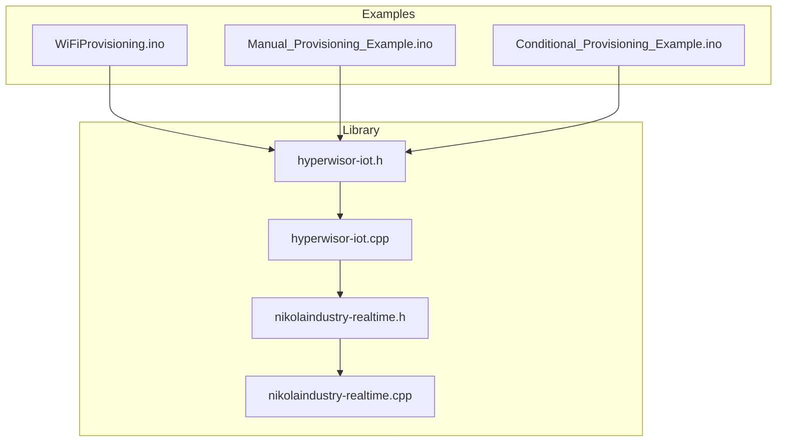
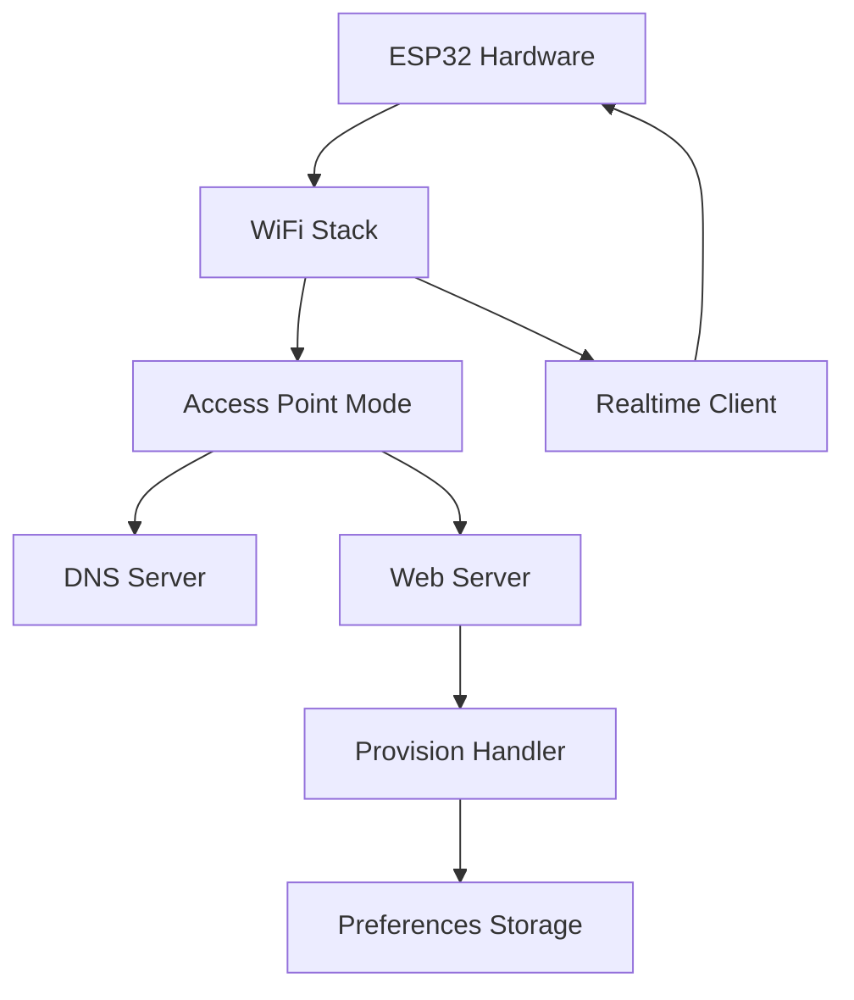
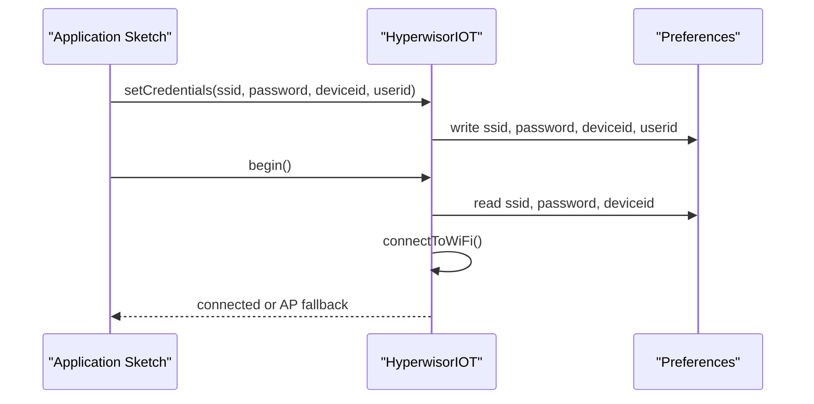
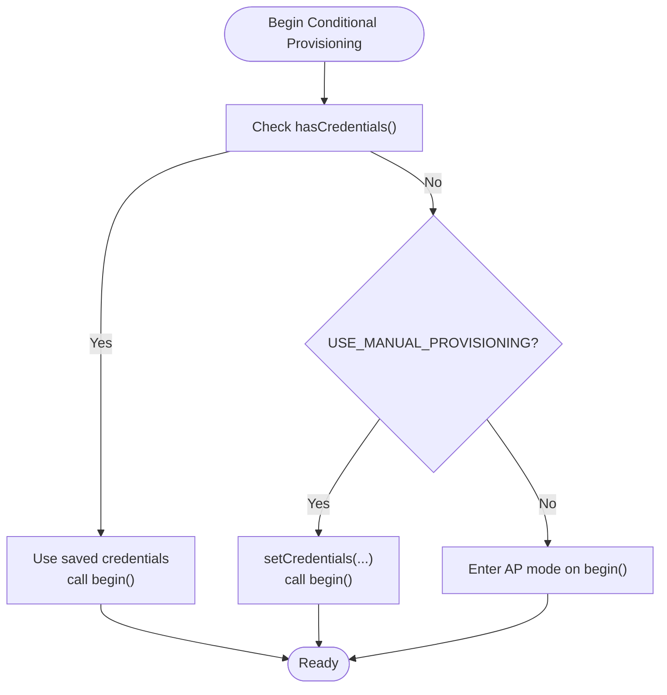
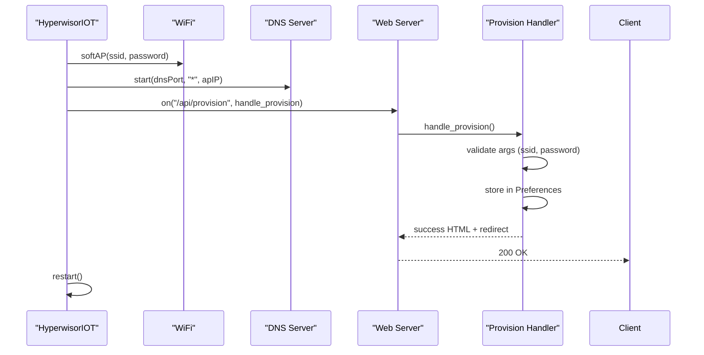
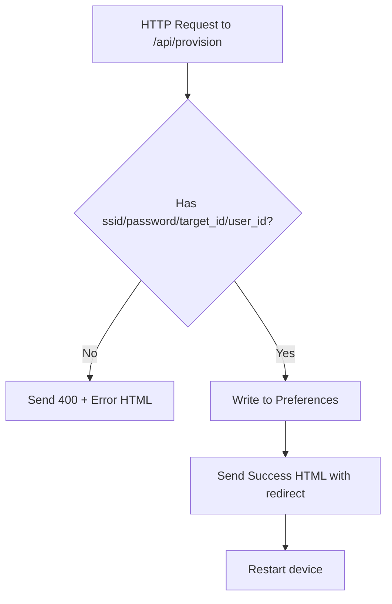
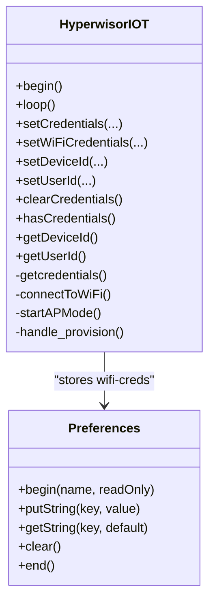
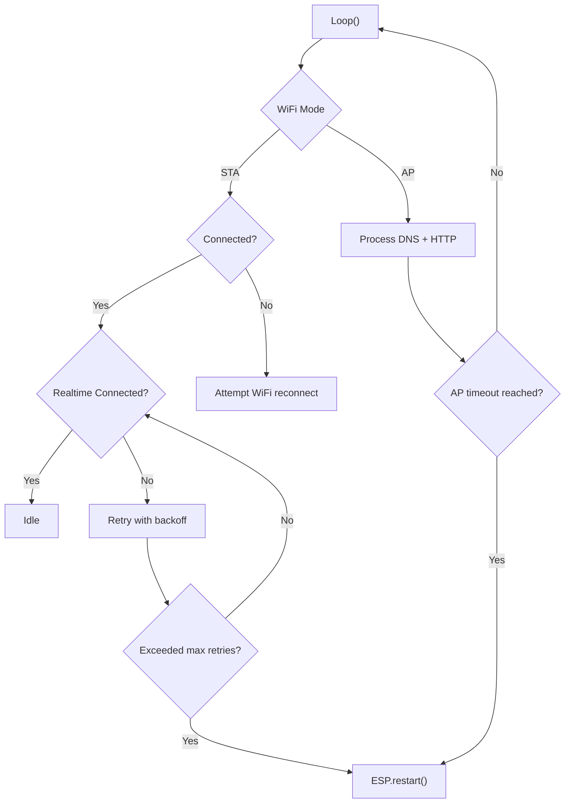
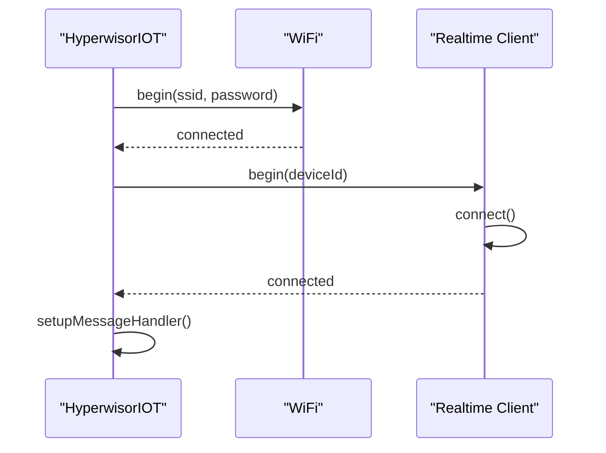
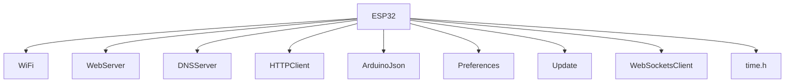

# WiFi Provisioning

<cite>
**Referenced Files in This Document**
- [WiFiProvisioning.ino](file://examples/WiFiProvisioning/WiFiProvisioning.ino)
- [Manual_Provisioning_Example.ino](file://examples/Manual_Provisioning_Example/Manual_Provisioning_Example.ino)
- [Conditional_Provisioning_Example.ino](file://examples/Conditional_Provisioning_Example/Conditional_Provisioning_Example.ino)
- [hyperwisor-iot.h](file://src/hyperwisor-iot.h)
- [hyperwisor-iot.cpp](file://src/hyperwisor-iot.cpp)
- [nikolaindustry-realtime.h](file://src/nikolaindustry-realtime.h)
- [nikolaindustry-realtime.cpp](file://src/nikolaindustry-realtime.cpp)
- [README.md](file://README.md)
</cite>

## Table of Contents
1. [Introduction](#introduction)
2. [Project Structure](#project-structure)
3. [Core Components](#core-components)
4. [Architecture Overview](#architecture-overview)
5. [Detailed Component Analysis](#detailed-component-analysis)
6. [Dependency Analysis](#dependency-analysis)
7. [Performance Considerations](#performance-considerations)
8. [Troubleshooting Guide](#troubleshooting-guide)
9. [Conclusion](#conclusion)
10. [Appendices](#appendices)

## Introduction
This document explains the WiFi provisioning capabilities of the Hyperwisor IoT Arduino library for ESP32. It covers:
- Manual provisioning (pre-configured credentials)
- Conditional provisioning (manual or AP mode fallback)
- Access Point (AP) mode establishment and captive portal behavior
- Captive portal implementation (DNS redirection and web server)
- Form processing for WiFi credentials
- Credential storage and security considerations
- Automatic reconnection logic
- Troubleshooting and recovery procedures
- Mobile app integration and QR-based setup
- Fallback mechanisms for failed provisioning

## Project Structure
The repository provides:
- Example sketches demonstrating provisioning modes
- A core library header and implementation
- A real-time communication module used by the library

**Diagram sources**
- [WiFiProvisioning.ino](file://examples/WiFiProvisioning/WiFiProvisioning.ino#L1-L58)
- [Manual_Provisioning_Example.ino](file://examples/Manual_Provisioning_Example/Manual_Provisioning_Example.ino#L1-L65)
- [Conditional_Provisioning_Example.ino](file://examples/Conditional_Provisioning_Example/Conditional_Provisioning_Example.ino#L1-L69)
- [hyperwisor-iot.h](file://src/hyperwisor-iot.h#L1-L190)
- [hyperwisor-iot.cpp](file://src/hyperwisor-iot.cpp#L1-L120)
- [nikolaindustry-realtime.h](file://src/nikolaindustry-realtime.h#L1-L35)
- [nikolaindustry-realtime.cpp](file://src/nikolaindustry-realtime.cpp#L1-L113)

**Section sources**
- [README.md](file://README.md#L1-L173)
- [WiFiProvisioning.ino](file://examples/WiFiProvisioning/WiFiProvisioning.ino#L1-L58)
- [Manual_Provisioning_Example.ino](file://examples/Manual_Provisioning_Example/Manual_Provisioning_Example.ino#L1-L65)
- [Conditional_Provisioning_Example.ino](file://examples/Conditional_Provisioning_Example/Conditional_Provisioning_Example.ino#L1-L69)

## Core Components
- HyperwisorIOT class orchestrates WiFi provisioning, AP mode, captive portal, and real-time connectivity.
- nikolaindustryrealtime provides WebSocket-based real-time messaging.
- Preferences store WiFi credentials and device identifiers persistently.

Key capabilities:
- Automatic Wi-Fi connection using stored credentials
- AP mode fallback with DNS redirection and HTTP provisioning endpoint
- Manual provisioning via API calls
- Conditional provisioning combining manual and AP mode
- Real-time command handling and OTA update support
- Time synchronization via NTP

**Section sources**
- [hyperwisor-iot.h](file://src/hyperwisor-iot.h#L39-L190)
- [hyperwisor-iot.cpp](file://src/hyperwisor-iot.cpp#L12-L137)
- [nikolaindustry-realtime.h](file://src/nikolaindustry-realtime.h#L10-L35)

## Architecture Overview
The provisioning architecture integrates WiFi connection, AP mode, and real-time communication.

**Diagram sources**
- [hyperwisor-iot.cpp](file://src/hyperwisor-iot.cpp#L141-L156)
- [hyperwisor-iot.cpp](file://src/hyperwisor-iot.cpp#L159-L185)
- [hyperwisor-iot.cpp](file://src/hyperwisor-iot.cpp#L256-L275)
- [nikolaindustry-realtime.cpp](file://src/nikolaindustry-realtime.cpp#L5-L17)

## Detailed Component Analysis

### Manual Provisioning Workflow
Manual provisioning writes credentials directly into Preferences during setup, bypassing AP mode.

**Diagram sources**
- [Manual_Provisioning_Example.ino](file://examples/Manual_Provisioning_Example/Manual_Provisioning_Example.ino#L35-L53)
- [hyperwisor-iot.cpp](file://src/hyperwisor-iot.cpp#L431-L490)
- [hyperwisor-iot.cpp](file://src/hyperwisor-iot.cpp#L278-L310)

**Section sources**
- [Manual_Provisioning_Example.ino](file://examples/Manual_Provisioning_Example/Manual_Provisioning_Example.ino#L1-L65)
- [hyperwisor-iot.cpp](file://src/hyperwisor-iot.cpp#L431-L490)

### Conditional Provisioning Workflow
Conditional provisioning checks for existing credentials and either uses them or sets them manually, falling back to AP mode otherwise.

**Diagram sources**
- [Conditional_Provisioning_Example.ino](file://examples/Conditional_Provisioning_Example/Conditional_Provisioning_Example.ino#L28-L57)
- [hyperwisor-iot.cpp](file://src/hyperwisor-iot.cpp#L13-L28)

**Section sources**
- [Conditional_Provisioning_Example.ino](file://examples/Conditional_Provisioning_Example/Conditional_Provisioning_Example.ino#L1-L69)
- [hyperwisor-iot.cpp](file://src/hyperwisor-iot.cpp#L13-L28)

### AP Mode and Captive Portal Implementation
AP mode starts when no credentials are found. The device acts as an access point, serves a provisioning page, and redirects DNS queries.

**Diagram sources**
- [hyperwisor-iot.cpp](file://src/hyperwisor-iot.cpp#L141-L156)
- [hyperwisor-iot.cpp](file://src/hyperwisor-iot.cpp#L159-L185)
- [hyperwisor-iot.cpp](file://src/hyperwisor-iot.cpp#L188-L253)

**Section sources**
- [hyperwisor-iot.cpp](file://src/hyperwisor-iot.cpp#L141-L156)
- [hyperwisor-iot.cpp](file://src/hyperwisor-iot.cpp#L159-L185)
- [hyperwisor-iot.cpp](file://src/hyperwisor-iot.cpp#L188-L253)

### Form Processing and Redirect Behavior
The provisioning endpoint reads form arguments, validates presence, stores credentials, and responds with success HTML containing a deep link redirect.

**Diagram sources**
- [hyperwisor-iot.cpp](file://src/hyperwisor-iot.cpp#L159-L185)
- [hyperwisor-iot.cpp](file://src/hyperwisor-iot.cpp#L188-L253)

**Section sources**
- [hyperwisor-iot.cpp](file://src/hyperwisor-iot.cpp#L159-L185)
- [hyperwisor-iot.cpp](file://src/hyperwisor-iot.cpp#L188-L253)

### Credential Storage and Security Considerations
Credentials are stored in Preferences under a dedicated namespace. The library exposes helpers to check, set, and clear credentials.

**Diagram sources**
- [hyperwisor-iot.h](file://src/hyperwisor-iot.h#L66-L72)
- [hyperwisor-iot.cpp](file://src/hyperwisor-iot.cpp#L431-L518)
- [hyperwisor-iot.cpp](file://src/hyperwisor-iot.cpp#L256-L275)

Security considerations:
- Credentials are stored in NVS via Preferences; no encryption is implemented in the library.
- Use HTTPS endpoints for backend APIs and secure the device’s AP password.
- Consider rotating AP credentials and limiting AP session duration.

**Section sources**
- [hyperwisor-iot.h](file://src/hyperwisor-iot.h#L66-L72)
- [hyperwisor-iot.cpp](file://src/hyperwisor-iot.cpp#L431-L518)
- [hyperwisor-iot.cpp](file://src/hyperwisor-iot.cpp#L256-L275)

### Automatic Reconnection Logic
The library monitors WiFi and WebSocket connectivity, attempting periodic reconnections and rebooting after a maximum number of retries.

**Diagram sources**
- [hyperwisor-iot.cpp](file://src/hyperwisor-iot.cpp#L46-L137)
- [hyperwisor-iot.cpp](file://src/hyperwisor-iot.cpp#L116-L132)

**Section sources**
- [hyperwisor-iot.cpp](file://src/hyperwisor-iot.cpp#L46-L137)

### Real-Time Communication Integration
After connecting to WiFi, the device establishes a WebSocket connection for real-time messaging and command handling.

**Diagram sources**
- [hyperwisor-iot.cpp](file://src/hyperwisor-iot.cpp#L278-L310)
- [nikolaindustry-realtime.cpp](file://src/nikolaindustry-realtime.cpp#L5-L17)
- [nikolaindustry-realtime.cpp](file://src/nikolaindustry-realtime.cpp#L19-L67)

**Section sources**
- [hyperwisor-iot.cpp](file://src/hyperwisor-iot.cpp#L278-L310)
- [nikolaindustry-realtime.cpp](file://src/nikolaindustry-realtime.cpp#L5-L17)

## Dependency Analysis
External libraries and modules used by the library:

**Diagram sources**
- [hyperwisor-iot.h](file://src/hyperwisor-iot.h#L4-L14)
- [nikolaindustry-realtime.h](file://src/nikolaindustry-realtime.h#L4-L8)

**Section sources**
- [hyperwisor-iot.h](file://src/hyperwisor-iot.h#L4-L14)
- [README.md](file://README.md#L92-L122)

## Performance Considerations
- AP mode idle loop processes DNS and HTTP requests; ensure minimal blocking operations.
- Reconnection backoff prevents excessive CPU usage during transient failures.
- OTA updates require sufficient flash space; verify free partition before update.
- NTP initialization occurs once and reconfigures on timezone change.

[No sources needed since this section provides general guidance]

## Troubleshooting Guide
Common issues and resolutions:
- Device stuck in AP mode for too long
  - Cause: AP session exceeded timeout threshold.
  - Resolution: Verify provisioning form submission and restart behavior.
  - Reference: [hyperwisor-iot.cpp](file://src/hyperwisor-iot.cpp#L127-L131)

- WiFi connection fails during provisioning
  - Cause: Incorrect SSID/password or network unreachable.
  - Resolution: Confirm credentials, ensure AP mode is active, and retry.
  - Reference: [hyperwisor-iot.cpp](file://src/hyperwisor-iot.cpp#L288-L310)

- Provisioning endpoint returns error
  - Cause: Missing required arguments (ssid/password/target_id/user_id).
  - Resolution: Ensure form sends all required fields.
  - Reference: [hyperwisor-iot.cpp](file://src/hyperwisor-iot.cpp#L161-L184)

- Realtime WebSocket disconnects repeatedly
  - Cause: Network instability or server-side disconnection.
  - Resolution: Check network connectivity and device logs; device auto-reconnects with backoff.
  - Reference: [hyperwisor-iot.cpp](file://src/hyperwisor-iot.cpp#L64-L87)

- OTA update fails
  - Cause: Insufficient space or invalid URL.
  - Resolution: Verify free flash space and OTA URL validity.
  - Reference: [hyperwisor-iot.cpp](file://src/hyperwisor-iot.cpp#L1417-L1503)

**Section sources**
- [hyperwisor-iot.cpp](file://src/hyperwisor-iot.cpp#L127-L131)
- [hyperwisor-iot.cpp](file://src/hyperwisor-iot.cpp#L288-L310)
- [hyperwisor-iot.cpp](file://src/hyperwisor-iot.cpp#L161-L184)
- [hyperwisor-iot.cpp](file://src/hyperwisor-iot.cpp#L64-L87)
- [hyperwisor-iot.cpp](file://src/hyperwisor-iot.cpp#L1417-L1503)

## Conclusion
The Hyperwisor IoT library provides a robust, modular approach to WiFi provisioning on ESP32:
- Manual provisioning for pre-deployment scenarios
- Conditional provisioning for flexible deployment
- AP mode with captive portal for user-driven setup
- Secure storage and retrieval of credentials
- Automatic reconnection and OTA update support
- Real-time messaging for device management

Adopt the appropriate provisioning mode for your use case, apply security best practices, and leverage the built-in fallback and recovery mechanisms for reliable operation.

[No sources needed since this section summarizes without analyzing specific files]

## Appendices

### Example Sketches Overview
- WiFiProvisioning.ino: Demonstrates AP mode provisioning and status reporting.
- Manual_Provisioning_Example.ino: Shows manual credential setting and device initialization.
- Conditional_Provisioning_Example.ino: Combines manual and AP provisioning with a compile-time toggle.

**Section sources**
- [WiFiProvisioning.ino](file://examples/WiFiProvisioning/WiFiProvisioning.ino#L1-L58)
- [Manual_Provisioning_Example.ino](file://examples/Manual_Provisioning_Example/Manual_Provisioning_Example.ino#L1-L65)
- [Conditional_Provisioning_Example.ino](file://examples/Conditional_Provisioning_Example/Conditional_Provisioning_Example.ino#L1-L69)