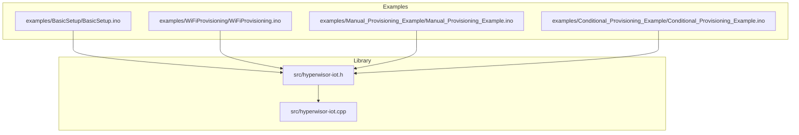
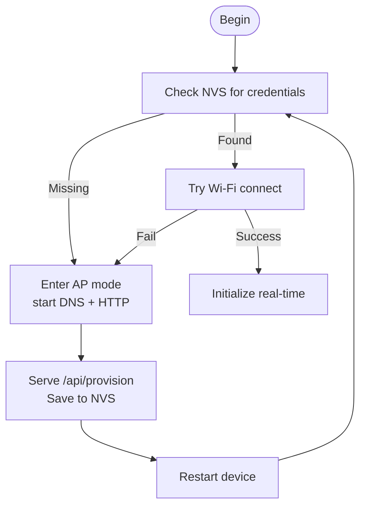
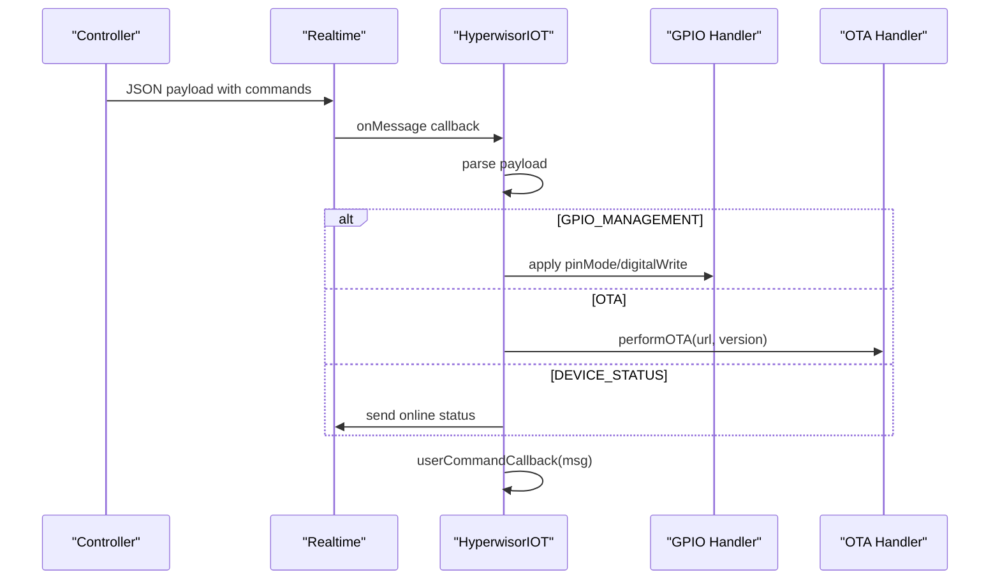
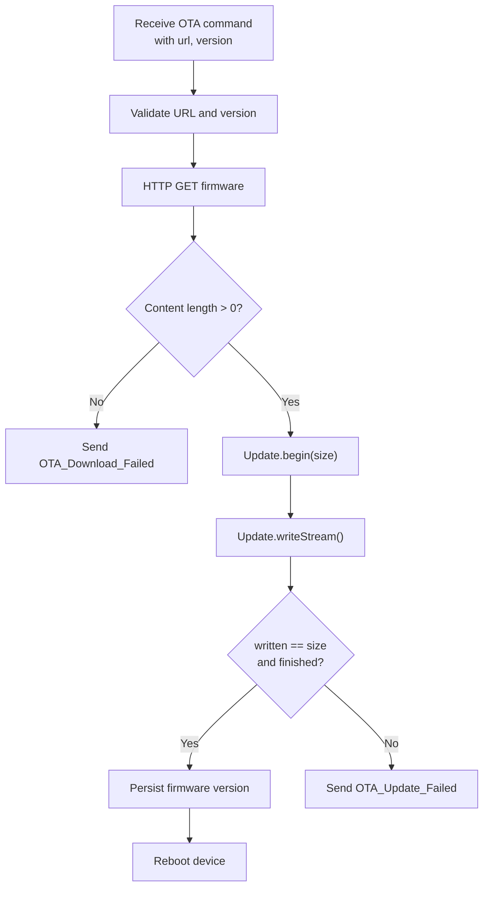
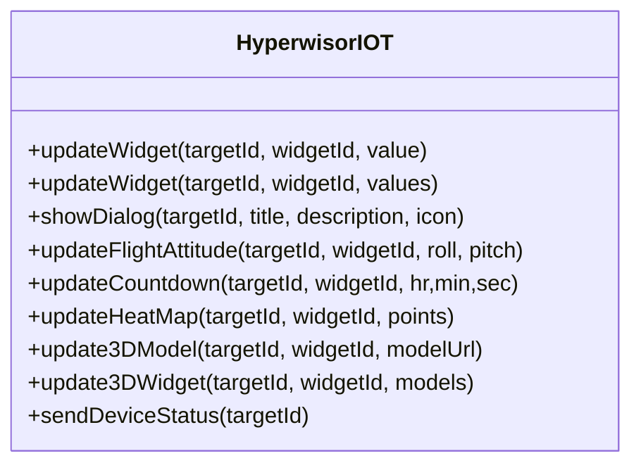
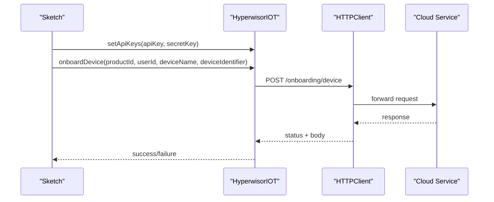
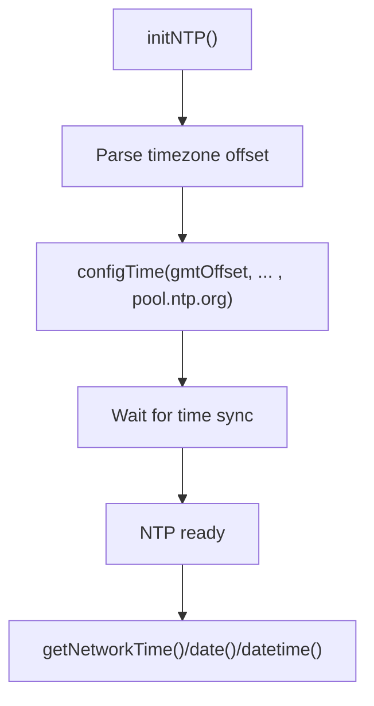
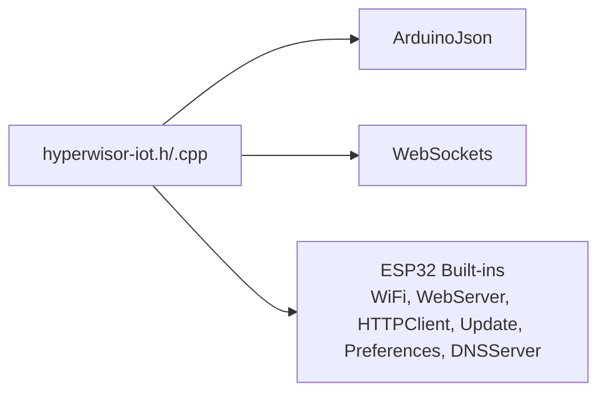

# Configuration and Deployment

<cite>
**Referenced Files in This Document**
- [README.md](file://README.md)
- [library.properties](file://library.properties)
- [src/hyperwisor-iot.h](file://src/hyperwisor-iot.h)
- [src/hyperwisor-iot.cpp](file://src/hyperwisor-iot.cpp)
- [examples/BasicSetup/BasicSetup.ino](file://examples/BasicSetup/BasicSetup.ino)
- [examples/WiFiProvisioning/WiFiProvisioning.ino](file://examples/WiFiProvisioning/WiFiProvisioning.ino)
- [examples/Manual_Provisioning_Example/Manual_Provisioning_Example.ino](file://examples/Manual_Provisioning_Example/Manual_Provisioning_Example.ino)
- [examples/Conditional_Provisioning_Example/Conditional_Provisioning_Example.ino](file://examples/Conditional_Provisioning_Example/Conditional_Provisioning_Example.ino)
</cite>

## Table of Contents
1. [Introduction](#introduction)
2. [Project Structure](#project-structure)
3. [Core Components](#core-components)
4. [Architecture Overview](#architecture-overview)
5. [Detailed Component Analysis](#detailed-component-analysis)
6. [Dependency Analysis](#dependency-analysis)
7. [Performance Considerations](#performance-considerations)
8. [Troubleshooting Guide](#troubleshooting-guide)
9. [Conclusion](#conclusion)
10. [Appendices](#appendices)

## Introduction
This document provides production-ready configuration and deployment strategies for Hyperwisor-IOT, an ESP32-based abstraction layer for IoT devices. It covers device configuration (credential management, network settings, widget configuration), deployment strategies (onboarding, scaling, infrastructure), OTA update procedures (version tracking, rollback, scheduling), monitoring and maintenance workflows (health checks, logs, metrics), security and compliance, troubleshooting, and integration with cloud platforms and dashboards.

## Project Structure
The repository is organized around a core Arduino library with example sketches demonstrating provisioning and usage patterns. The library exposes a high-level interface for Wi-Fi provisioning, real-time communication, OTA updates, GPIO management, and structured JSON command handling.



**Diagram sources**
- [src/hyperwisor-iot.h](file://src/hyperwisor-iot.h#L1-L190)
- [src/hyperwisor-iot.cpp](file://src/hyperwisor-iot.cpp#L1-L1811)
- [examples/BasicSetup/BasicSetup.ino](file://examples/BasicSetup/BasicSetup.ino#L1-L39)
- [examples/WiFiProvisioning/WiFiProvisioning.ino](file://examples/WiFiProvisioning/WiFiProvisioning.ino#L1-L58)
- [examples/Manual_Provisioning_Example/Manual_Provisioning_Example.ino](file://examples/Manual_Provisioning_Example/Manual_Provisioning_Example.ino#L1-L65)
- [examples/Conditional_Provisioning_Example/Conditional_Provisioning_Example.ino](file://examples/Conditional_Provisioning_Example/Conditional_Provisioning_Example.ino#L1-L69)

**Section sources**
- [README.md](file://README.md#L1-L173)
- [library.properties](file://library.properties#L1-L11)

## Core Components
- Device lifecycle: initialization, provisioning, Wi-Fi connection, real-time messaging, and loop maintenance.
- Credential management: stored in non-volatile preferences; supports manual provisioning and AP-mode provisioning.
- Real-time communication: built on a real-time protocol with structured JSON command execution.
- OTA update: firmware update with version tracking and feedback to the controller.
- Widget APIs: dashboard widget updates for numeric, string, arrays, dialogs, flight attitude, countdown, heat map, and 3D model widgets.
- Database and service integrations: onboarding, authentication, SMS, and runtime data operations via HTTPS.
- Time synchronization: NTP-based time/date/datetime retrieval with timezone support.

**Section sources**
- [src/hyperwisor-iot.h](file://src/hyperwisor-iot.h#L39-L187)
- [src/hyperwisor-iot.cpp](file://src/hyperwisor-iot.cpp#L13-L137)
- [README.md](file://README.md#L22-L36)

## Architecture Overview
The library orchestrates Wi-Fi provisioning, AP-mode fallback, real-time messaging, and OTA updates. It persists credentials and device metadata in NVS and communicates with backend services over HTTPS.

```mermaid
graph TB
App["Application Sketch<br/>BasicSetup.ino"]
HW["ESP32 Hardware"]
Lib["HyperwisorIOT Library<br/>hyperwisor-iot.h/.cpp"]
App --> Lib
Lib --> HW
subgraph "Wi-Fi & Provisioning"
NVS["Preferences<br/>NVS"]
WiFi["WiFi STA/AP"]
DNS["DNS Server"]
HTTP["HTTP Server"]
end
subgraph "Real-Time"
RT["Realtime Protocol"]
WS["WebSocket Layer"]
end
subgraph "OTA"
OTA["HTTPClient + Update"]
end
subgraph "Cloud Integrations"
Cloud["HTTPS Services"]
end
Lib --> NVS
Lib --> WiFi
Lib --> DNS
Lib --> HTTP
Lib --> RT
RT --> WS
Lib --> OTA
Lib --> Cloud
```

**Diagram sources**
- [src/hyperwisor-iot.h](file://src/hyperwisor-iot.h#L147-L187)
- [src/hyperwisor-iot.cpp](file://src/hyperwisor-iot.cpp#L13-L137)
- [examples/BasicSetup/BasicSetup.ino](file://examples/BasicSetup/BasicSetup.ino#L19-L38)

## Detailed Component Analysis

### Device Lifecycle and Initialization
- On begin(): loads stored credentials, attempts Wi-Fi connection, falls back to AP mode if missing, initializes NTP, and sets up the real-time message handler.
- Loop(): manages Wi-Fi reconnection, WebSocket reconnection with retry/backoff, and AP-mode watchdog.

```mermaid
sequenceDiagram
participant App as "Sketch"
participant Dev as "HyperwisorIOT"
participant Pref as "Preferences"
participant WiFi as "WiFi"
participant DNS as "DNS Server"
participant HTTP as "HTTP Server"
participant RT as "Realtime"
App->>Dev : begin()
Dev->>Pref : getcredentials()
alt Has credentials
Dev->>WiFi : connectToWiFi()
WiFi-->>Dev : connected?
opt Connected
Dev->>RT : begin(deviceid)
Dev->>Dev : setupMessageHandler()
else Not connected
Dev->>Dev : startAPMode()
Dev->>DNS : start()
Dev->>HTTP : server.on("/api/provision")
HTTP-->>Dev : ready
end
else No credentials
Dev->>Dev : startAPMode()
Dev->>DNS : start()
Dev->>HTTP : server.on("/api/provision")
HTTP-->>Dev : ready
end
note over Dev : loop() maintains connections and AP watchdog
```

**Diagram sources**
- [src/hyperwisor-iot.cpp](file://src/hyperwisor-iot.cpp#L13-L137)
- [src/hyperwisor-iot.cpp](file://src/hyperwisor-iot.cpp#L256-L310)
- [src/hyperwisor-iot.cpp](file://src/hyperwisor-iot.cpp#L141-L156)
- [src/hyperwisor-iot.cpp](file://src/hyperwisor-iot.cpp#L159-L185)

**Section sources**
- [src/hyperwisor-iot.cpp](file://src/hyperwisor-iot.cpp#L13-L137)
- [examples/BasicSetup/BasicSetup.ino](file://examples/BasicSetup/BasicSetup.ino#L21-L33)

### Credential Management and Provisioning
- Stored in NVS under a dedicated namespace.
- Two provisioning modes:
  - AP-mode provisioning via a built-in HTTP server and DNS redirection.
  - Manual provisioning via API calls in the sketch.
- Provisioning endpoints and success/error pages are embedded in the device.



**Diagram sources**
- [src/hyperwisor-iot.cpp](file://src/hyperwisor-iot.cpp#L256-L310)
- [src/hyperwisor-iot.cpp](file://src/hyperwisor-iot.cpp#L141-L156)
- [src/hyperwisor-iot.cpp](file://src/hyperwisor-iot.cpp#L159-L185)

**Section sources**
- [src/hyperwisor-iot.cpp](file://src/hyperwisor-iot.cpp#L159-L185)
- [examples/WiFiProvisioning/WiFiProvisioning.ino](file://examples/WiFiProvisioning/WiFiProvisioning.ino#L28-L52)
- [examples/Manual_Provisioning_Example/Manual_Provisioning_Example.ino](file://examples/Manual_Provisioning_Example/Manual_Provisioning_Example.ino#L35-L50)
- [examples/Conditional_Provisioning_Example/Conditional_Provisioning_Example.ino](file://examples/Conditional_Provisioning_Example/Conditional_Provisioning_Example.ino#L28-L51)

### Real-Time Messaging and Command Handling
- Incoming JSON commands are parsed and routed to built-in handlers (GPIO, OTA, DEVICE_STATUS) and optionally to a user-defined callback.
- Supports structured payloads with commands/actions/params.



**Diagram sources**
- [src/hyperwisor-iot.cpp](file://src/hyperwisor-iot.cpp#L313-L404)
- [src/hyperwisor-iot.cpp](file://src/hyperwisor-iot.cpp#L328-L390)

**Section sources**
- [src/hyperwisor-iot.cpp](file://src/hyperwisor-iot.cpp#L313-L404)
- [README.md](file://README.md#L51-L76)

### OTA Update Procedures
- Triggers OTA via a command with URL and version.
- Downloads firmware over HTTPS, validates content length, writes via Update, persists version, and reboots.
- Provides feedback to the controller during progress and failure.



**Diagram sources**
- [src/hyperwisor-iot.cpp](file://src/hyperwisor-iot.cpp#L364-L390)
- [src/hyperwisor-iot.cpp](file://src/hyperwisor-iot.cpp#L1417-L1503)

**Section sources**
- [src/hyperwisor-iot.cpp](file://src/hyperwisor-iot.cpp#L1417-L1503)
- [src/hyperwisor-iot.cpp](file://src/hyperwisor-iot.cpp#L364-L390)

### Widget Configuration and Dashboard Integration
- Widget APIs support numeric, string, and array values, plus specialized widgets (flight attitude, countdown, heat map, 3D model).
- Dialogs and status reporting are available for user feedback.
- These APIs send structured JSON payloads to the controller for rendering.



**Diagram sources**
- [src/hyperwisor-iot.h](file://src/hyperwisor-iot.h#L78-L107)

**Section sources**
- [src/hyperwisor-iot.h](file://src/hyperwisor-iot.h#L78-L107)

### Database and Service Integrations
- Onboarding, authentication, SMS, and runtime data operations are exposed via HTTPS endpoints.
- Requires API keys and a valid Wi-Fi connection.
- Responses are logged and optionally parsed into JSON documents.



**Diagram sources**
- [src/hyperwisor-iot.cpp](file://src/hyperwisor-iot.cpp#L1154-L1200)
- [src/hyperwisor-iot.cpp](file://src/hyperwisor-iot.cpp#L1506-L1549)

**Section sources**
- [src/hyperwisor-iot.cpp](file://src/hyperwisor-iot.cpp#L724-L778)
- [src/hyperwisor-iot.cpp](file://src/hyperwisor-iot.cpp#L849-L888)
- [src/hyperwisor-iot.cpp](file://src/hyperwisor-iot.cpp#L1154-L1200)
- [src/hyperwisor-iot.cpp](file://src/hyperwisor-iot.cpp#L1269-L1314)
- [src/hyperwisor-iot.cpp](file://src/hyperwisor-iot.cpp#L1506-L1549)

### Time and Date Functions
- NTP initialization with timezone parsing and periodic synchronization.
- Provides formatted time, date, and datetime strings.



**Diagram sources**
- [src/hyperwisor-iot.cpp](file://src/hyperwisor-iot.cpp#L1617-L1654)
- [src/hyperwisor-iot.cpp](file://src/hyperwisor-iot.cpp#L1667-L1779)

**Section sources**
- [src/hyperwisor-iot.cpp](file://src/hyperwisor-iot.cpp#L1617-L1779)

## Dependency Analysis
- ArduinoJson and WebSockets are required dependencies.
- Built-in ESP32 components are used for networking, storage, and update.
- The library targets ESP32 architecture.



**Diagram sources**
- [library.properties](file://library.properties#L10-L11)
- [README.md](file://README.md#L92-L122)

**Section sources**
- [library.properties](file://library.properties#L10-L11)
- [README.md](file://README.md#L92-L122)

## Performance Considerations
- Wi-Fi and WebSocket reconnection logic includes retry attempts and backoff to minimize downtime.
- AP-mode watchdog prevents indefinite AP sessions.
- OTA write operations are streamed and validated; ensure adequate flash space and stable power supply.
- NTP synchronization is attempted only when needed and reinitialized when timezone changes.

[No sources needed since this section provides general guidance]

## Troubleshooting Guide
Common issues and resolutions:
- Wi-Fi connection failures:
  - Verify credentials were saved and device restarted after provisioning.
  - Confirm AP-mode provisioning was completed successfully.
- AP-mode stuck:
  - Device reboots after a timeout to prevent indefinite AP sessions.
- OTA failures:
  - Check URL validity, content length, and available flash space.
  - Inspect error feedback sent to the controller.
- Real-time disconnects:
  - Review retry attempts and backoff behavior; ensure network stability.
- Time synchronization:
  - Confirm Wi-Fi connectivity and NTP server reachability; timezone parsing is basic and may require manual adjustments.

**Section sources**
- [src/hyperwisor-iot.cpp](file://src/hyperwisor-iot.cpp#L46-L137)
- [src/hyperwisor-iot.cpp](file://src/hyperwisor-iot.cpp#L127-L132)
- [src/hyperwisor-iot.cpp](file://src/hyperwisor-iot.cpp#L1417-L1503)
- [src/hyperwisor-iot.cpp](file://src/hyperwisor-iot.cpp#L1617-L1654)

## Conclusion
Hyperwisor-IOT provides a production-ready foundation for ESP32-based IoT devices with robust provisioning, real-time communication, OTA updates, and dashboard integrations. By following the configuration and deployment strategies outlined here—especially around secure credential management, resilient networking, scheduled OTA updates, and operational monitoring—you can achieve reliable, scalable IoT deployments.

[No sources needed since this section summarizes without analyzing specific files]

## Appendices

### Production Configuration Checklist
- Secure credential storage:
  - Use AP-mode provisioning for first-time setup; validate success before deployment.
  - Store API keys securely and rotate periodically.
- Network hardening:
  - Prefer WPA2/WPA3; disable unnecessary AP sessions.
  - Implement firewall and VLAN segmentation at the network level.
- OTA policy:
  - Version tracking and rollback: persist firmware version post-update; schedule updates during maintenance windows.
  - Validate firmware integrity and ensure sufficient flash space.
- Monitoring and logging:
  - Collect device status, Wi-Fi RSSI, OTA progress, and NTP sync status.
  - Aggregate logs and alert on repeated failures.
- Security and compliance:
  - Enforce HTTPS-only communications; validate certificates in production.
  - Comply with applicable regulations (e.g., data protection, device safety).
- Scaling and infrastructure:
  - Use managed cloud services for real-time messaging and storage.
  - Implement device onboarding and identity management at scale.
- Integration:
  - Connect to cloud platforms and dashboards via HTTPS endpoints.
  - Extend with user-defined command handlers for custom device logic.

[No sources needed since this section provides general guidance]