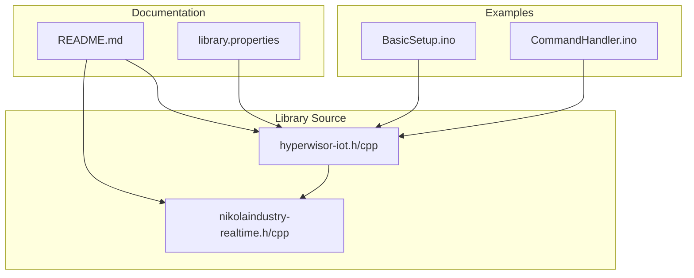
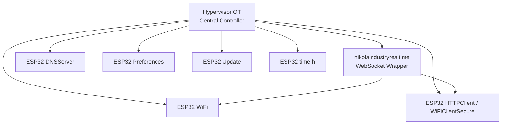
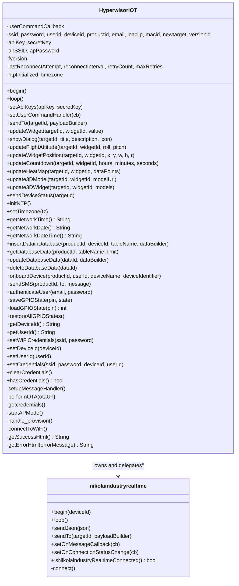
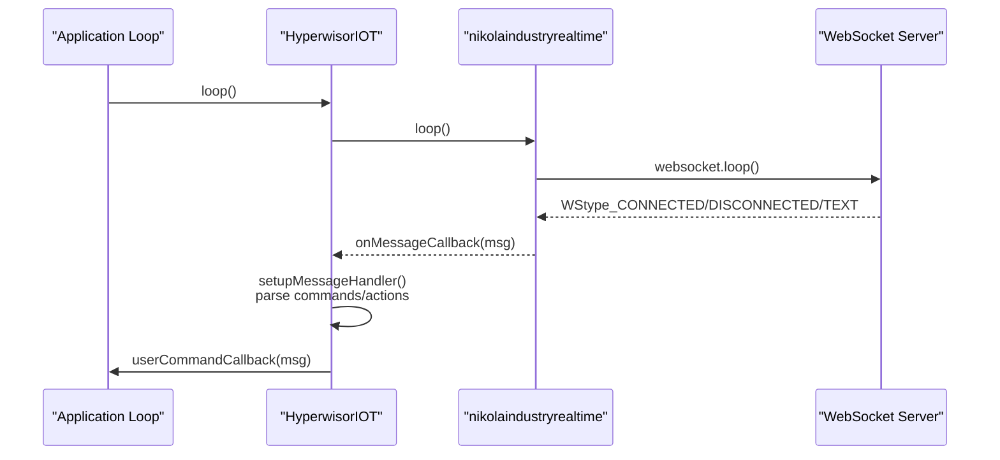
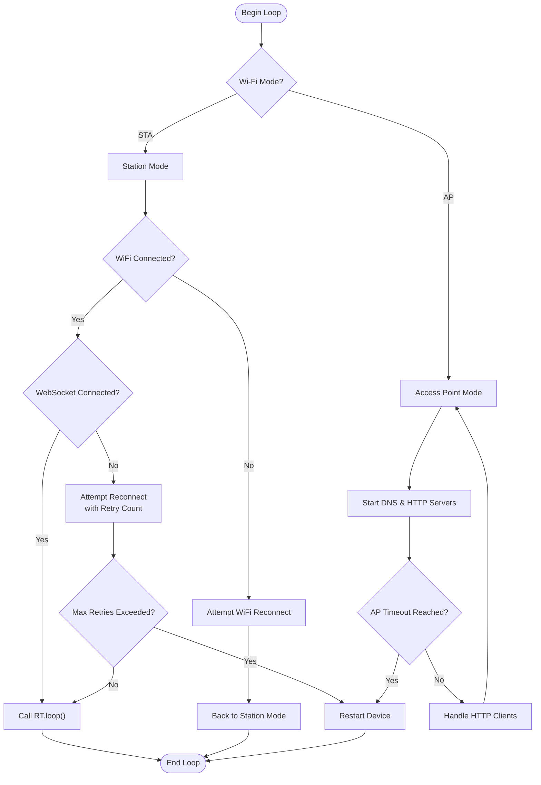
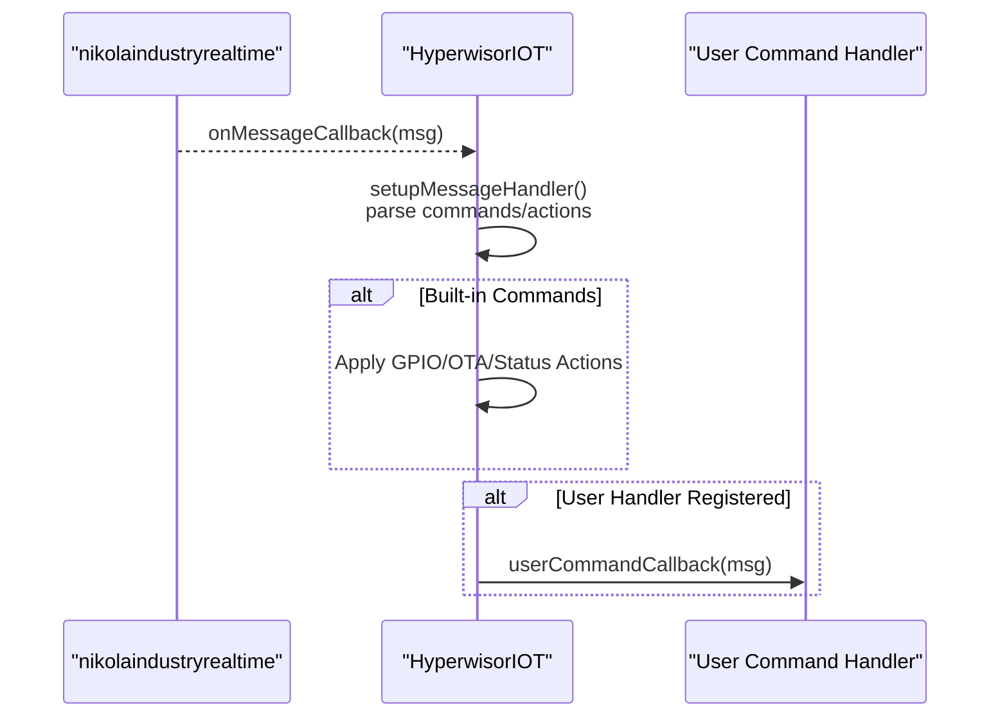
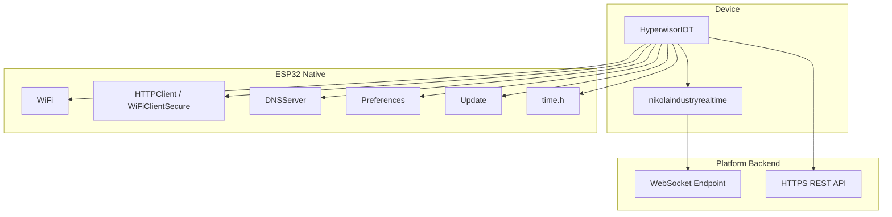
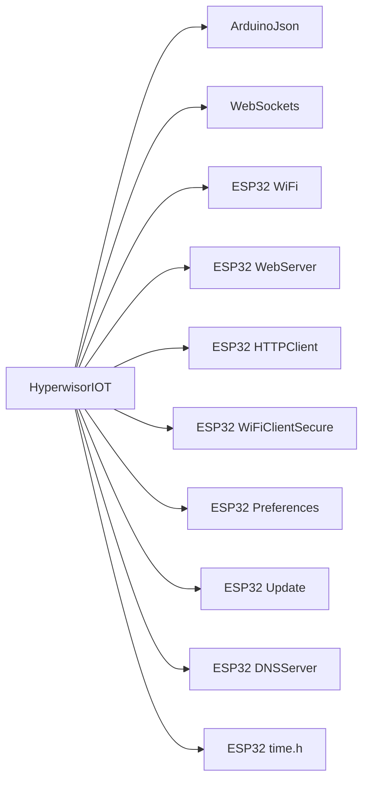

# Architecture Overview

<cite>
**Referenced Files in This Document**
- [hyperwisor-iot.h](file://src/hyperwisor-iot.h)
- [hyperwisor-iot.cpp](file://src/hyperwisor-iot.cpp)
- [nikolaindustry-realtime.h](file://src/nikolaindustry-realtime.h)
- [nikolaindustry-realtime.cpp](file://src/nikolaindustry-realtime.cpp)
- [README.md](file://README.md)
- [BasicSetup.ino](file://examples/BasicSetup/BasicSetup.ino)
- [CommandHandler.ino](file://examples/CommandHandler/CommandHandler.ino)
- [library.properties](file://library.properties)
</cite>

## Table of Contents
1. [Introduction](#introduction)
2. [Project Structure](#project-structure)
3. [Core Components](#core-components)
4. [Architecture Overview](#architecture-overview)
5. [Detailed Component Analysis](#detailed-component-analysis)
6. [Dependency Analysis](#dependency-analysis)
7. [Performance Considerations](#performance-considerations)
8. [Troubleshooting Guide](#troubleshooting-guide)
9. [Conclusion](#conclusion)

## Introduction
This document presents the architecture overview of Hyperwisor-IOT, focusing on the high-level system design, component relationships, and integration patterns. The library provides a comprehensive abstraction layer for ESP32-based IoT devices, handling Wi-Fi provisioning, real-time communication via the nikolaindustry-realtime protocol, OTA updates, GPIO management, and structured JSON command execution. The central controller is the HyperwisorIOT class, which orchestrates subsystems through a continuous background loop and integrates with ESP32-native libraries for networking, storage, and real-time messaging.

## Project Structure
The repository follows a modular layout:
- Core library source files: HyperwisorIOT class definition and implementation, plus the nikolaindustry-realtime communication wrapper.
- Examples demonstrating basic setup and custom command handling.
- Documentation and metadata for installation and dependencies.

**Diagram sources**
- [hyperwisor-iot.h](file://src/hyperwisor-iot.h#L1-L190)
- [hyperwisor-iot.cpp](file://src/hyperwisor-iot.cpp#L1-L1811)
- [nikolaindustry-realtime.h](file://src/nikolaindustry-realtime.h#L1-L35)
- [nikolaindustry-realtime.cpp](file://src/nikolaindustry-realtime.cpp#L1-L113)
- [README.md](file://README.md#L1-L173)
- [BasicSetup.ino](file://examples/BasicSetup/BasicSetup.ino#L1-L39)
- [CommandHandler.ino](file://examples/CommandHandler/CommandHandler.ino#L1-L96)
- [library.properties](file://library.properties#L1-L11)

**Section sources**
- [README.md](file://README.md#L1-L173)
- [library.properties](file://library.properties#L1-L11)

## Core Components
- HyperwisorIOT: Central controller managing Wi-Fi provisioning, real-time communication, OTA updates, GPIO persistence, database operations, and time synchronization. It exposes a continuous loop() method and a begin() initializer.
- nikolaindustryrealtime: Lightweight wrapper around ESP32 WebSocket client for real-time bidirectional messaging with the platform backend.
- ESP32 Native Libraries: Integrated via Arduino framework for networking (WiFi, WebServer, HTTPClient), secure HTTP (WiFiClientSecure), DNS redirection (DNSServer), preferences storage, and update handling.

Key responsibilities:
- Wi-Fi provisioning and AP fallback with embedded HTTP server and DNS redirection.
- Real-time message routing and callback dispatch.
- Structured JSON command parsing and user-defined command handler extension.
- OTA firmware update with progress reporting and version tracking.
- GPIO state persistence and restoration.
- Database operations (insert, get, update, delete) and authentication via HTTPS.
- Network time synchronization using NTP with timezone support.

**Section sources**
- [hyperwisor-iot.h](file://src/hyperwisor-iot.h#L39-L187)
- [hyperwisor-iot.cpp](file://src/hyperwisor-iot.cpp#L13-L137)
- [nikolaindustry-realtime.h](file://src/nikolaindustry-realtime.h#L10-L32)
- [nikolaindustry-realtime.cpp](file://src/nikolaindustry-realtime.cpp#L5-L113)

## Architecture Overview
The system employs a central controller pattern with a background loop coordinating multiple subsystems:
- Initialization phase: begin() loads credentials, connects to Wi-Fi, starts AP mode if needed, initializes NTP, and registers message handlers.
- Background loop: loop() manages Wi-Fi reconnection, WebSocket connectivity, AP mode timeouts, and delegates real-time message processing to the communication layer.
- Communication layer: nikolaindustryrealtime encapsulates WebSocket lifecycle, heartbeat monitoring, and JSON serialization/deserialization.
- Integration with ESP32 native libraries: Wi-Fi, HTTP(S), DNS, Preferences, Update, and time functions.

**Diagram sources**
- [hyperwisor-iot.h](file://src/hyperwisor-iot.h#L147-L187)
- [hyperwisor-iot.cpp](file://src/hyperwisor-iot.cpp#L13-L137)
- [nikolaindustry-realtime.h](file://src/nikolaindustry-realtime.h#L10-L32)
- [nikolaindustry-realtime.cpp](file://src/nikolaindustry-realtime.cpp#L5-L113)

## Detailed Component Analysis

### HyperwisorIOT Class
The HyperwisorIOT class serves as the central orchestrator. It maintains:
- Real-time communication instance (nikolaindustryrealtime).
- Embedded HTTP server and DNS server for AP provisioning.
- User-defined command callback for custom logic.
- Credentials and configuration state.
- Retry logic for Wi-Fi and WebSocket reconnection.
- NTP initialization and timezone management.

Background loop coordination:
- Wi-Fi station mode: monitors connection status, triggers WebSocket reconnection attempts, and resets retry counters upon success.
- Access Point mode: runs DNS and HTTP server, enforces a timeout to prevent indefinite AP operation, and restarts the device if exceeded.
- Delegates real-time loop to the communication layer.

**Diagram sources**
- [hyperwisor-iot.h](file://src/hyperwisor-iot.h#L39-L187)
- [nikolaindustry-realtime.h](file://src/nikolaindustry-realtime.h#L10-L32)

**Section sources**
- [hyperwisor-iot.h](file://src/hyperwisor-iot.h#L39-L187)
- [hyperwisor-iot.cpp](file://src/hyperwisor-iot.cpp#L13-L137)

### nikolaindustry-realtime Communication Layer
The nikolaindustryrealtime class encapsulates WebSocket connectivity:
- Establishes SSL connection to the platform endpoint with device identification.
- Manages connection events (CONNECTED, DISCONNECTED, TEXT, PING, PONG, ERROR).
- Provides callbacks for incoming messages and connection status changes.
- Implements heartbeat monitoring to detect stale connections.
- Offers convenience methods to send JSON payloads and targeted messages.

**Diagram sources**
- [hyperwisor-iot.cpp](file://src/hyperwisor-iot.cpp#L46-L137)
- [nikolaindustry-realtime.cpp](file://src/nikolaindustry-realtime.cpp#L69-L113)

**Section sources**
- [nikolaindustry-realtime.h](file://src/nikolaindustry-realtime.h#L10-L32)
- [nikolaindustry-realtime.cpp](file://src/nikolaindustry-realtime.cpp#L5-L113)

### Background Loop Architecture and Subsystem Coordination
The background loop coordinates subsystems through a deterministic flow:
- Wi-Fi station mode:
  - Detects disconnections and attempts reconnection at intervals.
  - Re-establishes WebSocket connection and registers message handlers upon success.
  - Resets retry counters on successful connection.
- Access Point mode:
  - Starts DNS and HTTP servers for provisioning.
  - Enforces a timeout to prevent indefinite AP operation.
  - Restarts the device after the timeout.
- Real-time loop delegation:
  - Continuously calls the communication layer’s loop to process WebSocket events.

**Diagram sources**
- [hyperwisor-iot.cpp](file://src/hyperwisor-iot.cpp#L46-L137)

**Section sources**
- [hyperwisor-iot.cpp](file://src/hyperwisor-iot.cpp#L46-L137)

### Factory Pattern for Device Initialization
While not a traditional factory, the library provides a fluent initialization approach:
- begin(): Orchestrates credential loading, Wi-Fi connection, AP mode fallback, and NTP initialization.
- setUserCommandHandler(): Allows registration of a user-defined callback for custom command processing.
- setApiKeys(): Configures credentials for database and service operations.
- setCredentials()/setWiFiCredentials()/setDeviceId()/setUserId(): Manual provisioning helpers.

Integration pattern:
- Application code constructs a HyperwisorIOT instance, calls begin() once, and then continuously invokes loop().
- Optional: register a user command handler to extend functionality beyond built-in commands.

**Section sources**
- [hyperwisor-iot.h](file://src/hyperwisor-iot.h#L47-L72)
- [hyperwisor-iot.cpp](file://src/hyperwisor-iot.cpp#L13-L28)
- [BasicSetup.ino](file://examples/BasicSetup/BasicSetup.ino#L21-L38)

### Observer Pattern for Callback-Based Message Handling
The library implements an observer-like pattern for message handling:
- nikolaindustryrealtime exposes setOnMessageCallback() and setOnConnectionStatusChange() to register observers.
- HyperwisorIOT registers a message handler via setupMessageHandler() that parses incoming JSON payloads, routes built-in commands (e.g., GPIO_MANAGEMENT, OTA, DEVICE_STATUS), and forwards the entire message to the user’s callback if provided.
- User-defined command handler receives the raw JsonObject for custom logic.

**Diagram sources**
- [nikolaindustry-realtime.h](file://src/nikolaindustry-realtime.h#L19-L21)
- [nikolaindustry-realtime.cpp](file://src/nikolaindustry-realtime.cpp#L25-L59)
- [hyperwisor-iot.cpp](file://src/hyperwisor-iot.cpp#L313-L404)

**Section sources**
- [nikolaindustry-realtime.h](file://src/nikolaindustry-realtime.h#L19-L21)
- [hyperwisor-iot.cpp](file://src/hyperwisor-iot.cpp#L313-L404)
- [CommandHandler.ino](file://examples/CommandHandler/CommandHandler.ino#L26-L85)

### Singleton Pattern for Global Communication Access
The library does not expose a global singleton accessor. Instead:
- The HyperwisorIOT instance acts as the primary controller and is instantiated by the application.
- The nikolaindustryrealtime instance is owned by HyperwisorIOT and used internally for WebSocket operations.
- Applications maintain a single HyperwisorIOT instance and pass it around as needed.

Implications:
- No global static accessors are exposed.
- Communication APIs are accessed through the HyperwisorIOT instance methods.

**Section sources**
- [hyperwisor-iot.h](file://src/hyperwisor-iot.h#L147-L149)
- [hyperwisor-iot.cpp](file://src/hyperwisor-iot.cpp#L521-L532)

### System Boundaries and Data Flow Architecture
- Internal boundaries:
  - HyperwisorIOT encapsulates Wi-Fi, HTTP, DNS, Preferences, Update, and time management.
  - nikolaindustry-realtime encapsulates WebSocket lifecycle and JSON transport.
- External boundaries:
  - Platform backend via SSL WebSocket endpoint and HTTPS REST endpoints for database, onboarding, SMS, and authentication.
- Data flow:
  - Incoming: WebSocket TEXT frames are deserialized into JsonObject and routed to handlers.
  - Outgoing: Application builds payloads via sendTo() and sendJson(), then transmitted over WebSocket.
  - Provisioning: AP mode HTTP server accepts credentials and restarts the device to apply them.

**Diagram sources**
- [hyperwisor-iot.h](file://src/hyperwisor-iot.h#L147-L187)
- [nikolaindustry-realtime.cpp](file://src/nikolaindustry-realtime.cpp#L5-L113)
- [README.md](file://README.md#L92-L122)

**Section sources**
- [README.md](file://README.md#L92-L122)

## Dependency Analysis
External dependencies and integration points:
- ArduinoJson: JSON serialization/deserialization for payloads and HTTP bodies.
- WebSockets: WebSocket client for real-time communication.
- ESP32-native libraries: WiFi, WebServer, HTTPClient, WiFiClientSecure, Preferences, Update, DNSServer, time.h.

**Diagram sources**
- [library.properties](file://library.properties#L10-L10)
- [hyperwisor-iot.h](file://src/hyperwisor-iot.h#L4-L14)
- [README.md](file://README.md#L92-L122)

**Section sources**
- [library.properties](file://library.properties#L10-L10)
- [README.md](file://README.md#L92-L122)

## Performance Considerations
- Heartbeat and reconnection: The WebSocket layer enables heartbeat detection to identify stale connections and trigger reconnection attempts, reducing downtime.
- Retry logic: Controlled reconnection attempts with exponential backoff-like behavior prevent excessive CPU usage.
- JSON size management: Payload builders allow controlled document sizes to balance capability and memory usage.
- OTA streaming: Streaming firmware updates minimize memory footprint during downloads.
- NTP initialization: Lazy initialization with timezone-aware configuration avoids unnecessary overhead.

[No sources needed since this section provides general guidance]

## Troubleshooting Guide
Common issues and diagnostics:
- Wi-Fi connection failures:
  - Verify credentials stored in Preferences and AP provisioning page.
  - Monitor serial logs for connection attempts and timeouts.
- WebSocket disconnections:
  - Check heartbeat logs and reconnection attempts.
  - Ensure device remains reachable on the network.
- AP mode stuck:
  - AP mode enforces a timeout to prevent indefinite operation; device restarts after the timeout.
- OTA failures:
  - Inspect HTTP GET responses and Update errors; ensure sufficient flash space and valid firmware URL.
- Time synchronization:
  - Confirm NTP initialization and timezone configuration; retry if immediate sync fails.

**Section sources**
- [hyperwisor-iot.cpp](file://src/hyperwisor-iot.cpp#L46-L137)
- [nikolaindustry-realtime.cpp](file://src/nikolaindustry-realtime.cpp#L69-L113)
- [hyperwisor-iot.cpp](file://src/hyperwisor-iot.cpp#L1417-L1503)

## Conclusion
Hyperwisor-IOT provides a cohesive architecture centered on the HyperwisorIOT class, which coordinates Wi-Fi provisioning, real-time communication, OTA updates, GPIO persistence, and time synchronization. The nikolaindustry-realtime communication layer encapsulates WebSocket lifecycle and JSON transport, while ESP32-native libraries deliver robust networking, storage, and update capabilities. The system’s background loop architecture ensures resilient operation across diverse network conditions, and the observer pattern enables flexible, extensible command handling through user-defined callbacks.