# Background Loop Architecture

<cite>
**Referenced Files in This Document**
- [hyperwisor-iot.h](file://src/hyperwisor-iot.h)
- [hyperwisor-iot.cpp](file://src/hyperwisor-iot.cpp)
- [nikolaindustry-realtime.h](file://src/nikolaindustry-realtime.h)
- [nikolaindustry-realtime.cpp](file://src/nikolaindustry-realtime.cpp)
- [README.md](file://README.md)
- [library.properties](file://library.properties)
- [BasicSetup.ino](file://examples/BasicSetup/BasicSetup.ino)
- [CommandHandler.ino](file://examples/CommandHandler/CommandHandler.ino)
</cite>

## Table of Contents
1. [Introduction](#introduction)
2. [Project Structure](#project-structure)
3. [Core Components](#core-components)
4. [Architecture Overview](#architecture-overview)
5. [Detailed Component Analysis](#detailed-component-analysis)
6. [Dependency Analysis](#dependency-analysis)
7. [Performance Considerations](#performance-considerations)
8. [Troubleshooting Guide](#troubleshooting-guide)
9. [Conclusion](#conclusion)
10. [Appendices](#appendices)

## Introduction
This document explains the background loop architecture of the Hyperwisor-IOT Arduino library for ESP32. It focuses on the main loop() implementation, timing considerations, and task scheduling within the ESP32 environment. It documents how WiFi management, real-time communication, GPIO handling, and OTA updates are coordinated through the background loop, including retry logic, connection monitoring, and automatic reconnection mechanisms. It also clarifies the event-driven versus polling approach used throughout the library, and provides guidance on extending the loop functionality and adding custom periodic tasks without disrupting existing operations.

## Project Structure
The library is organized around a central class that orchestrates subsystems:
- A public interface class manages WiFi provisioning, real-time communication, OTA, GPIO persistence, and user command callbacks.
- A companion real-time client encapsulates WebSocket connectivity and heartbeat monitoring.
- Example sketches demonstrate usage patterns and show how to integrate custom periodic tasks safely.

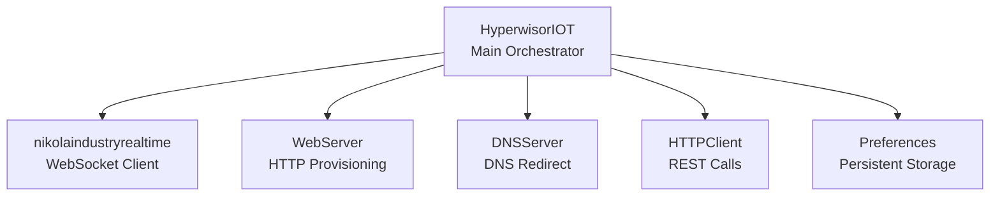

**Diagram sources**
- [hyperwisor-iot.h](file://src/hyperwisor-iot.h#L147-L187)
- [nikolaindustry-realtime.h](file://src/nikolaindustry-realtime.h#L10-L32)

**Section sources**
- [README.md](file://README.md#L1-L173)
- [library.properties](file://library.properties#L1-L11)

## Core Components
- HyperwisorIOT: Provides begin(), loop(), WiFi provisioning, real-time messaging, OTA, GPIO state persistence, and user command handler registration.
- nikolaindustryrealtime: Manages WebSocket connection lifecycle, heartbeat detection, and message dispatch.
- WebServer and DNSServer: Serve provisioning pages and DNS redirection when in AP mode.
- HTTPClient: Performs REST operations for database and authentication APIs.
- Preferences: Stores WiFi credentials, device identifiers, and GPIO states persistently.

Key loop-related elements:
- A polling-based loop() that checks WiFi mode, connection status, and schedules retries.
- Real-time loop() delegation to the WebSocket client.
- AP-mode HTTP/DNS handling when in access point mode.
- Retry logic with exponential-like backoff and maximum attempts.

**Section sources**
- [hyperwisor-iot.h](file://src/hyperwisor-iot.h#L39-L187)
- [nikolaindustry-realtime.h](file://src/nikolaindustry-realtime.h#L10-L32)
- [hyperwisor-iot.cpp](file://src/hyperwisor-iot.cpp#L46-L137)

## Architecture Overview
The background loop coordinates multiple subsystems in a single-threaded, cooperative multitasking manner:
- In STA mode, it monitors WiFi connectivity and real-time connection health, attempting reconnections with bounded retries.
- In AP mode, it serves provisioning endpoints and enforces a time limit to prevent indefinite AP sessions.
- It delegates real-time message handling to the WebSocket client, which uses an event-driven model internally.

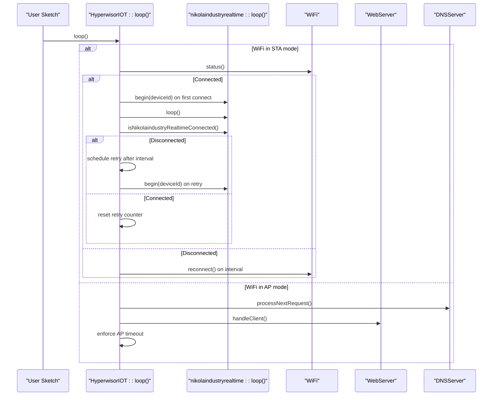

**Diagram sources**
- [hyperwisor-iot.cpp](file://src/hyperwisor-iot.cpp#L46-L137)
- [nikolaindustry-realtime.cpp](file://src/nikolaindustry-realtime.cpp#L69-L75)

**Section sources**
- [hyperwisor-iot.cpp](file://src/hyperwisor-iot.cpp#L46-L137)
- [nikolaindustry-realtime.cpp](file://src/nikolaindustry-realtime.cpp#L69-L75)

## Detailed Component Analysis

### Main Loop Implementation
The main loop() performs:
- WiFi mode detection and branch logic.
- Connection monitoring and reconnection scheduling with a fixed interval and bounded retries.
- Real-time loop delegation when connected.
- AP-mode provisioning handling and enforced session timeout.

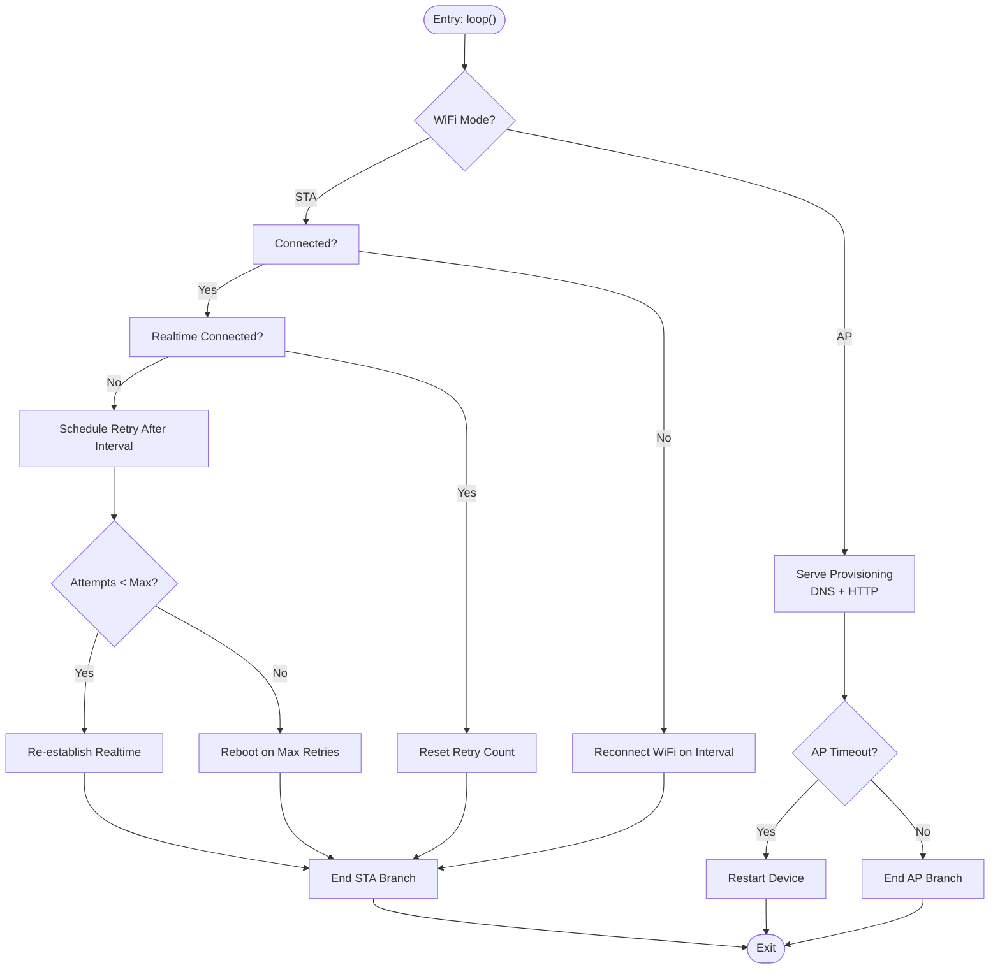

**Diagram sources**
- [hyperwisor-iot.cpp](file://src/hyperwisor-iot.cpp#L46-L137)

**Section sources**
- [hyperwisor-iot.cpp](file://src/hyperwisor-iot.cpp#L46-L137)

### Timing Considerations and Retry Logic
- Fixed intervals and counters govern reconnection attempts:
  - Reconnect interval for WiFi and real-time attempts.
  - Retry count bounded by a maximum number of attempts.
  - AP mode enforced timeout to prevent stuck sessions.
- Heartbeat and automatic reconnection are handled by the WebSocket client:
  - Periodic ping/pong with configurable timeouts.
  - Automatic reconnection attempts with a fixed interval.

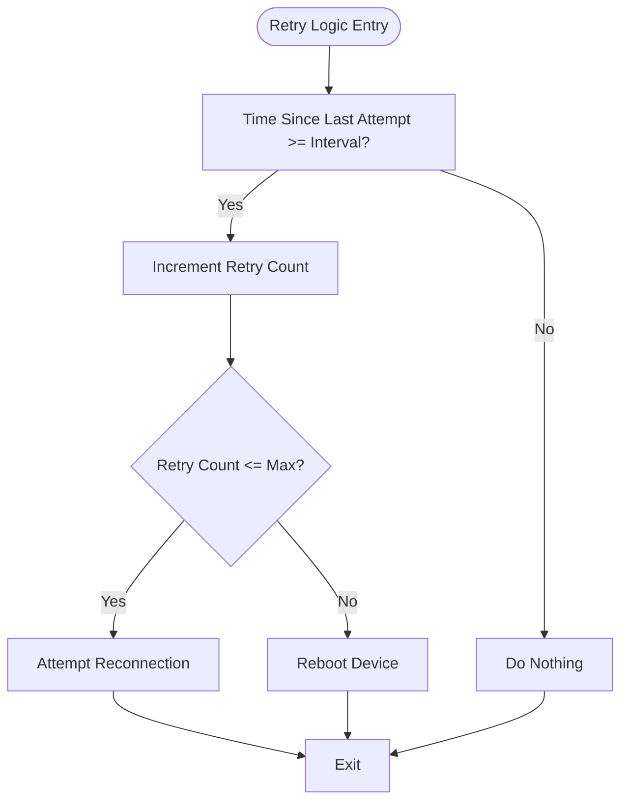

**Diagram sources**
- [hyperwisor-iot.cpp](file://src/hyperwisor-iot.cpp#L64-L87)
- [nikolaindustry-realtime.cpp](file://src/nikolaindustry-realtime.cpp#L61-L66)

**Section sources**
- [hyperwisor-iot.cpp](file://src/hyperwisor-iot.cpp#L178-L182)
- [nikolaindustry-realtime.cpp](file://src/nikolaindustry-realtime.cpp#L61-L66)

### Task Scheduling Within the Background Loop
- The loop() is a single-threaded scheduler that:
  - Polls WiFi and real-time status.
  - Processes AP-mode requests.
  - Delegates real-time message handling to the WebSocket client.
- There is no explicit periodic task queue; tasks are scheduled implicitly by checking conditions each loop iteration.

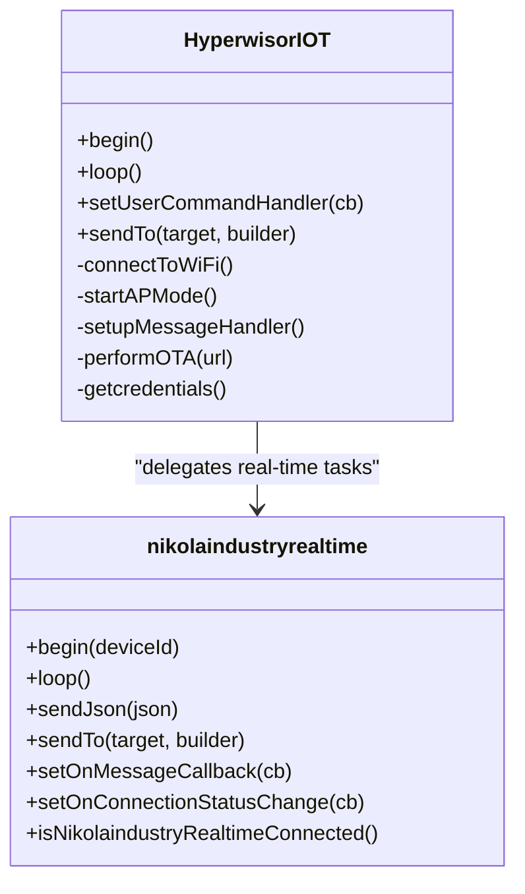

**Diagram sources**
- [hyperwisor-iot.h](file://src/hyperwisor-iot.h#L39-L187)
- [nikolaindustry-realtime.h](file://src/nikolaindustry-realtime.h#L10-L32)

**Section sources**
- [hyperwisor-iot.cpp](file://src/hyperwisor-iot.cpp#L46-L137)
- [nikolaindustry-realtime.cpp](file://src/nikolaindustry-realtime.cpp#L69-L75)

### WiFi Management and AP Mode
- On begin(), the library attempts to connect using stored credentials; otherwise it starts AP mode.
- AP mode serves a provisioning endpoint and enforces a timeout to avoid indefinite sessions.
- Provisioning writes credentials to Preferences and triggers a restart.

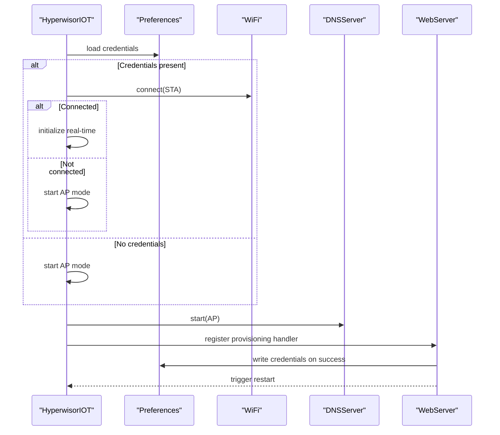

**Diagram sources**
- [hyperwisor-iot.cpp](file://src/hyperwisor-iot.cpp#L13-L30)
- [hyperwisor-iot.cpp](file://src/hyperwisor-iot.cpp#L141-L185)

**Section sources**
- [hyperwisor-iot.cpp](file://src/hyperwisor-iot.cpp#L13-L30)
- [hyperwisor-iot.cpp](file://src/hyperwisor-iot.cpp#L141-L185)

### Real-Time Communication and Message Handling
- Real-time messages are parsed and dispatched to built-in handlers for GPIO, OTA, and device status.
- A user-defined callback receives all messages for custom logic.
- The WebSocket client manages connection lifecycle and heartbeat.

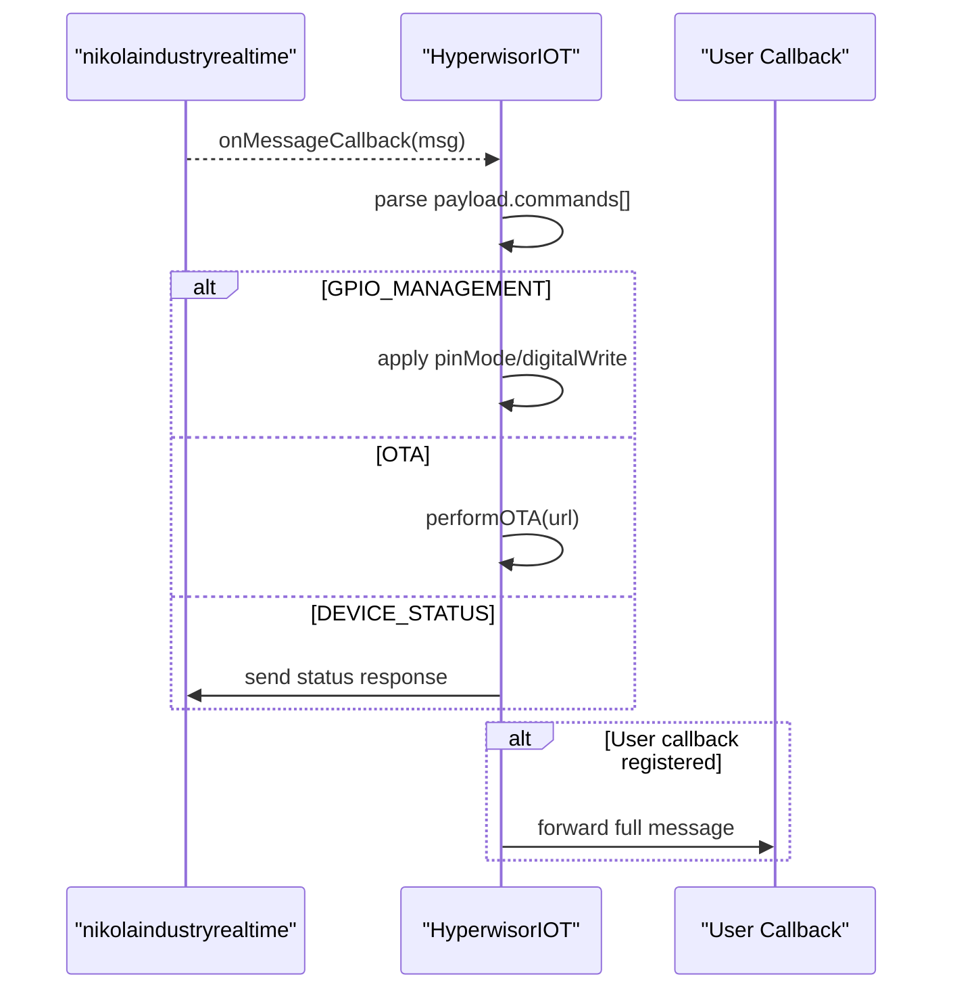

**Diagram sources**
- [hyperwisor-iot.cpp](file://src/hyperwisor-iot.cpp#L313-L404)
- [nikolaindustry-realtime.cpp](file://src/nikolaindustry-realtime.cpp#L25-L59)

**Section sources**
- [hyperwisor-iot.cpp](file://src/hyperwisor-iot.cpp#L313-L404)
- [nikolaindustry-realtime.cpp](file://src/nikolaindustry-realtime.cpp#L25-L59)

### GPIO Handling and Persistence
- GPIO commands change pin modes and output states.
- GPIO states are persisted to Preferences and can be restored on boot.

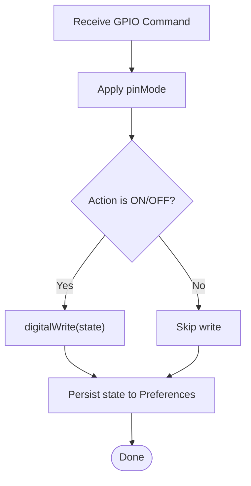

**Diagram sources**
- [hyperwisor-iot.cpp](file://src/hyperwisor-iot.cpp#L328-L362)
- [hyperwisor-iot.cpp](file://src/hyperwisor-iot.cpp#L1382-L1414)

**Section sources**
- [hyperwisor-iot.cpp](file://src/hyperwisor-iot.cpp#L328-L362)
- [hyperwisor-iot.cpp](file://src/hyperwisor-iot.cpp#L1382-L1414)

### OTA Updates
- OTA is triggered by a real-time command containing a URL and version.
- The library downloads firmware, validates size, writes via Update, persists version, and reboots.

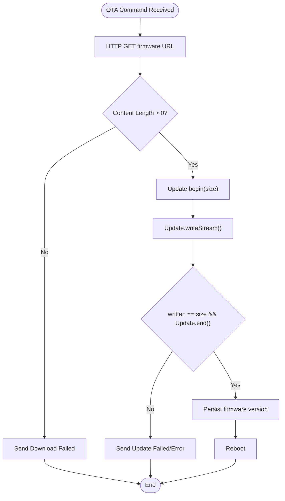

**Diagram sources**
- [hyperwisor-iot.cpp](file://src/hyperwisor-iot.cpp#L374-L383)
- [hyperwisor-iot.cpp](file://src/hyperwisor-iot.cpp#L1417-L1503)

**Section sources**
- [hyperwisor-iot.cpp](file://src/hyperwisor-iot.cpp#L374-L383)
- [hyperwisor-iot.cpp](file://src/hyperwisor-iot.cpp#L1417-L1503)

### Event-Driven vs Polling Approach
- The library uses a polling-based loop() for coordination, checking WiFi and real-time status each iteration.
- The WebSocket client uses an event-driven model internally (callbacks for connect/disconnect/text/ping/pong/error).
- This hybrid approach keeps the loop lightweight while leveraging the client’s robust connection management.

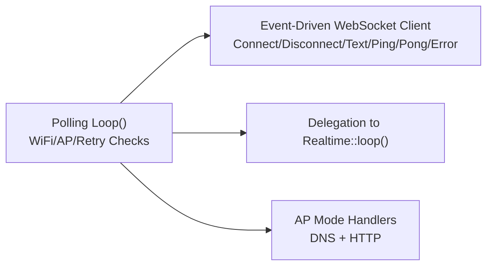

**Diagram sources**
- [hyperwisor-iot.cpp](file://src/hyperwisor-iot.cpp#L46-L137)
- [nikolaindustry-realtime.cpp](file://src/nikolaindustry-realtime.cpp#L25-L59)

**Section sources**
- [hyperwisor-iot.cpp](file://src/hyperwisor-iot.cpp#L46-L137)
- [nikolaindustry-realtime.cpp](file://src/nikolaindustry-realtime.cpp#L25-L59)

## Dependency Analysis
- HyperwisorIOT depends on:
  - WiFi for connectivity.
  - WebServer and DNSServer for AP provisioning.
  - HTTPClient for REST operations.
  - Preferences for persistent storage.
  - ArduinoJson for JSON parsing and serialization.
  - nikolaindustryrealtime for WebSocket communication.
- The WebSocket client encapsulates heartbeat and reconnection logic, reducing coupling in the main loop.

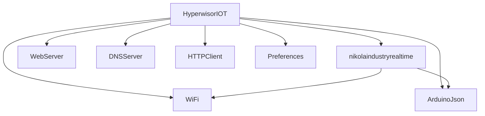

**Diagram sources**
- [hyperwisor-iot.h](file://src/hyperwisor-iot.h#L4-L14)
- [nikolaindustry-realtime.h](file://src/nikolaindustry-realtime.h#L4-L8)

**Section sources**
- [hyperwisor-iot.h](file://src/hyperwisor-iot.h#L4-L14)
- [nikolaindustry-realtime.h](file://src/nikolaindustry-realtime.h#L4-L8)

## Performance Considerations
- Cooperative multitasking: The loop() runs continuously; keep work minimal and non-blocking.
- Use millis() for timing to avoid blocking delays.
- Real-time client handles heartbeats and reconnections; avoid redundant reconnection attempts in user code.
- Prefer short-lived HTTP operations; reuse connections where possible.
- Limit JSON payload sizes and avoid frequent allocations; reuse buffers when feasible.
- Persist GPIO states to reduce startup overhead.

[No sources needed since this section provides general guidance]

## Troubleshooting Guide
Common issues and remedies:
- WiFi disconnection: The loop() attempts reconnection on a fixed interval; ensure credentials are valid and reachable networks exist.
- Real-time disconnection: The loop() retries up to a maximum; if exceeded, the device reboots to recover.
- AP mode stuck: An enforced timeout reboots the device after a period to prevent indefinite AP sessions.
- OTA failures: Inspect download errors, content length, and update errors; ensure sufficient flash space and correct URL.

**Section sources**
- [hyperwisor-iot.cpp](file://src/hyperwisor-iot.cpp#L64-L87)
- [hyperwisor-iot.cpp](file://src/hyperwisor-iot.cpp#L127-L131)
- [hyperwisor-iot.cpp](file://src/hyperwisor-iot.cpp#L1431-L1500)

## Conclusion
The Hyperwisor-IOT background loop architecture combines a simple, reliable polling loop with an event-driven WebSocket client to coordinate WiFi provisioning, real-time messaging, GPIO control, OTA updates, and AP-mode provisioning. The design emphasizes resilience through retry logic, heartbeat monitoring, and automatic recovery. Users can extend functionality by registering a user command handler and adding custom periodic tasks that check elapsed time each loop iteration, without disrupting core operations.

[No sources needed since this section summarizes without analyzing specific files]

## Appendices

### Extending Loop Functionality and Adding Custom Periodic Tasks
- Register a user command handler to process custom commands and respond to the sender.
- Add custom periodic tasks by checking elapsed time against a stored millis() value within loop().
- Avoid blocking delays; use non-blocking patterns and yield control back to the loop quickly.
- Keep custom tasks small and idempotent to minimize impact on real-time responsiveness.

**Section sources**
- [hyperwisor-iot.cpp](file://src/hyperwisor-iot.cpp#L407-L411)
- [CommandHandler.ino](file://examples/CommandHandler/CommandHandler.ino#L25-L85)