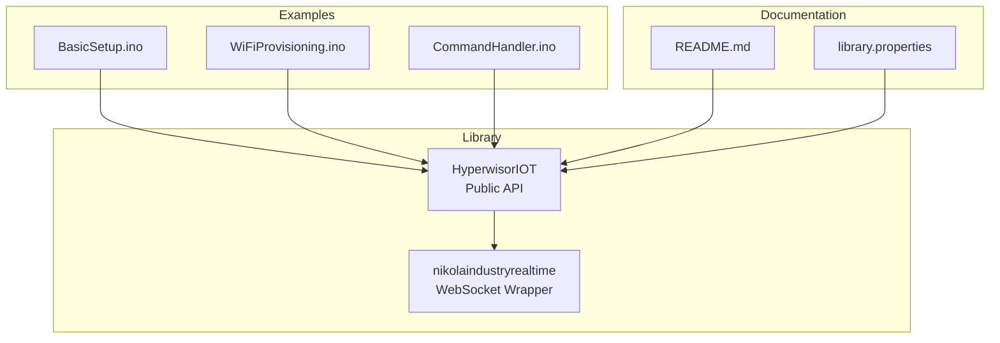
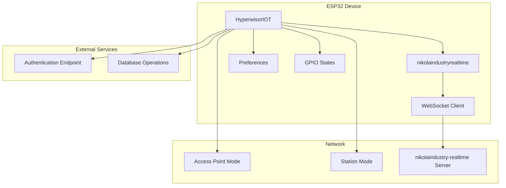
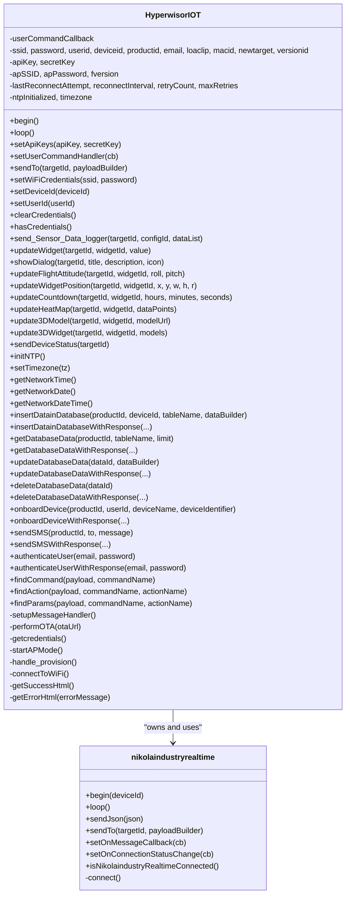
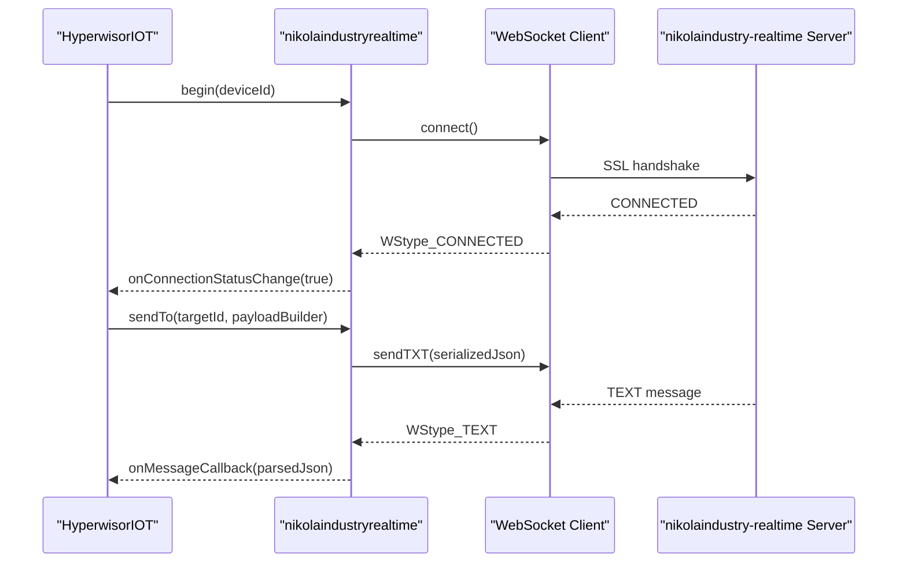
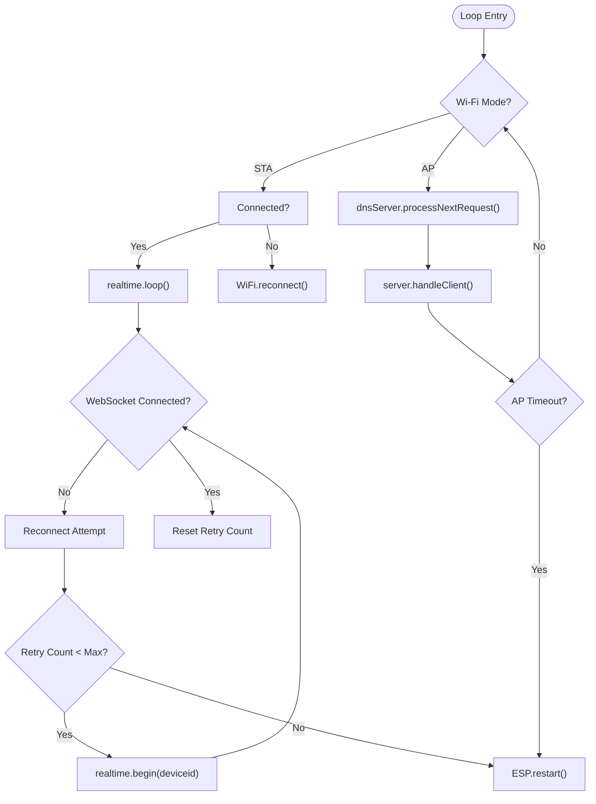
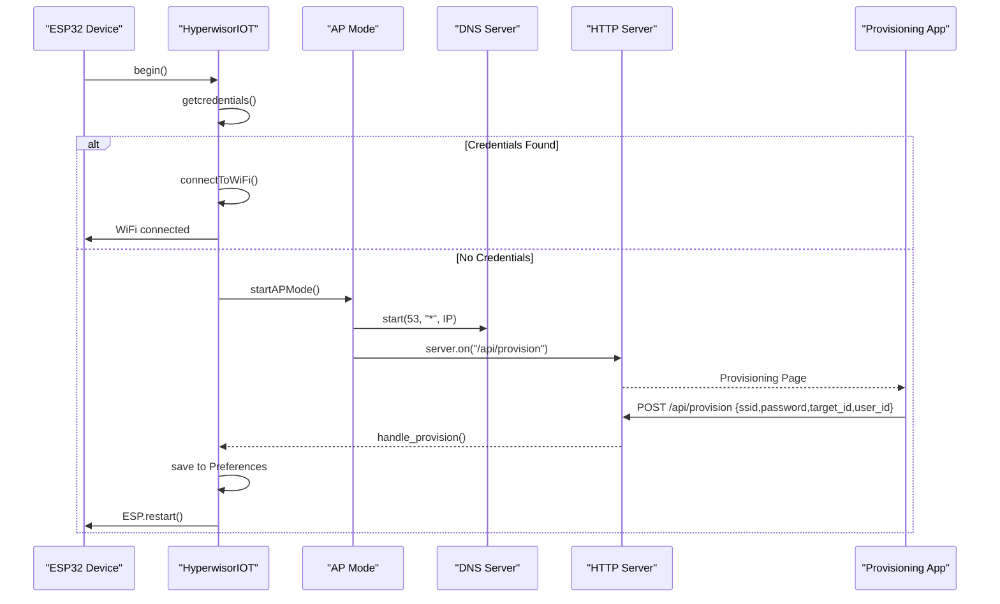
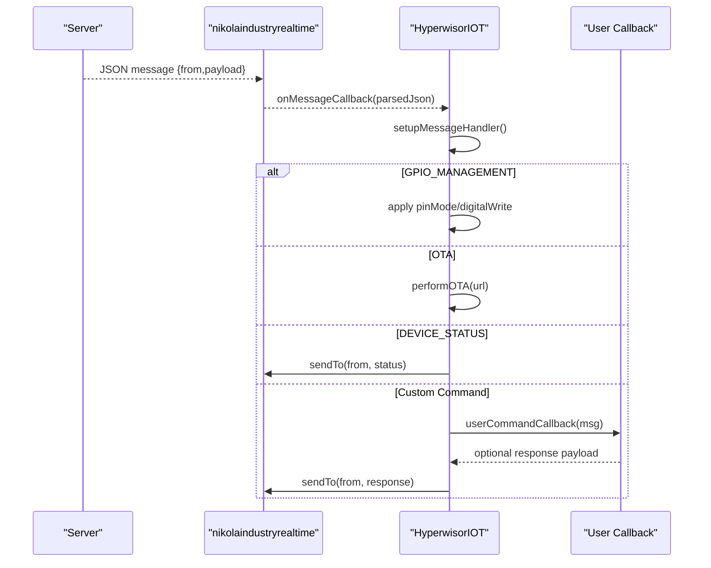
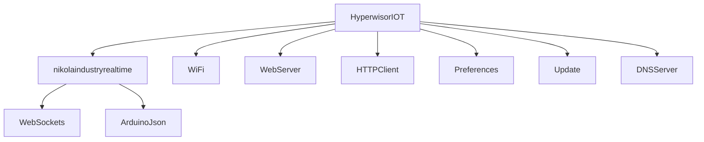

# Core Concepts

<cite>
**Referenced Files in This Document**
- [hyperwisor-iot.h](file://src/hyperwisor-iot.h)
- [hyperwisor-iot.cpp](file://src/hyperwisor-iot.cpp)
- [nikolaindustry-realtime.h](file://src/nikolaindustry-realtime.h)
- [nikolaindustry-realtime.cpp](file://src/nikolaindustry-realtime.cpp)
- [README.md](file://README.md)
- [library.properties](file://library.properties)
- [BasicSetup.ino](file://examples/BasicSetup/BasicSetup.ino)
- [WiFiProvisioning.ino](file://examples/WiFiProvisioning/WiFiProvisioning.ino)
- [CommandHandler.ino](file://examples/CommandHandler/CommandHandler.ino)
</cite>

## Table of Contents
1. [Introduction](#introduction)
2. [Project Structure](#project-structure)
3. [Core Components](#core-components)
4. [Architecture Overview](#architecture-overview)
5. [Detailed Component Analysis](#detailed-component-analysis)
6. [Dependency Analysis](#dependency-analysis)
7. [Performance Considerations](#performance-considerations)
8. [Troubleshooting Guide](#troubleshooting-guide)
9. [Conclusion](#conclusion)
10. [Appendices](#appendices)

## Introduction
Hyperwisor-IOT is a comprehensive abstraction layer designed to accelerate ESP32-based IoT development. It provides a unified foundation for Wi-Fi provisioning, real-time communication, OTA firmware updates, GPIO management, and structured JSON command execution. Built atop the nikolaindustry-realtime protocol, the library enables developers to deploy smart, connected devices with minimal boilerplate code while maintaining robust connectivity and extensibility.

The library’s philosophy centers on:
- Simplicity: Reduce complexity to essential building blocks for ESP32 IoT.
- Reliability: Provide resilient networking, connection management, and error handling.
- Extensibility: Offer callback-based hooks and structured JSON messaging for custom logic.
- Developer Experience: Deliver clear APIs for provisioning, widgets, dialogs, sensors, and database operations.

## Project Structure
The library follows a modular structure with clear separation of concerns:
- Core library interface and public API in header and implementation files.
- Real-time communication wrapper encapsulating WebSocket connectivity.
- Example sketches demonstrating provisioning, command handling, and basic setup.
- Documentation and metadata for installation and dependencies.

**Diagram sources**
- [hyperwisor-iot.h](file://src/hyperwisor-iot.h#L39-L187)
- [nikolaindustry-realtime.h](file://src/nikolaindustry-realtime.h#L10-L32)
- [README.md](file://README.md#L1-L173)
- [library.properties](file://library.properties#L1-L11)

**Section sources**
- [README.md](file://README.md#L1-L173)
- [library.properties](file://library.properties#L1-L11)

## Core Components
This section introduces the primary building blocks and their roles in the system.

- HyperwisorIOT: The central class orchestrating Wi-Fi provisioning, real-time communication, OTA updates, GPIO persistence, and higher-level widget/dialog/database operations. It exposes methods for device initialization, background loop execution, user-defined command callbacks, and convenience functions for UI widgets and sensor data logging.

- nikolaindustryrealtime: A lightweight wrapper around the WebSocket client that manages connection lifecycle, message serialization/deserialization, and callback registration for incoming messages and connection status changes.

- Background Loop Architecture: The library runs a continuous loop coordinating Wi-Fi reconnection, WebSocket health checks, AP mode provisioning UI, and periodic tasks. It ensures robust connectivity and graceful fallbacks.

- Factory Pattern for Initialization: The constructor initializes internal state and prepares subsystems. The begin() method performs conditional initialization based on stored credentials, starting AP mode or connecting to Wi-Fi accordingly.

- Observer Pattern for Message Handling: Incoming JSON messages trigger registered callbacks, enabling decoupled handling of commands and events. Users register a callback to process custom commands, while the library registers built-in handlers for GPIO, OTA, and device status.

- Singleton Pattern for Global Access: While not strictly enforced as a singleton class, the library exposes a global-like usage pattern where a single HyperwisorIOT instance is created and reused across setup and loop. The nikolaindustryrealtime instance is owned by HyperwisorIOT and serves as a shared communication channel.

**Section sources**
- [hyperwisor-iot.h](file://src/hyperwisor-iot.h#L39-L187)
- [nikolaindustry-realtime.h](file://src/nikolaindustry-realtime.h#L10-L32)
- [hyperwisor-iot.cpp](file://src/hyperwisor-iot.cpp#L13-L137)
- [README.md](file://README.md#L78-L88)

## Architecture Overview
The system architecture integrates Wi-Fi provisioning, real-time messaging, and background processing into a cohesive runtime model.

**Diagram sources**
- [hyperwisor-iot.h](file://src/hyperwisor-iot.h#L147-L187)
- [nikolaindustry-realtime.cpp](file://src/nikolaindustry-realtime.cpp#L5-L67)
- [hyperwisor-iot.cpp](file://src/hyperwisor-iot.cpp#L13-L137)

## Detailed Component Analysis

### HyperwisorIOT Class
The HyperwisorIOT class encapsulates the entire runtime behavior:
- Initialization and loop orchestration
- Wi-Fi provisioning (AP mode and station mode)
- Real-time communication via nikolaindustryrealtime
- OTA firmware updates
- GPIO state persistence and restoration
- Widget/dialog/database helpers
- Time synchronization and NTP utilities
- Authentication and database operations

**Diagram sources**
- [hyperwisor-iot.h](file://src/hyperwisor-iot.h#L39-L187)
- [nikolaindustry-realtime.h](file://src/nikolaindustry-realtime.h#L10-L32)

**Section sources**
- [hyperwisor-iot.h](file://src/hyperwisor-iot.h#L39-L187)
- [hyperwisor-iot.cpp](file://src/hyperwisor-iot.cpp#L13-L137)

### nikolaindustry-realtime WebSocket Wrapper
This component abstracts WebSocket connectivity:
- Establishes secure SSL connections to the nikolaindustry-realtime server
- Manages connection lifecycle with heartbeat and automatic reconnection
- Provides callbacks for message reception and connection status changes
- Serializes/deserializes JSON payloads using ArduinoJson

**Diagram sources**
- [nikolaindustry-realtime.cpp](file://src/nikolaindustry-realtime.cpp#L5-L67)
- [nikolaindustry-realtime.cpp](file://src/nikolaindustry-realtime.cpp#L77-L97)

**Section sources**
- [nikolaindustry-realtime.h](file://src/nikolaindustry-realtime.h#L10-L32)
- [nikolaindustry-realtime.cpp](file://src/nikolaindustry-realtime.cpp#L5-L113)

### Background Loop Architecture
The loop coordinates multiple subsystems:
- Wi-Fi reconnection attempts and state transitions
- WebSocket health checks with exponential backoff and max retries
- AP mode provisioning UI and DNS redirection
- Real-time message processing and user callbacks

**Diagram sources**
- [hyperwisor-iot.cpp](file://src/hyperwisor-iot.cpp#L46-L137)

**Section sources**
- [hyperwisor-iot.cpp](file://src/hyperwisor-iot.cpp#L46-L137)

### WiFi Provisioning System
The provisioning system enables seamless device onboarding:
- Detects stored credentials and attempts automatic connection
- Falls back to AP mode with a captive portal for manual configuration
- Persists credentials to Preferences for future boots
- Redirects users back to the controlling application upon completion

**Diagram sources**
- [hyperwisor-iot.cpp](file://src/hyperwisor-iot.cpp#L13-L137)
- [hyperwisor-iot.cpp](file://src/hyperwisor-iot.cpp#L159-L185)

**Section sources**
- [hyperwisor-iot.cpp](file://src/hyperwisor-iot.cpp#L13-L137)
- [WiFiProvisioning.ino](file://examples/WiFiProvisioning/WiFiProvisioning.ino#L1-L58)

### Real-Time Communication Layer
The real-time layer handles structured JSON messaging:
- Incoming messages are parsed and routed to registered callbacks
- Built-in handlers manage GPIO control, OTA updates, and device status
- User-defined handlers can extend functionality with custom commands
- Responses are sent back using the sendTo mechanism with target routing

**Diagram sources**
- [nikolaindustry-realtime.cpp](file://src/nikolaindustry-realtime.cpp#L39-L43)
- [hyperwisor-iot.cpp](file://src/hyperwisor-iot.cpp#L313-L400)
- [CommandHandler.ino](file://examples/CommandHandler/CommandHandler.ino#L26-L85)

**Section sources**
- [hyperwisor-iot.cpp](file://src/hyperwisor-iot.cpp#L313-L400)
- [CommandHandler.ino](file://examples/CommandHandler/CommandHandler.ino#L1-L96)

### Data Structures and Widget Helpers
The library defines specialized structures for richer UI experiences:
- HeatMapPoint: Represents grid-based data points for heat maps
- ThreeDModelUpdate: Encapsulates positional, rotational, and material properties for 3D widgets

It also provides convenience functions for updating widgets, dialogs, countdowns, heat maps, and 3D models, enabling rapid prototyping of interactive dashboards.

**Section sources**
- [hyperwisor-iot.h](file://src/hyperwisor-iot.h#L17-L35)
- [hyperwisor-iot.h](file://src/hyperwisor-iot.h#L78-L110)

### Conceptual Overviews for Beginners
- ESP32 Development Basics: The ESP32 is a powerful microcontroller with integrated Wi-Fi and Bluetooth. For IoT projects, it simplifies connectivity and reduces external component count. The Hyperwisor-IOT library builds on this by handling provisioning, real-time messaging, and OTA updates out of the box.

- JSON Message Structures: Messages follow a standardized format with a sender identifier and a payload containing one or more commands. Each command includes an action and parameters. The library parses these messages and routes them to appropriate handlers.

- WebSocket Communication Fundamentals: WebSocket provides full-duplex communication over a single TCP connection. The nikolaindustry-realtime wrapper manages SSL/TLS, heartbeats, and automatic reconnection to keep the connection healthy.

**Section sources**
- [README.md](file://README.md#L51-L76)
- [nikolaindustry-realtime.cpp](file://src/nikolaindustry-realtime.cpp#L19-L67)

## Dependency Analysis
The library relies on several Arduino ecosystem components:
- ArduinoJson: Efficient JSON parsing and serialization
- WebSockets: WebSocket client for real-time communication
- WiFi, WebServer, HTTPClient, Preferences, Update, DNSServer: ESP32-native capabilities for networking, provisioning, and OTA

**Diagram sources**
- [library.properties](file://library.properties#L10-L10)
- [hyperwisor-iot.h](file://src/hyperwisor-iot.h#L4-L14)
- [nikolaindustry-realtime.h](file://src/nikolaindustry-realtime.h#L4-L8)

**Section sources**
- [library.properties](file://library.properties#L10-L10)
- [hyperwisor-iot.h](file://src/hyperwisor-iot.h#L4-L14)
- [nikolaindustry-realtime.h](file://src/nikolaindustry-realtime.h#L4-L8)

## Performance Considerations
- Heartbeat and Reconnection: The WebSocket wrapper enables heartbeat detection to identify stale connections promptly, reducing downtime and improving reliability.
- Retry Logic: The library implements bounded retry attempts with exponential backoff to prevent resource exhaustion during transient failures.
- Memory Management: ArduinoJson documents are sized appropriately for typical payloads, balancing memory usage and throughput.
- OTA Efficiency: OTA downloads stream firmware content and validate sizes before writing to flash, minimizing risk and improving user feedback.

[No sources needed since this section provides general guidance]

## Troubleshooting Guide
Common issues and resolutions:
- Wi-Fi Connection Failures: Verify stored credentials and network availability. If credentials are missing, the device will enter AP mode for provisioning.
- WebSocket Disconnections: The library attempts automatic reconnection with heartbeat monitoring. Excessive failures trigger a device reboot to recover.
- OTA Update Failures: Inspect HTTP response codes and content length. Ensure sufficient flash space and correct firmware URLs.
- Authentication Errors: Confirm API keys are set and the device has an active Wi-Fi connection before attempting authentication.

**Section sources**
- [hyperwisor-iot.cpp](file://src/hyperwisor-iot.cpp#L64-L86)
- [hyperwisor-iot.cpp](file://src/hyperwisor-iot.cpp#L1417-L1503)
- [hyperwisor-iot.cpp](file://src/hyperwisor-iot.cpp#L1506-L1549)

## Conclusion
Hyperwisor-IOT delivers a robust, extensible foundation for ESP32-based IoT applications. By abstracting Wi-Fi provisioning, real-time communication, OTA updates, and structured JSON messaging, it accelerates development while maintaining reliability and developer control. The combination of factory-style initialization, observer-based message handling, and a singleton-like usage pattern creates a predictable and scalable architecture suitable for both beginners and advanced developers.

[No sources needed since this section summarizes without analyzing specific files]

## Appendices

### Example Usage Patterns
- Basic Setup: Demonstrates minimal initialization and loop usage for immediate connectivity.
- WiFi Provisioning: Shows how to detect provisioning status and guide users through AP mode configuration.
- Command Handler: Illustrates registering a user-defined callback to process custom commands and respond to the sender.

**Section sources**
- [BasicSetup.ino](file://examples/BasicSetup/BasicSetup.ino#L1-L39)
- [WiFiProvisioning.ino](file://examples/WiFiProvisioning/WiFiProvisioning.ino#L1-L58)
- [CommandHandler.ino](file://examples/CommandHandler/CommandHandler.ino#L1-L96)