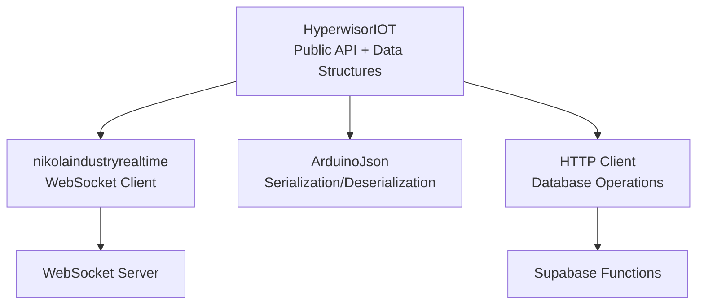
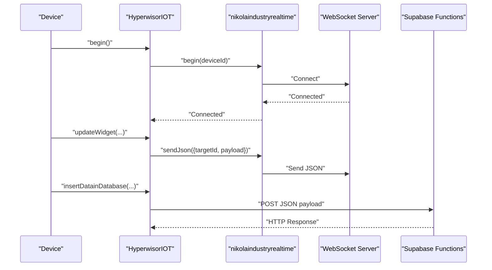
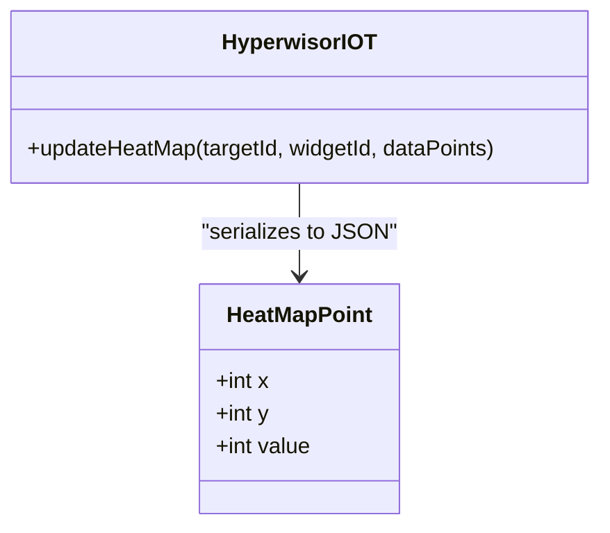
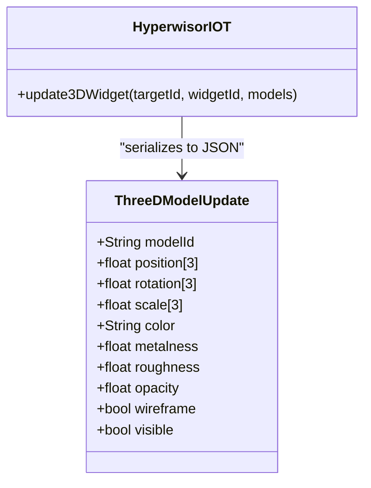
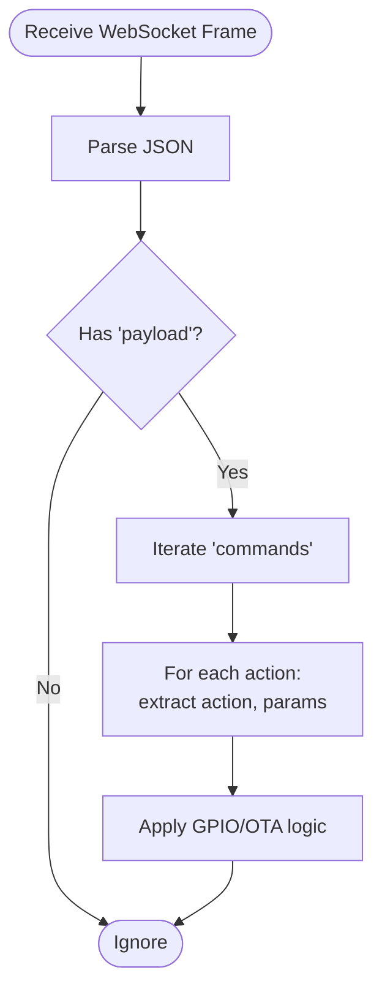
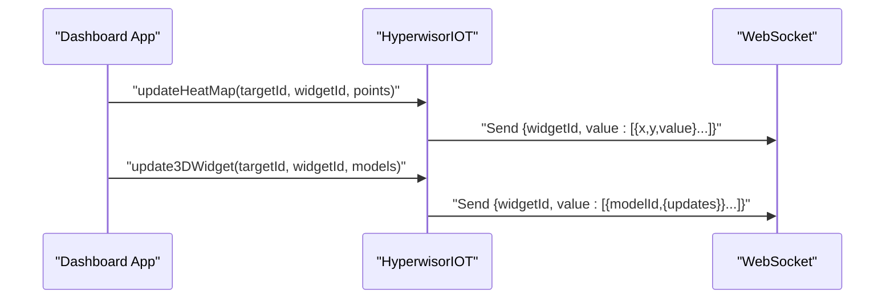
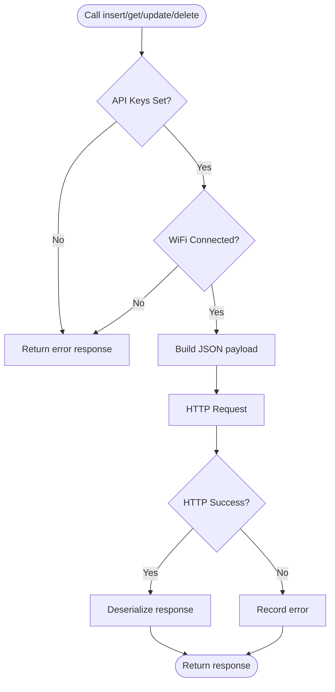
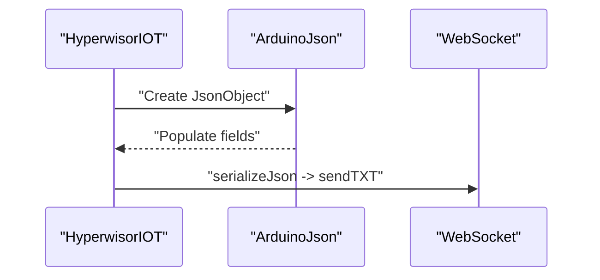
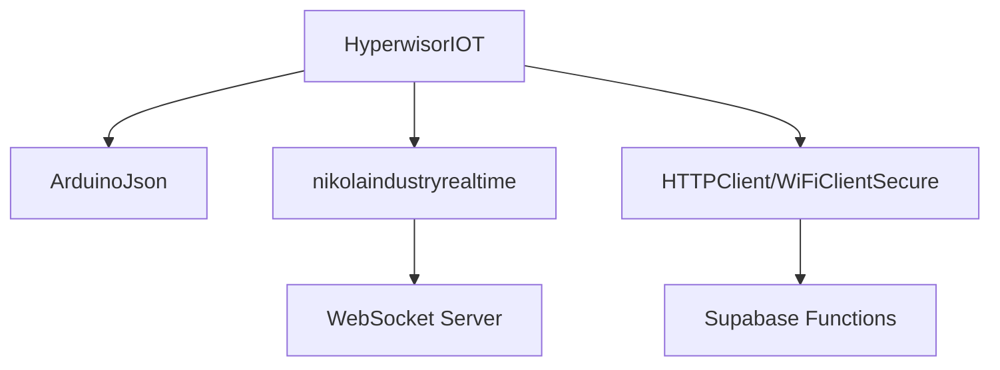

# Data Models and Structures

<cite>
**Referenced Files in This Document**
- [hyperwisor-iot.h](file://src/hyperwisor-iot.h)
- [hyperwisor-iot.cpp](file://src/hyperwisor-iot.cpp)
- [nikolaindustry-realtime.h](file://src/nikolaindustry-realtime.h)
- [nikolaindustry-realtime.cpp](file://src/nikolaindustry-realtime.cpp)
- [WidgetUpdate.ino](file://examples/WidgetUpdate/WidgetUpdate.ino)
- [ThreeDWidgetControl.ino](file://examples/ThreeDWidgetControl/ThreeDWidgetControl.ino)
- [SensorDataLogger.ino](file://examples/SensorDataLogger/SensorDataLogger.ino)
- [README.md](file://README.md)
</cite>

## Table of Contents
1. [Introduction](#introduction)
2. [Project Structure](#project-structure)
3. [Core Components](#core-components)
4. [Architecture Overview](#architecture-overview)
5. [Detailed Component Analysis](#detailed-component-analysis)
6. [Dependency Analysis](#dependency-analysis)
7. [Performance Considerations](#performance-considerations)
8. [Troubleshooting Guide](#troubleshooting-guide)
9. [Conclusion](#conclusion)
10. [Appendices](#appendices)

## Introduction
This document provides comprehensive data model documentation for Hyperwisor-IOT’s core data structures and schemas. It focuses on:
- HeatMapPoint for visualization data (x, y coordinates and value)
- ThreeDModelUpdate for 3D model positioning, rotation, scaling, material properties, and visibility
- JSON payload structures for command communication, widget updates, and database operations
- Validation rules, acceptable value ranges, and constraint checking
- Serialization/deserialization processes, memory management, and performance implications
- Practical usage patterns with real-world examples

## Project Structure
The library centers around a primary class that encapsulates Wi-Fi provisioning, real-time messaging, OTA updates, GPIO control, and database operations. Data structures are defined in the public header and consumed by member functions that serialize them into JSON payloads.

**Diagram sources**
- [hyperwisor-iot.h](file://src/hyperwisor-iot.h#L16-L35)
- [nikolaindustry-realtime.h](file://src/nikolaindustry-realtime.h#L10-L21)
- [nikolaindustry-realtime.cpp](file://src/nikolaindustry-realtime.cpp#L19-L67)
- [hyperwisor-iot.cpp](file://src/hyperwisor-iot.cpp#L731-L778)

**Section sources**
- [hyperwisor-iot.h](file://src/hyperwisor-iot.h#L16-L35)
- [README.md](file://README.md#L1-L20)

## Core Components
This section documents the core data structures and their roles in the system.

- HeatMapPoint
  - Purpose: Represents a single point in a heatmap visualization.
  - Fields:
    - x: integer coordinate
    - y: integer coordinate
    - value: integer intensity/value
  - Usage: Aggregated into arrays for widget updates.

- ThreeDModelUpdate
  - Purpose: Encapsulates transformations and material properties for a 3D model within a 3D widget.
  - Fields:
    - modelId: String identifier
    - position[3]: float array [x, y, z]
    - rotation[3]: float array [rx, ry, rz]
    - scale[3]: float array [sx, sy, sz]
    - color: String (hex color)
    - metalness: float [0.0, 1.0]
    - roughness: float [0.0, 1.0]
    - opacity: float [0.0, 1.0]
    - wireframe: boolean
    - visible: boolean

- JSON Payloads
  - Command messages: parsed from real-time WebSocket frames for GPIO and OTA actions.
  - Widget updates: serialized from the above structures for dashboard rendering.
  - Database operations: structured payloads for Supabase functions.

**Section sources**
- [hyperwisor-iot.h](file://src/hyperwisor-iot.h#L16-L35)
- [hyperwisor-iot.cpp](file://src/hyperwisor-iot.cpp#L662-L714)
- [README.md](file://README.md#L51-L76)

## Architecture Overview
The system integrates real-time messaging, JSON serialization, and HTTP-based database operations.

**Diagram sources**
- [nikolaindustry-realtime.cpp](file://src/nikolaindustry-realtime.cpp#L19-L67)
- [hyperwisor-iot.cpp](file://src/hyperwisor-iot.cpp#L521-L532)
- [hyperwisor-iot.cpp](file://src/hyperwisor-iot.cpp#L731-L778)

## Detailed Component Analysis

### HeatMapPoint Data Model
- Definition: A lightweight structure for visualization data.
- Typical usage:
  - Build a vector of HeatMapPoint entries.
  - Serialize into a JSON array under the “value” field for a heatmap widget.
- Constraints and validation:
  - x, y: integers representing grid indices or screen coordinates.
  - value: integer representing intensity or aggregated metric.
  - Range expectations are application-dependent; ensure values fit the intended scale.

**Diagram sources**
- [hyperwisor-iot.h](file://src/hyperwisor-iot.h#L16-L21)
- [hyperwisor-iot.cpp](file://src/hyperwisor-iot.cpp#L662-L675)

**Section sources**
- [hyperwisor-iot.h](file://src/hyperwisor-iot.h#L16-L21)
- [hyperwisor-iot.cpp](file://src/hyperwisor-iot.cpp#L662-L675)

### ThreeDModelUpdate Data Model
- Definition: Encapsulates positional and material attributes for 3D models.
- Typical usage:
  - Populate a vector of ThreeDModelUpdate entries.
  - Serialize into a JSON array with nested “updates” for each model.
- Constraints and validation:
  - position, rotation, scale: float arrays of length 3.
  - metalness, roughness, opacity: floats constrained to [0.0, 1.0].
  - color: hex color string (no strict validation performed in code).
  - wireframe, visible: booleans controlling rendering.

**Diagram sources**
- [hyperwisor-iot.h](file://src/hyperwisor-iot.h#L23-L35)
- [hyperwisor-iot.cpp](file://src/hyperwisor-iot.cpp#L685-L714)

**Section sources**
- [hyperwisor-iot.h](file://src/hyperwisor-iot.h#L23-L35)
- [hyperwisor-iot.cpp](file://src/hyperwisor-iot.cpp#L685-L714)

### JSON Payload Structures

#### Command Communication (Real-time)
- Structure: Root contains “from” and “payload” with nested “commands” array.
- Example fields:
  - commands[i].command: e.g., “GPIO_MANAGEMENT”, “OTA”
  - commands[i].actions[j].action: e.g., “ON”, “OFF”, “ota_update”
  - commands[i].actions[j].params: e.g., gpio, pinmode, status, url, version

**Diagram sources**
- [hyperwisor-iot.cpp](file://src/hyperwisor-iot.cpp#L313-L404)
- [README.md](file://README.md#L51-L76)

**Section sources**
- [hyperwisor-iot.cpp](file://src/hyperwisor-iot.cpp#L313-L404)
- [README.md](file://README.md#L51-L76)

#### Widget Updates
- Heatmap payload:
  - widgetId: string
  - value: array of objects with x, y, value
- 3D widget payload:
  - widgetId: string
  - value: array of objects with modelId and updates:
    - updates.position: [x, y, z]
    - updates.rotation: [rx, ry, rz]
    - updates.scale: [sx, sy, sz]
    - updates.color: hex string
    - updates.metalness, updates.roughness, updates.opacity: [0.0, 1.0]
    - updates.wireframe, updates.visible: booleans

**Diagram sources**
- [hyperwisor-iot.cpp](file://src/hyperwisor-iot.cpp#L662-L714)

**Section sources**
- [hyperwisor-iot.cpp](file://src/hyperwisor-iot.cpp#L662-L714)

#### Database Operations
- Insert:
  - Root fields: product_id, device_id, table_name
  - Nested data_payload: arbitrary key-value pairs built by caller
- Get:
  - URL query parameters: product_id, table_name, limit
- Update/Delete:
  - Path parameter: data_id
  - data_payload: arbitrary key-value pairs for updates
- Responses:
  - Success flag and either parsed JSON data or raw response text

**Diagram sources**
- [hyperwisor-iot.cpp](file://src/hyperwisor-iot.cpp#L731-L778)
- [hyperwisor-iot.cpp](file://src/hyperwisor-iot.cpp#L850-L888)
- [hyperwisor-iot.cpp](file://src/hyperwisor-iot.cpp#L951-L995)
- [hyperwisor-iot.cpp](file://src/hyperwisor-iot.cpp#L1064-L1097)

**Section sources**
- [hyperwisor-iot.cpp](file://src/hyperwisor-iot.cpp#L731-L778)
- [hyperwisor-iot.cpp](file://src/hyperwisor-iot.cpp#L850-L888)
- [hyperwisor-iot.cpp](file://src/hyperwisor-iot.cpp#L951-L995)
- [hyperwisor-iot.cpp](file://src/hyperwisor-iot.cpp#L1064-L1097)

### Data Validation Rules and Constraint Checking
- HeatMapPoint
  - x, y: integers; value: integer
  - No explicit bounds enforced in code; ensure values match expected visualization scale
- ThreeDModelUpdate
  - metalness, roughness, opacity: constrained to [0.0, 1.0]
  - position, rotation, scale: float arrays of length 3
  - color: string; no strict validation performed
  - wireframe, visible: booleans
- Command payloads
  - Actions and parameters are parsed and validated by action handlers; ensure presence of required fields (e.g., gpio, pinmode, status for GPIO actions)
- Database payloads
  - Arbitrary key-value pairs; ensure keys match backend schema expectations

**Section sources**
- [hyperwisor-iot.h](file://src/hyperwisor-iot.h#L16-L35)
- [hyperwisor-iot.cpp](file://src/hyperwisor-iot.cpp#L328-L362)
- [hyperwisor-iot.cpp](file://src/hyperwisor-iot.cpp#L731-L778)

### Serialization and Deserialization Processes
- Serialization
  - ArduinoJson is used to construct payloads and send them over WebSocket and HTTP.
  - Examples:
    - Widget updates: nested objects and arrays for value fields
    - Database operations: nested data_payload objects
    - Real-time messages: root with targetId and payload builders
- Deserialization
  - Incoming WebSocket frames are deserialized into JsonObject for command parsing.
  - HTTP responses from database endpoints are optionally parsed into JSON or returned as raw text.

**Diagram sources**
- [nikolaindustry-realtime.cpp](file://src/nikolaindustry-realtime.cpp#L77-L88)
- [hyperwisor-iot.cpp](file://src/hyperwisor-iot.cpp#L521-L532)

**Section sources**
- [nikolaindustry-realtime.cpp](file://src/nikolaindustry-realtime.cpp#L77-L88)
- [hyperwisor-iot.cpp](file://src/hyperwisor-iot.cpp#L521-L532)

### Memory Management and Performance Implications
- Memory considerations
  - DynamicJsonDocument sizes vary by operation:
    - General payloads: 512 bytes
    - Sensor data: 1024 bytes
    - Database responses: 1024–2048 bytes
    - OTA feedback: 512 bytes
  - Prefer building payloads incrementally and reusing documents where possible.
- Performance implications
  - JSON serialization/deserialization overhead increases with payload size.
  - WebSocket heartbeats and reconnect logic improve reliability but add periodic CPU usage.
  - HTTP requests to Supabase are synchronous; consider batching or throttling frequent writes.

**Section sources**
- [hyperwisor-iot.cpp](file://src/hyperwisor-iot.cpp#L523-L523)
- [hyperwisor-iot.cpp](file://src/hyperwisor-iot.cpp#L745-L745)
- [hyperwisor-iot.cpp](file://src/hyperwisor-iot.cpp#L832-L832)
- [nikolaindustry-realtime.cpp](file://src/nikolaindustry-realtime.cpp#L61-L66)

### Usage Patterns and Examples
- Widget updates
  - Demonstrates sending numeric and array values to dashboard widgets.
  - Reference: [WidgetUpdate.ino](file://examples/WidgetUpdate/WidgetUpdate.ino#L41-L66)
- 3D widget control
  - Demonstrates rotating and transforming multiple 3D models with material properties.
  - Reference: [ThreeDWidgetControl.ino](file://examples/ThreeDWidgetControl/ThreeDWidgetControl.ino#L34-L83)
- Sensor data logging
  - Demonstrates structured sensor data payloads for charts and dashboards.
  - Reference: [SensorDataLogger.ino](file://examples/SensorDataLogger/SensorDataLogger.ino#L34-L62)

**Section sources**
- [WidgetUpdate.ino](file://examples/WidgetUpdate/WidgetUpdate.ino#L41-L66)
- [ThreeDWidgetControl.ino](file://examples/ThreeDWidgetControl/ThreeDWidgetControl.ino#L34-L83)
- [SensorDataLogger.ino](file://examples/SensorDataLogger/SensorDataLogger.ino#L34-L62)

## Dependency Analysis
- Internal dependencies
  - HyperwisorIOT depends on ArduinoJson for serialization/deserialization.
  - HyperwisorIOT composes nikolaindustryrealtime for WebSocket connectivity.
  - HTTP database operations depend on ESP32 HTTPClient and WiFiClientSecure.
- External dependencies
  - WebSocket server endpoint and Supabase functions are external services.

**Diagram sources**
- [hyperwisor-iot.h](file://src/hyperwisor-iot.h#L4-L14)
- [nikolaindustry-realtime.h](file://src/nikolaindustry-realtime.h#L4-L8)
- [hyperwisor-iot.cpp](file://src/hyperwisor-iot.cpp#L756-L778)

**Section sources**
- [hyperwisor-iot.h](file://src/hyperwisor-iot.h#L4-L14)
- [nikolaindustry-realtime.h](file://src/nikolaindustry-realtime.h#L4-L8)
- [hyperwisor-iot.cpp](file://src/hyperwisor-iot.cpp#L756-L778)

## Performance Considerations
- Optimize payload sizes:
  - Minimize unnecessary fields in database payloads.
  - Batch frequent updates where feasible.
- Monitor memory:
  - Track DynamicJsonDocument usage; adjust capacity to prevent fragmentation.
- Network reliability:
  - Leverage WebSocket heartbeats and automatic reconnection to reduce downtime.
- Security note:
  - HTTPClient uses insecure SSL in database operations; consider secure configurations in production deployments.

[No sources needed since this section provides general guidance]

## Troubleshooting Guide
- WebSocket connection issues
  - Verify WiFi connectivity before connecting.
  - Check heartbeat logs and reconnection attempts.
- OTA failures
  - Inspect HTTP GET responses and Update errors; ensure sufficient flash space.
- Database errors
  - Confirm API keys are set and WiFi is connected.
  - Inspect HTTP response codes and raw responses for debugging.
- Command parsing
  - Ensure required parameters are present in incoming messages.

**Section sources**
- [nikolaindustry-realtime.cpp](file://src/nikolaindustry-realtime.cpp#L19-L67)
- [hyperwisor-iot.cpp](file://src/hyperwisor-iot.cpp#L1417-L1503)
- [hyperwisor-iot.cpp](file://src/hyperwisor-iot.cpp#L731-L778)
- [hyperwisor-iot.cpp](file://src/hyperwisor-iot.cpp#L313-L404)

## Conclusion
Hyperwisor-IOT defines clear, compact data structures for visualization and 3D rendering, and provides robust mechanisms for real-time messaging and database operations. By adhering to the documented constraints and leveraging the provided examples, developers can efficiently integrate sensor data, 3D models, and interactive widgets into the Hyperwisor platform.

[No sources needed since this section summarizes without analyzing specific files]

## Appendices

### Appendix A: Data Model Field Reference
- HeatMapPoint
  - x: integer
  - y: integer
  - value: integer
- ThreeDModelUpdate
  - modelId: string
  - position[3]: float
  - rotation[3]: float
  - scale[3]: float
  - color: string (hex)
  - metalness: float [0.0, 1.0]
  - roughness: float [0.0, 1.0]
  - opacity: float [0.0, 1.0]
  - wireframe: boolean
  - visible: boolean

**Section sources**
- [hyperwisor-iot.h](file://src/hyperwisor-iot.h#L16-L35)

### Appendix B: Example Payloads
- Widget update (heatmap):
  - widgetId: string
  - value: array of {x:int, y:int, value:int}
- Widget update (3D):
  - widgetId: string
  - value: array of {modelId:string, updates:{position:[], rotation:[], scale:[], color:string, metalness:float, roughness:float, opacity:float, wireframe:boolean, visible:boolean}}
- Database insert:
  - product_id: string
  - device_id: string
  - table_name: string
  - data_payload: object

**Section sources**
- [hyperwisor-iot.cpp](file://src/hyperwisor-iot.cpp#L662-L714)
- [hyperwisor-iot.cpp](file://src/hyperwisor-iot.cpp#L731-L778)