# Real-time Communication Layer

<cite>
**Referenced Files in This Document**
- [nikolaindustry-realtime.h](file://src/nikolaindustry-realtime.h)
- [nikolaindustry-realtime.cpp](file://src/nikolaindustry-realtime.cpp)
- [hyperwisor-iot.h](file://src/hyperwisor-iot.h)
- [hyperwisor-iot.cpp](file://src/hyperwisor-iot.cpp)
- [README.md](file://README.md)
- [BasicSetup.ino](file://examples/BasicSetup/BasicSetup.ino)
- [CommandHandler.ino](file://examples/CommandHandler/CommandHandler.ino)
- [SensorDataLogger.ino](file://examples/SensorDataLogger/SensorDataLogger.ino)
</cite>

## Table of Contents
1. [Introduction](#introduction)
2. [Project Structure](#project-structure)
3. [Core Components](#core-components)
4. [Architecture Overview](#architecture-overview)
5. [Detailed Component Analysis](#detailed-component-analysis)
6. [WebSocket Message Formats](#websocket-message-formats)
7. [Background Loop Implementation](#background-loop-implementation)
8. [Reconnection Logic](#reconnection-logic)
9. [Heartbeat Mechanisms](#heartbeat-mechanisms)
10. [Integration Patterns](#integration-patterns)
11. [Error Handling](#error-handling)
12. [Performance Optimization](#performance-optimization)
13. [Troubleshooting Guide](#troubleshooting-guide)
14. [Conclusion](#conclusion)

## Introduction

The Hyperwisor-IOT library provides a comprehensive real-time communication layer for ESP32-based IoT devices, built upon the nikolaindustry-realtime protocol. This documentation focuses specifically on the WebSocket integration and message handling capabilities that enable bidirectional communication between IoT devices and cloud platforms.

The real-time communication layer consists of two primary components: the `nikolaindustryrealtime` class, which handles WebSocket connections and message routing, and the `HyperwisorIOT` main class, which orchestrates the overall system including Wi-Fi management, command processing, and integration with the real-time layer.

## Project Structure

The real-time communication layer is organized within the Hyperwisor-IOT library structure:

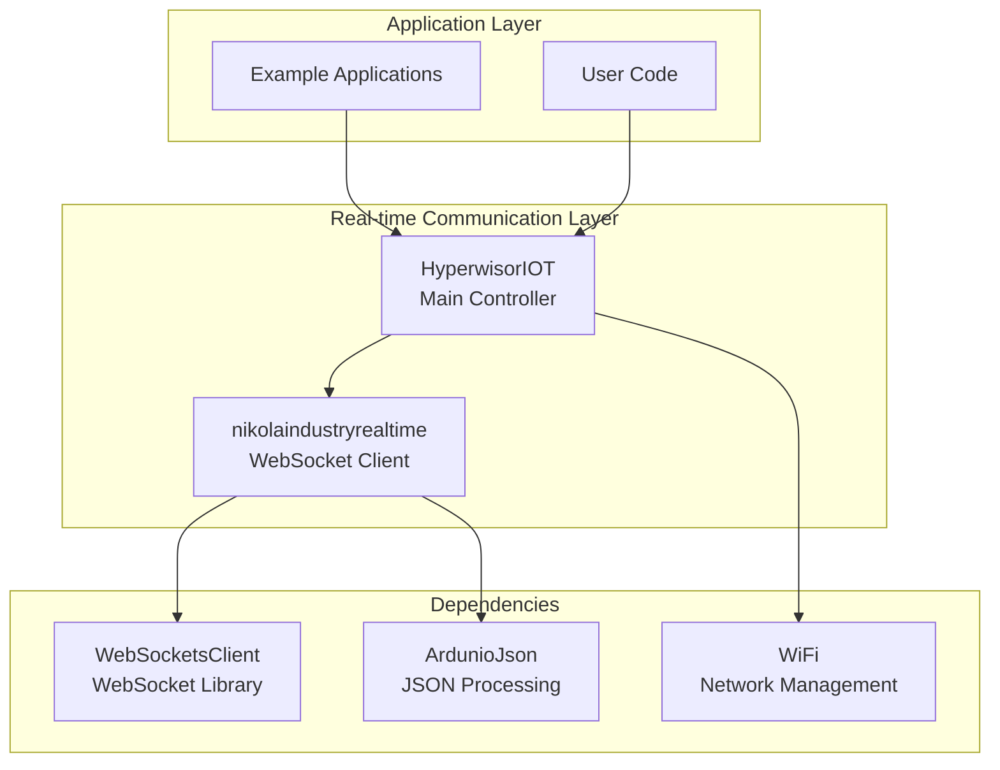

**Diagram sources**
- [nikolaindustry-realtime.h](file://src/nikolaindustry-realtime.h#L10-L32)
- [hyperwisor-iot.h](file://src/hyperwisor-iot.h#L39-L149)

**Section sources**
- [nikolaindustry-realtime.h](file://src/nikolaindustry-realtime.h#L1-L35)
- [hyperwisor-iot.h](file://src/hyperwisor-iot.h#L1-L190)

## Core Components

### nikolaindustryrealtime Class

The `nikolaindustryrealtime` class serves as the primary WebSocket client implementation, providing:

- **Connection Management**: Establishes and maintains WebSocket connections to the nikolaindustry-realtime server
- **Message Routing**: Handles incoming and outgoing JSON message routing
- **Event Callbacks**: Provides callback mechanisms for message reception and connection status changes
- **Heartbeat Support**: Implements automatic ping/pong mechanisms for connection health monitoring

### HyperwisorIOT Main Class

The `HyperwisorIOT` class acts as the orchestrator, integrating the real-time communication layer with:

- **Wi-Fi Management**: Handles network connectivity and provisioning
- **Command Processing**: Processes incoming commands and routes them appropriately
- **Device Control**: Manages GPIO operations and device state
- **OTA Updates**: Supports firmware update capabilities

**Section sources**
- [nikolaindustry-realtime.h](file://src/nikolaindustry-realtime.h#L10-L32)
- [hyperwisor-iot.h](file://src/hyperwisor-iot.h#L39-L149)

## Architecture Overview

The real-time communication architecture follows a layered approach with clear separation of concerns:

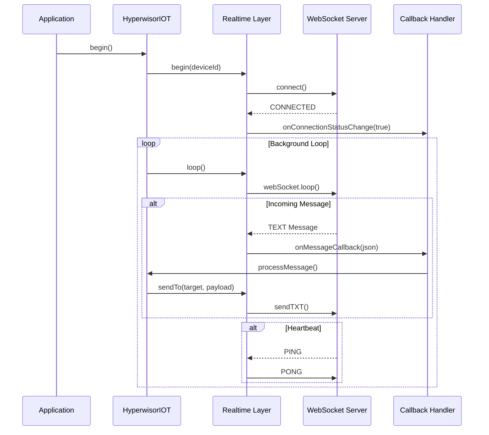

**Diagram sources**
- [nikolaindustry-realtime.cpp](file://src/nikolaindustry-realtime.cpp#L5-L17)
- [nikolaindustry-realtime.cpp](file://src/nikolaindustry-realtime.cpp#L69-L75)
- [hyperwisor-iot.cpp](file://src/hyperwisor-iot.cpp#L46-L137)

**Section sources**
- [nikolaindustry-realtime.cpp](file://src/nikolaindustry-realtime.cpp#L1-L113)
- [hyperwisor-iot.cpp](file://src/hyperwisor-iot.cpp#L13-L137)

## Detailed Component Analysis

### nikolaindustryrealtime Class Implementation

The `nikolaindustryrealtime` class implements a comprehensive WebSocket client with the following key components:

#### Class Structure and Dependencies

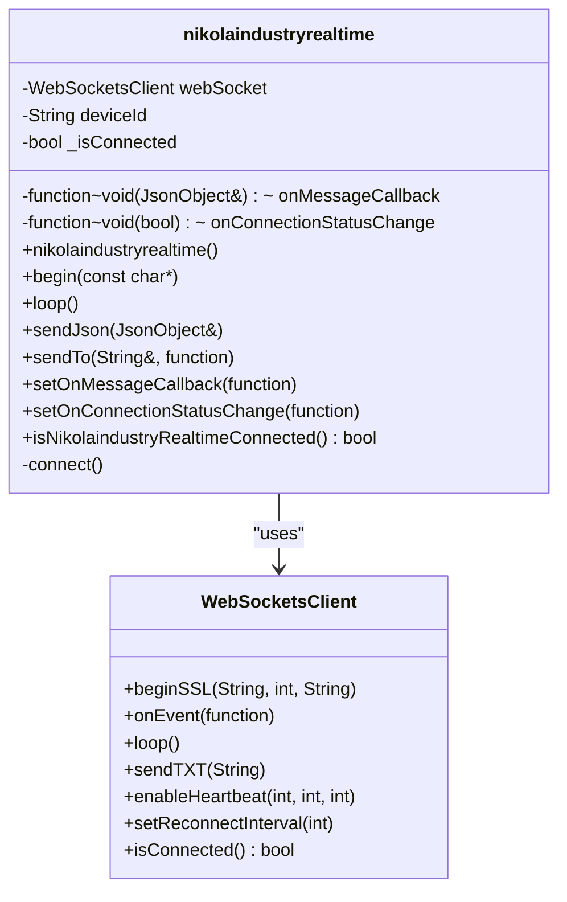

**Diagram sources**
- [nikolaindustry-realtime.h](file://src/nikolaindustry-realtime.h#L10-L32)

#### Connection Establishment Process

The connection establishment follows a structured approach:

1. **Initialization**: Device ID validation and WiFi connectivity check
2. **WebSocket Configuration**: SSL connection setup with authentication parameters
3. **Event Registration**: Callback registration for connection events
4. **Heartbeat Configuration**: Automatic ping/pong mechanism setup
5. **Reconnection Settings**: Configurable retry intervals

**Section sources**
- [nikolaindustry-realtime.cpp](file://src/nikolaindustry-realtime.cpp#L5-L17)
- [nikolaindustry-realtime.cpp](file://src/nikolaindustry-realtime.cpp#L19-L67)

### Message Handling Architecture

The message handling system processes JSON payloads through a structured pipeline:

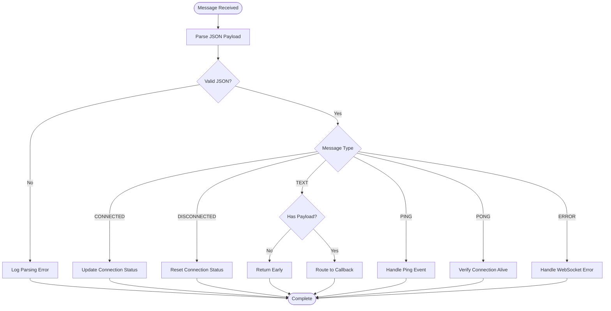

**Diagram sources**
- [nikolaindustry-realtime.cpp](file://src/nikolaindustry-realtime.cpp#L25-L59)

**Section sources**
- [nikolaindustry-realtime.cpp](file://src/nikolaindustry-realtime.cpp#L25-L59)

### Integration with HyperwisorIOT

The `HyperwisorIOT` class integrates the real-time layer through composition:

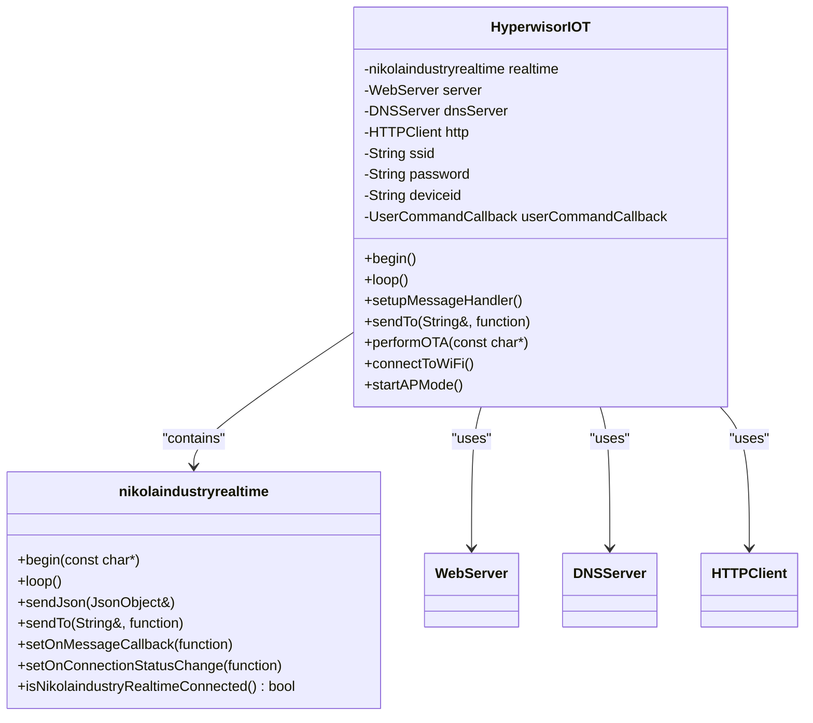

**Diagram sources**
- [hyperwisor-iot.h](file://src/hyperwisor-iot.h#L147-L187)
- [nikolaindustry-realtime.h](file://src/nikolaindustry-realtime.h#L10-L32)

**Section sources**
- [hyperwisor-iot.h](file://src/hyperwisor-iot.h#L147-L187)
- [hyperwisor-iot.cpp](file://src/hyperwisor-iot.cpp#L313-L405)

## WebSocket Message Formats

### JSON Payload Structure

The real-time communication protocol uses a standardized JSON message format:

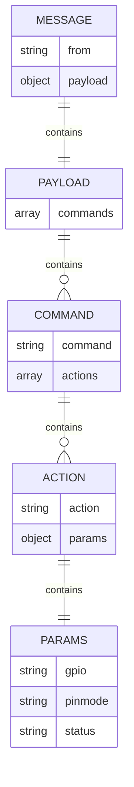

**Diagram sources**
- [README.md](file://README.md#L51-L76)

### Message Types and Events

The WebSocket implementation handles several distinct message types:

| Message Type | Description | Usage |
|--------------|-------------|-------|
| `WStype_CONNECTED` | Connection established successfully | Triggers connection status callback |
| `WStype_DISCONNECTED` | Connection lost or terminated | Resets connection state |
| `WStype_TEXT` | JSON message payload | Main data transmission channel |
| `WStype_PING` | Server heartbeat ping | Automatic response handled |
| `WStype_PONG` | Server heartbeat pong | Connection health verification |
| `WStype_ERROR` | WebSocket error occurred | Error handling and recovery |

**Section sources**
- [nikolaindustry-realtime.cpp](file://src/nikolaindustry-realtime.cpp#L28-L58)
- [README.md](file://README.md#L51-L76)

## Background Loop Implementation

The background loop implementation ensures continuous operation and connection maintenance:

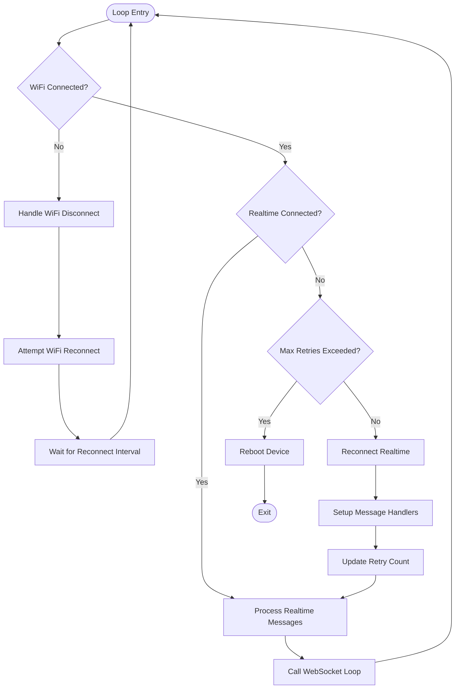

**Diagram sources**
- [hyperwisor-iot.cpp](file://src/hyperwisor-iot.cpp#L46-L137)

### Loop Control Parameters

The background loop implements sophisticated retry logic:

| Parameter | Value | Purpose |
|-----------|-------|---------|
| `lastReconnectAttempt` | `unsigned long` | Tracks last reconnection attempt time |
| `reconnectInterval` | 10000ms | Minimum interval between reconnection attempts |
| `retryCount` | `int` | Current number of reconnection attempts |
| `maxRetries` | 6 | Maximum allowed reconnection attempts |
| `webSocket.setReconnectInterval` | 5000ms | WebSocket library retry interval |

**Section sources**
- [hyperwisor-iot.cpp](file://src/hyperwisor-iot.cpp#L46-L137)
- [nikolaindustry-realtime.cpp](file://src/nikolaindustry-realtime.cpp#L61-L67)

## Reconnection Logic

### Multi-layered Reconnection Strategy

The reconnection logic implements a hierarchical approach to ensure robust connectivity:

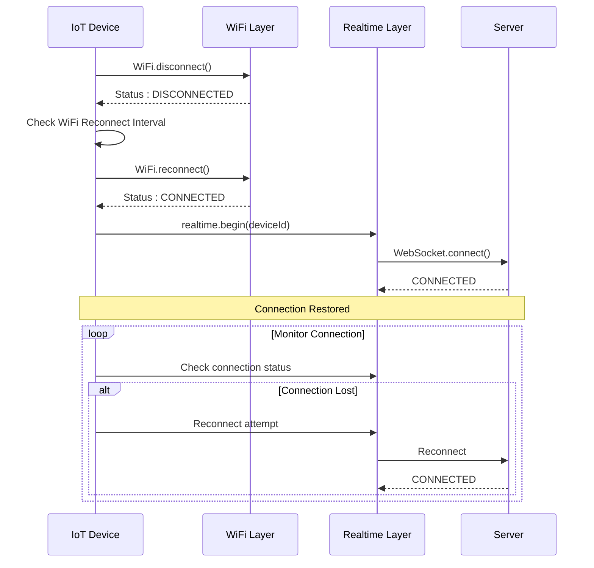

**Diagram sources**
- [hyperwisor-iot.cpp](file://src/hyperwisor-iot.cpp#L48-L92)

### Reconnection State Machine

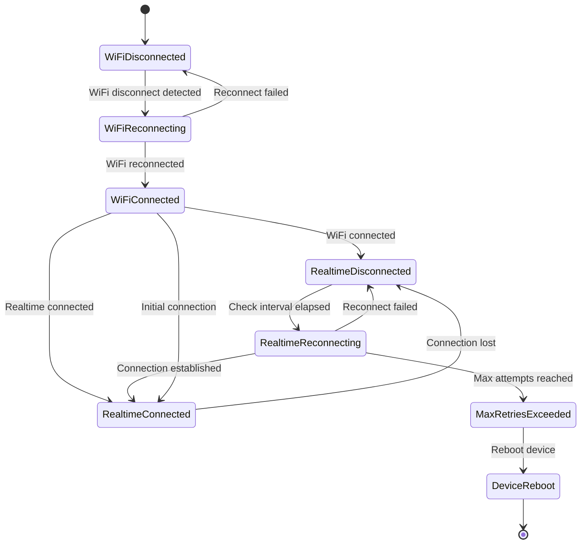

**Diagram sources**
- [hyperwisor-iot.cpp](file://src/hyperwisor-iot.cpp#L48-L92)

**Section sources**
- [hyperwisor-iot.cpp](file://src/hyperwisor-iot.cpp#L48-L92)

## Heartbeat Mechanisms

### Automatic Connection Health Monitoring

The heartbeat mechanism implements a sophisticated ping/pong system for connection health verification:

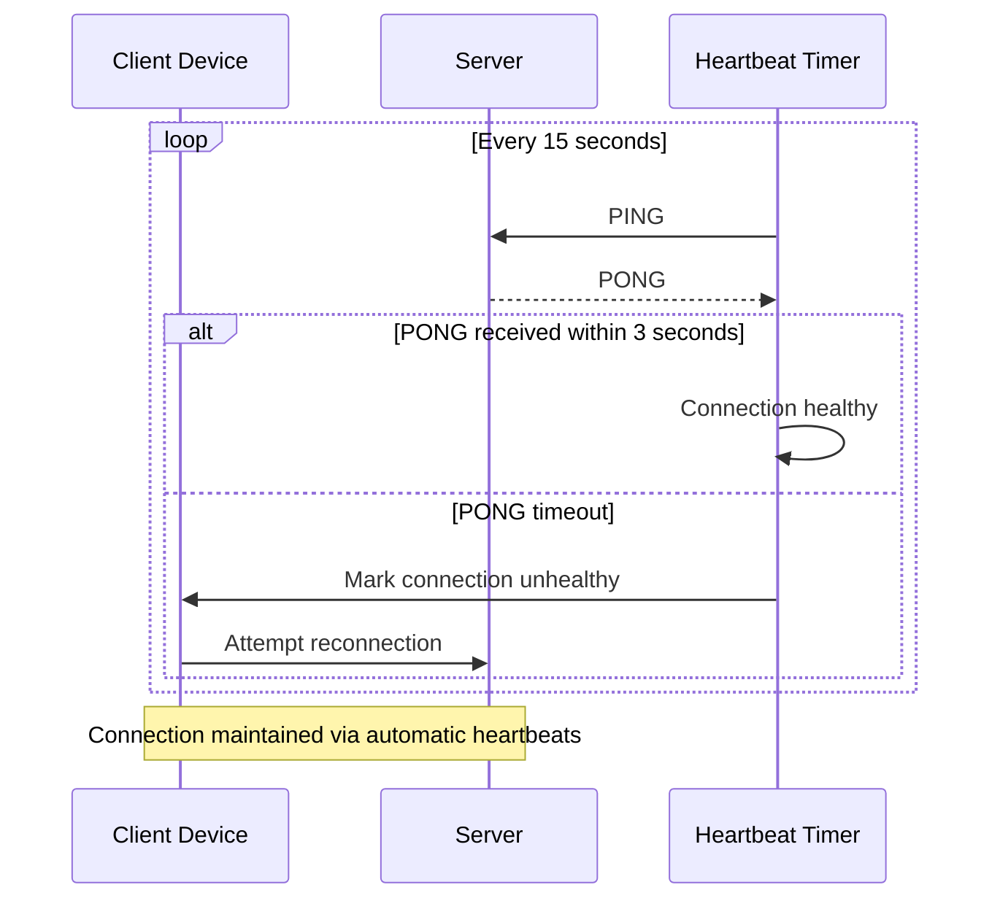

**Diagram sources**
- [nikolaindustry-realtime.cpp](file://src/nikolaindustry-realtime.cpp#L45-L52)

### Heartbeat Configuration Parameters

The heartbeat system uses the following configuration:

| Parameter | Value | Description |
|-----------|-------|-------------|
| `pingInterval` | 15000ms | Time between ping messages |
| `timeout` | 3000ms | Maximum wait time for pong response |
| `maxFailures` | 2 | Number of failed pongs before disconnect |

**Section sources**
- [nikolaindustry-realtime.cpp](file://src/nikolaindustry-realtime.cpp#L64-L66)

## Integration Patterns

### Command Processing Pipeline

The HyperwisorIOT class implements a comprehensive command processing pipeline:

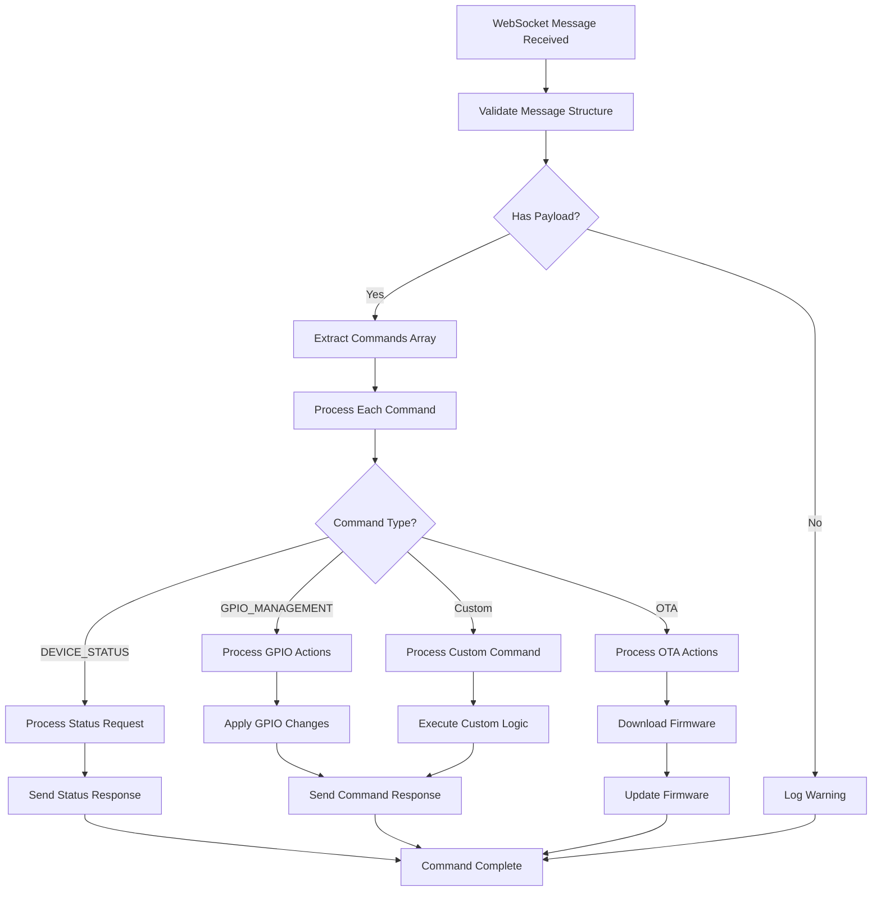

**Diagram sources**
- [hyperwisor-iot.cpp](file://src/hyperwisor-iot.cpp#L313-L405)

### Message Routing Architecture

The message routing system enables bidirectional communication:

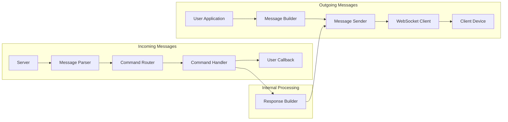

**Diagram sources**
- [hyperwisor-iot.cpp](file://src/hyperwisor-iot.cpp#L313-L405)
- [nikolaindustry-realtime.cpp](file://src/nikolaindustry-realtime.cpp#L90-L97)

**Section sources**
- [hyperwisor-iot.cpp](file://src/hyperwisor-iot.cpp#L313-L405)
- [nikolaindustry-realtime.cpp](file://src/nikolaindustry-realtime.cpp#L90-L97)

## Error Handling

### Comprehensive Error Management

The real-time communication layer implements robust error handling across multiple layers:

#### Connection Error Handling

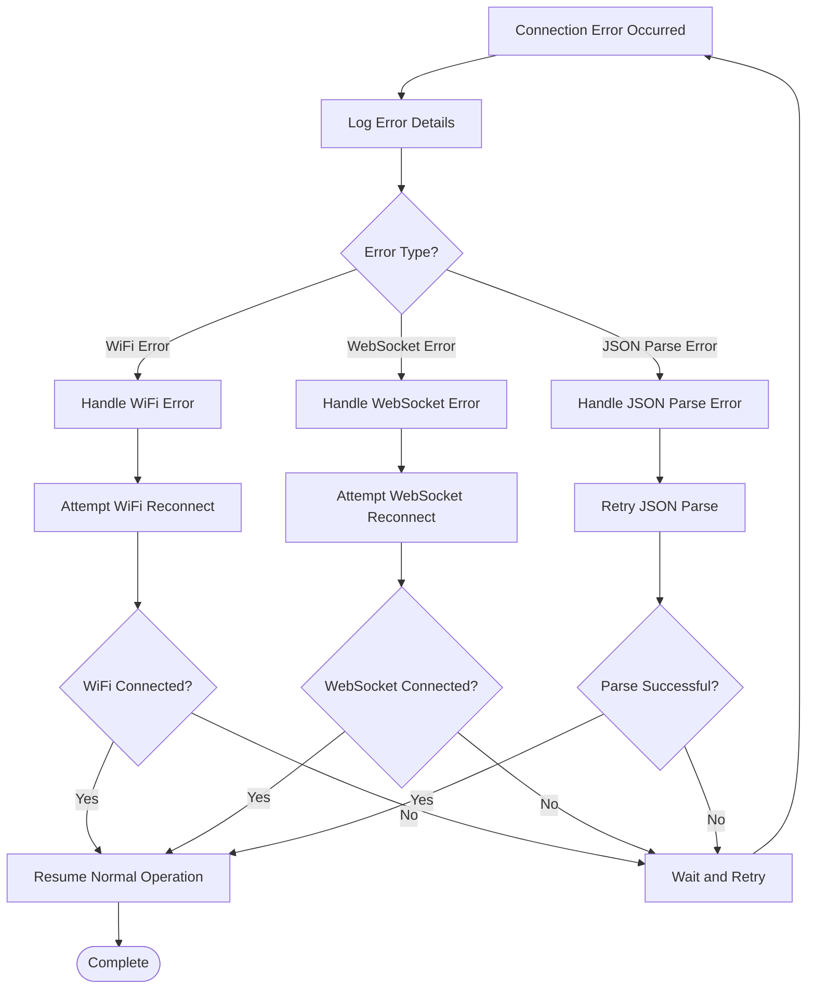

#### Error Recovery Strategies

| Error Type | Recovery Strategy | Timeout | Max Attempts |
|------------|-------------------|---------|--------------|
| WiFi Disconnection | `WiFi.reconnect()` | 10 seconds | Unlimited |
| WebSocket Disconnection | `realtime.begin()` | 10 seconds | 6 attempts |
| JSON Parse Failure | Retry parsing | Immediate | 3 attempts |
| Heartbeat Timeout | Reconnect websocket | 3 seconds | 2 failures |

**Section sources**
- [nikolaindustry-realtime.cpp](file://src/nikolaindustry-realtime.cpp#L53-L58)
- [hyperwisor-iot.cpp](file://src/hyperwisor-iot.cpp#L73-L86)

## Performance Optimization

### Memory Management

The real-time communication layer implements efficient memory management strategies:

#### JSON Document Management

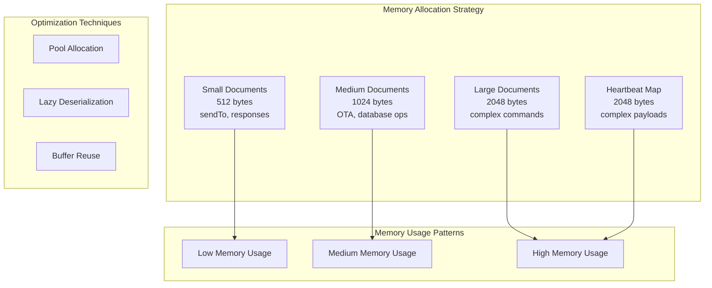

#### Performance Metrics

| Operation | Memory Usage | Processing Time | Notes |
|-----------|--------------|-----------------|-------|
| Small JSON | 512 bytes | <10ms | Typical command responses |
| Medium JSON | 1024 bytes | <20ms | OTA progress updates |
| Large JSON | 2048+ bytes | <50ms | Complex widget updates |
| Heartbeat | 2048 bytes | <15ms | Periodic monitoring |

### Network Optimization

The system implements several network optimization strategies:

1. **Connection Pooling**: Maintains persistent WebSocket connections
2. **Batch Processing**: Groups multiple operations into single transmissions
3. **Compression**: Utilizes efficient JSON serialization
4. **Timeout Management**: Prevents blocking operations

**Section sources**
- [nikolaindustry-realtime.cpp](file://src/nikolaindustry-realtime.cpp#L90-L97)
- [hyperwisor-iot.cpp](file://src/hyperwisor-iot.cpp#L521-L532)

## Troubleshooting Guide

### Common Issues and Solutions

#### Connection Issues

| Issue | Symptoms | Solution |
|-------|----------|----------|
| WiFi not connecting | Device stays in AP mode | Check credentials, verify router availability |
| WebSocket fails to connect | Repeated reconnection attempts | Verify SSL certificates, check firewall settings |
| Frequent disconnections | Connection drops every few minutes | Check power supply stability, reduce network interference |

#### Message Processing Issues

| Issue | Symptoms | Solution |
|-------|----------|----------|
| Commands not executing | GPIO pins remain unchanged | Verify command format, check action parameters |
| Responses not received | Client waits indefinitely | Ensure proper message routing, verify target IDs |
| JSON parsing errors | Error logs with parsing failures | Validate JSON structure, check payload format |

#### Performance Issues

| Issue | Symptoms | Solution |
|-------|----------|----------|
| Slow response times | Delays in command execution | Optimize JSON payload size, reduce unnecessary operations |
| Memory leaks | Gradual memory decrease | Check for proper JSON document cleanup, monitor allocation patterns |
| Heartbeat failures | Connection timeouts | Verify network stability, adjust heartbeat parameters |

### Debugging Tools

The system provides comprehensive debugging capabilities:

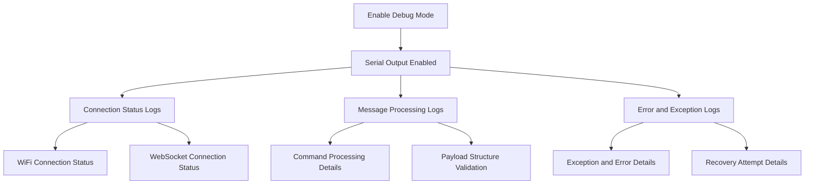

**Section sources**
- [nikolaindustry-realtime.cpp](file://src/nikolaindustry-realtime.cpp#L30-L51)
- [hyperwisor-iot.cpp](file://src/hyperwisor-iot.cpp#L48-L137)

## Conclusion

The Hyperwisor-IOT real-time communication layer provides a robust, production-ready solution for ESP32-based IoT devices requiring reliable bidirectional communication. The architecture successfully balances simplicity for developers with advanced features for production environments.

Key strengths of the implementation include:

- **Reliable Connection Management**: Multi-layered reconnection logic with automatic recovery
- **Efficient Resource Usage**: Optimized memory management and processing
- **Comprehensive Error Handling**: Structured error recovery and debugging capabilities
- **Flexible Integration**: Clean separation between real-time layer and application logic
- **Production Ready**: Heartbeat mechanisms, timeout handling, and graceful degradation

The nikolaindustry-realtime class serves as an excellent foundation for building real-time IoT applications, while the HyperwisorIOT main class provides the orchestration needed for complex device management scenarios. Together, they create a powerful platform for developing sophisticated IoT solutions with minimal development overhead.

Future enhancements could include support for additional transport protocols, enhanced security features, and expanded monitoring capabilities, building upon the solid foundation established by this implementation.