# WiFi Provisioning System

<cite>
**Referenced Files in This Document**
- [hyperwisor-iot.h](file://src/hyperwisor-iot.h)
- [hyperwisor-iot.cpp](file://src/hyperwisor-iot.cpp)
- [WiFiProvisioning.ino](file://examples/WiFiProvisioning/WiFiProvisioning.ino)
- [Manual_Provisioning_Example.ino](file://examples/Manual_Provisioning_Example/Manual_Provisioning_Example.ino)
- [Conditional_Provisioning_Example.ino](file://examples/Conditional_Provisioning_Example/Conditional_Provisioning_Example.ino)
- [README.md](file://README.md)
</cite>

## Table of Contents
1. [Introduction](#introduction)
2. [Project Structure](#project-structure)
3. [Core Components](#core-components)
4. [Architecture Overview](#architecture-overview)
5. [Detailed Component Analysis](#detailed-component-analysis)
6. [Dependency Analysis](#dependency-analysis)
7. [Performance Considerations](#performance-considerations)
8. [Troubleshooting Guide](#troubleshooting-guide)
9. [Conclusion](#conclusion)

## Introduction
This document provides comprehensive technical documentation for the WiFi provisioning system within the Hyperwisor IoT Arduino library. It explains how the library supports both manual and conditional provisioning modes, AP mode functionality with a built-in captive portal, DNS redirection mechanisms, credential storage using Preferences, WiFi connection management, and fallback retry logic. It also covers the HTML provisioning interface, user credential input validation, secure credential handling, and practical troubleshooting guidance for common network configuration issues.

## Project Structure
The WiFi provisioning system is implemented within the HyperwisorIOT class, which orchestrates:
- Initial credential loading from NVS (Preferences)
- WiFi connection attempts with timeout and fallback to AP mode
- AP mode setup with DNS redirection and HTTP provisioning endpoint
- Credential persistence and device/user identification storage
- Retry logic for WebSocket connectivity and WiFi reconnection

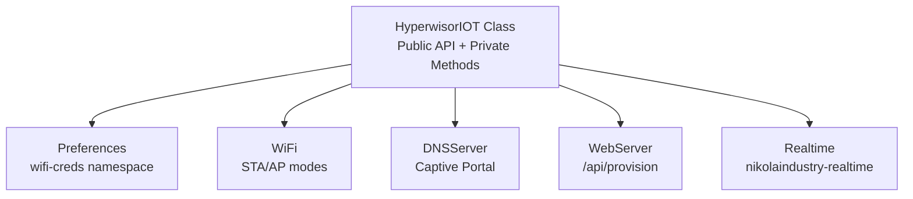

**Diagram sources**
- [hyperwisor-iot.h](file://src/hyperwisor-iot.h#L39-L187)
- [hyperwisor-iot.cpp](file://src/hyperwisor-iot.cpp#L13-L137)

**Section sources**
- [hyperwisor-iot.h](file://src/hyperwisor-iot.h#L39-L187)
- [hyperwisor-iot.cpp](file://src/hyperwisor-iot.cpp#L13-L137)
- [README.md](file://README.md#L22-L36)

## Core Components
- WiFi provisioning orchestration: begin(), loop()
- AP mode: startAPMode(), DNS redirection, HTTP provisioning endpoint
- Credential handling: Preferences-based storage, getcredentials(), setCredentials(), clearCredentials(), hasCredentials()
- Connection management: connectToWiFi() with timeout and fallback
- Retry logic: WebSocket reconnection attempts and WiFi reconnection with exponential backoff
- Message handling: setupMessageHandler() for real-time commands

**Section sources**
- [hyperwisor-iot.cpp](file://src/hyperwisor-iot.cpp#L13-L137)
- [hyperwisor-iot.cpp](file://src/hyperwisor-iot.cpp#L141-L156)
- [hyperwisor-iot.cpp](file://src/hyperwisor-iot.cpp#L159-L185)
- [hyperwisor-iot.cpp](file://src/hyperwisor-iot.cpp#L256-L275)
- [hyperwisor-iot.cpp](file://src/hyperwisor-iot.cpp#L278-L310)
- [hyperwisor-iot.cpp](file://src/hyperwisor-iot.cpp#L313-L405)
- [hyperwisor-iot.cpp](file://src/hyperwisor-iot.cpp#L432-L518)

## Architecture Overview
The WiFi provisioning system follows a deterministic flow:
- On boot, credentials are loaded from Preferences
- If credentials exist, the device attempts to connect to WiFi with a timeout
- If connection fails, AP mode is started with DNS redirection and a provisioning HTTP endpoint
- Users submit credentials via the captive portal; the device persists them and restarts
- On subsequent boots, the device connects using stored credentials
- Background loop manages WebSocket reconnection and periodic WiFi reconnection

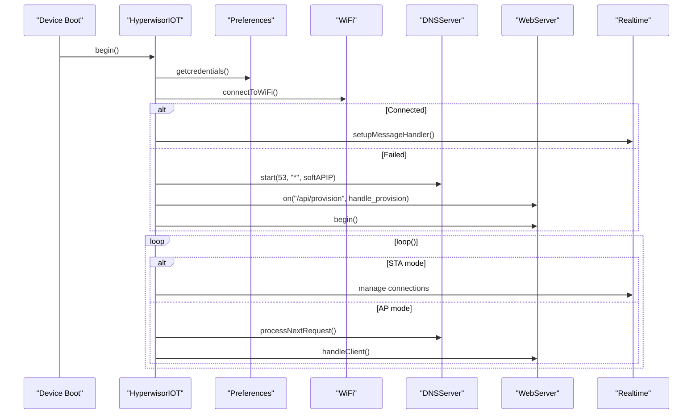

**Diagram sources**
- [hyperwisor-iot.cpp](file://src/hyperwisor-iot.cpp#L13-L137)
- [hyperwisor-iot.cpp](file://src/hyperwisor-iot.cpp#L141-L156)
- [hyperwisor-iot.cpp](file://src/hyperwisor-iot.cpp#L159-L185)
- [hyperwisor-iot.cpp](file://src/hyperwisor-iot.cpp#L278-L310)
- [hyperwisor-iot.cpp](file://src/hyperwisor-iot.cpp#L313-L405)

## Detailed Component Analysis

### Manual Provisioning Mode
Manual provisioning allows setting credentials programmatically during setup without relying on AP mode. The library provides:
- setWiFiCredentials(): stores SSID and password
- setDeviceId(): stores device identifier
- setUserId(): stores user identifier
- setCredentials(): bulk setter for SSID, password, device ID, optional user ID
- clearCredentials(): clears stored credentials
- hasCredentials(): checks existence of required credentials

Implementation highlights:
- Uses Preferences with namespace "wifi-creds"
- Persists only the essential fields for WiFi connectivity and device identity
- Immediately applies provided values to runtime state

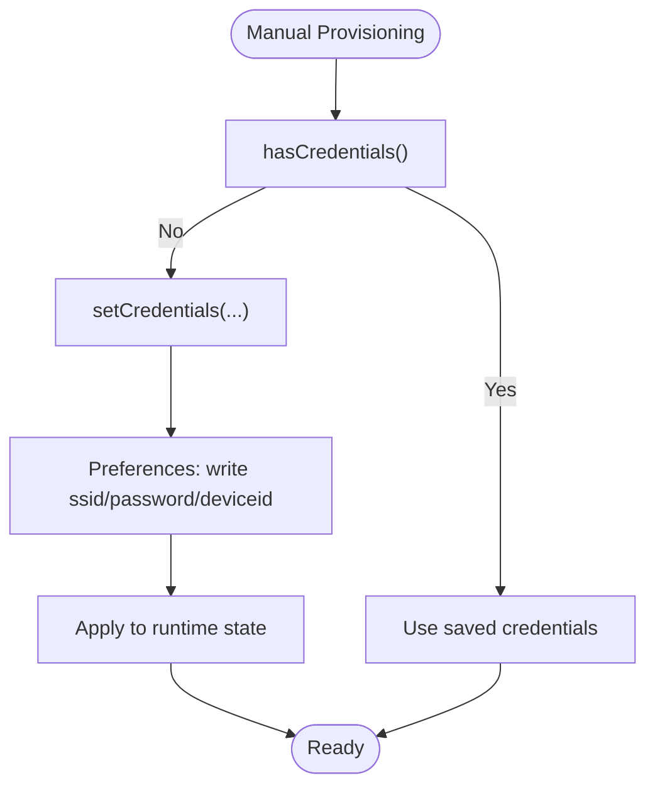

**Diagram sources**
- [hyperwisor-iot.cpp](file://src/hyperwisor-iot.cpp#L432-L518)

**Section sources**
- [hyperwisor-iot.cpp](file://src/hyperwisor-iot.cpp#L432-L518)
- [Manual_Provisioning_Example.ino](file://examples/Manual_Provisioning_Example/Manual_Provisioning_Example.ino#L35-L47)

### Conditional Provisioning Mode
Conditional provisioning combines manual and AP provisioning:
- On first boot, check for existing credentials
- If missing, optionally set credentials manually
- Otherwise, fall back to AP mode for user-driven provisioning

This approach enables flexible deployment scenarios and graceful fallbacks.

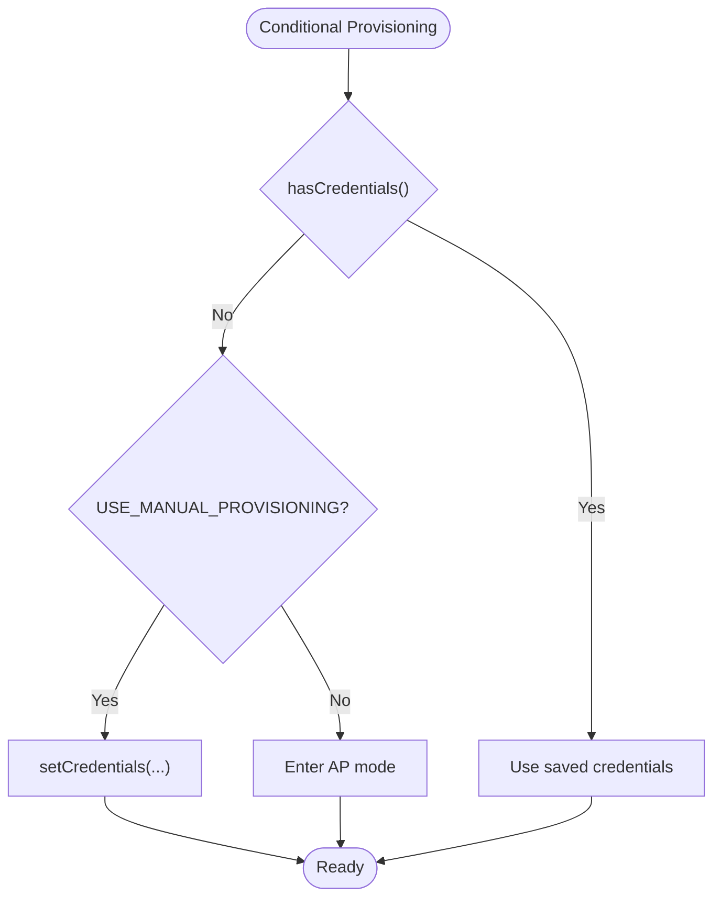

**Diagram sources**
- [Conditional_Provisioning_Example.ino](file://examples/Conditional_Provisioning_Example/Conditional_Provisioning_Example.ino#L28-L51)

**Section sources**
- [Conditional_Provisioning_Example.ino](file://examples/Conditional_Provisioning_Example/Conditional_Provisioning_Example.ino#L28-L51)

### AP Mode Functionality with Captive Portal
When credentials are absent or connection fails, the device starts AP mode:
- Creates an access point with a fixed SSID and password
- Starts DNSServer to intercept DNS queries and redirect to the device's IP
- Initializes WebServer and registers the provisioning endpoint "/api/provision"
- Provides success/error HTML pages with deep links back to the app

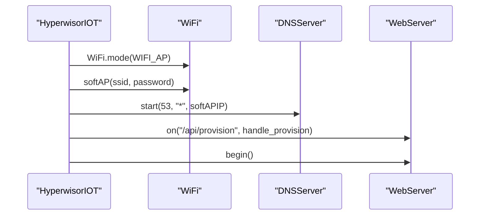

**Diagram sources**
- [hyperwisor-iot.cpp](file://src/hyperwisor-iot.cpp#L141-L156)

**Section sources**
- [hyperwisor-iot.cpp](file://src/hyperwisor-iot.cpp#L141-L156)

### DNS Redirection Mechanisms
The DNSServer listens on port 53 and redirects all queries to the device's AP IP address. This ensures that any HTTP request resolves to the device, enabling seamless captive portal behavior without requiring users to manually enter IP addresses.

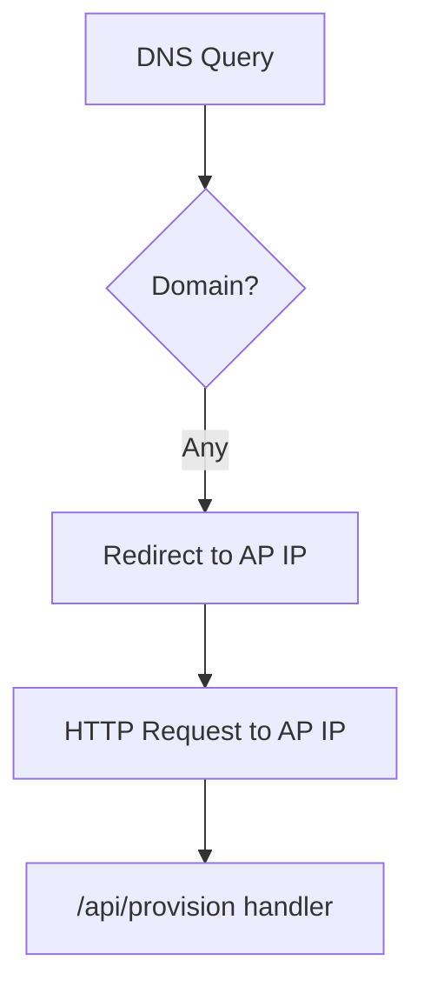

**Diagram sources**
- [hyperwisor-iot.cpp](file://src/hyperwisor-iot.cpp#L150-L154)

**Section sources**
- [hyperwisor-iot.cpp](file://src/hyperwisor-iot.cpp#L150-L154)

### HTML Provisioning Interface
The provisioning endpoint responds with HTML pages:
- Success page: informs the user that the device is connecting and provides a deep link back to the app
- Error page: displays a user-friendly error message and a deep link back to the app

The success page constructs a deep link using a custom scheme to signal completion to the companion app.

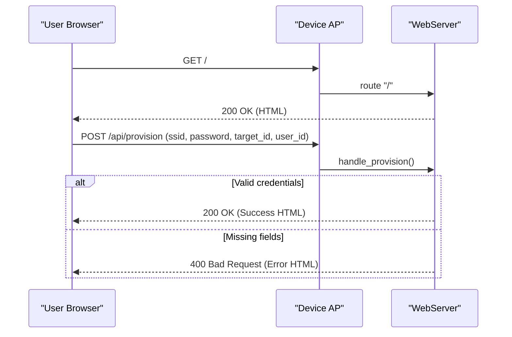

**Diagram sources**
- [hyperwisor-iot.cpp](file://src/hyperwisor-iot.cpp#L152-L185)
- [hyperwisor-iot.cpp](file://src/hyperwisor-iot.cpp#L188-L253)

**Section sources**
- [hyperwisor-iot.cpp](file://src/hyperwisor-iot.cpp#L152-L185)
- [hyperwisor-iot.cpp](file://src/hyperwisor-iot.cpp#L188-L253)

### User Credential Input Validation and Secure Handling
Validation performed by the provisioning handler:
- Checks presence of SSID field
- Stores SSID, password, device ID, and user ID into Preferences
- Triggers a restart to apply new credentials

Security considerations:
- Credentials are stored in NVS using the Preferences API
- The password is stored as-is; consider adding encryption at the application level if required
- The provisioning endpoint does not enforce strict input sanitization; ensure upstream validation in the app layer

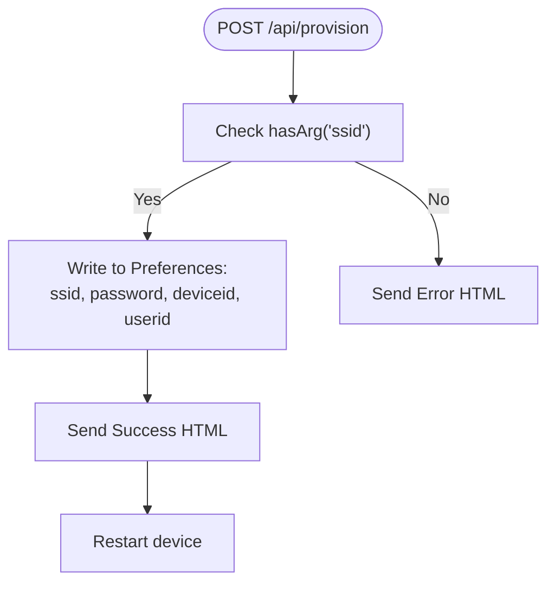

**Diagram sources**
- [hyperwisor-iot.cpp](file://src/hyperwisor-iot.cpp#L159-L185)

**Section sources**
- [hyperwisor-iot.cpp](file://src/hyperwisor-iot.cpp#L159-L185)

### Credential Storage Using Preferences
The library uses the Preferences API to persist:
- ssid: WiFi network name
- password: WiFi passphrase
- deviceid: Unique device identifier
- userid: Optional user identifier
- email, productid, firmware: Additional metadata

Storage namespace: "wifi-creds"

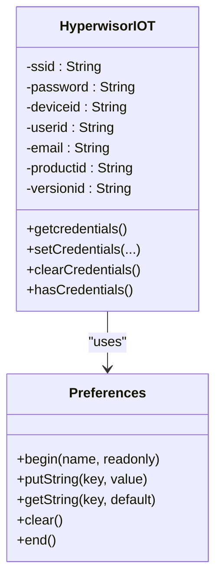

**Diagram sources**
- [hyperwisor-iot.cpp](file://src/hyperwisor-iot.cpp#L256-L275)
- [hyperwisor-iot.cpp](file://src/hyperwisor-iot.cpp#L432-L518)

**Section sources**
- [hyperwisor-iot.cpp](file://src/hyperwisor-iot.cpp#L256-L275)
- [hyperwisor-iot.cpp](file://src/hyperwisor-iot.cpp#L432-L518)

### WiFi Connection Management and Fallback Retry Logic
Connection management includes:
- connectToWiFi(): sets hostname, mode, disables sleep, attempts connection with 30-second timeout
- fallback to AP mode if connection fails
- loop(): manages WebSocket reconnection attempts with exponential backoff and maximum retry limits
- loop(): periodically attempts WiFi reconnection if disconnected

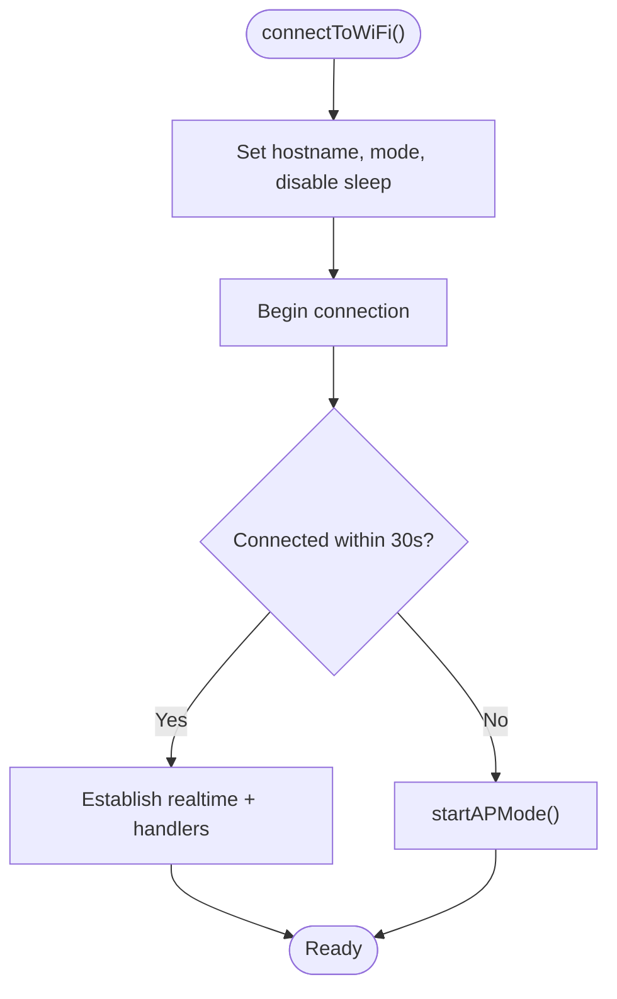

**Diagram sources**
- [hyperwisor-iot.cpp](file://src/hyperwisor-iot.cpp#L278-L310)

**Section sources**
- [hyperwisor-iot.cpp](file://src/hyperwisor-iot.cpp#L278-L310)
- [hyperwisor-iot.cpp](file://src/hyperwisor-iot.cpp#L46-L137)

### Concrete Code References
- setupMessageHandler(): registers real-time message callbacks and handles commands
  - [hyperwisor-iot.cpp](file://src/hyperwisor-iot.cpp#L313-L405)
- startAPMode(): initializes AP mode, DNS redirection, and HTTP provisioning endpoint
  - [hyperwisor-iot.cpp](file://src/hyperwisor-iot.cpp#L141-L156)
- handle_provision(): validates input, stores credentials, sends success/error HTML
  - [hyperwisor-iot.cpp](file://src/hyperwisor-iot.cpp#L159-L185)
- connectToWiFi(): attempts connection with timeout and fallback
  - [hyperwisor-iot.cpp](file://src/hyperwisor-iot.cpp#L278-L310)

**Section sources**
- [hyperwisor-iot.cpp](file://src/hyperwisor-iot.cpp#L313-L405)
- [hyperwisor-iot.cpp](file://src/hyperwisor-iot.cpp#L141-L156)
- [hyperwisor-iot.cpp](file://src/hyperwisor-iot.cpp#L159-L185)
- [hyperwisor-iot.cpp](file://src/hyperwisor-iot.cpp#L278-L310)

## Dependency Analysis
The WiFi provisioning system depends on:
- WiFi for station and access point modes
- Preferences for persistent storage
- WebServer for the captive portal
- DNSServer for DNS redirection
- HTTPClient for optional HTTP operations
- ArduinoJson for JSON handling
- Update for OTA operations
- nikolaindustry-realtime for real-time messaging

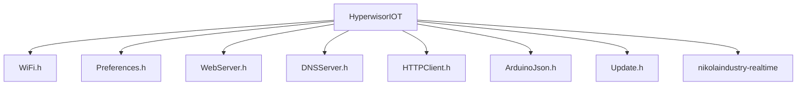

**Diagram sources**
- [hyperwisor-iot.h](file://src/hyperwisor-iot.h#L4-L14)

**Section sources**
- [hyperwisor-iot.h](file://src/hyperwisor-iot.h#L4-L14)

## Performance Considerations
- AP mode lifecycle: AP mode is automatically restarted after 4 minutes to prevent indefinite AP sessions; consider extending or disabling this behavior if needed
- Retry intervals: WebSocket reconnection attempts occur every 10 seconds with a maximum of 6 attempts; adjust reconnectInterval and maxRetries as needed
- WiFi timeout: Connection attempts wait up to 30 seconds; tune this based on network conditions
- DNS overhead: DNSServer runs continuously in AP mode; ensure minimal impact on CPU and memory

[No sources needed since this section provides general guidance]

## Troubleshooting Guide

Common issues and resolutions:
- AP mode failures
  - Symptoms: Device does not appear as an AP or browser cannot reach the provisioning page
  - Causes: WiFi initialization errors, DNS server startup issues, or HTTP server binding conflicts
  - Actions: Verify WiFi mode transitions, confirm DNSServer start with correct IP, ensure no conflicting HTTP handlers
  - Reference: [hyperwisor-iot.cpp](file://src/hyperwisor-iot.cpp#L141-L156)

- Connection timeouts
  - Symptoms: Device fails to connect to WiFi within 30 seconds and falls back to AP mode
  - Causes: Incorrect credentials, network unreachable, router overload
  - Actions: Validate SSID and password, check router availability, reduce interference
  - Reference: [hyperwisor-iot.cpp](file://src/hyperwisor-iot.cpp#L288-L310)

- Credential persistence problems
  - Symptoms: Device forgets credentials after restart or fails to load them
  - Causes: Preferences namespace mismatch, NVS corruption, or incorrect key names
  - Actions: Confirm Preferences namespace "wifi-creds", verify key names, clear and re-save credentials
  - Reference: [hyperwisor-iot.cpp](file://src/hyperwisor-iot.cpp#L256-L275), [hyperwisor-iot.cpp](file://src/hyperwisor-iot.cpp#L432-L518)

- AP mode stuck for extended periods
  - Symptoms: Device remains in AP mode beyond 4 minutes
  - Causes: User did not complete provisioning or device did not receive credentials
  - Actions: Force restart the device or clear credentials to re-enter AP mode
  - Reference: [hyperwisor-iot.cpp](file://src/hyperwisor-iot.cpp#L127-L131)

- WebSocket disconnections
  - Symptoms: Realtime connection drops intermittently
  - Causes: Network instability, server-side issues, or excessive retry attempts
  - Actions: Monitor retry logs, verify network stability, adjust reconnectInterval and maxRetries
  - Reference: [hyperwisor-iot.cpp](file://src/hyperwisor-iot.cpp#L46-L137)

- Captive portal not working
  - Symptoms: Browser does not redirect to the provisioning page
  - Causes: DNS interception not functioning or incorrect routing
  - Actions: Confirm DNSServer start and IP assignment, verify HTTP route registration
  - Reference: [hyperwisor-iot.cpp](file://src/hyperwisor-iot.cpp#L150-L154)

**Section sources**
- [hyperwisor-iot.cpp](file://src/hyperwisor-iot.cpp#L127-L131)
- [hyperwisor-iot.cpp](file://src/hyperwisor-iot.cpp#L141-L156)
- [hyperwisor-iot.cpp](file://src/hyperwisor-iot.cpp#L150-L154)
- [hyperwisor-iot.cpp](file://src/hyperwisor-iot.cpp#L256-L275)
- [hyperwisor-iot.cpp](file://src/hyperwisor-iot.cpp#L288-L310)
- [hyperwisor-iot.cpp](file://src/hyperwisor-iot.cpp#L46-L137)
- [hyperwisor-iot.cpp](file://src/hyperwisor-iot.cpp#L432-L518)

## Conclusion
The WiFi provisioning system provides a robust, production-ready mechanism for configuring ESP32-based IoT devices. It supports manual provisioning for controlled deployments, conditional provisioning for flexible scenarios, and AP mode with a captive portal for user-driven setup. With Preferences-based credential storage, DNS redirection, and comprehensive retry logic, the system ensures reliable connectivity and a smooth user experience. Proper validation, secure handling, and troubleshooting practices help maintain system stability and user trust.