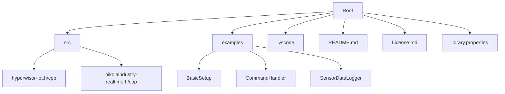
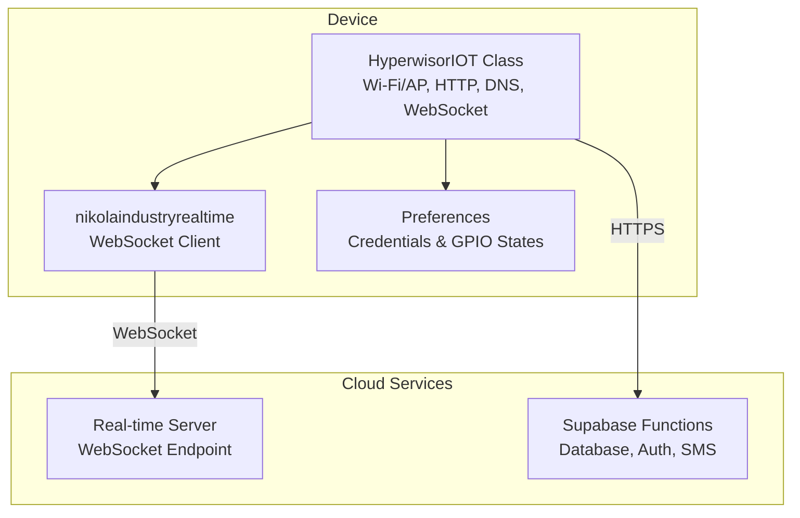
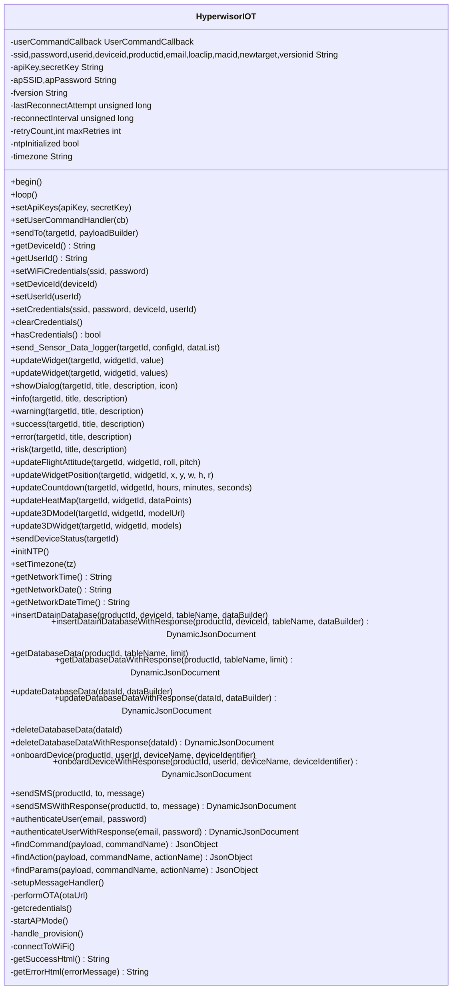
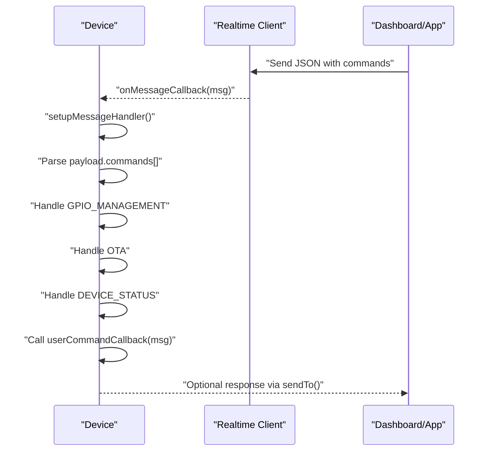
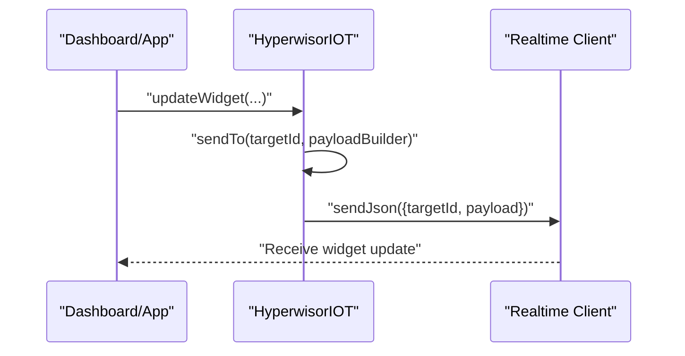
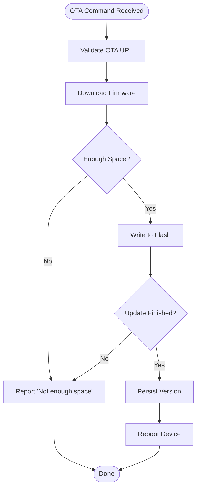
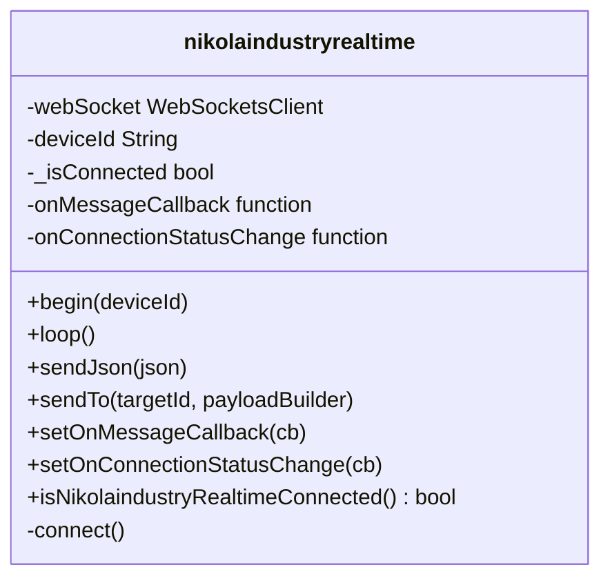
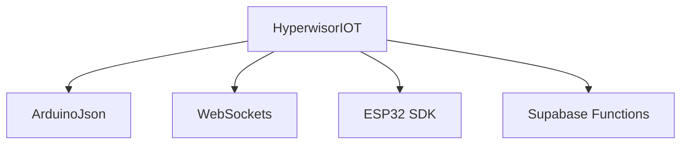

# Developer Resources

<cite>
**Referenced Files in This Document**
- [README.md](file://README.md)
- [License.md](file://License.md)
- [library.properties](file://library.properties)
- [src/hyperwisor-iot.h](file://src/hyperwisor-iot.h)
- [src/hyperwisor-iot.cpp](file://src/hyperwisor-iot.cpp)
- [src/nikolaindustry-realtime.h](file://src/nikolaindustry-realtime.h)
- [src/nikolaindustry-realtime.cpp](file://src/nikolaindustry-realtime.cpp)
- [.vscode/settings.json](file://.vscode/settings.json)
- [.vscode/launch.json](file://.vscode/launch.json)
- [examples/BasicSetup/BasicSetup.ino](file://examples/BasicSetup/BasicSetup.ino)
- [examples/CommandHandler/CommandHandler.ino](file://examples/CommandHandler/CommandHandler.ino)
- [examples/SensorDataLogger/SensorDataLogger.ino](file://examples/SensorDataLogger/SensorDataLogger.ino)
</cite>

## Table of Contents
1. [Introduction](#introduction)
2. [Project Structure](#project-structure)
3. [Core Components](#core-components)
4. [Architecture Overview](#architecture-overview)
5. [Detailed Component Analysis](#detailed-component-analysis)
6. [Dependency Analysis](#dependency-analysis)
7. [Performance Considerations](#performance-considerations)
8. [Troubleshooting Guide](#troubleshooting-guide)
9. [Contribution Guidelines](#contribution-guidelines)
10. [Licensing and Commercial Use](#licensing-and-commercial-use)
11. [Development Environment Setup](#development-environment-setup)
12. [Testing Methodologies](#testing-methodologies)
13. [Extending the Library](#extending-the-library)
14. [Conclusion](#conclusion)

## Introduction
This document provides comprehensive developer resources for extending and contributing to the Hyperwisor-IOT Arduino library. It covers:
- Extension guidelines for custom widget development, plugin creation, and API customization
- Contribution guidelines including code standards, testing procedures, and documentation requirements
- Internal architecture details for understanding implementation, modifying functionality, and creating custom integrations
- Development environment setup, debugging techniques, and testing methodologies
- Licensing terms, proprietary restrictions, and commercial usage requirements
- Guidelines for creating custom command handlers, extending the widget system, and integrating with additional cloud services
- Code review processes, version management, and release procedures

## Project Structure
The repository is organized into core library sources, protocol integration, examples, and development environment configurations:
- src: Library implementation (main class and protocol wrapper)
- examples: Usage demonstrations for basic setup, command handling, and sensor logging
- .vscode: VS Code configuration for compilation warnings and debugging
- Root: Documentation, license, and library metadata

**Diagram sources**
- [README.md](file://README.md#L1-L173)
- [library.properties](file://library.properties#L1-L11)
- [src/hyperwisor-iot.h](file://src/hyperwisor-iot.h#L1-L190)
- [src/nikolaindustry-realtime.h](file://src/nikolaindustry-realtime.h#L1-L35)

**Section sources**
- [README.md](file://README.md#L1-L173)
- [library.properties](file://library.properties#L1-L11)

## Core Components
The library centers around a primary class that orchestrates Wi-Fi provisioning, real-time communication, OTA updates, GPIO management, and structured JSON command execution. It integrates with a companion protocol library for WebSocket-based real-time messaging.

Key capabilities:
- Wi-Fi provisioning (STA/AP mode, HTTP provisioning server, DNS redirection)
- Real-time messaging via WebSocket with heartbeat and reconnection
- OTA firmware updates with progress reporting
- GPIO state persistence and restoration
- Widget APIs for dashboards (strings, floats, arrays, dialogs, flight attitude, positioning, countdown, heatmaps, 3D models)
- Database operations (insert, get, update, delete) and device onboarding
- SMS service integration
- Time synchronization via NTP with timezone support

**Section sources**
- [src/hyperwisor-iot.h](file://src/hyperwisor-iot.h#L39-L187)
- [src/hyperwisor-iot.cpp](file://src/hyperwisor-iot.cpp#L13-L137)
- [src/nikolaindustry-realtime.h](file://src/nikolaindustry-realtime.h#L10-L32)
- [src/nikolaindustry-realtime.cpp](file://src/nikolaindustry-realtime.cpp#L5-L113)

## Architecture Overview
The system architecture combines a device-side library with a real-time protocol and optional cloud services. The device initializes Wi-Fi, falls back to AP mode if needed, establishes a WebSocket connection, and processes incoming commands.

**Diagram sources**
- [src/hyperwisor-iot.cpp](file://src/hyperwisor-iot.cpp#L13-L137)
- [src/nikolaindustry-realtime.cpp](file://src/nikolaindustry-realtime.cpp#L5-L113)
- [src/hyperwisor-iot.cpp](file://src/hyperwisor-iot.cpp#L731-L847)

## Detailed Component Analysis

### HyperwisorIOT Class
The primary class encapsulates device lifecycle, provisioning, real-time messaging, and utility functions.

**Diagram sources**
- [src/hyperwisor-iot.h](file://src/hyperwisor-iot.h#L39-L187)
- [src/hyperwisor-iot.cpp](file://src/hyperwisor-iot.cpp#L13-L1811)

**Section sources**
- [src/hyperwisor-iot.h](file://src/hyperwisor-iot.h#L39-L187)
- [src/hyperwisor-iot.cpp](file://src/hyperwisor-iot.cpp#L13-L1811)

### Message Handling Flow
Incoming messages are parsed and routed to built-in handlers and user-defined callbacks.

**Diagram sources**
- [src/hyperwisor-iot.cpp](file://src/hyperwisor-iot.cpp#L313-L404)
- [src/nikolaindustry-realtime.cpp](file://src/nikolaindustry-realtime.cpp#L25-L59)

**Section sources**
- [src/hyperwisor-iot.cpp](file://src/hyperwisor-iot.cpp#L313-L404)

### Widget Update Flow
Multiple widget update methods serialize structured payloads and send them via the real-time channel.

**Diagram sources**
- [src/hyperwisor-iot.cpp](file://src/hyperwisor-iot.cpp#L551-L598)
- [src/hyperwisor-iot.cpp](file://src/hyperwisor-iot.cpp#L521-L532)
- [src/nikolaindustry-realtime.cpp](file://src/nikolaindustry-realtime.cpp#L77-L97)

**Section sources**
- [src/hyperwisor-iot.cpp](file://src/hyperwisor-iot.cpp#L521-L598)

### OTA Update Flow
OTA updates are triggered by commands and executed with progress reporting.

**Diagram sources**
- [src/hyperwisor-iot.cpp](file://src/hyperwisor-iot.cpp#L1417-L1503)

**Section sources**
- [src/hyperwisor-iot.cpp](file://src/hyperwisor-iot.cpp#L1417-L1503)

### Protocol Wrapper (nikolaindustry-realtime)
The protocol wrapper manages WebSocket connectivity, heartbeats, and message serialization.

**Diagram sources**
- [src/nikolaindustry-realtime.h](file://src/nikolaindustry-realtime.h#L10-L32)
- [src/nikolaindustry-realtime.cpp](file://src/nikolaindustry-realtime.cpp#L5-L113)

**Section sources**
- [src/nikolaindustry-realtime.h](file://src/nikolaindustry-realtime.h#L10-L32)
- [src/nikolaindustry-realtime.cpp](file://src/nikolaindustry-realtime.cpp#L5-L113)

### Example Usage Patterns
- Basic initialization and loop maintenance
- Custom command handler registration and response generation
- Periodic sensor data logging to the platform

**Section sources**
- [examples/BasicSetup/BasicSetup.ino](file://examples/BasicSetup/BasicSetup.ino#L1-L39)
- [examples/CommandHandler/CommandHandler.ino](file://examples/CommandHandler/CommandHandler.ino#L1-L96)
- [examples/SensorDataLogger/SensorDataLogger.ino](file://examples/SensorDataLogger/SensorDataLogger.ino#L1-L77)

## Dependency Analysis
External dependencies and integration points:
- ArduinoJson: JSON parsing and serialization
- WebSockets: WebSocket client for real-time communication
- ESP32 SDK: WiFi, Preferences, Update, DNSServer, Wire, HTTPClient, time
- Supabase Functions: Database runtime data, onboarding, authentication, SMS

**Diagram sources**
- [library.properties](file://library.properties#L10-L11)
- [src/hyperwisor-iot.cpp](file://src/hyperwisor-iot.cpp#L731-L847)

**Section sources**
- [library.properties](file://library.properties#L10-L11)
- [README.md](file://README.md#L92-L122)

## Performance Considerations
- Prefer lightweight JSON payloads for frequent updates (e.g., widget arrays vs. single values)
- Batch sensor readings and send at intervals to reduce network overhead
- Use NTP sparingly; cache time locally and refresh periodically
- Limit OTA update frequency and ensure sufficient flash space
- Monitor heap usage and avoid deep nesting in JSON documents

## Troubleshooting Guide
Common issues and resolutions:
- Wi-Fi connection failures: Verify credentials, ensure AP mode provisioning completes, and confirm network availability
- WebSocket disconnections: Check heartbeat settings, server reachability, and reconnection attempts
- OTA failures: Validate URL, content length, and available flash space; inspect error logs
- Cloud API errors: Confirm API keys, network connectivity, and endpoint availability
- Time synchronization: Ensure NTP initialization and timezone configuration

**Section sources**
- [src/hyperwisor-iot.cpp](file://src/hyperwisor-iot.cpp#L46-L137)
- [src/hyperwisor-iot.cpp](file://src/hyperwisor-iot.cpp#L1417-L1503)
- [src/hyperwisor-iot.cpp](file://src/hyperwisor-iot.cpp#L1617-L1779)

## Contribution Guidelines
Contributions are welcome. While the repository indicates openness to suggestions and pull requests, the license restricts redistribution and modification without explicit permission. Contributors should:
- Follow existing code style and patterns
- Add comprehensive comments and documentation
- Provide example sketches demonstrating new features
- Test on supported hardware (ESP32)
- Submit changes via pull requests for review

**Section sources**
- [README.md](file://README.md#L166-L173)
- [License.md](file://License.md#L10-L21)

## Licensing and Commercial Use
- License type: Proprietary - All Rights Reserved
- Restrictions: Redistribution, sublicensing, disclosure, and open-source use are prohibited without explicit written permission
- Allowed usage: Exclusive use with NIKOLAINDUSTRY hardware/software and closed-source commercial applications developed in partnership with NIKOLAINDUSTRY
- Contact for licensing: support@nikolaindustry.com

**Section sources**
- [License.md](file://License.md#L8-L32)
- [README.md](file://README.md#L125-L164)

## Development Environment Setup
Recommended setup:
- Arduino IDE with ESP32 board package
- Install required libraries via Library Manager (ArduinoJson, WebSockets)
- Configure VS Code with compiler warnings and debugging settings
- Use examples as templates for new projects

**Section sources**
- [README.md](file://README.md#L92-L122)
- [.vscode/settings.json](file://.vscode/settings.json#L1-L59)
- [.vscode/launch.json](file://.vscode/launch.json#L1-L24)

## Testing Methodologies
- Unit-level: Validate JSON parsing, widget updates, and database operations with small payloads
- Integration-level: End-to-end testing with real-time server and cloud endpoints
- Field-level: Verify Wi-Fi provisioning, OTA updates, and GPIO state persistence
- Automated: Use example sketches as regression tests; simulate command injection and error scenarios

## Extending the Library
Guidelines for extending the library:
- Custom command handlers
  - Register a user command handler to intercept and process custom commands
  - Use helper functions to locate commands, actions, and parameters within payloads
  - Send targeted responses using the provided sendTo method

- Widget system extensions
  - Add new widget update methods mirroring existing patterns
  - Define data structures for complex widgets (e.g., 3D model updates)
  - Serialize structured payloads consistently

- API customization
  - Introduce new cloud service integrations by adding HTTP client wrappers
  - Maintain API key management and error handling
  - Provide synchronous and asynchronous variants for operations

- Plugin creation
  - Encapsulate domain-specific logic in separate modules
  - Expose clean interfaces for widget updates and command handling
  - Ensure compatibility with the real-time protocol and JSON schema

**Section sources**
- [src/hyperwisor-iot.h](file://src/hyperwisor-iot.h#L37-L146)
- [src/hyperwisor-iot.cpp](file://src/hyperwisor-iot.cpp#L408-L411)
- [src/hyperwisor-iot.cpp](file://src/hyperwisor-iot.cpp#L1781-L1810)
- [examples/CommandHandler/CommandHandler.ino](file://examples/CommandHandler/CommandHandler.ino#L26-L85)

## Conclusion
Hyperwisor-IOT provides a robust foundation for ESP32-based IoT devices with integrated Wi-Fi provisioning, real-time communication, OTA updates, and cloud service integrations. While the license restricts redistribution and modification, developers can integrate the library into closed-source commercial applications and collaborate with NIKOLAINDUSTRY for broader use. By following the extension guidelines, contribution standards, and development practices outlined above, contributors can enhance functionality, maintain compatibility, and deliver reliable solutions.