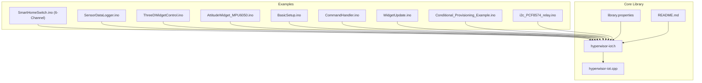
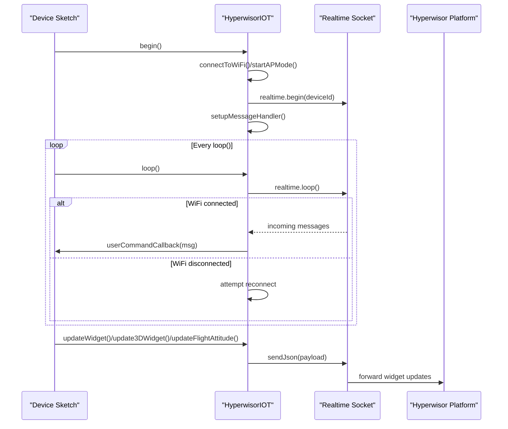
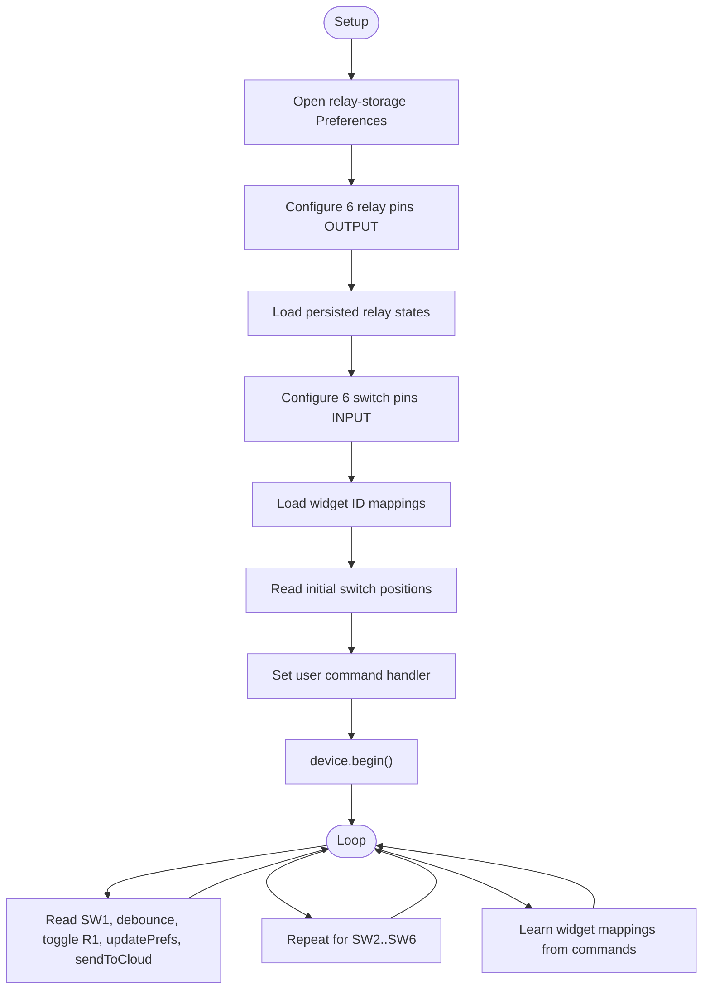
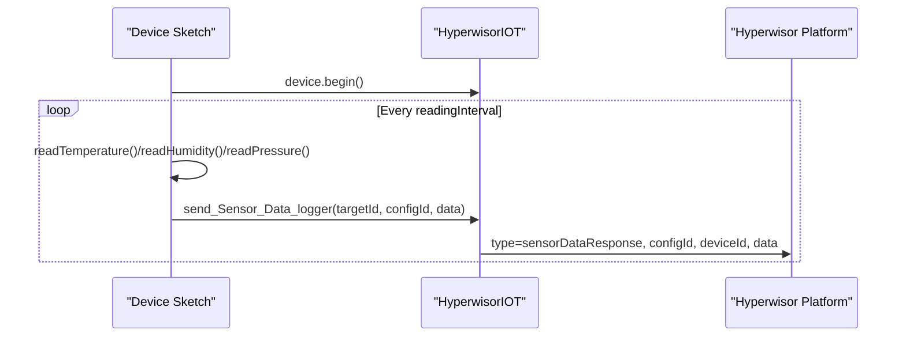
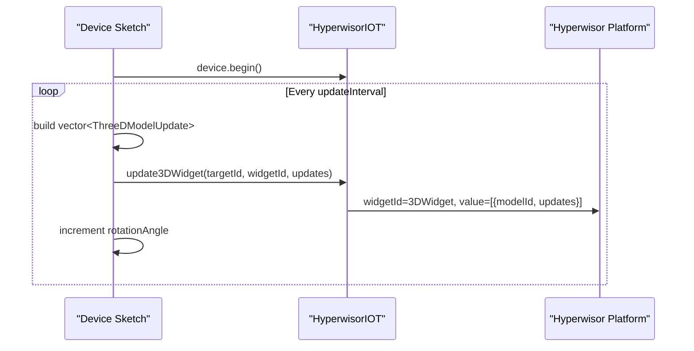
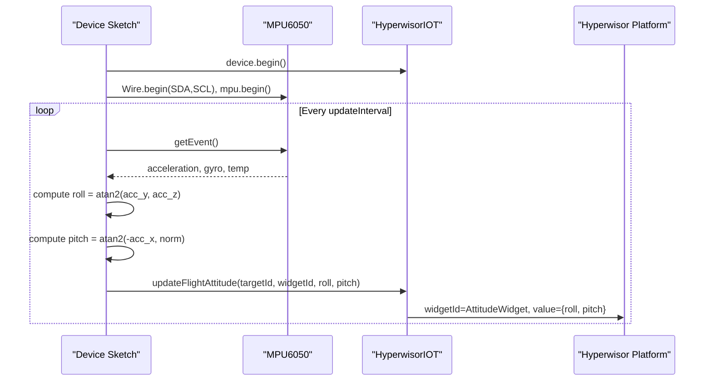
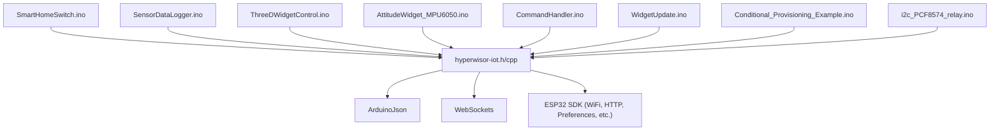

# Advanced Implementations

<cite>
**Referenced Files in This Document**
- [SmartHomeSwitch.ino](file://examples/SmartHomeSwitch/SmartHomeSwitch.ino)
- [SensorDataLogger.ino](file://examples/SensorDataLogger/SensorDataLogger.ino)
- [ThreeDWidgetControl.ino](file://examples/ThreeDWidgetControl/ThreeDWidgetControl.ino)
- [AttitudeWidget_MPU6050.ino](file://examples/AttitudeWidget_MPU6050/AttitudeWidget_MPU6050.ino)
- [hyperwisor-iot.h](file://src/hyperwisor-iot.h)
- [hyperwisor-iot.cpp](file://src/hyperwisor-iot.cpp)
- [README.md](file://README.md)
- [library.properties](file://library.properties)
- [BasicSetup.ino](file://examples/BasicSetup/BasicSetup.ino)
- [CommandHandler.ino](file://examples/CommandHandler/CommandHandler.ino)
- [WidgetUpdate.ino](file://examples/WidgetUpdate/WidgetUpdate.ino)
- [Conditional_Provisioning_Example.ino](file://examples/Conditional_Provisioning_Example/Conditional_Provisioning_Example.ino)
- [i2c_PCF8574_relay.ino](file://examples/i2c_PCF8574_relay/i2c_PCF8574_relay.ino)
</cite>

## Update Summary
**Changes Made**
- Updated SmartHomeSwitch example documentation to reflect the current 6-channel implementation
- Enhanced hardware requirements and pin configurations for the 6-channel setup
- Added comprehensive coverage of offline/online control capabilities
- Expanded widget ID mapping and learning mechanisms
- Updated power loss resume functionality documentation
- Revised bidirectional state management explanation

## Table of Contents
1. [Introduction](#introduction)
2. [Project Structure](#project-structure)
3. [Core Components](#core-components)
4. [Architecture Overview](#architecture-overview)
5. [Detailed Component Analysis](#detailed-component-analysis)
6. [Dependency Analysis](#dependency-analysis)
7. [Performance Considerations](#performance-considerations)
8. [Troubleshooting Guide](#troubleshooting-guide)
9. [Conclusion](#conclusion)
10. [Appendices](#appendices)

## Introduction
This document presents advanced implementation examples for Hyperwisor-IOT, focusing on three complex application domains:
- SmartHomeSwitch: Sophisticated 6-channel hardware control with multiple relays, physical button inputs, debouncing, power-loss resume, and bidirectional cloud-state synchronization.
- SensorDataLogger: Sensor integration patterns, data aggregation, logging strategies, and periodic data transmission to the Hyperwisor platform.
- ThreeDWidgetControl: Interactive 3D visualization techniques, transformation matrices, and dynamic model updates.
- AttitudeWidget_MPU6050: Sensor fusion, attitude calculation, and real-time 3D orientation visualization using an MPU6050 IMU.

Each example includes comprehensive code walkthroughs, hardware requirements, integration patterns, performance considerations, and advanced troubleshooting guidance. Optimization techniques for memory usage, power consumption, and network efficiency are also provided.

## Project Structure
The repository organizes examples by use case and the core library under src. The examples demonstrate practical integrations with the Hyperwisor-IOT library for real-time communication, widget updates, and sensor/actuator control.

**Diagram sources**
- [SmartHomeSwitch.ino:1-286](file://examples/SmartHomeSwitch/SmartHomeSwitch.ino#L1-L286)
- [SensorDataLogger.ino:1-77](file://examples/SensorDataLogger/SensorDataLogger.ino#L1-L77)
- [ThreeDWidgetControl.ino:1-85](file://examples/ThreeDWidgetControl/ThreeDWidgetControl.ino#L1-L85)
- [AttitudeWidget_MPU6050.ino:1-95](file://examples/AttitudeWidget_MPU6050/AttitudeWidget_MPU6050.ino#L1-L95)
- [hyperwisor-iot.h:1-190](file://src/hyperwisor-iot.h#L1-L190)
- [hyperwisor-iot.cpp:1-1811](file://src/hyperwisor-iot.cpp#L1-L1811)
- [library.properties:1-11](file://library.properties#L1-L11)
- [README.md:1-173](file://README.md#L1-L173)

**Section sources**
- [README.md:1-173](file://README.md#L1-L173)
- [library.properties:1-11](file://library.properties#L1-L11)

## Core Components
The Hyperwisor-IOT library provides:
- Real-time communication via nikolaindustry-realtime with automatic reconnection and retry logic.
- Wi-Fi provisioning with AP mode fallback and web-based provisioning.
- Widget update APIs for numeric, string, and array values, plus specialized widgets (flight attitude, 3D models, heat maps, countdowns).
- GPIO management and persistence.
- Database operations, SMS service, authentication, and NTP-based time/date utilities.
- OTA firmware update capability with version tracking.

Key capabilities leveraged by the advanced examples:
- User command handler for custom logic and bidirectional control.
- Widget update functions for real-time dashboards.
- Sensor data logging helper for structured telemetry.
- 3D widget update with transformation matrices and material properties.
- Flight attitude widget for roll/pitch visualization.

**Section sources**
- [hyperwisor-iot.h:39-187](file://src/hyperwisor-iot.h#L39-L187)
- [hyperwisor-iot.cpp:46-137](file://src/hyperwisor-iot.cpp#L46-L137)
- [README.md:22-36](file://README.md#L22-L36)

## Architecture Overview
The examples integrate with the Hyperwisor-IOT core through a consistent lifecycle:
- Initialization: begin() connects to Wi-Fi or starts AP provisioning.
- Loop: maintain real-time connection and handle incoming commands.
- Widget updates: push state to dashboards using updateWidget/update3DWidget/updateFlightAttitude.
- Sensor data: log and transmit sensor readings periodically.
- GPIO control: manage relays and persist states across power cycles.

**Diagram sources**
- [hyperwisor-iot.cpp:13-137](file://src/hyperwisor-iot.cpp#L13-L137)
- [hyperwisor-iot.cpp:313-404](file://src/hyperwisor-iot.cpp#L313-L404)
- [hyperwisor-iot.h:75-107](file://src/hyperwisor-iot.h#L75-L107)

## Detailed Component Analysis

### SmartHomeSwitch: Sophisticated 6-Channel Hardware Control and Bidirectional State Management
**Updated** The SmartHomeSwitch example has been updated to a comprehensive 6-channel implementation with advanced offline/online control capabilities.

This example demonstrates:
- 6-channel relay control with physical push-button inputs for each channel.
- Debounced switch handling to prevent chatter and ensure reliable operation.
- Power-loss resume using Preferences to persist relay states across power cycles.
- Dynamic widget ID mapping and learning for flexible dashboard integration.
- Automatic WiFi reconnection and seamless offline/online state transitions.
- Real-time bidirectional control: remote commands update local relays and vice versa.
- Comprehensive state synchronization when Wi-Fi is available.

Hardware requirements:
- ESP32 development board.
- 6-channel relay module wired to ESP32 GPIO pins: 32, 33, 25, 26, 18, 19.
- Momentary push buttons per relay input connected to pins: 36, 39, 34, 35, 4, 23.
- Pull-up or pull-down resistors as needed for switches.
- Flyback diodes across relay coils for protection.

Implementation highlights:
- Pin definitions for 6 relays and 6 corresponding switch inputs.
- State variables and debounce tracking arrays for reliable operation.
- Advanced widget ID mapping system with caching for performance.
- Helper functions to update relay state, persist to Preferences, and send updates to the cloud.
- Dynamic widget mapping learning from cloud commands with flexible parameter support.
- User command handler supporting multiple dashboard formats and parameter variations.
- Loop routine scanning each switch with debounce and triggering updates and cloud sync.

**Diagram sources**
- [SmartHomeSwitch.ino:147-285](file://examples/SmartHomeSwitch/SmartHomeSwitch.ino#L147-L285)

Integration patterns:
- Use Preferences for non-volatile state persistence with separate storage for relay states and widget mappings.
- Map widget IDs to internal relay indices using flexible string matching with caching for performance.
- Support multiple parameter formats for widget mapping: relay, relayNumber, relay_number, channel.
- Validate action names and parameters to support various dashboard formats and command structures.

Performance considerations:
- Debounce delay of 50ms balances reliability vs. responsiveness for physical switches.
- Minimal loop delay of 10ms prevents excessive CPU usage while maintaining responsiveness.
- Cloud updates are conditional on Wi-Fi connectivity to avoid blocking operations.
- Widget ID cache reduces repeated storage operations and improves command processing speed.

Advanced troubleshooting:
- Verify relay wiring polarity and use appropriate flyback diodes across relay coils.
- Confirm switch pull-up/pull-down configurations and check for switch chatter.
- Ensure widget IDs match between dashboard and device logic, especially with dynamic mapping.
- Monitor Preferences storage usage and widget mapping cache effectiveness.
- Validate WiFi connectivity and cloud command routing for bidirectional control.

**Section sources**
- [SmartHomeSwitch.ino:1-286](file://examples/SmartHomeSwitch/SmartHomeSwitch.ino#L1-L286)

### SensorDataLogger: Sensor Integration, Aggregation, and Periodic Transmission
This example showcases:
- Structured sensor data logging with a helper method.
- Periodic sampling at fixed intervals.
- Sending multiple metrics (temperature, humidity, pressure) as a single telemetry payload.

**Diagram sources**
- [SensorDataLogger.ino:34-62](file://examples/SensorDataLogger/SensorDataLogger.ino#L34-L62)
- [hyperwisor-iot.cpp:535-549](file://src/hyperwisor-iot.cpp#L535-L549)

Integration patterns:
- Replace simulated sensor functions with actual sensor reads (I2C/SPI).
- Use a configuration ID to group related metrics in the dashboard.
- Ensure Wi-Fi connectivity before logging to avoid blocking.

Performance considerations:
- Tune readingInterval to balance battery life and data freshness.
- Aggregate multiple sensors per interval to reduce network overhead.

Advanced troubleshooting:
- Validate sensor initialization and address I2C bus conflicts.
- Monitor free heap and adjust interval if memory pressure occurs.

**Section sources**
- [SensorDataLogger.ino:1-77](file://examples/SensorDataLogger/SensorDataLogger.ino#L1-L77)
- [hyperwisor-iot.h:76-76](file://src/hyperwisor-iot.h#L76-L76)
- [hyperwisor-iot.cpp:535-549](file://src/hyperwisor-iot.cpp#L535-L549)

### ThreeDWidgetControl: 3D Model Manipulation and Interactive Visualization
This example demonstrates:
- Updating multiple 3D models within a single 3D widget.
- Transformation matrices: position, rotation, scale.
- Material properties: color, metalness, roughness, opacity.
- Visibility and wireframe rendering toggles.
- Periodic updates with incremental rotation.

**Diagram sources**
- [ThreeDWidgetControl.ino:34-83](file://examples/ThreeDWidgetControl/ThreeDWidgetControl.ino#L34-L83)
- [hyperwisor-iot.h:24-35](file://src/hyperwisor-iot.h#L24-L35)
- [hyperwisor-iot.h:107-107](file://src/hyperwisor-iot.h#L107-L107)
- [hyperwisor-iot.cpp:686-714](file://src/hyperwisor-iot.cpp#L686-L714)

Integration patterns:
- Assign unique model IDs per 3D object.
- Use ThreeDModelUpdate structure to specify transformations and materials.
- Limit update frequency to maintain smooth visualization.

Performance considerations:
- Reduce updateInterval for complex scenes.
- Prefer wireframe mode sparingly to preserve bandwidth.
- Minimize JSON payload size by avoiding unnecessary fields.

Advanced troubleshooting:
- Verify model URLs and widget IDs in the dashboard.
- Ensure Wi-Fi stability for continuous updates.

**Section sources**
- [ThreeDWidgetControl.ino:1-85](file://examples/ThreeDWidgetControl/ThreeDWidgetControl.ino#L1-L85)
- [hyperwisor-iot.h:24-35](file://src/hyperwisor-iot.h#L24-L35)
- [hyperwisor-iot.cpp:686-714](file://src/hyperwisor-iot.cpp#L686-L714)

### AttitudeWidget_MPU6050: Sensor Fusion, Attitude Calculation, and Real-Time 3D Orientation
This example integrates:
- MPU6050 accelerometer/gyroscope via I2C.
- Roll/pitch estimation from accelerometer readings.
- Real-time updates to a Flight Attitude Widget on the dashboard.

**Diagram sources**
- [AttitudeWidget_MPU6050.ino:33-94](file://examples/AttitudeWidget_MPU6050/AttitudeWidget_MPU6050.ino#L33-L94)
- [hyperwisor-iot.cpp:631-638](file://src/hyperwisor-iot.cpp#L631-L638)

Integration patterns:
- Configure MPU6050 ranges and filter bandwidth for stable readings.
- Use custom I2C pins if needed.
- Update at a consistent rate suitable for visualization.

Performance considerations:
- Keep updateInterval low (e.g., 100 ms) for responsive visualization.
- Filter sensor noise by averaging or smoothing if necessary.

Advanced troubleshooting:
- Confirm MPU6050 detection and wiring.
- Calibrate sensor placement to minimize vibration interference.

**Section sources**
- [AttitudeWidget_MPU6050.ino:1-95](file://examples/AttitudeWidget_MPU6050/AttitudeWidget_MPU6050.ino#L1-L95)
- [hyperwisor-iot.cpp:631-638](file://src/hyperwisor-iot.cpp#L631-L638)

## Dependency Analysis
The examples depend on the Hyperwisor-IOT library and optional external libraries. The core library manages Wi-Fi, provisioning, real-time messaging, and widget updates.

**Diagram sources**
- [library.properties:10-10](file://library.properties#L10-L10)
- [hyperwisor-iot.h:11-14](file://src/hyperwisor-iot.h#L11-L14)
- [README.md:92-121](file://README.md#L92-L121)

**Section sources**
- [library.properties:10-11](file://library.properties#L10-L11)
- [README.md:92-121](file://README.md#L92-L121)

## Performance Considerations
Memory usage:
- Use compact data structures (e.g., float arrays for transforms).
- Avoid frequent dynamic allocations; reuse buffers where possible.
- Prefer stack allocation for small, short-lived objects.

Power consumption:
- Implement sleep/idle modes when feasible.
- Reduce update frequency for non-critical widgets.
- Use deep sleep for periodic tasks with long intervals.

Network efficiency:
- Batch updates (e.g., multiple sensor values per payload).
- Throttle widget updates to visualization-friendly rates.
- Retry with exponential backoff for OTA and database operations.

Wi-Fi and real-time stability:
- Monitor connection status and handle reconnections gracefully.
- Use targeted updates (only changed values) to reduce traffic.
- Validate payload sizes to prevent fragmentation issues.

## Troubleshooting Guide
Common issues and resolutions:
- AP mode stuck: The device restarts after a timeout if provisioning is not completed. Ensure the provisioning page is reachable and credentials are submitted correctly.
- Wi-Fi reconnection loops: Excessive disconnections trigger automatic retries; verify router credentials and signal strength.
- OTA failures: Inspect HTTP response codes and available flash space; ensure secure endpoint accessibility.
- Widget updates not appearing: Confirm targetId/widgetId correctness and Wi-Fi connectivity before sending updates.
- Sensor data not logged: Check interval timing and Wi-Fi availability; validate sensor initialization and I2C addresses.
- **Widget ID mapping failures**: Ensure widget IDs are properly learned and cached; check for parameter variations in cloud commands.

Operational checks:
- Use provided basic examples to validate provisioning and connectivity.
- Employ command handler examples to inspect incoming messages and debug custom logic.
- Utilize widget update examples to confirm dashboard communication.

**Section sources**
- [hyperwisor-iot.cpp:116-136](file://src/hyperwisor-iot.cpp#L116-L136)
- [hyperwisor-iot.cpp:1417-1503](file://src/hyperwisor-iot.cpp#L1417-L1503)
- [BasicSetup.ino:1-39](file://examples/BasicSetup/BasicSetup.ino#L1-L39)
- [CommandHandler.ino:1-96](file://examples/CommandHandler/CommandHandler.ino#L1-L96)
- [WidgetUpdate.ino:1-68](file://examples/WidgetUpdate/WidgetUpdate.ino#L1-L68)

## Conclusion
The Hyperwisor-IOT library enables robust, real-time IoT applications on ESP32. These advanced examples illustrate:
- Reliable 6-channel hardware control with persistence and bidirectional synchronization.
- Efficient sensor logging and periodic telemetry.
- Interactive 3D visualization with precise transformation control.
- Real-time attitude visualization leveraging sensor fusion.

By following the integration patterns, performance guidelines, and troubleshooting steps outlined above, developers can build scalable, maintainable IoT solutions tailored to complex use cases.

## Appendices

### Appendix A: Example Lifecycle Patterns
- Initialization: Call begin() to connect or provision; retrieve device/user IDs for dashboard targeting.
- Loop maintenance: Invoke loop() continuously to keep real-time connections alive and process incoming commands.
- Widget updates: Use appropriate update functions for the desired widget type and data format.

**Section sources**
- [BasicSetup.ino:21-38](file://examples/BasicSetup/BasicSetup.ino#L21-L38)
- [hyperwisor-iot.cpp:13-28](file://src/hyperwisor-iot.cpp#L13-L28)

### Appendix B: Provisioning Options
- Automatic provisioning: AP mode with web UI for first-time setup.
- Manual provisioning: Save credentials programmatically for headless deployments.
- Conditional provisioning: Combine manual defaults with AP mode fallback.

**Section sources**
- [Conditional_Provisioning_Example.ino:22-68](file://examples/Conditional_Provisioning_Example/Conditional_Provisioning_Example.ino#L22-L68)
- [hyperwisor-iot.cpp:141-185](file://src/hyperwisor-iot.cpp#L141-L185)

### Appendix C: GPIO and Persistence Utilities
- Save/load GPIO states and restore on boot for power-loss resume.
- Use Preferences for small, structured data like relay states.
- **Widget ID mapping and caching for efficient dashboard integration.**

**Section sources**
- [hyperwisor-iot.cpp:1383-1414](file://src/hyperwisor-iot.cpp#L1383-L1414)
- [SmartHomeSwitch.ino:58-88](file://examples/SmartHomeSwitch/SmartHomeSwitch.ino#L58-L88)