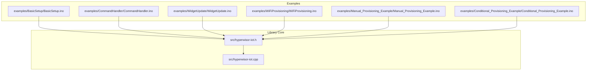
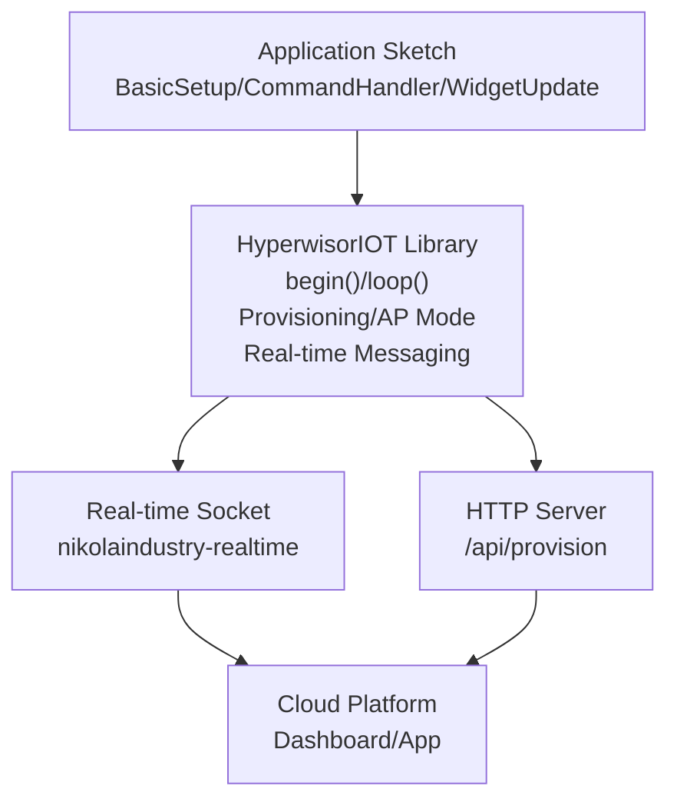
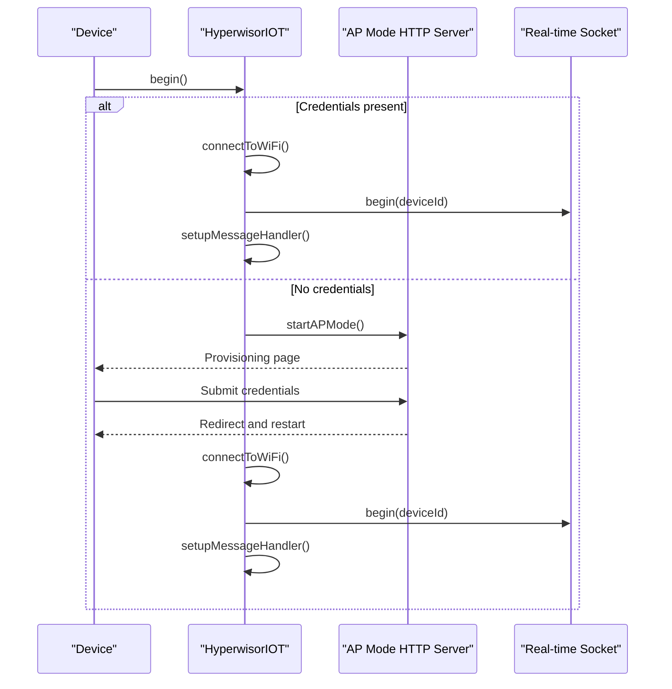
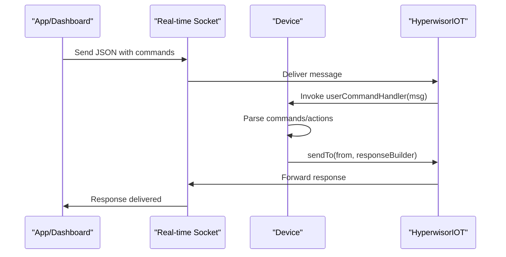
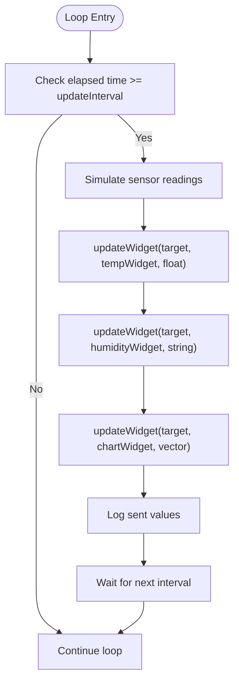
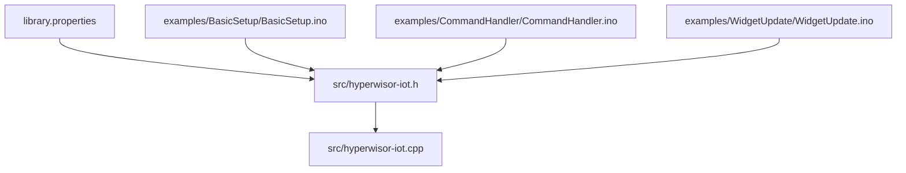
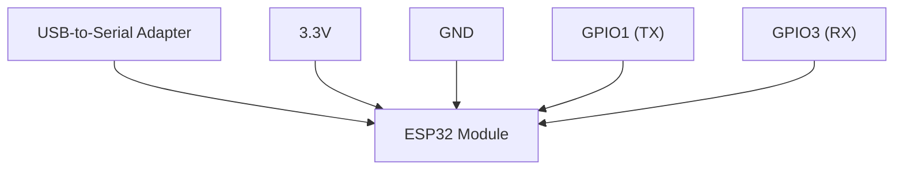
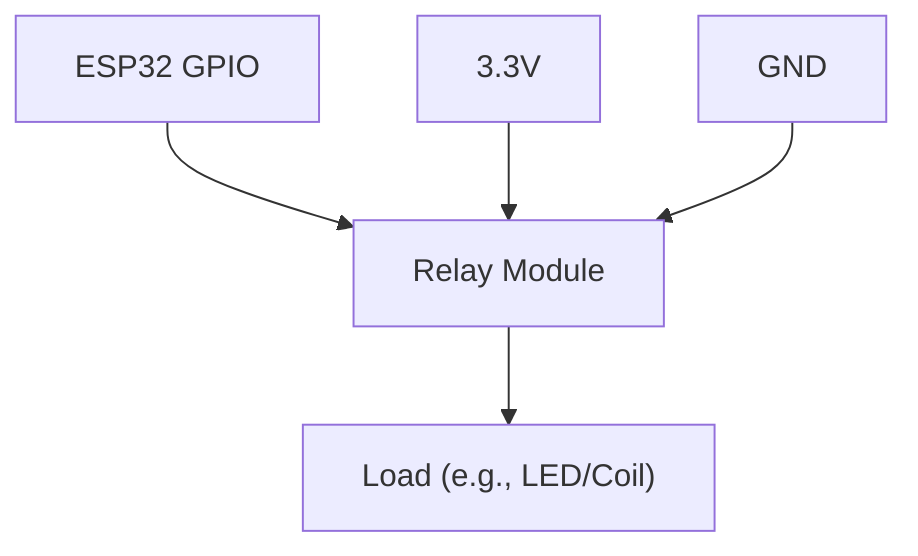
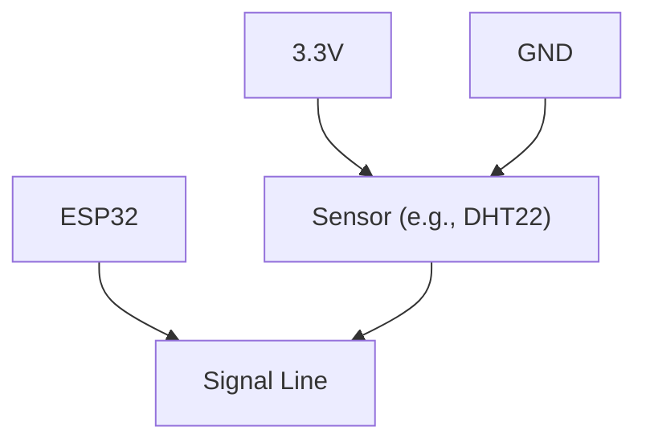

# Basic Examples

<cite>
**Referenced Files in This Document**
- [README.md](file://README.md)
- [library.properties](file://library.properties)
- [hyperwisor-iot.h](file://src/hyperwisor-iot.h)
- [hyperwisor-iot.cpp](file://src/hyperwisor-iot.cpp)
- [BasicSetup.ino](file://examples/BasicSetup/BasicSetup.ino)
- [CommandHandler.ino](file://examples/CommandHandler/CommandHandler.ino)
- [WidgetUpdate.ino](file://examples/WidgetUpdate/WidgetUpdate.ino)
- [WiFiProvisioning.ino](file://examples/WiFiProvisioning/WiFiProvisioning.ino)
- [Manual_Provisioning_Example.ino](file://examples/Manual_Provisioning_Example/Manual_Provisioning_Example.ino)
- [Conditional_Provisioning_Example.ino](file://examples/Conditional_Provisioning_Example/Conditional_Provisioning_Example.ino)
</cite>

## Table of Contents
1. [Introduction](#introduction)
2. [Project Structure](#project-structure)
3. [Core Components](#core-components)
4. [Architecture Overview](#architecture-overview)
5. [Detailed Component Analysis](#detailed-component-analysis)
6. [Dependency Analysis](#dependency-analysis)
7. [Performance Considerations](#performance-considerations)
8. [Troubleshooting Guide](#troubleshooting-guide)
9. [Conclusion](#conclusion)
10. [Appendices](#appendices)

## Introduction
This document explains three foundational examples that demonstrate essential usage patterns of the Hyperwisor-IOT Arduino library for ESP32:
- BasicSetup: Initial device configuration, WiFi provisioning, and first successful connection to the cloud platform.
- CommandHandler: Custom command processing, callback implementation, and message routing patterns.
- WidgetUpdate: Dashboard widget integration, real-time data updates, and visualization techniques.

It provides step-by-step implementation walkthroughs, inline code explanations, expected serial output, troubleshooting guidance, and conceptual diagrams that tie each example to core library concepts such as provisioning, real-time messaging, and widget updates.

## Project Structure
The repository organizes the library core and examples as follows:
- Library core: header and implementation files under src/
- Examples: multiple self-contained Arduino sketches under examples/

**Diagram sources**
- [hyperwisor-iot.h](file://src/hyperwisor-iot.h#L1-L190)
- [hyperwisor-iot.cpp](file://src/hyperwisor-iot.cpp#L1-L1811)
- [BasicSetup.ino](file://examples/BasicSetup/BasicSetup.ino#L1-L39)
- [CommandHandler.ino](file://examples/CommandHandler/CommandHandler.ino#L1-L96)
- [WidgetUpdate.ino](file://examples/WidgetUpdate/WidgetUpdate.ino#L1-L68)
- [WiFiProvisioning.ino](file://examples/WiFiProvisioning/WiFiProvisioning.ino#L1-L58)
- [Manual_Provisioning_Example.ino](file://examples/Manual_Provisioning_Example/Manual_Provisioning_Example.ino#L1-L65)
- [Conditional_Provisioning_Example.ino](file://examples/Conditional_Provisioning_Example/Conditional_Provisioning_Example.ino#L1-L69)

**Section sources**
- [README.md](file://README.md#L1-L173)
- [library.properties](file://library.properties#L1-L11)

## Core Components
This section highlights the core library APIs used by the basic examples, focusing on initialization, provisioning, real-time messaging, and widget updates.

- Initialization and loop
  - begin(): Initializes WiFi and real-time connectivity, falls back to AP mode if no credentials are found.
  - loop(): Maintains real-time connection, handles reconnection, and processes AP mode requests.

- Provisioning
  - hasCredentials(): Checks if stored credentials exist.
  - setCredentials(...): Manually sets WiFi SSID/password, device ID, and optional user ID.
  - clearCredentials(): Resets stored credentials.
  - AP mode provisioning endpoint: HTTP server at /api/provision handles provisioning form submissions.

- Real-time messaging
  - setUserCommandHandler(...): Registers a user-defined callback to process incoming commands.
  - sendTo(targetId, payloadBuilder): Sends a JSON payload to a target device or dashboard.
  - setupMessageHandler(): Registers built-in command handlers for GPIO, OTA, and device status.

- Widget updates
  - updateWidget(targetId, widgetId, value): Updates a single-value widget with string, float, or arrays.
  - Additional widget helpers: dialogs, flight attitude, countdown, heat map, 3D model/widget.

- Database and API utilities
  - setApiKeys(apiKey, secretKey): Sets credentials for backend operations.
  - insert/get/update/delete database data: HTTP wrappers for runtime data operations.

**Section sources**
- [hyperwisor-iot.h](file://src/hyperwisor-iot.h#L39-L187)
- [hyperwisor-iot.cpp](file://src/hyperwisor-iot.cpp#L13-L137)
- [hyperwisor-iot.cpp](file://src/hyperwisor-iot.cpp#L159-L405)
- [hyperwisor-iot.cpp](file://src/hyperwisor-iot.cpp#L521-L722)
- [hyperwisor-iot.cpp](file://src/hyperwisor-iot.cpp#L730-L847)

## Architecture Overview
The examples rely on a layered architecture:
- Application layer: Example sketches initialize the device and define behavior.
- Library layer: HyperwisorIOT manages WiFi, AP provisioning, real-time messaging, and widget updates.
- Cloud platform: Real-time socket and HTTP endpoints for provisioning, OTA, and database operations.

**Diagram sources**
- [hyperwisor-iot.cpp](file://src/hyperwisor-iot.cpp#L13-L137)
- [hyperwisor-iot.cpp](file://src/hyperwisor-iot.cpp#L141-L156)
- [hyperwisor-iot.cpp](file://src/hyperwisor-iot.cpp#L159-L185)
- [hyperwisor-iot.cpp](file://src/hyperwisor-iot.cpp#L313-L405)

## Detailed Component Analysis

### BasicSetup Example
Purpose: Demonstrate minimal device initialization, AP-mode provisioning, and first successful connection.

Step-by-step walkthrough:
1. Include the library header and instantiate the device object.
2. In setup():
   - Initialize serial communication.
   - Call device.begin() to initialize WiFi and real-time connection.
   - Optionally print device ID for verification.
3. In loop():
   - Continuously call device.loop() to maintain connectivity and handle messages.

Expected serial output (high level):
- Initialization logs indicating AP mode or WiFi connection.
- Success message upon connecting to the cloud platform.
- Device ID printed for identification.

Implementation notes:
- If no credentials are found, the device starts AP mode and exposes /api/provision for provisioning.
- After provisioning, the device restarts and connects automatically.

**Diagram sources**
- [hyperwisor-iot.cpp](file://src/hyperwisor-iot.cpp#L13-L137)
- [hyperwisor-iot.cpp](file://src/hyperwisor-iot.cpp#L141-L185)
- [hyperwisor-iot.cpp](file://src/hyperwisor-iot.cpp#L278-L310)
- [hyperwisor-iot.cpp](file://src/hyperwisor-iot.cpp#L313-L405)

**Section sources**
- [BasicSetup.ino](file://examples/BasicSetup/BasicSetup.ino#L1-L39)
- [WiFiProvisioning.ino](file://examples/WiFiProvisioning/WiFiProvisioning.ino#L1-L58)
- [Manual_Provisioning_Example.ino](file://examples/Manual_Provisioning_Example/Manual_Provisioning_Example.ino#L1-L65)
- [Conditional_Provisioning_Example.ino](file://examples/Conditional_Provisioning_Example/Conditional_Provisioning_Example.ino#L1-L69)

### CommandHandler Example
Purpose: Receive and process custom commands, implement a user command handler, and route responses.

Step-by-step walkthrough:
1. Include the library header and instantiate the device object.
2. In setup():
   - Register a user command handler using setUserCommandHandler(...).
   - Inside the handler:
     - Extract the sender ID from the message.
     - Validate payload presence.
     - Iterate through commands and actions.
     - Implement custom logic for recognized commands.
     - Send a response back to the sender using sendTo(...).
3. In loop():
   - Call device.loop() to keep the connection alive.

Expected serial output (high level):
- Message receipt logs with sender ID.
- Payload dump for debugging.
- Command-specific actions logged (e.g., SET_VALUE, GET_STATUS).
- Response sent back to the sender.

**Diagram sources**
- [hyperwisor-iot.cpp](file://src/hyperwisor-iot.cpp#L313-L405)
- [hyperwisor-iot.cpp](file://src/hyperwisor-iot.cpp#L521-L532)
- [CommandHandler.ino](file://examples/CommandHandler/CommandHandler.ino#L1-L96)

**Section sources**
- [CommandHandler.ino](file://examples/CommandHandler/CommandHandler.ino#L1-L96)
- [hyperwisor-iot.h](file://src/hyperwisor-iot.h#L37-L55)
- [hyperwisor-iot.cpp](file://src/hyperwisor-iot.cpp#L408-L411)

### WidgetUpdate Example
Purpose: Update dashboard widgets with real-time data, including numeric values and arrays for charts.

Step-by-step walkthrough:
1. Include the library header and instantiate the device object.
2. Define targetId and widget IDs for your dashboard.
3. In setup():
   - Initialize the device.
   - Log initialization and update cadence.
4. In loop():
   - Call device.loop().
   - At a fixed interval:
     - Generate simulated sensor data.
     - Update widgets with:
       - Single float values.
       - String values (e.g., formatted percentage).
       - Arrays of floats for chart widgets.
     - Log sent values for verification.

Expected serial output (high level):
- Initialization logs.
- Periodic logs of sent temperature, humidity, and chart data.

**Diagram sources**
- [WidgetUpdate.ino](file://examples/WidgetUpdate/WidgetUpdate.ino#L1-L68)
- [hyperwisor-iot.cpp](file://src/hyperwisor-iot.cpp#L552-L598)

**Section sources**
- [WidgetUpdate.ino](file://examples/WidgetUpdate/WidgetUpdate.ino#L1-L68)
- [hyperwisor-iot.h](file://src/hyperwisor-iot.h#L78-L84)
- [hyperwisor-iot.cpp](file://src/hyperwisor-iot.cpp#L552-L598)

## Dependency Analysis
The examples depend on the HyperwisorIOT library, which in turn depends on several ESP32 and Arduino libraries. The library’s constructor initializes internal components for real-time communication, HTTP server, DNS, and preferences.

**Diagram sources**
- [library.properties](file://library.properties#L1-L11)
- [hyperwisor-iot.h](file://src/hyperwisor-iot.h#L1-L15)
- [hyperwisor-iot.cpp](file://src/hyperwisor-iot.cpp#L1-L10)

**Section sources**
- [library.properties](file://library.properties#L1-L11)
- [hyperwisor-iot.h](file://src/hyperwisor-iot.h#L1-L15)

## Performance Considerations
- Real-time loop overhead: The library’s loop() continuously checks WiFi and real-time connectivity; keep application work minimal in loop() to avoid blocking.
- OTA updates: Large firmware downloads consume memory and time; ensure sufficient free heap and stable connectivity.
- HTTP operations: Database and API calls are synchronous and may block; schedule them outside tight loops or use non-blocking patterns.
- Widget updates: Frequent chart updates can saturate bandwidth; batch updates or increase intervals for dense datasets.

## Troubleshooting Guide
Common setup issues and resolutions:
- Device stuck in AP mode:
  - Symptom: Device remains in AP mode indefinitely.
  - Cause: Missing or invalid credentials.
  - Resolution: Use the provisioning app to submit credentials; confirm /api/provision receives and stores values.

- WiFi connection failures:
  - Symptom: Repeated reconnection attempts and fallback to AP mode.
  - Cause: Incorrect SSID/password or network unreachable.
  - Resolution: Verify credentials and network availability; ensure device is within range.

- No real-time messages received:
  - Symptom: Commands not processed by setUserCommandHandler.
  - Cause: Missing or incorrect target ID, or message not addressed to this device.
  - Resolution: Confirm targetId matches device ID; ensure messages include the correct “from” and “payload”.

- Widget updates not appearing:
  - Symptom: Widgets remain unchanged.
  - Cause: Incorrect targetId/widgetId or missing dashboard configuration.
  - Resolution: Verify targetId and widget IDs in the dashboard; ensure device is connected.

- Provisioning errors:
  - Symptom: Provisioning page returns an error.
  - Cause: Missing required fields or malformed request.
  - Resolution: Ensure SSID, password, target_id, and user_id are provided; check HTML error page content.

**Section sources**
- [hyperwisor-iot.cpp](file://src/hyperwisor-iot.cpp#L46-L137)
- [hyperwisor-iot.cpp](file://src/hyperwisor-iot.cpp#L159-L185)
- [hyperwisor-iot.cpp](file://src/hyperwisor-iot.cpp#L256-L310)
- [hyperwisor-iot.cpp](file://src/hyperwisor-iot.cpp#L313-L405)
- [WiFiProvisioning.ino](file://examples/WiFiProvisioning/WiFiProvisioning.ino#L27-L52)

## Conclusion
The BasicSetup, CommandHandler, and WidgetUpdate examples showcase the core capabilities of the Hyperwisor-IOT library:
- Seamless provisioning and connection to the cloud platform.
- Extensible command handling with user-defined callbacks.
- Real-time widget updates for dynamic dashboards.

By following the step-by-step guides and using the troubleshooting tips, you can confidently integrate these patterns into your own projects.

## Appendices

### Conceptual Wiring Diagram (BasicSetup)
This diagram illustrates the typical wiring for an ESP32-based device using the BasicSetup example. It focuses on power supply and serial debugging connections.

[No sources needed since this diagram shows conceptual wiring, not a specific code mapping]

### Conceptual Wiring Diagram (CommandHandler)
This diagram shows how to wire a simple GPIO-controlled load (e.g., relay or LED) for testing GPIO commands.

[No sources needed since this diagram shows conceptual wiring, not a specific code mapping]

### Conceptual Wiring Diagram (WidgetUpdate)
This diagram shows a simple sensor setup for generating temperature and humidity values for widget updates.

[No sources needed since this diagram shows conceptual wiring, not a specific code mapping]