# FSR Pressure Sensor Example

<cite>
**Referenced Files in This Document**
- [FSR_Pressure_Sensor.ino](file://examples/FSR_Pressure_Sensor/FSR_Pressure_Sensor.ino)
- [hyperwisor-iot.h](file://src/hyperwisor-iot.h)
- [hyperwisor-iot.cpp](file://src/hyperwisor-iot.cpp)
- [nikolaindustry-realtime.h](file://src/nikolaindustry-realtime.h)
- [README.md](file://README.md)
- [library.properties](file://library.properties)
</cite>

## Update Summary
**Changes Made**
- Updated from individual widget updates to primary heat map visualization approach
- Added enhanced data processing capabilities with coordinate-based sensor positioning
- Implemented interpolation capabilities for smoother visualization
- Enhanced sensor grid configuration with customizable sensor layouts
- Added optional enhanced heat map with interpolated data points

## Table of Contents
1. [Introduction](#introduction)
2. [Project Structure](#project-structure)
3. [Core Components](#core-components)
4. [Architecture Overview](#architecture-overview)
5. [Detailed Component Analysis](#detailed-component-analysis)
6. [FSR Sensor Implementation](#fsr-sensor-implementation)
7. [Heat Map Visualization System](#heat-map-visualization-system)
8. [Enhanced Data Processing and Interpolation](#enhanced-data-processing-and-interpolation)
9. [Dashboard Integration](#dashboard-integration)
10. [Data Logging and Historical Visualization](#data-logging-and-historical-visualization)
11. [Performance Considerations](#performance-considerations)
12. [Troubleshooting Guide](#troubleshooting-guide)
13. [Conclusion](#conclusion)

## Introduction

The FSR Pressure Sensor Example demonstrates how to integrate seven-point Force-Sensitive Resistor (FSR) matrix sensors with the Hyperwisor IoT platform using an enhanced heat map visualization approach. This implementation showcases real-time sensor data streaming with coordinate-based visualization, interpolation capabilities for smooth pressure distribution mapping, and comprehensive dashboard integration for both individual widget monitoring and consolidated heat map visualization.

The example utilizes an ESP32 microcontroller to read analog sensor values from seven FSR sensors connected to specific GPIO pins and sends this data to Hyperwisor IoT dashboard widgets for real-time visualization and historical analysis. The implementation has been enhanced from individual widget updates to a primary heat map visualization approach with improved data processing and interpolation capabilities.

## Project Structure

The Hyperwisor IoT library follows a modular structure designed for ESP32-based IoT applications:

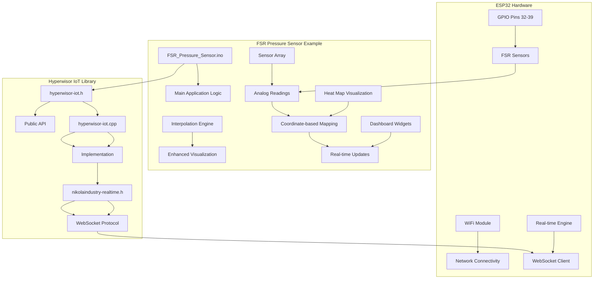

**Diagram sources**
- [FSR_Pressure_Sensor.ino:1-174](file://examples/FSR_Pressure_Sensor/FSR_Pressure_Sensor.ino#L1-L174)
- [hyperwisor-iot.h:1-719](file://src/hyperwisor-iot.h#L1-L719)
- [hyperwisor-iot.cpp:1-1811](file://src/hyperwisor-iot.cpp#L1-L1811)

**Section sources**
- [FSR_Pressure_Sensor.ino:1-174](file://examples/FSR_Pressure_Sensor/FSR_Pressure_Sensor.ino#L1-L174)
- [README.md:1-173](file://README.md#L1-L173)

## Core Components

The FSR Pressure Sensor example consists of several interconnected components that work together to provide comprehensive sensor monitoring with enhanced visualization capabilities:

### Hardware Components
- **FSR Sensors**: Seven force-sensitive resistors arranged in a configurable matrix pattern
- **ESP32 Microcontroller**: Primary processing unit with Wi-Fi connectivity and real-time capabilities
- **Analog-to-Digital Converters**: Built-in ADC channels for precise sensor readings
- **GPIO Pin Configuration**: Dedicated pins for sensor connections with flexible assignment

### Software Components
- **Sensor Reading Module**: Handles analog sensor data acquisition with noise filtering
- **Coordinate Mapping System**: Translates sensor positions to dashboard coordinates
- **Heat Map Visualization Engine**: Manages coordinate-based pressure visualization
- **Interpolation Processor**: Generates intermediate points for smooth pressure distribution
- **Dashboard Integration Layer**: Manages widget updates and data transmission
- **Real-time Communication Engine**: Provides WebSocket-based communication
- **Data Logging System**: Enables historical data storage and visualization

**Section sources**
- [FSR_Pressure_Sensor.ino:17-48](file://examples/FSR_Pressure_Sensor/FSR_Pressure_Sensor.ino#L17-L48)
- [hyperwisor-iot.h:23-27](file://src/hyperwisor-iot.h#L23-L27)

## Architecture Overview

The FSR Pressure Sensor implementation follows a layered architecture that separates concerns between hardware interfacing, data processing, coordinate mapping, and cloud communication:

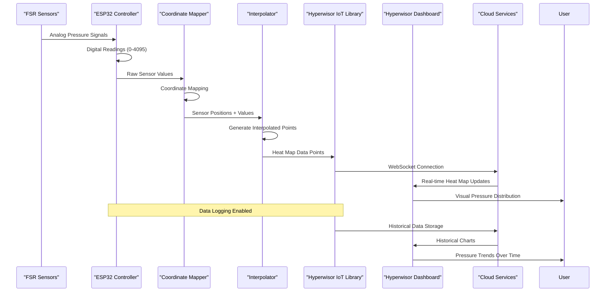

**Diagram sources**
- [FSR_Pressure_Sensor.ino:93-114](file://examples/FSR_Pressure_Sensor/FSR_Pressure_Sensor.ino#L93-L114)
- [hyperwisor-iot.cpp:662-675](file://src/hyperwisor-iot.cpp#L662-L675)

The architecture implements a publish-subscribe pattern where sensor data is processed through coordinate mapping and interpolation before being published to dashboard widgets through the Hyperwisor IoT library, which manages the underlying WebSocket communication and real-time data streaming.

## Detailed Component Analysis

### Main Application Control Flow

The application operates on a continuous loop that alternates between sensor reading, coordinate mapping, and dashboard updates:

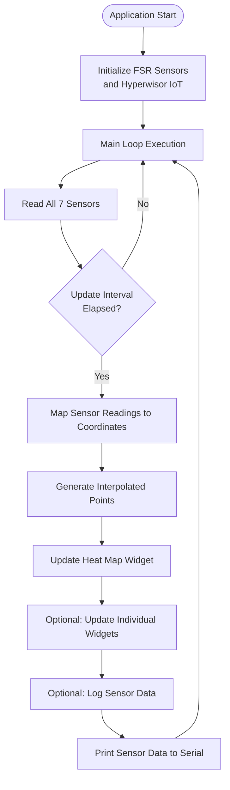

**Diagram sources**
- [FSR_Pressure_Sensor.ino:69-91](file://examples/FSR_Pressure_Sensor/FSR_Pressure_Sensor.ino#L69-L91)

### Sensor Configuration and Initialization

The FSR sensors are configured with specific GPIO pin assignments and coordinate-based positioning:

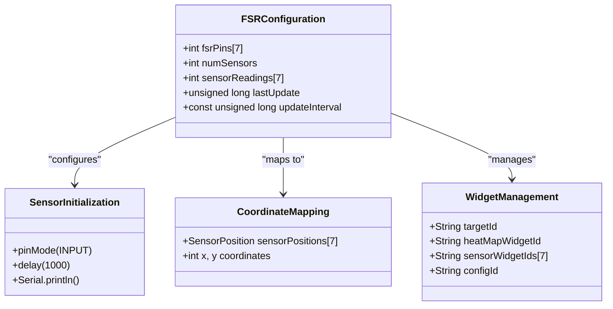

**Diagram sources**
- [FSR_Pressure_Sensor.ino:17-48](file://examples/FSR_Pressure_Sensor/FSR_Pressure_Sensor.ino#L17-L48)

**Section sources**
- [FSR_Pressure_Sensor.ino:47-67](file://examples/FSR_Pressure_Sensor/FSR_Pressure_Sensor.ino#L47-L67)

## FSR Sensor Implementation

### Sensor Array Configuration

The FSR sensor implementation uses a carefully designed array configuration optimized for pressure measurement accuracy and coordinate-based visualization:

| Sensor Index | GPIO Pin | Sensor Name | Physical Position | Purpose |
|--------------|----------|-------------|-------------------|---------|
| 0 | 32 | Pressure Sensor 1 | (100, 100) | Primary Load Measurement |
| 1 | 33 | Pressure Sensor 2 | (150, 100) | Secondary Load Measurement |
| 2 | 34 | Pressure Sensor 3 | (200, 100) | Auxiliary Load Measurement |
| 3 | 35 | Pressure Sensor 4 | (100, 150) | Reference Point |
| 4 | 36 | Pressure Sensor 5 | (150, 150) | Calibration Reference |
| 5 | 39 | Pressure Sensor 6 | (200, 150) | Environmental Compensation |
| 6 | 4 | Pressure Sensor 7 | (150, 200) | Safety Monitoring |

### Analog Reading Process

The sensor reading process involves multiple stages of data acquisition and processing:

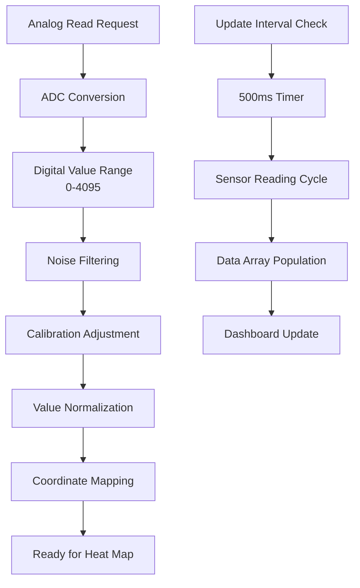

**Diagram sources**
- [FSR_Pressure_Sensor.ino:93-97](file://examples/FSR_Pressure_Sensor/FSR_Pressure_Sensor.ino#L93-L97)

**Section sources**
- [FSR_Pressure_Sensor.ino:93-97](file://examples/FSR_Pressure_Sensor/FSR_Pressure_Sensor.ino#L93-L97)

## Heat Map Visualization System

### Coordinate-Based Sensor Mapping

The enhanced heat map system uses coordinate-based positioning to create spatial pressure visualizations:

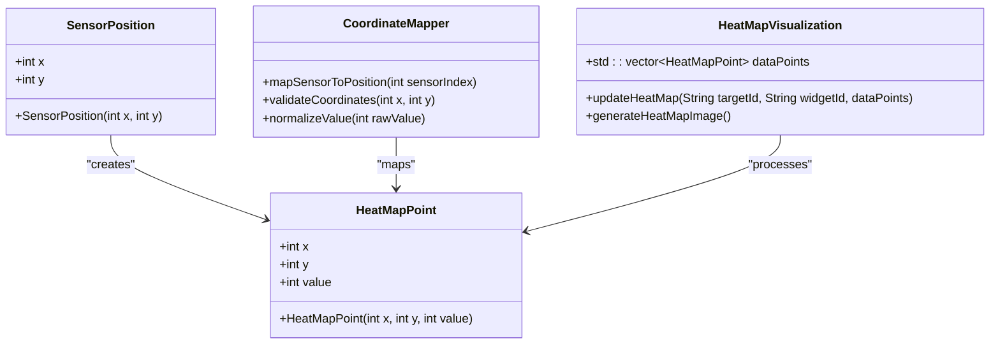

**Diagram sources**
- [FSR_Pressure_Sensor.ino:31-45](file://examples/FSR_Pressure_Sensor/FSR_Pressure_Sensor.ino#L31-L45)
- [FSR_Pressure_Sensor.ino:99-114](file://examples/FSR_Pressure_Sensor/FSR_Pressure_Sensor.ino#L99-L114)

### Heat Map Data Structure

The heat map implementation uses a structured approach to represent pressure data:

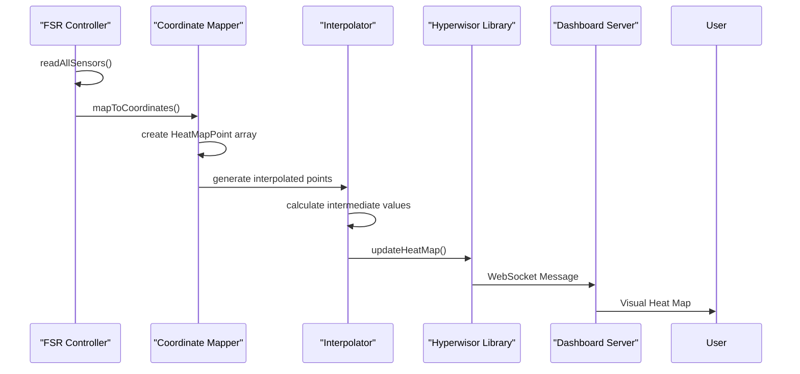

**Diagram sources**
- [FSR_Pressure_Sensor.ino:99-114](file://examples/FSR_Pressure_Sensor/FSR_Pressure_Sensor.ino#L99-L114)
- [hyperwisor-iot.cpp:662-675](file://src/hyperwisor-iot.cpp#L662-L675)

**Section sources**
- [FSR_Pressure_Sensor.ino:26-48](file://examples/FSR_Pressure_Sensor/FSR_Pressure_Sensor.ino#L26-L48)

## Enhanced Data Processing and Interpolation

### Interpolation Algorithm Implementation

The enhanced system includes sophisticated interpolation capabilities for creating smooth pressure distribution visualizations:

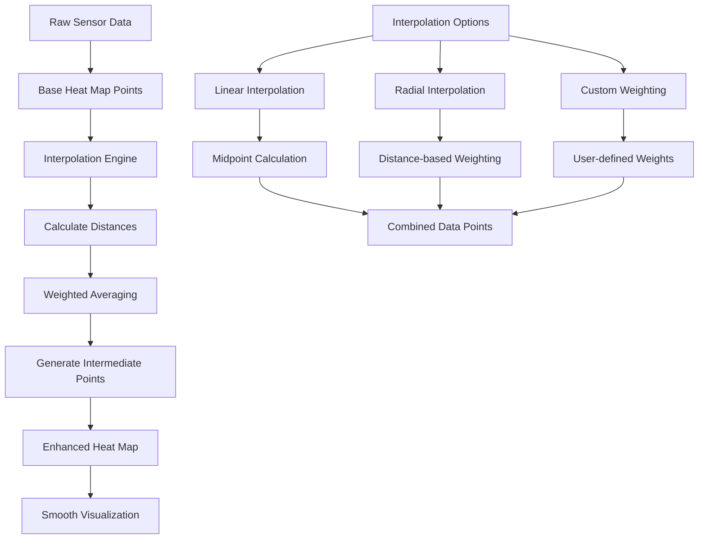

**Diagram sources**
- [FSR_Pressure_Sensor.ino:134-159](file://examples/FSR_Pressure_Sensor/FSR_Pressure_Sensor.ino#L134-L159)

### Interpolation Methods

The system supports multiple interpolation approaches for different visualization needs:

#### Linear Interpolation
- Calculates midpoint values between adjacent sensors
- Uses simple arithmetic averaging for intermediate points
- Provides smooth gradient transitions between sensor locations

#### Radial Interpolation
- Distributes pressure values based on distance from sensor points
- Applies inverse distance weighting for more realistic pressure spread
- Creates natural-looking pressure distributions

#### Custom Weighting
- Allows user-defined interpolation weights and algorithms
- Supports advanced mathematical functions for pressure modeling
- Enables specialized interpolation for specific use cases

**Section sources**
- [FSR_Pressure_Sensor.ino:134-159](file://examples/FSR_Pressure_Sensor/FSR_Pressure_Sensor.ino#L134-L159)

## Dashboard Integration

### Heat Map Widget Integration

The Hyperwisor IoT library provides comprehensive support for heat map visualization widgets:

#### Primary Heat Map Updates
The main implementation focuses on heat map widget updates with coordinate-based data:

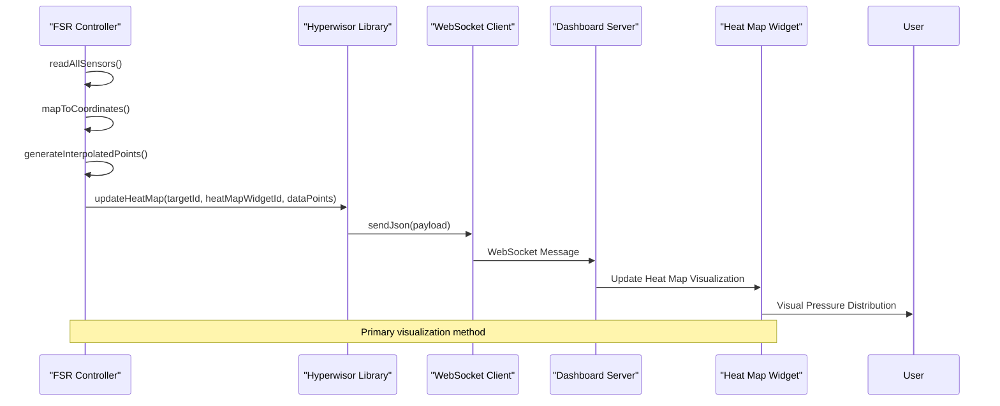

**Diagram sources**
- [FSR_Pressure_Sensor.ino:79-80](file://examples/FSR_Pressure_Sensor/FSR_Pressure_Sensor.ino#L79-L80)
- [hyperwisor-iot.cpp:662-675](file://src/hyperwisor-iot.cpp#L662-L675)

#### Individual Widget Updates (Optional)
Support for traditional individual widget updates remains available:

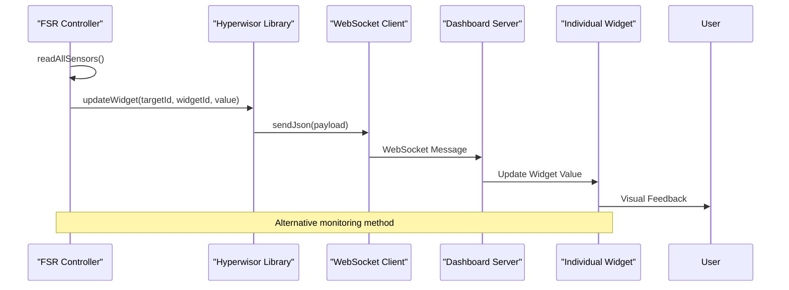

**Diagram sources**
- [FSR_Pressure_Sensor.ino:116-132](file://examples/FSR_Pressure_Sensor/FSR_Pressure_Sensor.ino#L116-L132)

**Section sources**
- [FSR_Pressure_Sensor.ino:79-87](file://examples/FSR_Pressure_Sensor/FSR_Pressure_Sensor.ino#L79-L87)

## Data Logging and Historical Visualization

### Sensor Data Logger Configuration

The Hyperwisor IoT library includes comprehensive data logging capabilities for historical analysis:

```mermaid
flowchart TD
A[Sensor Reading Complete] --> B[Data Collection]
B --> C[Structured Data Format]
C --> D[Config ID Assignment]
D --> E[Historical Storage]
E --> F[Dashboard Integration]
F --> G[Historical Charts]
G --> H[Pressure Trend Analysis]
I[Log Configuration] --> J[Config ID: "fsr-sensor-config"]
J --> K[Field Names:<br/>sensor1-sensor7]
K --> L[Float Values]
L --> M[Time-stamped Records]
```

**Diagram sources**
- [FSR_Pressure_Sensor.ino:85-86](file://examples/FSR_Pressure_Sensor/FSR_Pressure_Sensor.ino#L85-L86)
- [hyperwisor-iot.cpp:535-549](file://src/hyperwisor-iot.cpp#L535-L549)

### Historical Data Management

The data logging system provides several benefits for pressure monitoring applications:

- **Continuous Data Recording**: Uninterrupted capture of sensor readings with coordinate information
- **Historical Analysis**: Long-term trend identification and pattern recognition across the pressure surface
- **Performance Monitoring**: Detection of sensor drift and calibration needs
- **Diagnostic Capabilities**: Identification of abnormal pressure patterns and distribution changes
- **Reporting Generation**: Automated generation of pressure analysis reports with spatial context
- **Heat Map History**: Ability to track pressure distribution changes over time

**Section sources**
- [FSR_Pressure_Sensor.ino:85-86](file://examples/FSR_Pressure_Sensor/FSR_Pressure_Sensor.ino#L85-L86)

## Performance Considerations

### Update Frequency Optimization

The FSR sensor implementation balances data accuracy with system performance through strategic update intervals:

| Parameter | Value | Impact |
|-----------|-------|---------|
| Update Interval | 500ms | Real-time responsiveness |
| Sensor Readings | 7 sensors | Processing overhead |
| Coordinate Mapping | Constant time operation | Minimal computational cost |
| Interpolation | Optional computation | Configurable performance impact |
| Data Transmission | JSON payloads | Network bandwidth usage |
| Dashboard Updates | Single heat map update | Optimized UI rendering |

### Memory Management

The implementation employs efficient memory management strategies:

- **Static Arrays**: Fixed-size arrays prevent dynamic allocation overhead
- **Vector-based Data Structures**: Efficient storage for heat map points
- **Circular Buffer Approach**: Efficient data storage for historical records
- **Memory Pool Allocation**: Pre-allocated buffers for JSON serialization
- **Garbage Collection Prevention**: Minimized heap usage for real-time stability

### Power Consumption Optimization

For battery-powered deployments, the system implements power-saving measures:

- **Sleep Modes**: Processor sleep between sensor readings
- **WiFi Power Management**: Adaptive WiFi power saving
- **LED Indicators**: Optional LED usage for status indication
- **Background Processing**: Non-blocking operations for continuous monitoring
- **Interpolation Optimization**: Configurable interpolation complexity for power-constrained environments

## Troubleshooting Guide

### Common Issues and Solutions

#### Sensor Reading Problems
- **Symptom**: Inconsistent sensor readings or incorrect pressure values
- **Solution**: Verify proper sensor wiring and check for electrical interference
- **Prevention**: Implement proper grounding and shielding
- **Debug**: Check coordinate mapping accuracy and sensor calibration

#### Dashboard Connection Issues
- **Symptom**: Widgets not updating or delayed updates
- **Solution**: Check WiFi connectivity and verify target widget IDs
- **Prevention**: Implement connection status monitoring
- **Debug**: Verify heat map widget configuration and coordinate values

#### Data Logging Failures
- **Symptom**: Missing historical data or incomplete records
- **Solution**: Verify network connectivity and check cloud service availability
- **Prevention**: Implement retry mechanisms and error logging
- **Debug**: Check data format compatibility and timestamp accuracy

#### Heat Map Visualization Issues
- **Symptom**: Incorrect pressure distribution or missing visualization
- **Solution**: Verify coordinate values and interpolation settings
- **Prevention**: Test coordinate mapping with known pressure patterns
- **Debug**: Check heat map point validation and dashboard widget configuration

### Debugging Tools and Techniques

The implementation includes comprehensive debugging capabilities:

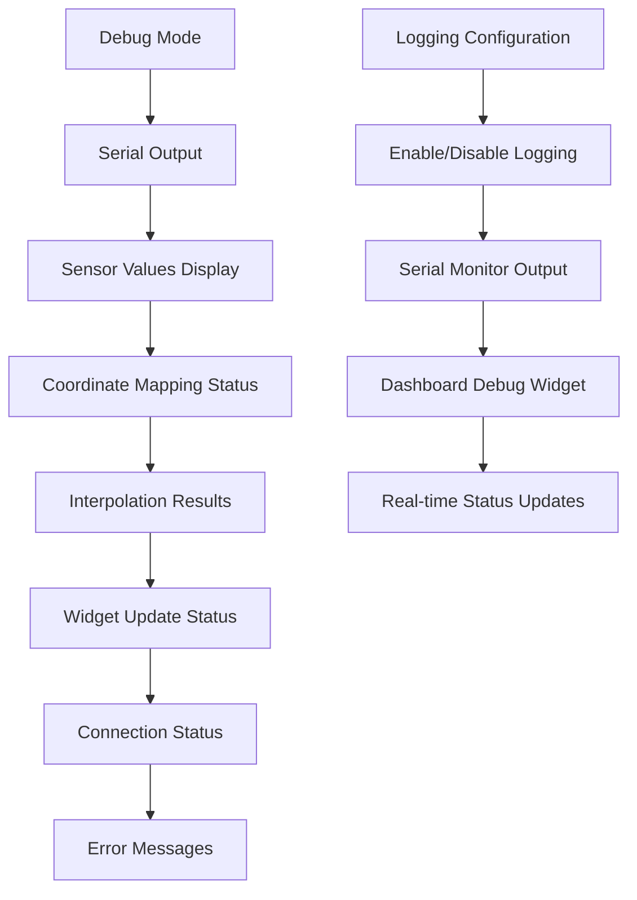

**Diagram sources**
- [FSR_Pressure_Sensor.ino:161-173](file://examples/FSR_Pressure_Sensor/FSR_Pressure_Sensor.ino#L161-L173)

**Section sources**
- [FSR_Pressure_Sensor.ino:161-173](file://examples/FSR_Pressure_Sensor/FSR_Pressure_Sensor.ino#L161-L173)

## Conclusion

The FSR Pressure Sensor Example demonstrates a comprehensive approach to IoT sensor integration with enhanced heat map visualization and interpolation capabilities. The implementation showcases best practices for sensor data acquisition, coordinate-based visualization, interpolation algorithms, and cloud-based data management.

Key achievements of this enhanced implementation include:

- **Advanced Heat Map Visualization**: Coordinate-based pressure distribution mapping with customizable sensor layouts
- **Interpolation Capabilities**: Sophisticated algorithms for smooth pressure distribution visualization
- **Flexible Data Processing**: Configurable interpolation methods for different visualization needs
- **Robust Sensor Integration**: Reliable FSR sensor reading with proper calibration and coordinate mapping
- **Real-time Dashboard Updates**: Immediate visualization of pressure changes through heat map widgets
- **Historical Data Management**: Comprehensive logging for trend analysis and pressure distribution history
- **Scalable Architecture**: Modular design supporting additional sensors, interpolation methods, and visualization approaches
- **Production-Ready Features**: Error handling, debugging, performance optimization, and power management

The example serves as a foundation for more complex pressure monitoring applications, providing a template for coordinate-based sensor integration, real-time data streaming, interpolation processing, and historical analysis that can be adapted to various industrial and research scenarios.

Future enhancements could include advanced interpolation algorithms, predictive analytics capabilities, integration with additional sensor types for comprehensive environmental monitoring, and support for custom heat map visualization themes and styling options.