# Hardware Control Examples

<cite>
**Referenced Files in This Document**
- [README.md](file://README.md)
- [library.properties](file://library.properties)
- [hyperwisor-iot.h](file://src/hyperwisor-iot.h)
- [hyperwisor-iot.cpp](file://src/hyperwisor-iot.cpp)
- [BasicSetup.ino](file://examples/BasicSetup/BasicSetup.ino)
- [GPIOControl.ino](file://examples/GPIOControl/GPIOControl.ino)
- [IoTRelayController.ino](file://examples/IoTRelayController/IoTRelayController.ino)
- [i2c_PCF8574_relay.ino](file://examples/i2c_PCF8574_relay/i2c_PCF8574_relay.ino)
- [Manual_Provisioning_Example.ino](file://examples/Manual_Provisioning_Example/Manual_Provisioning_Example.ino)
- [Conditional_Provisioning_Example.ino](file://examples/Conditional_Provisioning_Example/Conditional_Provisioning_Example.ino)
- [WiFiProvisioning.ino](file://examples/WiFiProvisioning/WiFiProvisioning.ino)
- [SensorDataLogger.ino](file://examples/SensorDataLogger/SensorDataLogger.ino)
- [SmartHomeSwitch.ino](file://examples/SmartHomeSwitch/SmartHomeSwitch.ino)
</cite>

## Update Summary
**Changes Made**
- Added comprehensive documentation for IoTRelayController example - a 496-line 8-channel relay controller with temperature monitoring
- Updated project structure to include the new IoTRelayController example
- Enhanced relay control documentation with active-LOW/active-HIGH support
- Added temperature monitoring and data logging capabilities
- Updated architecture diagrams to reflect new example integration
- Expanded hardware control patterns to include comprehensive relay management

## Table of Contents
1. [Introduction](#introduction)
2. [Project Structure](#project-structure)
3. [Core Components](#core-components)
4. [Architecture Overview](#architecture-overview)
5. [Detailed Component Analysis](#detailed-component-analysis)
6. [Dependency Analysis](#dependency-analysis)
7. [Performance Considerations](#performance-considerations)
8. [Troubleshooting Guide](#troubleshooting-guide)
9. [Conclusion](#conclusion)
10. [Appendices](#appendices)

## Introduction
This document provides comprehensive documentation for hardware control and provisioning examples in the Hyperwisor-IOT Arduino library. It focuses on practical IoT device implementation patterns, covering:
- GPIOControl: direct pin manipulation, input/output handling, and hardware abstraction techniques
- IoTRelayController: comprehensive 8-channel relay control with temperature monitoring and dashboard integration
- i2c_PCF8574_relay: I2C communication protocols, external hardware integration, and relay control mechanisms
- SmartHomeSwitch: dual-mode relay control with offline/online capabilities and widget mapping
- WiFi provisioning: manual and conditional provisioning workflows, AP mode configuration, and captive portal functionality

The guide includes circuit schematics, component selection guidelines, wiring diagrams, timing diagrams, signal characteristics, electrical safety considerations, and integration patterns for sensors, actuators, and peripherals commonly used in IoT applications.

## Project Structure
The repository organizes examples by functional area, with each example demonstrating a specific aspect of hardware control and provisioning. The core library resides under src/, while examples are located under examples/.

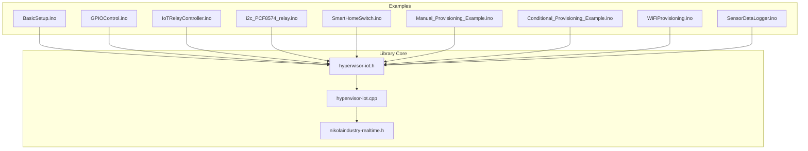

**Diagram sources**
- [hyperwisor-iot.h:1-190](file://src/hyperwisor-iot.h#L1-L190)
- [hyperwisor-iot.cpp:1-200](file://src/hyperwisor-iot.cpp#L1-L200)
- [BasicSetup.ino:1-39](file://examples/BasicSetup/BasicSetup.ino#L1-L39)
- [GPIOControl.ino:1-105](file://examples/GPIOControl/GPIOControl.ino#L1-L105)
- [IoTRelayController.ino:1-497](file://examples/IoTRelayController/IoTRelayController.ino#L1-L497)
- [i2c_PCF8574_relay.ino:1-116](file://examples/i2c_PCF8574_relay/i2c_PCF8574_relay.ino#L1-L116)
- [SmartHomeSwitch.ino:1-286](file://examples/SmartHomeSwitch/SmartHomeSwitch.ino#L1-L286)
- [Manual_Provisioning_Example.ino:1-65](file://examples/Manual_Provisioning_Example/Manual_Provisioning_Example.ino#L1-L65)
- [Conditional_Provisioning_Example.ino:1-69](file://examples/Conditional_Provisioning_Example/Conditional_Provisioning_Example.ino#L1-L69)
- [WiFiProvisioning.ino:1-58](file://examples/WiFiProvisioning/WiFiProvisioning.ino#L1-L58)
- [SensorDataLogger.ino:1-77](file://examples/SensorDataLogger/SensorDataLogger.ino#L1-L77)

**Section sources**
- [README.md:1-173](file://README.md#L1-L173)
- [library.properties:1-11](file://library.properties#L1-L11)

## Core Components
The Hyperwisor-IOT library provides a unified interface for:
- WiFi provisioning and AP mode fallback
- Real-time communication via nikolaindustry-realtime
- GPIO management with persistence
- OTA firmware updates
- Widget updates and data logging
- Time and date functions with NTP
- Comprehensive sensor data logging with send_Sensor_Data_logger function

Key capabilities include:
- Automatic Wi-Fi connection using stored credentials
- AP-mode fallback with web-based provisioning page
- Structured JSON command parsing with custom extensibility
- GPIO control via commands (pinMode, digitalWrite)
- Continuous background loop with real-time and HTTP handling
- User command handler support via lambda functions
- Built-in DNS redirection when in AP mode
- Smart command routing via from → sendTo() pairing
- Preferences-based persistent storage
- Advanced sensor data logging with configurable data structures

**Section sources**
- [README.md:22-36](file://README.md#L22-L36)
- [hyperwisor-iot.h:46-146](file://src/hyperwisor-iot.h#L46-L146)
- [hyperwisor-iot.cpp:12-137](file://src/hyperwisor-iot.cpp#L12-L137)

## Architecture Overview
The library architecture integrates Wi-Fi connectivity, AP provisioning, real-time messaging, and hardware control into a cohesive system. The following diagram illustrates the high-level flow from initialization to runtime operation.

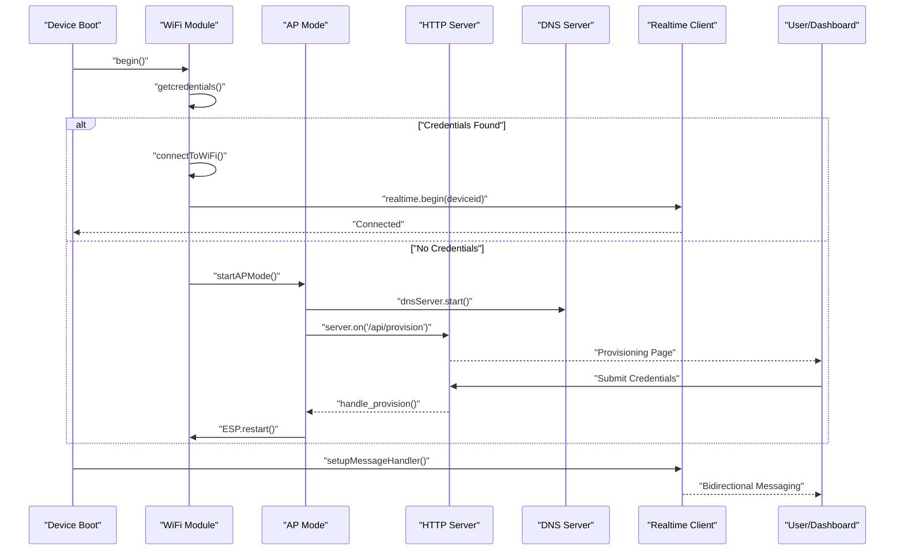

**Diagram sources**
- [hyperwisor-iot.cpp:13-137](file://src/hyperwisor-iot.cpp#L13-L137)
- [hyperwisor-iot.cpp:141-185](file://src/hyperwisor-iot.cpp#L141-L185)

## Detailed Component Analysis

### GPIOControl Example
The GPIOControl example demonstrates remote GPIO control with persistence and custom command handling. It shows how to:
- Save and restore GPIO states across reboots
- Add custom logic for GPIO changes
- Report GPIO status back to the dashboard

Implementation highlights:
- Defines GPIO pins for LED and relay control
- Restores saved GPIO states during setup
- Handles GPIO_MANAGEMENT commands automatically
- Adds custom logic for logging and notifications
- Reports GPIO status via GET_GPIO_STATUS command
- Sends confirmation responses back to the sender

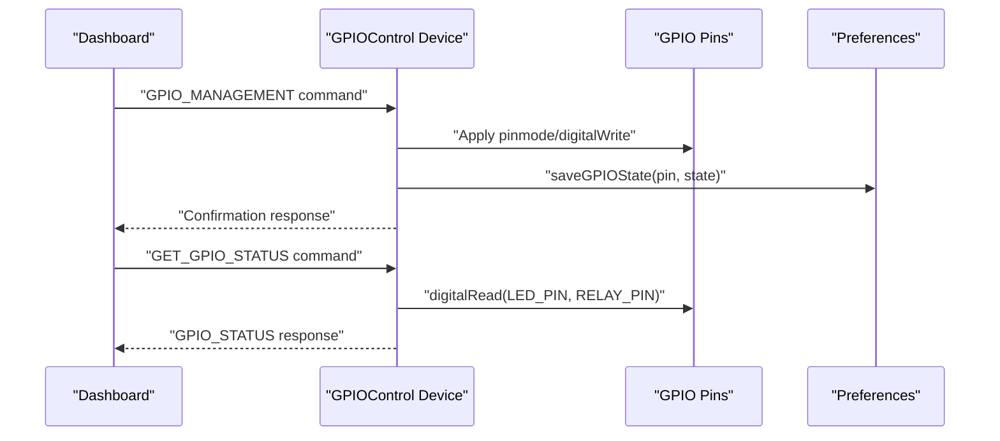

**Diagram sources**
- [GPIOControl.ino:34-79](file://examples/GPIOControl/GPIOControl.ino#L34-L79)
- [hyperwisor-iot.cpp:1382-1414](file://src/hyperwisor-iot.cpp#L1382-L1414)

**Section sources**
- [GPIOControl.ino:1-105](file://examples/GPIOControl/GPIOControl.ino#L1-L105)
- [hyperwisor-iot.h:57-61](file://src/hyperwisor-iot.h#L57-L61)
- [hyperwisor-iot.cpp:1382-1414](file://src/hyperwisor-iot.cpp#L1382-L1414)

### IoTRelayController Example
The IoTRelayController example demonstrates a comprehensive 496-line 8-channel relay controller with advanced features including temperature monitoring, active-LOW relay support, and dashboard integration. This example showcases professional-grade IoT relay control with:

**Core Features:**
- **8-channel relay control** with configurable GPIO pins
- **Active-LOW and Active-HIGH relay support** with automatic polarity detection
- **DS18B20 temperature monitoring** with configurable sensor count
- **Real-time dashboard integration** with individual relay and temperature widgets
- **Advanced command handling** supporting multiple parameter naming conventions
- **Persistent state management** with automatic relay state restoration
- **Comprehensive status reporting** with system health monitoring

**Hardware Configuration:**
- **Relay Module**: 8-channel relay board (commonly active-LOW)
- **Temperature Sensors**: DS18B20 sensors with 4.7kΩ pull-up resistors
- **ESP32 Development Board**: ESP32-WROOM-32 or compatible
- **Power Supply**: Adequate current capacity for relay loads

**Implementation Highlights:**
- Configurable relay pins (default: 32, 33, 25, 26, 27, 4, 16, 17)
- Automatic relay initialization with safe default states
- Temperature sensor resolution configuration (12-bit for highest accuracy)
- Dynamic widget ID mapping for dashboard integration
- Non-blocking sensor reading with request/response pattern
- Batch data logging with send_Sensor_Data_logger function
- Comprehensive error handling and validation

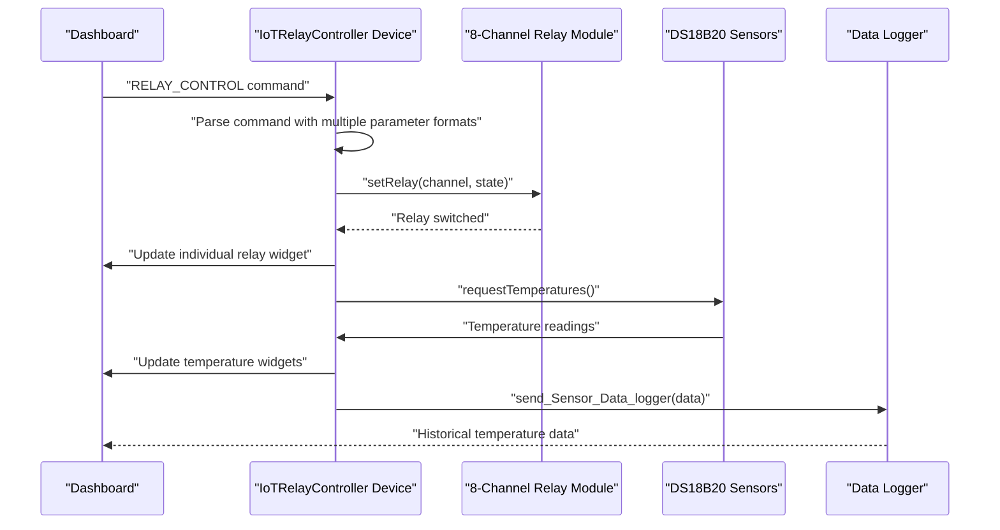

**Diagram sources**
- [IoTRelayController.ino:263-397](file://examples/IoTRelayController/IoTRelayController.ino#L263-L397)
- [IoTRelayController.ino:149-178](file://examples/IoTRelayController/IoTRelayController.ino#L149-L178)
- [IoTRelayController.ino:184-259](file://examples/IoTRelayController/IoTRelayController.ino#L184-L259)

**Section sources**
- [IoTRelayController.ino:1-497](file://examples/IoTRelayController/IoTRelayController.ino#L1-L497)
- [hyperwisor-iot.h:233-234](file://src/hyperwisor-iot.h#L233-L234)

### i2c_PCF8574_relay Example
The i2c_PCF8574_relay example demonstrates I2C communication with an external PCF8574 GPIO expander to control relays. It covers:
- I2C bus initialization with custom SDA/SCL pins
- PCF8574 expander configuration and pin modes
- Relay control via GPIO expander pins
- Command parsing for relay actions
- Integration with Hyperwisor-IOT messaging

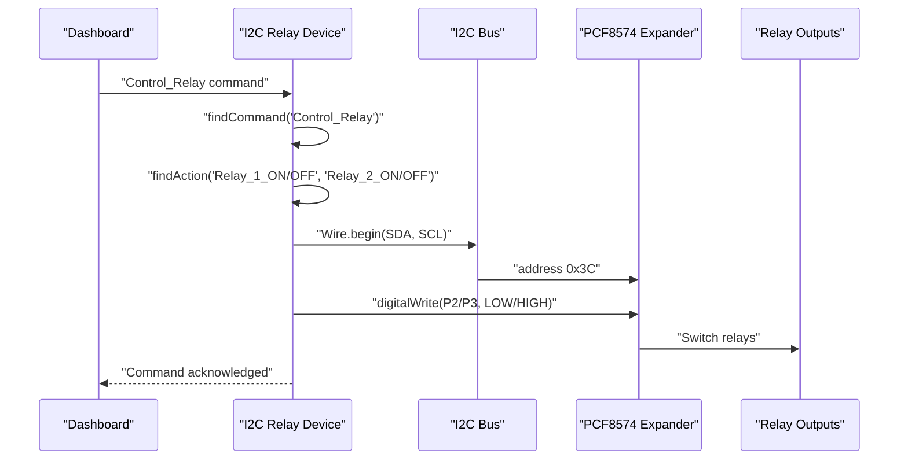

**Diagram sources**
- [i2c_PCF8574_relay.ino:12-108](file://examples/i2c_PCF8574_relay/i2c_PCF8574_relay.ino#L12-L108)
- [hyperwisor-iot.cpp:13-28](file://src/hyperwisor-iot.cpp#L13-L28)

**Section sources**
- [i2c_PCF8574_relay.ino:1-116](file://examples/i2c_PCF8574_relay/i2c_PCF8574_relay.ino#L1-L116)

### SmartHomeSwitch Example
The SmartHomeSwitch example demonstrates dual-mode relay control with offline/online capabilities and widget mapping. It features:
- **6-channel relay outputs** with physical switch inputs
- **Power loss resume** functionality with state persistence
- **Debounced switch inputs** for reliable operation
- **Dynamic widget ID mapping** for flexible dashboard integration
- **Automatic WiFi reconnection** and real-time bidirectional control

**Key Features:**
- Physical button control with state persistence across power cycles
- Cloud-based remote control via Hyperwisor dashboard
- Widget ID learning mechanism for dynamic mapping
- Debounce handling for reliable button press detection
- Bidirectional state synchronization between physical and cloud controls

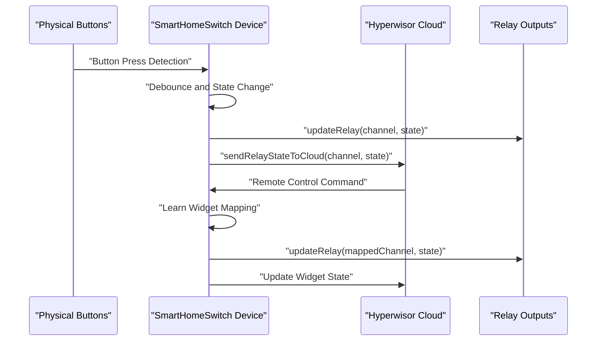

**Diagram sources**
- [SmartHomeSwitch.ino:264-285](file://examples/SmartHomeSwitch/SmartHomeSwitch.ino#L264-L285)
- [SmartHomeSwitch.ino:182-253](file://examples/SmartHomeSwitch/SmartHomeSwitch.ino#L182-L253)

**Section sources**
- [SmartHomeSwitch.ino:1-286](file://examples/SmartHomeSwitch/SmartHomeSwitch.ino#L1-L286)

### WiFi Provisioning Examples
The WiFi provisioning examples demonstrate three distinct approaches to device configuration:
- Manual provisioning: direct credential setting in code
- Conditional provisioning: combination of manual and AP mode
- Standard provisioning: AP mode with captive portal

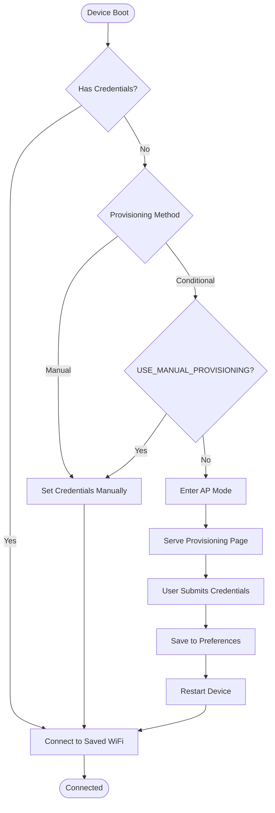

**Diagram sources**
- [WiFiProvisioning.ino:27-46](file://examples/WiFiProvisioning/WiFiProvisioning.ino#L27-L46)
- [Conditional_Provisioning_Example.ino:28-57](file://examples/Conditional_Provisioning_Example/Conditional_Provisioning_Example.ino#L28-L57)
- [Manual_Provisioning_Example.ino:25-53](file://examples/Manual_Provisioning_Example/Manual_Provisioning_Example.ino#L25-L53)

**Section sources**
- [WiFiProvisioning.ino:1-58](file://examples/WiFiProvisioning/WiFiProvisioning.ino#L1-L58)
- [Conditional_Provisioning_Example.ino:1-69](file://examples/Conditional_Provisioning_Example/Conditional_Provisioning_Example.ino#L1-L69)
- [Manual_Provisioning_Example.ino:1-65](file://examples/Manual_Provisioning_Example/Manual_Provisioning_Example.ino#L1-L65)

### Sensor Data Logging
The SensorDataLogger example demonstrates how to send sensor data to the Hyperwisor platform for logging and visualization. It shows structured data sending with configurable intervals.

**Section sources**
- [SensorDataLogger.ino:1-77](file://examples/SensorDataLogger/SensorDataLogger.ino#L1-L77)

## Dependency Analysis
The library depends on several Arduino ecosystem components and the nikolaindustry-realtime protocol. The following diagram shows the primary dependencies and their roles.

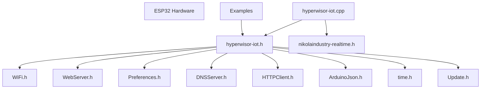

**Diagram sources**
- [hyperwisor-iot.h:4-14](file://src/hyperwisor-iot.h#L4-L14)
- [library.properties:9-10](file://library.properties#L9-L10)

**Section sources**
- [hyperwisor-iot.h:1-190](file://src/hyperwisor-iot.h#L1-L190)
- [library.properties:1-11](file://library.properties#L1-L11)

## Performance Considerations
- WiFi reconnection and WebSocket management are handled in the background loop with retry logic and automatic restart after max retries
- AP mode has a timeout to prevent indefinite hanging
- I2C operations should use appropriate pull-up resistors and avoid excessive polling
- GPIO state persistence uses Preferences with minimal overhead
- OTA updates require sufficient memory and secure HTTPS connections
- **IoTRelayController optimization**: Non-blocking sensor operations with configurable update intervals (2s for status, 5s for temperature)
- **Memory management**: Efficient use of static arrays for relay states and dynamic allocation for sensor data structures
- **Command processing**: Optimized JSON parsing with multiple parameter format support reduces processing overhead

## Troubleshooting Guide
Common issues and resolutions:
- AP mode stuck: Device automatically reboots after 4 minutes if provisioning is not completed
- WiFi disconnections: Automatic reconnection attempts with exponential backoff
- WebSocket disconnects: Automatic reconnection attempts with max retry limits
- GPIO state restoration: Verify Preferences keys and pin ranges
- I2C communication: Check SDA/SCL pin assignments and pull-up resistors
- **IoTRelayController issues**: 
  - Relay not switching: Verify ACTIVE_LOW_RELAYS configuration matches hardware polarity
  - Temperature sensor errors: Check DS18B20 wiring and 4.7kΩ pull-up resistors
  - Widget ID mapping failures: Ensure dashboard widget IDs match configured values
  - Memory issues: Monitor free heap with built-in status reporting

**Section sources**
- [hyperwisor-iot.cpp:127-136](file://src/hyperwisor-iot.cpp#L127-L136)
- [hyperwisor-iot.cpp:96-113](file://src/hyperwisor-iot.cpp#L96-L113)
- [hyperwisor-iot.cpp:64-87](file://src/hyperwisor-iot.cpp#L64-L87)

## Conclusion
The Hyperwisor-IOT library provides a comprehensive foundation for ESP32-based IoT devices, offering seamless WiFi provisioning, real-time communication, GPIO management, and hardware abstraction. The included examples demonstrate practical implementation patterns for GPIO control, I2C-based relay management, dual-mode smart home switches, and comprehensive relay control with temperature monitoring. The new IoTRelayController example showcases professional-grade IoT relay control with advanced features including active-LOW/active-HIGH relay support, temperature monitoring, and sophisticated dashboard integration. By following the guidelines and best practices outlined in this document, developers can build robust, connected IoT solutions with reliable hardware control and provisioning.

## Appendices

### Circuit Schematics and Wiring Guidelines

#### GPIO Control Circuit
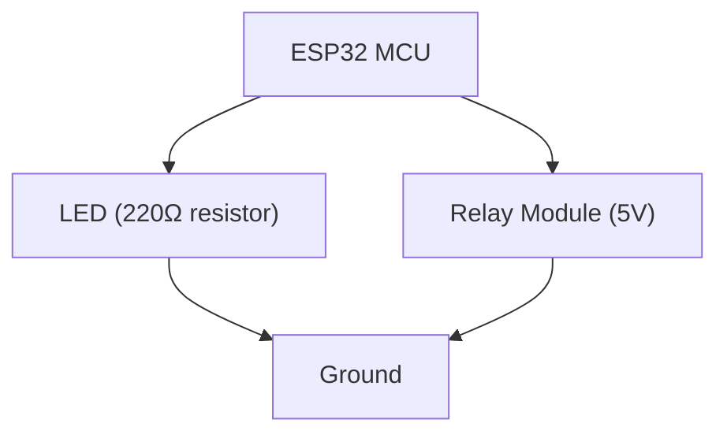

#### IoTRelayController Circuit
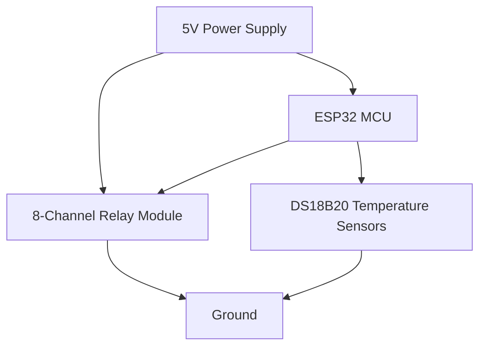

#### I2C PCF8574 Relay Circuit
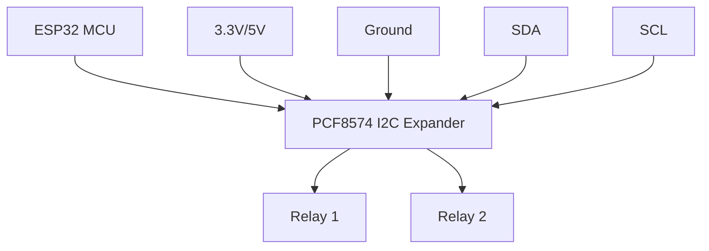

### Component Selection Guidelines
- GPIO resistors: 220Ω–1kΩ for LEDs, 10kΩ pull-ups for I2C
- Relay modules: 5V/10A, opto-isolated for noise immunity, verify polarity (active-LOW vs active-HIGH)
- DS18B20 sensors: 4.7kΩ pull-up resistors, waterproof housing for outdoor use
- PCF8574: I2C address 0x3C, 5V tolerant inputs
- ESP32: Ensure adequate power supply for I2C pull-ups and relay loads
- **IoTRelayController considerations**: 
  - Relay module with 8 channels and individual opto-isolation
  - DS18B20 sensors with 12-bit resolution for precise measurements
  - 5V power supply capable of handling all relay loads simultaneously

### Timing Diagrams
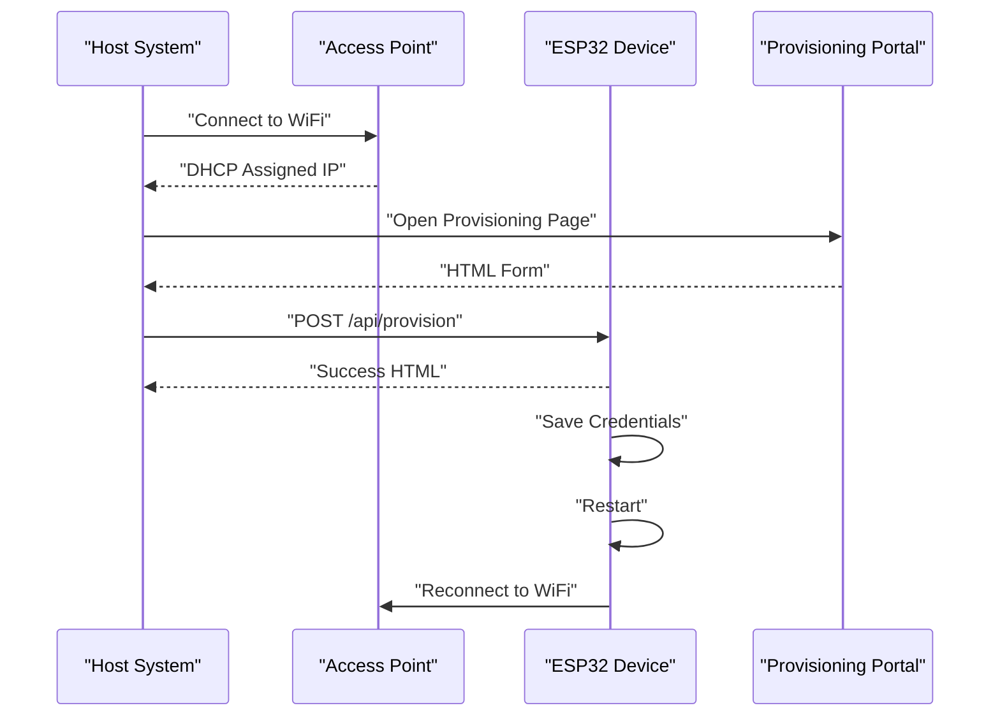

### Electrical Safety Considerations
- Use appropriate current-limiting resistors for LEDs
- Isolate high-voltage relays from microcontroller circuits
- Ensure proper grounding and noise filtering
- Verify I2C pull-up resistor values match bus capacitance
- Consider surge protection for sensitive I2C devices
- **IoTRelayController safety**:
  - Use opto-isolated relay modules for galvanic isolation
  - Implement proper fuse protection for high-current loads
  - Ensure adequate PCB spacing for high-voltage traces
  - Use appropriate enclosure materials for safety compliance

### Advanced Features and Extensions
The IoTRelayController example demonstrates several advanced features that can be adapted for other projects:

**Active-LOW/Active-HIGH Relay Support:**
- Automatic polarity detection based on ACTIVE_LOW_RELAYS configuration
- Safe default state initialization (relays OFF during startup)
- Flexible GPIO pin assignment for custom hardware layouts

**Temperature Monitoring Integration:**
- DS18B20 sensor resolution configuration (12-bit for highest accuracy)
- Dynamic sensor count detection and validation
- Batch data logging with send_Sensor_Data_logger function
- Real-time widget updates combined with historical data logging

**Dashboard Integration Patterns:**
- Individual widget mapping for each relay and sensor
- Dynamic widget ID learning from cloud commands
- Comprehensive status reporting with system health metrics
- Bidirectional state synchronization between physical and cloud controls

**Section sources**
- [IoTRelayController.ino:46-72](file://examples/IoTRelayController/IoTRelayController.ino#L46-L72)
- [IoTRelayController.ino:117-141](file://examples/IoTRelayController/IoTRelayController.ino#L117-L141)
- [IoTRelayController.ino:184-259](file://examples/IoTRelayController/IoTRelayController.ino#L184-L259)
- [hyperwisor-iot.h:233-234](file://src/hyperwisor-iot.h#L233-L234)