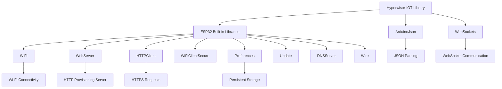
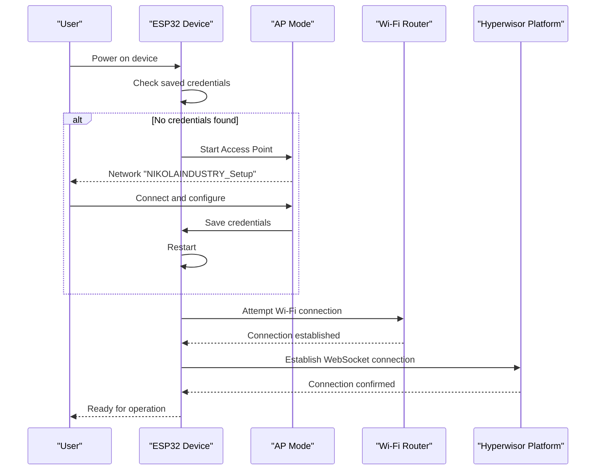
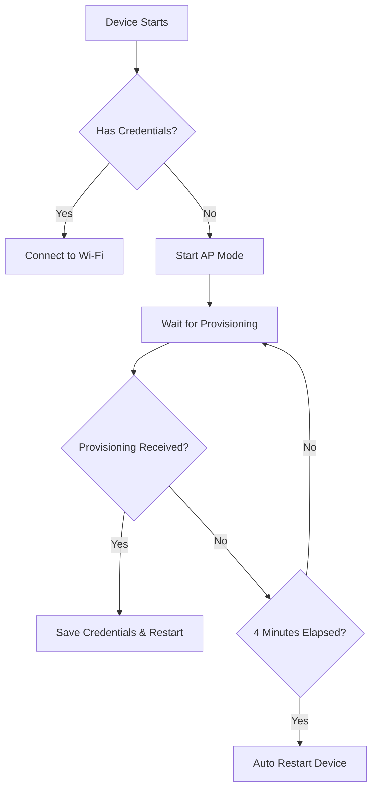

# Getting Started

<cite>
**Referenced Files in This Document**
- [README.md](file://README.md)
- [library.properties](file://library.properties)
- [hyperwisor-iot.h](file://src/hyperwisor-iot.h)
- [hyperwisor-iot.cpp](file://src/hyperwisor-iot.cpp)
- [BasicSetup.ino](file://examples/BasicSetup/BasicSetup.ino)
- [WidgetUpdate.ino](file://examples/WidgetUpdate/WidgetUpdate.ino)
- [GPIOControl.ino](file://examples/GPIOControl/GPIOControl.ino)
- [SensorDataLogger.ino](file://examples/SensorDataLogger/SensorDataLogger.ino)
- [AttitudeWidget_MPU6050.ino](file://examples/AttitudeWidget_MPU6050/AttitudeWidget_MPU6050.ino)
- [ThreeDWidgetControl.ino](file://examples/ThreeDWidgetControl/ThreeDWidgetControl.ino)
</cite>

## Table of Contents
1. [Introduction](#introduction)
2. [Prerequisites](#prerequisites)
3. [Installation](#installation)
4. [ESP32 Development Environment Setup](#esp32-development-environment-setup)
5. [Library Dependencies](#library-dependencies)
6. [First Successful Connection](#first-successful-connection)
7. [Basic Device Initialization](#basic-device-initialization)
8. [Simple Widget Demonstration](#simple-widget-demonstration)
9. [Common Setup Issues and Troubleshooting](#common-setup-issues-and-troubleshooting)
10. [Next Steps](#next-steps)

## Introduction

The Hyperwisor-IOT Arduino Library provides a powerful abstraction layer for ESP32-based IoT devices. It handles Wi-Fi provisioning, real-time communication, OTA updates, GPIO management, and structured JSON command execution out of the box. Built on top of the nikolaindustry-realtime protocol, it enables developers to build smart, connected devices with minimal code.

Key features include:
- Seamless Wi-Fi provisioning with AP-mode fallback
- Real-time communication using nikolaindustry-realtime
- Built-in JSON command parser with custom extensibility
- GPIO control via commands
- OTA firmware updates with version tracking
- Smart command routing and response feedback
- Persistent configuration using Preferences

## Prerequisites

Before you begin with Hyperwisor-IOT, ensure you have the following knowledge and equipment:

### Hardware Requirements
- ESP32 development board (any ESP32 variant)
- USB-to-Serial converter compatible with ESP32
- Basic wiring tools and breadboard for sensor connections

### Software Knowledge
- **ESP32 Microcontroller Familiarity**: Understanding of ESP32 architecture, GPIO pins, and memory constraints
- **Arduino Programming Basics**: C++ programming concepts, setup() and loop() functions, serial communication
- **JSON Data Format Understanding**: Structured data representation, arrays, objects, and key-value pairs
- **Wi-Fi Networking Concepts**: SSID, passwords, IP addresses, and network connectivity

### Development Environment
- Arduino IDE version 1.8 or later
- Basic understanding of Arduino library management
- Serial monitor for debugging and monitoring

## Installation

### Step 1: Install Required Dependencies

The Hyperwisor-IOT library requires two essential dependencies that must be installed via Arduino Library Manager:

| Library | Author | Purpose |
|---------|--------|---------|
| [ArduinoJson](https://arduinojson.org/) | Benoit Blanchon | JSON parsing and generation for device communication |
| [WebSockets](https://github.com/Links2004/arduinoWebSockets) | Markus Sattler | WebSocket communication for real-time data exchange |

**Installation Steps:**
1. Open Arduino IDE
2. Go to **Sketch → Include Library → Manage Libraries...**
3. Search for `ArduinoJson` and click **Install**
4. Search for `WebSockets` and click **Install`

### Step 2: Install ESP32 Board Package

This library only works with ESP32. Install the ESP32 board package:

1. Go to **File → Preferences**
2. Add this URL to "Additional Board Manager URLs":
   ```
   https://raw.githubusercontent.com/espressif/arduino-esp32/gh-pages/package_esp32_index.json
   ```
3. Go to **Tools → Board → Boards Manager...**
4. Search for `esp32` and install **esp32 by Espressif Systems**

### Step 3: Install Hyperwisor-IOT Library

**Method A: Arduino Library Manager (Recommended)**
1. In Arduino IDE, go to **Sketch → Include Library → Manage Libraries...**
2. Search for `Hyperwisor-IOT`
3. Click **Install**

**Method B: Manual Installation**
1. Download the repository as ZIP
2. Extract to your Arduino libraries folder
3. Restart Arduino IDE

### Step 4: Verify Installation

1. Open Arduino IDE
2. Go to **File → Examples → Hyperwisor-IOT**
3. Select any example sketch
4. Verify the sketch compiles without errors

## ESP32 Development Environment Setup

### Board Selection
1. Go to **Tools → Board → Boards Manager...**
2. Install ESP32 board package if not already installed
3. Select your specific ESP32 board variant (e.g., ESP32 Dev Module)

### Port Configuration
1. Go to **Tools → Port**
2. Select the appropriate COM port for your ESP32
3. Ensure the port matches your physical connection

### Serial Monitor Settings
1. Open **Tools → Serial Monitor**
2. Set baud rate to **115200**
3. Enable "Both NL & CR" if needed

### Memory and Flash Settings
1. Go to **Tools → Flash Frequency** (typically 80MHz for development)
2. Set **Flash Mode** to **DIO** (most common)
3. Choose appropriate **Flash Size** for your board

## Library Dependencies

The Hyperwisor-IOT library has the following dependency structure:



**Diagram sources**
- [library.properties](file://library.properties#L9-L11)
- [hyperwisor-iot.h](file://src/hyperwisor-iot.h#L4-L15)

### Dependency Management

The library declares its dependencies in `library.properties`:
- **ArduinoJson**: Required for JSON message parsing and generation
- **WebSockets**: Required for real-time communication protocol
- **ESP32 Built-in**: WiFi, WebServer, HTTPClient, Preferences, Update, DNSServer, Wire

### Version Compatibility

- **Arduino IDE**: Version 1.8 or later
- **ESP32 Core**: Latest stable version
- **ArduinoJson**: Version compatible with library requirements
- **WebSockets**: Latest stable version

## First Successful Connection

### Initial Setup Process

Follow these steps for your first successful connection:

#### Step 1: Upload Basic Setup Sketch
1. Open `examples/BasicSetup/BasicSetup.ino`
2. Connect your ESP32 to computer via USB
3. Upload the sketch to your device

#### Step 2: Monitor Serial Output
1. Open **Tools → Serial Monitor** (115200 baud)
2. Reset your ESP32 device
3. Look for initialization messages

#### Step 3: Wi-Fi Provisioning
If no credentials are found, the device enters AP mode:
- **Access Point**: `NIKOLAINDUSTRY_Setup`
- **Password**: `0123456789`
- **IP Address**: Usually `192.168.4.1`

#### Step 4: Configure Wi-Fi Credentials
1. Connect to the `NIKOLAINDUSTRY_Setup` Wi-Fi network
2. Open browser and navigate to `http://192.168.4.1`
3. Enter your Wi-Fi credentials and device information
4. Submit the form

#### Step 5: Device Reboot and Connection
1. Device will restart automatically
2. Device attempts to connect to your Wi-Fi network
3. If successful, device connects to the Hyperwisor platform
4. You should see connection confirmation in serial monitor

### Connection Flow Diagram



**Diagram sources**
- [hyperwisor-iot.cpp](file://src/hyperwisor-iot.cpp#L13-L28)
- [hyperwisor-iot.cpp](file://src/hyperwisor-iot.cpp#L141-L156)
- [hyperwisor-iot.cpp](file://src/hyperwisor-iot.cpp#L278-L310)

### Expected Serial Output

After successful connection, you should see output similar to:
```
=== Hyperwisor-IOT Basic Setup ===

Device initialized!
Device ID: YOUR_DEVICE_ID
WiFi connected: 192.168.1.XXX
Real-time connection established
```

## Basic Device Initialization

### Minimal Implementation

The simplest way to initialize a Hyperwisor-IOT device:

```cpp
#include <hyperwisor-iot.h>

HyperwisorIOT device;

void setup() {
  Serial.begin(115200);
  delay(1000);
  
  Serial.println("\n=== Hyperwisor-IOT Basic Setup ===\n");
  
  // Initialize the device
  device.begin();
  
  Serial.println("Device initialized!");
  Serial.println("Device ID: " + device.getDeviceId());
}

void loop() {
  // Keep the connection alive and handle incoming messages
  device.loop();
}
```

### Initialization Process Breakdown

The `device.begin()` function performs these key steps:

1. **Load Stored Credentials**: Retrieves saved Wi-Fi credentials and device information
2. **Connection Decision**: Attempts automatic Wi-Fi connection if credentials exist
3. **Fallback to AP Mode**: Starts access point if no credentials are found
4. **Initialize Real-time Protocol**: Sets up WebSocket communication
5. **Start NTP Services**: Configures network time synchronization

### Device Configuration Options

You can customize device behavior during initialization:

```cpp
// Manual provisioning (optional)
device.setWiFiCredentials("YourSSID", "YourPassword");
device.setDeviceId("your-device-id");
device.setUserId("your-user-id");

// Set API keys for database operations
device.setApiKeys("your-api-key", "your-secret-key");

// Set custom command handler
device.setUserCommandHandler([](JsonObject& msg) {
  // Custom logic here
});
```

## Simple Widget Demonstration

### Basic Widget Updates

This example demonstrates how to send data to dashboard widgets:

```cpp
#include <hyperwisor-iot.h>

HyperwisorIOT device;

// Replace with your actual IDs from Hyperwisor Dashboard
String targetId = "your-dashboard-id";
String temperatureWidgetId = "widget-temperature";
String humidityWidgetId = "widget-humidity";
String chartWidgetId = "widget-chart";

void setup() {
  Serial.begin(115200);
  delay(1000);
  
  Serial.println("\n=== Widget Update Example ===\n");
  
  device.begin();
  
  Serial.println("Device initialized!");
  Serial.println("Will send widget updates every 5 seconds...");
}

void loop() {
  device.loop();
  
  // Send updates at regular intervals
  static unsigned long lastUpdate = 0;
  if (millis() - lastUpdate >= 5000) {
    lastUpdate = millis();
    
    // Simulate sensor readings
    float temperature = 20.0 + random(0, 100) / 10.0;
    float humidity = 40.0 + random(0, 300) / 10.0;
    
    // Update widget with a float value
    device.updateWidget(targetId, temperatureWidgetId, temperature);
    Serial.println("Sent temperature: " + String(temperature));
    
    // Update widget with a string value
    device.updateWidget(targetId, humidityWidgetId, String(humidity) + "%");
    Serial.println("Sent humidity: " + String(humidity) + "%");
    
    // Update widget with an array (for charts/graphs)
    std::vector<float> chartData = {23.5, 24.0, 24.5, 25.0, 24.8, temperature};
    device.updateWidget(targetId, chartWidgetId, chartData);
    Serial.println("Sent chart data array");
    
    Serial.println("---");
  }
}
```

### Widget Types and Capabilities

The library supports various widget types:

| Widget Type | Method | Description |
|-------------|--------|-------------|
| Text/Value | `updateWidget()` | Single values, strings, numbers |
| Chart/Graph | `updateWidget()` with arrays | Multi-point data series |
| Flight Attitude | `updateFlightAttitude()` | Roll/pitch visualization |
| 3D Model | `update3DModel()` | Single model updates |
| 3D Widget | `update3DWidget()` | Multiple model control |
| Position/Size | `updateWidgetPosition()` | Widget positioning |
| Countdown | `updateCountdown()` | Time-based displays |
| Heat Map | `updateHeatMap()` | Spatial data visualization |

### Widget Update Flow

```mermaid
flowchart TD
A[User Code] --> B[device.updateWidget()]
B --> C[Build JSON Payload]
C --> D[Send via WebSocket]
D --> E[Dashboard Receives]
E --> F[Widget Updates]
G[Multiple Values] --> H[Array Parameter]
H --> I[JSON Array Format]
J[3D Models] --> K[Multiple Model Updates]
K --> L[Individual Transformations]
M[Flight Attitude] --> N[Roll/Pitch Calculation]
N --> O[Specialized Widget Format]
```

**Diagram sources**
- [hyperwisor-iot.cpp](file://src/hyperwisor-iot.cpp#L552-L598)
- [hyperwisor-iot.cpp](file://src/hyperwisor-iot.cpp#L631-L638)
- [hyperwisor-iot.cpp](file://src/hyperwisor-iot.cpp#L678-L714)

## Common Setup Issues and Troubleshooting

### Issue 1: Library Installation Problems

**Problem**: Arduino IDE cannot find Hyperwisor-IOT library
**Solution**:
1. Verify library appears in **Sketch → Include Library → Manage Libraries...**
2. Check library version compatibility
3. Remove and reinstall the library if corrupted
4. Restart Arduino IDE

**Diagnostic Commands**:
```cpp
// Test library inclusion
#include <hyperwisor-iot.h>
Serial.println("Library loaded successfully");
```

### Issue 2: ESP32 Board Package Not Found

**Problem**: Cannot select ESP32 board in Arduino IDE
**Solution**:
1. Go to **File → Preferences → Additional Board Manager URLs**
2. Add: `https://raw.githubusercontent.com/espressif/arduino-esp32/gh-pages/package_esp32_index.json`
3. Open **Tools → Board → Boards Manager**
4. Search and install "esp32 by Espressif Systems"
5. Select your specific ESP32 board variant

### Issue 3: Compilation Errors

**Problem**: Errors related to missing dependencies
**Solution**:
1. Install ArduinoJson via Library Manager
2. Install WebSockets via Library Manager
3. Verify library versions are compatible
4. Clean and rebuild project

**Common Error Messages**:
- `fatal error: ArduinoJson.h: No such file or directory`
- `websockets.h: No such file or directory`
- `WiFi.h: No such file or directory`

### Issue 4: Wi-Fi Connection Failures

**Problem**: Device cannot connect to Wi-Fi network
**Solution**:
1. Verify Wi-Fi credentials are correct
2. Check router compatibility (2.4GHz networks)
3. Ensure router is functioning properly
4. Move closer to router for signal strength

**Debugging Steps**:
1. Check serial monitor for connection attempts
2. Verify AP mode activation when no credentials found
3. Confirm provisioning page accessibility

### Issue 5: AP Mode Issues

**Problem**: Device stays in AP mode indefinitely
**Solution**:
1. Device automatically restarts after 4 minutes in AP mode
2. Check provisioning form submission
3. Verify device receives and saves credentials
4. Ensure device has internet access after provisioning

**AP Mode Timeout Flow**:


**Diagram sources**
- [hyperwisor-iot.cpp](file://src/hyperwisor-iot.cpp#L127-L132)

### Issue 6: Real-time Communication Problems

**Problem**: WebSocket connection fails or drops
**Solution**:
1. Check network connectivity
2. Verify device has internet access
3. Monitor serial output for reconnection attempts
4. Ensure firewall allows WebSocket connections

**Reconnection Logic**:
- Automatic reconnection every 10 seconds
- Maximum 6 reconnection attempts
- Device restarts after max attempts exceeded

### Issue 7: Serial Monitor Issues

**Problem**: No output in Serial Monitor
**Solution**:
1. Set baud rate to 115200
2. Select correct COM port
3. Ensure device is properly connected
4. Check USB cable quality

### Issue 8: Memory and Storage Issues

**Problem**: Device runs out of memory or storage
**Solution**:
1. Monitor memory usage in serial output
2. Use smaller JSON payloads when possible
3. Clear unused preferences data
4. Optimize code for memory efficiency

**Memory Management Tips**:
- Use appropriate JSON document sizes
- Clear temporary variables
- Avoid large static arrays
- Use dynamic allocation judiciously

## Next Steps

### Advanced Examples

Explore these advanced examples to expand your device capabilities:

1. **GPIO Control**: Remote GPIO pin management with state persistence
2. **Sensor Data Logging**: Structured sensor data collection and reporting
3. **MPU6050 Integration**: Flight attitude visualization with accelerometer/gyroscope
4. **3D Widget Control**: Multi-model 3D scene manipulation
5. **Command Handlers**: Custom command processing and response generation

### Production Considerations

When moving to production:

1. **Security**: Implement proper authentication and encryption
2. **Reliability**: Add comprehensive error handling and recovery
3. **Performance**: Optimize memory usage and power consumption
4. **Scalability**: Design for multiple device management
5. **Monitoring**: Implement health checks and diagnostics

### Community Resources

- **GitHub Repository**: Report issues and contribute improvements
- **Documentation**: Complete API reference and examples
- **Community Forums**: Get help from other developers
- **Hardware Compatibility**: Check supported ESP32 variants and shields

### Support and Licensing

The Hyperwisor-IOT library is proprietary software with specific licensing terms. For commercial use, OEM partnerships, or distribution rights, contact the maintainers at support@nikolaindustry.com.

---

**Remember**: This is a getting started guide designed for beginners. As you become more comfortable with the library, explore the advanced examples and full API documentation to unlock the complete potential of the Hyperwisor-IOT platform.