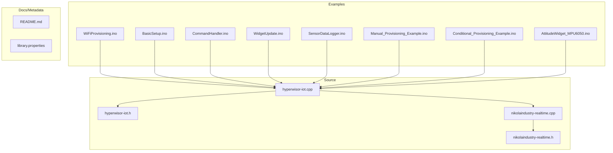
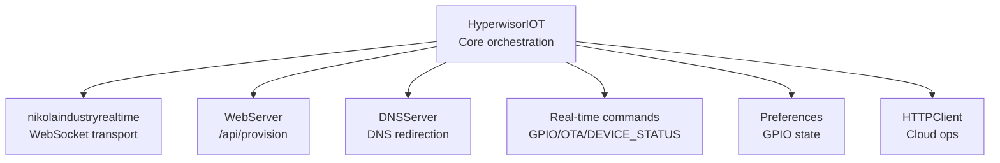
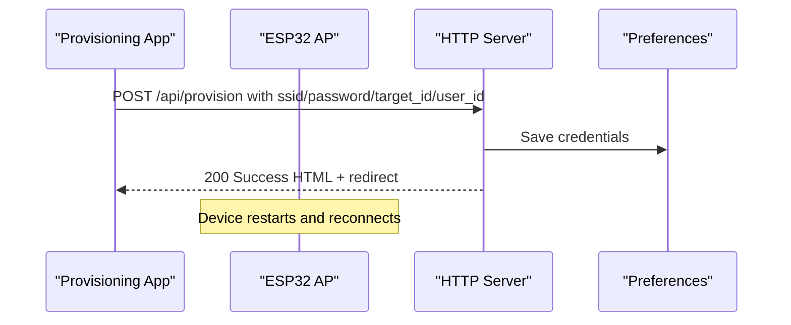
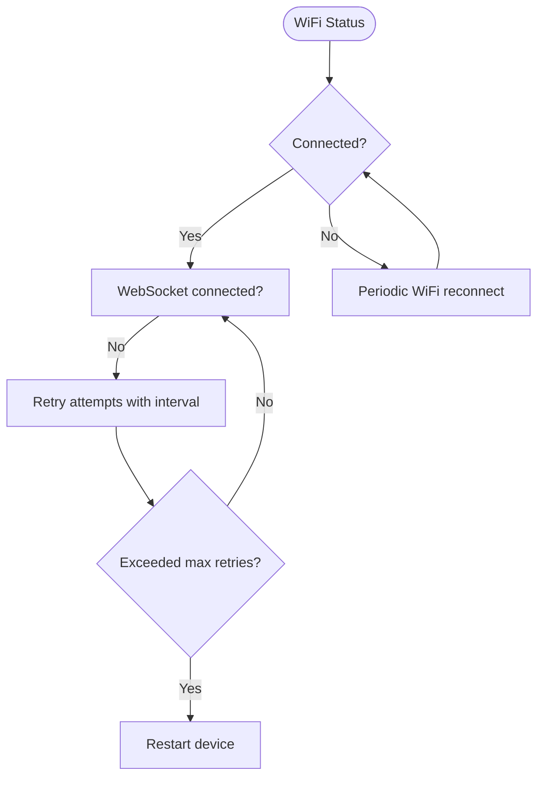
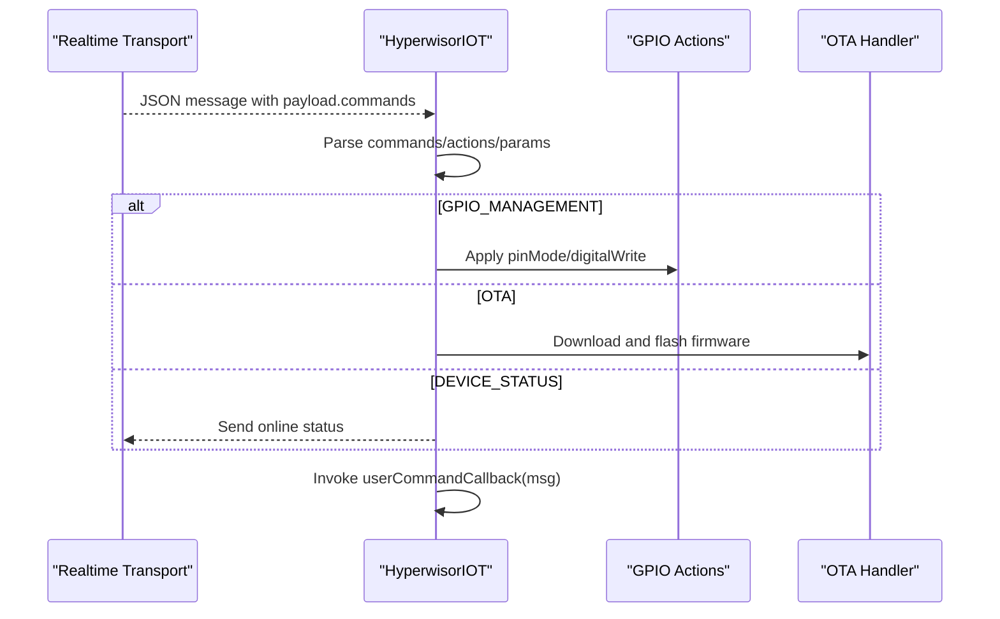
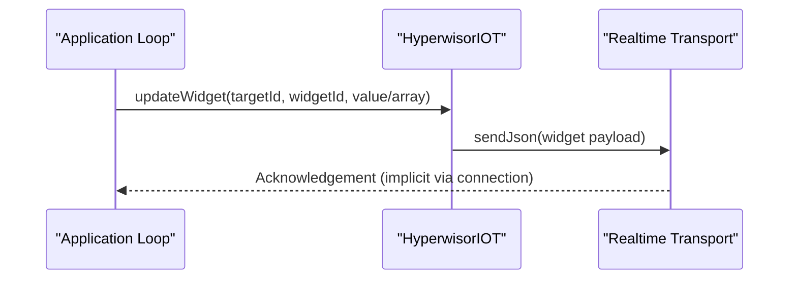
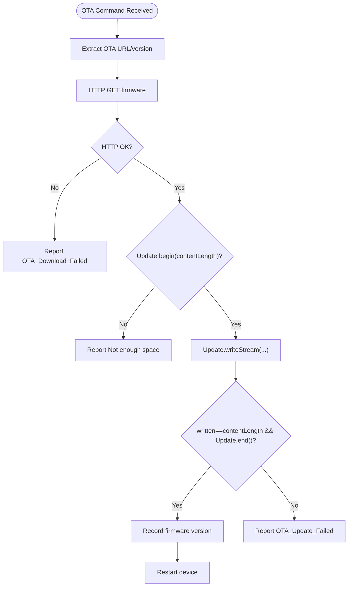
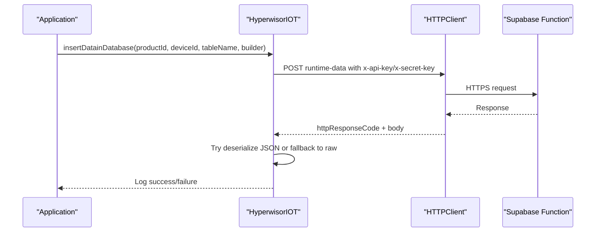
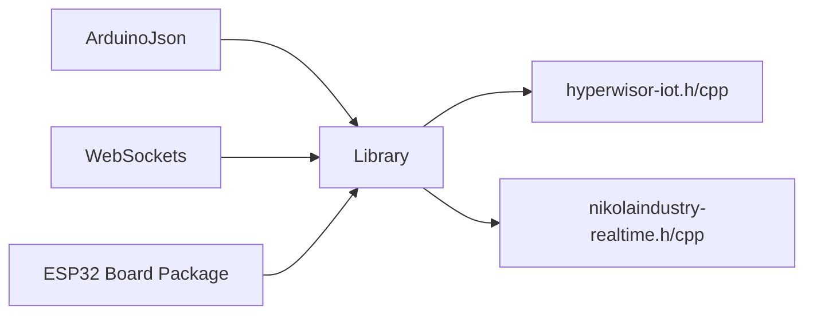

# Troubleshooting and FAQ

<cite>
**Referenced Files in This Document**
- [README.md](file://README.md)
- [library.properties](file://library.properties)
- [src/hyperwisor-iot.h](file://src/hyperwisor-iot.h)
- [src/hyperwisor-iot.cpp](file://src/hyperwisor-iot.cpp)
- [src/nikolaindustry-realtime.h](file://src/nikolaindustry-realtime.h)
- [src/nikolaindustry-realtime.cpp](file://src/nikolaindustry-realtime.cpp)
- [examples/WiFiProvisioning/WiFiProvisioning.ino](file://examples/WiFiProvisioning/WiFiProvisioning.ino)
- [examples/BasicSetup/BasicSetup.ino](file://examples/BasicSetup/BasicSetup.ino)
- [examples/CommandHandler/CommandHandler.ino](file://examples/CommandHandler/CommandHandler.ino)
- [examples/WidgetUpdate/WidgetUpdate.ino](file://examples/WidgetUpdate/WidgetUpdate.ino)
- [examples/SensorDataLogger/SensorDataLogger.ino](file://examples/SensorDataLogger/SensorDataLogger.ino)
- [examples/Manual_Provisioning_Example/Manual_Provisioning_Example.ino](file://examples/Manual_Provisioning_Example/Manual_Provisioning_Example.ino)
- [examples/Conditional_Provisioning_Example/Conditional_Provisioning_Example.ino](file://examples/Conditional_Provisioning_Example/Conditional_Provisioning_Example.ino)
- [examples/AttitudeWidget_MPU6050/AttitudeWidget_MPU6050.ino](file://examples/AttitudeWidget_MPU6050/AttitudeWidget_MPU6050.ino)
</cite>

## Table of Contents
1. [Introduction](#introduction)
2. [Project Structure](#project-structure)
3. [Core Components](#core-components)
4. [Architecture Overview](#architecture-overview)
5. [Detailed Component Analysis](#detailed-component-analysis)
6. [Dependency Analysis](#dependency-analysis)
7. [Performance Considerations](#performance-considerations)
8. [Troubleshooting Guide](#troubleshooting-guide)
9. [Conclusion](#conclusion)
10. [Appendices](#appendices)

## Introduction
This document provides a comprehensive troubleshooting and FAQ guide for the Hyperwisor-IOT Arduino library. It focuses on diagnosing and resolving common issues related to:
- WiFi provisioning failures
- Real-time communication problems
- DNS redirection issues
- Widget display and update problems
- Command processing and JSON parsing errors
- Memory and stack-related concerns
- Performance tuning
- Configuration mistakes, dependency conflicts, and compilation errors
- Platform-specific considerations for ESP32 boards and development environments

The guide also outlines systematic debugging approaches using serial output, log analysis, and diagnostic tools, and answers frequently asked questions about library limitations, compatibility, and integration.

## Project Structure
The repository is organized into:
- Examples: Ready-to-run demonstrations of provisioning, basic setup, command handling, widget updates, sensor logging, and advanced integrations
- Source: Core library implementation and the underlying real-time transport wrapper
- Documentation and metadata: README, library properties, and license

**Diagram sources**
- [src/hyperwisor-iot.h](file://src/hyperwisor-iot.h#L1-L190)
- [src/hyperwisor-iot.cpp](file://src/hyperwisor-iot.cpp#L1-L1811)
- [src/nikolaindustry-realtime.h](file://src/nikolaindustry-realtime.h#L1-L35)
- [src/nikolaindustry-realtime.cpp](file://src/nikolaindustry-realtime.cpp#L1-L113)
- [examples/WiFiProvisioning/WiFiProvisioning.ino](file://examples/WiFiProvisioning/WiFiProvisioning.ino#L1-L58)
- [examples/BasicSetup/BasicSetup.ino](file://examples/BasicSetup/BasicSetup.ino#L1-L39)
- [examples/CommandHandler/CommandHandler.ino](file://examples/CommandHandler/CommandHandler.ino#L1-L96)
- [examples/WidgetUpdate/WidgetUpdate.ino](file://examples/WidgetUpdate/WidgetUpdate.ino#L1-L68)
- [examples/SensorDataLogger/SensorDataLogger.ino](file://examples/SensorDataLogger/SensorDataLogger.ino#L1-L77)
- [examples/Manual_Provisioning_Example/Manual_Provisioning_Example.ino](file://examples/Manual_Provisioning_Example/Manual_Provisioning_Example.ino#L1-L65)
- [examples/Conditional_Provisioning_Example/Conditional_Provisioning_Example.ino](file://examples/Conditional_Provisioning_Example/Conditional_Provisioning_Example.ino#L1-L69)
- [examples/AttitudeWidget_MPU6050/AttitudeWidget_MPU6050.ino](file://examples/AttitudeWidget_MPU6050/AttitudeWidget_MPU6050.ino#L1-L95)

**Section sources**
- [README.md](file://README.md#L1-L173)
- [library.properties](file://library.properties#L1-L11)

## Core Components
- HyperwisorIOT class: Orchestrates WiFi provisioning, AP mode, DNS redirection, real-time messaging, OTA updates, widget updates, GPIO state persistence, and HTTP-based cloud operations.
- nikolaindustryrealtime wrapper: Manages WebSocket connectivity, heartbeats, and JSON serialization/deserialization for real-time messaging.

Key capabilities:
- WiFi provisioning via AP mode with embedded HTTP server and DNS redirection
- Real-time bidirectional messaging with automatic reconnection and heartbeat
- Structured JSON command processing for GPIO and OTA
- Widget update helpers for numeric, string, and array values
- Cloud operations (database insert/get/update/delete, onboard device, send SMS, authenticate user)
- GPIO state persistence and restoration

**Section sources**
- [src/hyperwisor-iot.h](file://src/hyperwisor-iot.h#L39-L187)
- [src/nikolaindustry-realtime.h](file://src/nikolaindustry-realtime.h#L10-L32)

## Architecture Overview
The system integrates several subsystems:
- WiFi and AP provisioning
- Embedded HTTP server and DNS redirection
- Real-time WebSocket transport
- JSON command processing and dispatch
- Optional cloud HTTP operations
- GPIO state persistence

**Diagram sources**
- [src/hyperwisor-iot.cpp](file://src/hyperwisor-iot.cpp#L13-L137)
- [src/hyperwisor-iot.cpp](file://src/hyperwisor-iot.cpp#L141-L156)
- [src/hyperwisor-iot.cpp](file://src/hyperwisor-iot.cpp#L159-L185)
- [src/nikolaindustry-realtime.cpp](file://src/nikolaindustry-realtime.cpp#L5-L75)

## Detailed Component Analysis

### WiFi Provisioning and AP Mode
Common symptoms:
- Device remains stuck in AP mode
- Provisioning page returns errors
- No redirect to the app after provisioning

Root causes and fixes:
- Missing SSID or invalid provisioning arguments cause a provisioning error response and keep the device in AP mode
- AP mode timeout triggers a restart after a fixed duration
- Ensure the provisioning app sends required fields and uses the correct endpoint

**Diagram sources**
- [src/hyperwisor-iot.cpp](file://src/hyperwisor-iot.cpp#L159-L185)
- [src/hyperwisor-iot.cpp](file://src/hyperwisor-iot.cpp#L188-L253)

**Section sources**
- [src/hyperwisor-iot.cpp](file://src/hyperwisor-iot.cpp#L141-L156)
- [src/hyperwisor-iot.cpp](file://src/hyperwisor-iot.cpp#L159-L185)
- [examples/WiFiProvisioning/WiFiProvisioning.ino](file://examples/WiFiProvisioning/WiFiProvisioning.ino#L28-L52)

### Real-time Communication and Reconnection
Common symptoms:
- WebSocket disconnects frequently
- No real-time messages received
- Heartbeat ping/pong logs missing

Root causes and fixes:
- WiFi disconnection triggers reconnection attempts with retry limits
- After exceeding max retries, the device reboots
- Heartbeat is enabled to detect stale connections

**Diagram sources**
- [src/hyperwisor-iot.cpp](file://src/hyperwisor-iot.cpp#L46-L137)
- [src/nikolaindustry-realtime.cpp](file://src/nikolaindustry-realtime.cpp#L69-L75)
- [src/nikolaindustry-realtime.cpp](file://src/nikolaindustry-realtime.cpp#L19-L67)

**Section sources**
- [src/hyperwisor-iot.cpp](file://src/hyperwisor-iot.cpp#L46-L137)
- [src/nikolaindustry-realtime.cpp](file://src/nikolaindustry-realtime.cpp#L19-L67)

### JSON Command Processing and Dispatch
Common symptoms:
- Commands ignored or not executed
- JSON parsing errors reported
- GPIO commands not applied

Root causes and fixes:
- Message must contain a payload with commands array
- Built-in commands: GPIO_MANAGEMENT, OTA, DEVICE_STATUS
- User-defined handler receives the raw message for custom logic
- Ensure JSON structure matches expected fields

**Diagram sources**
- [src/hyperwisor-iot.cpp](file://src/hyperwisor-iot.cpp#L313-L405)
- [src/hyperwisor-iot.cpp](file://src/hyperwisor-iot.cpp#L328-L390)
- [src/hyperwisor-iot.cpp](file://src/hyperwisor-iot.cpp#L408-L411)

**Section sources**
- [src/hyperwisor-iot.cpp](file://src/hyperwisor-iot.cpp#L313-L405)
- [examples/CommandHandler/CommandHandler.ino](file://examples/CommandHandler/CommandHandler.ino#L26-L85)

### Widget Updates and Display Issues
Common symptoms:
- Widgets not updating on the dashboard
- Incorrect data types sent
- Update intervals too aggressive

Root causes and fixes:
- Ensure targetId and widgetId match dashboard configuration
- Use appropriate updateWidget overloads for string, float, or arrays
- Respect update intervals to avoid overwhelming the transport

**Diagram sources**
- [src/hyperwisor-iot.cpp](file://src/hyperwisor-iot.cpp#L551-L598)
- [src/hyperwisor-iot.cpp](file://src/hyperwisor-iot.cpp#L630-L650)
- [examples/WidgetUpdate/WidgetUpdate.ino](file://examples/WidgetUpdate/WidgetUpdate.ino#L41-L67)

**Section sources**
- [src/hyperwisor-iot.cpp](file://src/hyperwisor-iot.cpp#L551-L598)
- [examples/WidgetUpdate/WidgetUpdate.ino](file://examples/WidgetUpdate/WidgetUpdate.ino#L20-L67)

### OTA Firmware Updates
Common symptoms:
- OTA download fails
- Flash write fails or device does not restart
- Version not recorded

Root causes and fixes:
- Verify OTA URL and content length
- Ensure sufficient flash space for the update
- Confirm HTTPS connectivity and error reporting

**Diagram sources**
- [src/hyperwisor-iot.cpp](file://src/hyperwisor-iot.cpp#L1417-L1503)

**Section sources**
- [src/hyperwisor-iot.cpp](file://src/hyperwisor-iot.cpp#L1417-L1503)

### Cloud Operations (Database, SMS, Onboarding, Auth)
Common symptoms:
- HTTP request failures
- JSON deserialization errors in responses
- Missing API keys or WiFi connectivity

Root causes and fixes:
- API keys must be set before invoking cloud functions
- WiFi must be connected
- Responses are parsed; if JSON parsing fails, raw response is logged

**Diagram sources**
- [src/hyperwisor-iot.cpp](file://src/hyperwisor-iot.cpp#L730-L778)
- [src/hyperwisor-iot.cpp](file://src/hyperwisor-iot.cpp#L800-L847)

**Section sources**
- [src/hyperwisor-iot.cpp](file://src/hyperwisor-iot.cpp#L730-L778)
- [src/hyperwisor-iot.cpp](file://src/hyperwisor-iot.cpp#L849-L888)

## Dependency Analysis
External dependencies and constraints:
- ArduinoJson and WebSockets are required
- ESP32 board package is mandatory
- Built-in ESP32 libraries are used (WiFi, WebServer, HTTPClient, Preferences, Update, DNSServer, Wire)

Potential conflicts and resolutions:
- Ensure Arduino IDE Library Manager installs ArduinoJson and WebSockets
- Use the official ESP32 board package index URL
- Avoid mixing incompatible versions of core libraries

**Diagram sources**
- [README.md](file://README.md#L92-L122)
- [library.properties](file://library.properties#L9-L10)

**Section sources**
- [README.md](file://README.md#L92-L122)
- [library.properties](file://library.properties#L9-L10)

## Performance Considerations
- Real-time loop runs continuously; keep user callbacks lightweight
- Prefer batching widget updates and limiting update frequency
- Use appropriate JSON document sizes to avoid fragmentation
- Monitor free heap and uptime in custom responses for stability insights
- Disable sleep if latency-sensitive real-time is required

[No sources needed since this section provides general guidance]

## Troubleshooting Guide

### WiFi Provisioning Failures
Symptoms:
- Device stays in AP mode indefinitely
- Provisioning page shows errors
- No redirect to the app

Checklist:
- Confirm provisioning app sends ssid, password, target_id, user_id
- Verify AP mode started and HTTP server listening
- Review serial logs for provisioning success/error HTML generation
- If stuck, device restarts after AP timeout

Remediation:
- Re-enter credentials via the provisioning app
- Clear stored credentials and restart if needed
- Ensure router accepts the provided SSID and password

**Section sources**
- [src/hyperwisor-iot.cpp](file://src/hyperwisor-iot.cpp#L141-L156)
- [src/hyperwisor-iot.cpp](file://src/hyperwisor-iot.cpp#L159-L185)
- [examples/WiFiProvisioning/WiFiProvisioning.ino](file://examples/WiFiProvisioning/WiFiProvisioning.ino#L28-L52)

### Real-time Communication Issues
Symptoms:
- Frequent WebSocket disconnects
- No messages received
- Heartbeat logs missing

Checklist:
- Verify WiFi connectivity
- Confirm device ID is set and passed to real-time
- Inspect retry attempts and max retries exceeded logs
- Look for heartbeat ping/pong indicators

Remediation:
- Improve WiFi signal or reduce interference
- Reduce workload in loop to maintain transport responsiveness
- Investigate firewall or network restrictions blocking WebSocket

**Section sources**
- [src/hyperwisor-iot.cpp](file://src/hyperwisor-iot.cpp#L46-L137)
- [src/nikolaindustry-realtime.cpp](file://src/nikolaindustry-realtime.cpp#L19-L67)

### DNS Redirection Problems
Symptoms:
- Browser cannot reach provisioning page
- Redirects fail to app

Checklist:
- Confirm DNSServer started on port 53
- Ensure soft AP IP is reachable
- Validate HTTP server routes

Remediation:
- Re-initiate AP mode and confirm DNS start
- Test connectivity to soft AP IP from the phone/tablet

**Section sources**
- [src/hyperwisor-iot.cpp](file://src/hyperwisor-iot.cpp#L141-L156)

### Widget Display and Update Problems
Symptoms:
- Widgets not updating
- Incorrect values shown

Checklist:
- Match targetId and widgetId with dashboard configuration
- Use correct updateWidget overload for the data type
- Ensure device is connected and real-time is active

Remediation:
- Validate widget IDs and target IDs
- Throttle update frequency
- Use array-based updates for charts/graphs

**Section sources**
- [src/hyperwisor-iot.cpp](file://src/hyperwisor-iot.cpp#L551-L598)
- [examples/WidgetUpdate/WidgetUpdate.ino](file://examples/WidgetUpdate/WidgetUpdate.ino#L20-L67)

### Command Processing and JSON Parsing Errors
Symptoms:
- Commands ignored
- JSON parsing warnings

Checklist:
- Ensure payload contains commands array
- Validate command/action/params presence
- Confirm user handler is registered

Remediation:
- Align JSON structure with expected schema
- Add defensive checks in user handler
- Use provided find helpers to locate nested fields

**Section sources**
- [src/hyperwisor-iot.cpp](file://src/hyperwisor-iot.cpp#L313-L405)
- [examples/CommandHandler/CommandHandler.ino](file://examples/CommandHandler/CommandHandler.ino#L26-L85)

### Memory Management and Stack Overflow
Symptoms:
- Random resets
- Loop hangs or freezes
- Heap size low in status responses

Checklist:
- Monitor free heap in custom responses
- Avoid large static buffers
- Use streaming for large payloads (e.g., OTA)

Remediation:
- Reduce JSON document sizes where possible
- Free heap monitoring via custom status command
- Avoid deep recursion and large local arrays

**Section sources**
- [examples/CommandHandler/CommandHandler.ino](file://examples/CommandHandler/CommandHandler.ino#L77-L83)

### Performance Optimization Guidance
- Minimize work in loop; delegate heavy tasks to background tasks
- Batch real-time messages
- Tune update intervals for widgets and sensor logs
- Use heartbeat and reconnection settings judiciously

[No sources needed since this section provides general guidance]

### Common Configuration Mistakes
- Missing API keys for cloud operations
- Incorrect targetId/widgetId
- Wrong device ID for real-time
- AP mode credentials mismatch

Remediation:
- Call setApiKeys before invoking cloud functions
- Verify IDs against dashboard configuration
- Ensure device ID is set and persisted

**Section sources**
- [src/hyperwisor-iot.cpp](file://src/hyperwisor-iot.cpp#L724-L728)
- [examples/WidgetUpdate/WidgetUpdate.ino](file://examples/WidgetUpdate/WidgetUpdate.ino#L20-L25)

### Dependency Conflicts and Compilation Errors
- ArduinoJson/WebSockets not installed
- ESP32 board package not installed or outdated
- Conflicting library versions

Remediation:
- Install required libraries via Library Manager
- Use the official ESP32 board package index URL
- Clean and rebuild project

**Section sources**
- [README.md](file://README.md#L92-L122)
- [library.properties](file://library.properties#L9-L10)

### Systematic Debugging Approaches
Serial output and logs:
- WiFi provisioning success/error HTML generation
- Real-time connection status and heartbeat logs
- OTA download progress and errors
- Cloud HTTP response codes and raw bodies
- GPIO state restore logs

Diagnostic tools:
- Serial monitor at 115200 baud
- Network analyzer for WebSocket traffic
- Packet capture for HTTP cloud endpoints

**Section sources**
- [src/hyperwisor-iot.cpp](file://src/hyperwisor-iot.cpp#L188-L253)
- [src/nikolaindustry-realtime.cpp](file://src/nikolaindustry-realtime.cpp#L21-L52)
- [src/hyperwisor-iot.cpp](file://src/hyperwisor-iot.cpp#L1417-L1503)
- [src/hyperwisor-iot.cpp](file://src/hyperwisor-iot.cpp#L824-L846)

### Frequently Asked Questions

Q: What devices and environments are supported?
A: The library requires the ESP32 board package and is designed for ESP32-based boards.

Q: Can I use this library with other boards?
A: No, the library targets ESP32 exclusively.

Q: Why do I need ArduinoJson and WebSockets?
A: They are required for JSON parsing and WebSocket communication.

Q: How do I integrate with my dashboard/widgets?
A: Use updateWidget with the correct targetId and widgetId, and ensure real-time is connected.

Q: How do I handle OTA updates safely?
A: Ensure sufficient flash space, verify URL and content length, and handle failures gracefully.

Q: How do I persist GPIO states across reboots?
A: Use saveGPIOState/loadGPIOState/restoreAllGPIOStates helpers.

Q: How do I diagnose JSON command issues?
A: Ensure payload contains commands, validate command/action/params, and register a user handler.

Q: How do I check real-time connectivity?
A: Watch for heartbeat logs and connection status callbacks.

Q: How do I troubleshoot cloud operation failures?
A: Verify API keys, WiFi connectivity, and inspect HTTP response codes and raw bodies.

Q: Are there platform-specific issues?
A: Some ESP32 variants may have differing memory and performance characteristics; test thoroughly.

**Section sources**
- [README.md](file://README.md#L108-L122)
- [library.properties](file://library.properties#L9-L10)
- [src/hyperwisor-iot.cpp](file://src/hyperwisor-iot.cpp#L1382-L1414)
- [examples/CommandHandler/CommandHandler.ino](file://examples/CommandHandler/CommandHandler.ino#L26-L85)
- [src/nikolaindustry-realtime.cpp](file://src/nikolaindustry-realtime.cpp#L21-L52)

## Conclusion
This guide consolidates practical troubleshooting steps, diagnostic techniques, and best practices for working with the Hyperwisor-IOT library. By following the structured approaches outlined here—especially leveraging serial logs, validating JSON structures, ensuring proper dependencies, and optimizing performance—you can resolve most issues efficiently and build reliable ESP32-based IoT solutions.

[No sources needed since this section summarizes without analyzing specific files]

## Appendices

### Appendix A: Example Reference Index
- WiFi provisioning: [examples/WiFiProvisioning/WiFiProvisioning.ino](file://examples/WiFiProvisioning/WiFiProvisioning.ino#L1-L58)
- Basic setup: [examples/BasicSetup/BasicSetup.ino](file://examples/BasicSetup/BasicSetup.ino#L1-L39)
- Command handler: [examples/CommandHandler/CommandHandler.ino](file://examples/CommandHandler/CommandHandler.ino#L1-L96)
- Widget updates: [examples/WidgetUpdate/WidgetUpdate.ino](file://examples/WidgetUpdate/WidgetUpdate.ino#L1-L68)
- Sensor data logger: [examples/SensorDataLogger/SensorDataLogger.ino](file://examples/SensorDataLogger/SensorDataLogger.ino#L1-L77)
- Manual provisioning: [examples/Manual_Provisioning_Example/Manual_Provisioning_Example.ino](file://examples/Manual_Provisioning_Example/Manual_Provisioning_Example.ino#L1-L65)
- Conditional provisioning: [examples/Conditional_Provisioning_Example/Conditional_Provisioning_Example.ino](file://examples/Conditional_Provisioning_Example/Conditional_Provisioning_Example.ino#L1-L69)
- MPU6050 attitude widget: [examples/AttitudeWidget_MPU6050/AttitudeWidget_MPU6050.ino](file://examples/AttitudeWidget_MPU6050/AttitudeWidget_MPU6050.ino#L1-L95)

[No sources needed since this section lists previously referenced files]